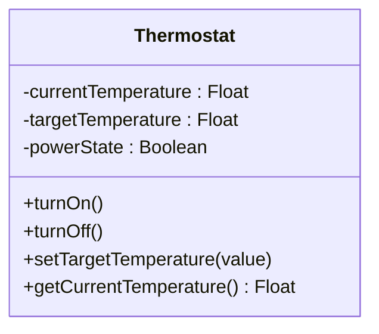

**ინკაფსულაცია** არის ერთმანეთთან დაკავშირებული ელემენტების ერთ მთლიან ერთეულში გაერთიანება ისე, რომ შემდეგ მთელ ამ ერთეულს ერთი სახელით მივმართავთ.

ეს იდეა პროგრამირებაში ახალი არ არის. ჯერ კიდევ პროგრამირების ადრეულ ხანაში შეამჩნიეს, რომ ერთი და იგივე ინსტრუქციების მიმდევრობა ხშირად მეორდებოდა ერთი და იმავე პროგრამის სხვადასხვა ადგილას. ამის გამო ასეთი განმეორებადი კოდი ერთხელ იწერებოდა და შემდეგ პროგრამის სხვადასხვა წერტილიდან ერთი სახელით გამოიძახებოდა — ასე გაჩნდა **ქვეპროგრამა (subroutine)**. ქვეპროგრამამ არა მხოლოდ დაზოგა მეხსიერება, არამედ ადამიანის აზროვნებაც გაამარტივა: პროგრამისტს შეეძლო ბევრი ხაზის კოდისთვის ეფიქრა როგორც ერთ კონცეპტუალურ მთლიანობაზე, ერთი სახელის მიღმა.

ობიექტზე ორიენტირებულ პროგრამირებაში ინკაფსულაციას მსგავსი დანიშნულება აქვს, თუმცა მისი სტრუქტურა გაცილებით დახვეწილია.

**ობიექტზე ორიენტირებული ინკაფსულაცია** ნიშნავს ოპერაციებისა და ატრიბუტების ისეთნაირად შეფუთვას ერთ ობიექტში, რომ ობიექტის მდგომარეობასთან წვდომა და მისი შეცვლა შესაძლებელი იყოს მხოლოდ იმ ინტერფეისის მეშვეობით, რომელსაც თავად ობიექტი გვთავაზობს.

---

### მაგალითი: თერმოსტატის ობიექტი

წარმოვიდგინოთ ჭკვიანი სახლის ერთ-ერთი მოწყობილობა — `Thermostat` (თერმოსტატი). მას აქვს ატრიბუტები, როგორიცაა `currentTemperature` (მიმდინარე ტემპერატურა) და `targetTemperature` (სასურველი ტემპერატურა), და ოპერაციები, როგორიცაა `turnOn()`, `turnOff()`, `setTargetTemperature()`, `getCurrentTemperature()`.

ყოველი ოპერაცია არის თერმოსტატის ობიექტის ქცევის ნაწილი და, ჩვეულებრივ, ხილულია სხვა ობიექტებისთვის — მაგალითად, `HomeHub`-ს ან `MobileApp`-ს შეუძლია ამ ოპერაციების გამოძახება. ატრიბუტები კი წარმოადგენს იმ ინფორმაციას, რასაც თერმოსტატი „იმახსოვრებს“, და მათზე წვდომა თუ მათი შეცვლა შესაძლებელია მხოლოდ თერმოსტატის საკუთარი ოპერაციების საშუალებით. არცერთ სხვა ობიექტს არ შეუძლია პირდაპირ „ჩაძვრეს“ და შეცვალოს `targetTemperature`-ის მნიშვნელობა ოპერაციის გვერდის ავლით — ეს ყოველთვის უნდა მოხდეს `setTargetTemperature()`-ის გამოძახებით.

ვინაიდან მხოლოდ ობიექტის საკუთარმა ოპერაციებმა შეიძლება წაიკითხონ და შეცვალონ მისი ატრიბუტები, ეს ოპერაციები ქმნის დამცავ ბარიერს ობიექტის შიდა მონაცემების გარშემო — ისევე, როგორც თავად ჭკვიანი მოწყობილობის კორპუსი მალავს მის შიდა სქემას და სენსორებს, ხოლო გარესამყაროსთან ურთიერთობა ხდება მხოლოდ მისი ღილაკებით, ეკრანით ან აპლიკაციის ბრძანებებით. ვერავინ „გახსნის“ თერმოსტატს და ხელით შეცვლის მასში არსებულ ცვლადს — ერთადერთი გზა მასთან ურთიერთობისა არის ის ოპერაციები, რომლებსაც თავად თერმოსტატი გვთავაზობს.

მინუსით (`-`) მონიშნული ატრიბუტები ხელმისაწვდომია მხოლოდ ობიექტის შიგნიდან, ხოლო პლუსით (`+`) მონიშნული ოპერაციები ხილულია გარედან — ეს არის ინკაფსულაციის გრაფიკული გამოსახვა.

---

ბევრი ობიექტზე ორიენტირებული ენა პროგრამისტს აძლევს საშუალებას, თითოეული ატრიბუტი და ოპერაცია მონიშნოს როგორც **public** (ხილული სხვა ობიექტებისთვის) ან **private** (ხილული მხოლოდ ობიექტის შიგნით) — ამ განსხვავებას **ხილვადობა (visibility)** ეწოდება. თუ სხვა რამეს არ დავაზუსტებთ, ტერმინი „ოპერაცია“ ჩვეულებრივ გულისხმობს საჯაროდ ხილულ ოპერაციას, ხოლო „ატრიბუტი“ — საჯაროდ ხილულ ატრიბუტს, თუმცა პრაქტიკაში ატრიბუტები ხშირად სწორედ private სახით ცხადდება და მათთან წვდომა ხდება მხოლოდ ოპერაციების მეშვეობით.

შემდეგი [[თავი 1.2 ინფორმაციის იმპლემენტაციის დამალვა]]
