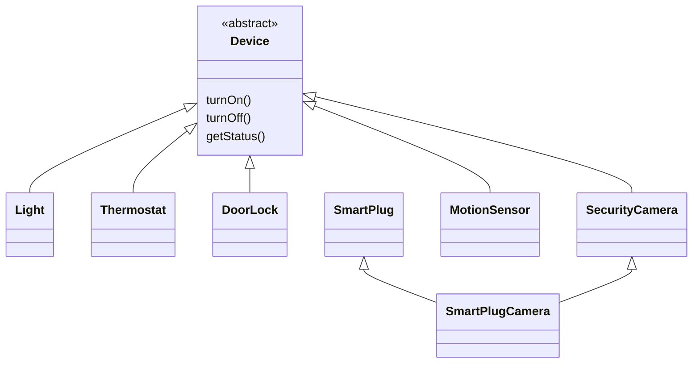

რადგან ინგლისურ სიტყვას „ობიექტზე ორიენტირებული“ არასდროს ჰქონია წინასწარ ცალსახად შეთანხმებული მნიშვნელობა, ისტორიულად თანხმობა თითქმის არასდროს ყოფილა იმაზე, თვისებათა რომელი ნაკრები განსაზღვრავს მას სინამდვილეში. ცენტრალურად ჩავთვალოთ ცხრა თვისება:

- **ინკაფსულაცია (Encapsulation)**

- **ინფორმაციის/იმპლემენტაციის დამალვა (Information/Implementation hiding)**

- **მდგომარეობის შენარჩუნება (State retention)**

- **ობიექტის იდენტობა (Object identity)**

- **შეტყობინებები (Messages)**

- **კლასები (Classes)**

- **მემკვიდრეობა (Inheritance)**

- **პოლიმორფიზმი (Polymorphism)**

- **გენერიულობა (Genericity)**

ქვემოთ თითოეულს მოკლედ გავიხსენებთ, ჭკვიანი სახლის მართვის სისტემიდან აღებული მაგალითებით.

---

### ინკაფსულაცია და დამალვა

**ინკაფსულაცია** ობიექტზე ორიენტაციაში აწარმოებს პროგრამულ სტრუქტურას („ობიექტს“), რომელშიც დამცავი ოპერაციები გარშემორტყმულია ატრიბუტების გარშემო, რომლებიც ობიექტის მდგომარეობას წარმოადგენენ. მაგალითად, `Thermostat` ობიექტის `targetTemperature`-ზე წვდომა და მისი შეცვლა შესაძლებელია მხოლოდ `Thermostat`-ის საკუთარი ოპერაციებით (მაგ. `setTargetTemperature()`) — არცერთ სხვა ობიექტს არ შეუძლია ამ ცვლადზე პირდაპირი, გვერდის ავლით წვდომა.

**ინფორმაციის/იმპლემენტაციის დამალვა** კარგი ინკაფსულაციის შედეგია: ის იცავს ობიექტში ლოკალურ ინფორმაციასა და მისი შიდა იმპლემენტაციის დეტალებს გარეშე ჩარევისგან. მაგალითად, `DoorLock`-ის მომხმარებელს არ სჭირდება იცოდეს, ზუსტად როგორ ინახავს ობიექტი შიგნით თავის `state`-ს — საკმარისია იცოდეს, რომ `getStatus()` სწორ პასუხს დააბრუნებს.

---

### მდგომარეობის შენარჩუნება და ობიექტის იდენტობა

**მდგომარეობის შენარჩუნება** არის თვისება, რომლის მეშვეობითაც ობიექტს შეუძლია ინფორმაცია განუსაზღვრელი ვადით შეინახოს — მათ შორის, თავისი ოპერაციების ცალკეულ გამოძახებებს შორის დროის მონაკვეთებშიც. მაგალითად, `SecurityCamera` ობიექტი „ახსოვს“, ჩაწერაშია თუ არა (`isRecording`), მაშინაც კი, როცა მასზე დიდი ხანია არავინ მიმართავს.

**ობიექტის იდენტობა** თითოეულ ობიექტს ანიჭებს უნიკალურ და მუდმივ „ვინაობას“, რომელიც დამოუკიდებელია მისი მიმდინარე მდგომარეობისგან. ეს ჩვეულებრივ ხორციელდება **ჰენდლის** მეშვეობით — ორ ერთნაირად დაყენებულ `Light`-საც კი განსხვავებული ჰენდლი აქვს, და ეს ჰენდლი უცვლელი რჩება მთელი მისი „სიცოცხლის“ განმავლობაში.

---

### შეტყობინებები

ობიექტის ჰენდლი ცნობილი უნდა იყოს ყველა იმ ობიექტისთვის, რომელსაც სურს მასთან კომუნიკაცია. **შეტყობინება** შედგება სამიზნე ობიექტზე განსაზღვრული ოპერაციის სახელისგან და მასზე გადასაცემი არგუმენტებისგან. მაგალითად, `mobileApp`-ს შეუძლია გაუგზავნოს შეტყობინება `lamp.setBrightness(40)` — ოპერაციის სახელი `setBrightness` და არგუმენტი `40` ერთად ქმნიან შეტყობინებას.

---

### კლასები

ერთი და იმავე კლასიდან წარმოშობილი ობიექტები იზიარებენ ერთსა და იმავე სტრუქტურასა და ქცევას. **კლასი** არის ნიმუში, რომლის მიხედვითაც შესრულების დროს ობიექტები „იწარმოება“. ერთსა და იმავე კლასს, მაგალითად `Light`-ს, შეიძლება ჰყავდეს ერთდროულად ბევრი ობიექტი — თითოეულს საკუთარი ჰენდლი და საკუთარი მდგომარეობა (მაგ. სხვადასხვა `brightness`), მაგრამ ყველას ერთი და იგივე ოპერაციები (`turnOn()`, `turnOff()`, `setBrightness()`).

პრინციპში, თითოეულ ობიექტს თავისი მეთოდები აქვს საკუთარი ინსტანციური ოპერაციების შესასრულებლად და თავისი ცვლადები საკუთარი ატრიბუტებისთვის. პრაქტიკაში კი, მეხსიერების დასაზოგად, ერთი კლასის ობიექტები ჩვეულებრივ იზიარებენ თითოეული მეთოდის ერთსა და იმავე ასლს — მაშინ როცა ცვლადები და ჰენდლები ერთმანეთს ვერ გაუზიარდება, რადგან ისინი განსხვავებულ მნიშვნელობებს ინახავენ.

---

### მემკვიდრეობა

კლასებს შეუძლიათ ჩამოაყალიბონ მემკვიდრეობის იერარქიები (ან, უფრო ზუსტად, **ბადეები**) სუპერკლასებისა და ქვეკლასებისგან. **მემკვიდრეობა** საშუალებას აძლევს ერთი კლასის ობიექტებს გამოიყენონ ნებისმიერი მისი სუპერკლასის შესაძლებლობები. მაგალითად, `SecurityCamera` არის `Device`-ის ქვეკლასი და ავტომატურად იღებს `turnOn()`, `turnOff()` და `getStatus()` ოპერაციებს, თან ამატებს საკუთარ `startRecording()`/`stopRecording()` ოპერაციებს.

არჩევითად, ქვეკლასს შეუძლია სუპერკლასის ოპერაცია ხელახლა განსაზღვროს — **გადაფაროს** (override).

კლასს შეიძლება ჰყავდეს ერთზე მეტი პირდაპირი სუპერკლასი — ამას **მრავლობითი მემკვიდრეობა** ეწოდება. მაგალითად, `SmartPlugCamera` ერთდროულად მემკვიდრეობს `SmartPlug`-ისგანაც და `SecurityCamera`-ისგანაც. ეს ძლიერი შესაძლებლობაა, თუმცა ფრთხილად გამოსაყენებელი: სხვადასხვა წინაპარმა შეიძლება ერთი და იმავე სახელის, მაგრამ სხვადასხვა მნიშვნელობის ოპერაციები „მოიტანოს“ ქვეკლასში, რაც სახელთა კონფლიქტს წარმოშობს.

---

### პოლიმორფიზმი და გადატვირთვა

**პოლიმორფიზმი** არის შესაძლებლობა, რომლის მეშვეობითაც ერთი ოპერაციის სახელი შეიძლება განისაზღვროს ბევრ სხვადასხვა კლასში, სხვადასხვა იმპლემენტაციით თითოეულში. ალტერნატიულად, პოლიმორფიზმი არის თვისება, რომლის მეშვეობითაც ცვლადს შეუძლია სხვადასხვა დროს მიუთითოს სხვადასხვა კლასის ობიექტზე.

მაგალითად, `getStatus()` სხვადასხვანაირად მუშაობს `Light`-ზე, `Thermostat`-ზე და `DoorLock`-ზე, თუმცა სახელი ერთია. ცვლადს `var target: Device` შეუძლია ერთხელ `Light`-ის ობიექტზე მიუთითოს, მეორედ — `DoorLock`-ის ობიექტზე, და ორივე შემთხვევაში `target.getStatus()` სწორად იმუშავებს.

პოლიმორფიზმი ახალ განზომილებას სძენს იმპლემენტაციის დამალვას: გამგზავნმა შეიძლება ზუსტად არ იცოდეს სამიზნე ობიექტის კლასი — საკმარისია დარწმუნებული იყოს, რომ ყველა შესაძლო კლასს აქვს სწორი სახელისა და სიგნატურის ოპერაცია, დანარჩენს კი შესრულების გარემო იტვირთავს თავზე.

**გადატვირთვა (Overloading)** პოლიმორფიზმთან დაკავშირებული ცნებაა: ერთსა და იმავე კლასზე ერთი და იმავე სახელის რამდენიმე ოპერაციიდან ერთი აირჩევა შესრულების დროს, არგუმენტების რაოდენობის და/ან კლასის მიხედვით (მაგალითად, `lamp.setBrightness` და `lamp.setBrightness(75)`). როგორც პოლიმორფიზმი, ისე გადატვირთვა, ჩვეულებრივ საჭიროებს **დინამიკურ (ანუ შესრულების დროინდელ) ბაინდინგს**.

---

### გენერიულობა

**გენერიულობა** პარამეტრიზებულ კლასს საშუალებას აძლევს, ობიექტის შექმნისას სხვა კლასი მიიღოს არგუმენტად. მაგალითად, `SortedQueue <ClassOfItem>` შეიძლება ინსტანცირდეს ერთხელ `Device` ობიექტების, მეორედ კი `AutomationScene` ობიექტების შესანახად, ერთი და იმავე კოდის კლონირების გარეშე. ეს განსაკუთრებით სასარგებლოა „საერთო კონტეინერის“ ტიპის კლასების (რიგები, ცხრილები, სიები) დასაპროექტებლად: პარამეტრიზებული კლასი გვაძლევს კლონირებული კოდის ყველა უპირატესობას, მრავალჯერადი მოვლის ტვირთის გარეშე.

---

### მოკლე შემაჯამებელი ცხრილი

| თვისება | არსი | მაგალითი |
|---|---|---|
| ინკაფსულაცია | მდგომარეობაზე წვდომა მხოლოდ ოპერაციებით | `Thermostat.setTargetTemperature()` |
| დამალვა | შიდა დეტალები დაცულია გარედან | `DoorLock`-ის შიდა `state` |
| მდგომარეობის შენარჩუნება | ობიექტი იმახსოვრებს გამოძახებებს შორის | `SecurityCamera.isRecording` |
| ობიექტის იდენტობა | უნიკალური, მუდმივი ჰენდლი | ორი განსხვავებული `Light` |
| შეტყობინებები | ოპერაციის სახელი + არგუმენტები | `lamp.setBrightness(40)` |
| კლასები | სტრუქტურისა და ქცევის ნიმუში | `Light`-ის ბევრი ეგზემპლარი |
| მემკვიდრეობა | ქვეკლასი იყენებს სუპერკლასის შესაძლებლობებს | `SecurityCamera` ⟵ `Device` |
| პოლიმორფიზმი | ერთი სახელი, სხვადასხვა იმპლემენტაცია | `getStatus()` ყველა `Device`-ზე |
| გადატვირთვა | ერთი სახელი, სხვადასხვა სიგნატურა ერთ კლასში | `setBrightness()` / `setBrightness(75)` |
| გენერიულობა | პარამეტრიზებული, მრავალჯერ გამოსაყენებელი კონტეინერი | `SortedQueue<Device>` |
