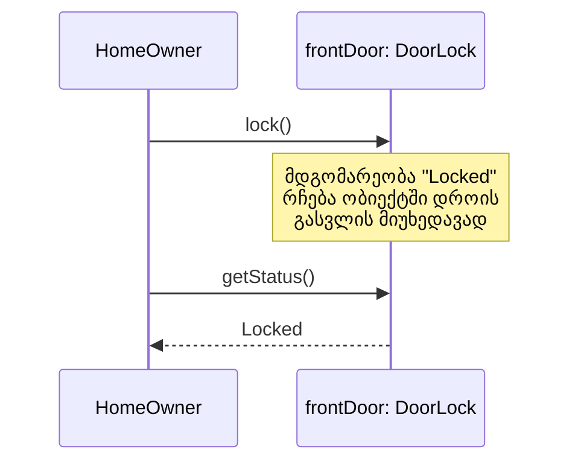

ობიექტზე ორიენტირებული აზროვნების მესამე საყრდენი ეხება ობიექტის უნარს, დროთა განმავლობაში შეინარჩუნოს საკუთარი **მდგომარეობა (state)**.

ტრადიციული პროცედურა თუ ფუნქცია, როცა გვერდითი ეფექტების გარეშე გამომძახებელს უბრუნებს შედეგს, ამის შემდეგ არაფერს „იმახსოვრებს“ — მისი შესრულება მთავრდება და მომდევნო გამოძახებისას ის თითქოს პირველად სრულდება, წინა გამოძახებების არავითარი კვალის გარეშე.

ობიექტი კი განსხვავებულად იქცევა: ის მისთვის მიწოდებულ ინფორმაციას ინახავს საკუთარ თავში განუსაზღვრელი ხნით, სანამ თავად არ გაქრება სისტემიდან. ერთხელ მიწოდებული ინფორმაცია იქ რჩება, და ნებისმიერ მომენტში — იმავე თუ სულ სხვა გამომძახებელს — შეუძლია ამ ობიექტს ხელახლა სთხოვოს ეს ინფორმაცია.

---

### მაგალითი

წარმოვიდგინოთ `DoorLock` ობიექტი სახელად `frontDoor`, რომელსაც აქვს ოპერაცია `lock()`. როცა ვინმე (მაგალითად, `HomeOwner` მობილური აპლიკაციიდან) გამოიძახებს `frontDoor.lock()`-ს, ობიექტი გადადის მდგომარეობაში „Locked“ და ეს ინფორმაცია რჩება მასში მუდმივად — არა მხოლოდ იმ წამში, როცა ოპერაცია სრულდება. კვირაში მოგვიანებით, ვინც არ უნდა ჰკითხოს ობიექტს `frontDoor.getStatus()`-ს, ის კვლავ უპასუხებს „Locked“-ს, თუ ამასობაში არაფერი შეცვლილა. ობიექტს არ სჭირდება, ვინმემ ხელახლა შეახსენოს, რომ ის ჩაკეტილია — ის უბრალოდ **იმახსოვრებს** ამას.

ტექნიკურად რომ ვთქვათ, ობიექტი **ინახავს მდგომარეობას** — ანუ იმ მნიშვნელობების ერთობლიობას, რაც მისი ატრიბუტების საშუალებით შენახულია ნებისმიერ კონკრეტულ მომენტში. მაგრამ, როგორც წინა ორ ცნებაში ვნახეთ, ის, თუ ზუსტად როგორ ინახავს ობიექტი ამ მდგომარეობას შიგნით, მთლიანად მისი „კერძო საქმეა“ — ინფორმაციისა და იმპლემენტაციის დამალვის წყალობით.

---

**[[თავი 1.1 ინკაფსულაცია]]**, **[[თავი 1.2 ინფორმაციის იმპლემენტაციის დამალვა]]** და **მდგომარეობის შენარჩუნება** ერთად ქმნიან ობიექტზე ორიენტირებული აზროვნების ბირთვს. თუმცა ეს სამივე იდეა ახალი არ არის — მეცნიერებმა მრავალი წლის განმავლობაში სწორედ ეს პრინციპები შეისწავლეს ტერმინის **აბსტრაქტული მონაცემთა ტიპი (Abstract Data Type, ADT)** ქვეშ. ობიექტზე ორიენტირებული მიდგომა კი ბევრად სცილდება ADT-ს ფარგლებს, რასაც შემდეგი ექვსი თვისება დაგვანახებს.

შემდეგი [[თავი 1.4 ობიექტის იდენტობა]]
