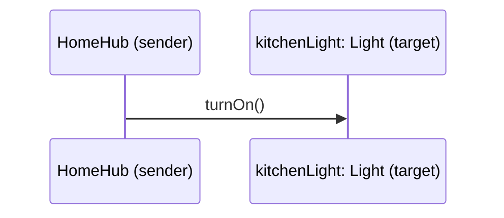

შეტყობინებას რამდენიმე სინტაქსური ელემენტი აქვს, თითოეული მათგანი მნიშვნელოვანია ობიექტზე ორიენტირებულ დიზაინში.

იმისთვის, რომ ობიექტმა `obj1` გაუგზავნოს აზრიანი შეტყობინება ობიექტ `obj2`-ს, მან უნდა იცოდეს სამი რამ:

1. **`obj2`-ის ჰენდლი** — ანუ ვის ვუგზავნით შეტყობინებას. ჩვეულებრივ `obj1` ინახავს `obj2`-ის ჰენდლს ერთ-ერთ საკუთარ ცვლადში.
    
2. **ოპერაციის სახელი** — რომელი ოპერაცია უნდა შესრულდეს `obj2`-ზე.
    
3. **დამატებითი ინფორმაცია (არგუმენტები)** — რაც სჭირდება `obj2`-ს ამ ოპერაციის სწორად შესასრულებლად.

ამ დროს:

- შეტყობინების გამგზავნია **sender** (აქ `obj1`),
    
- ხოლო მიმღებია **target** (აქ `obj2`).

### მაგალითი

წარმოვიდგინოთ, რომ `HomeHub`-ს აქვს ცვლადი, რომელიც მიუთითებს სამზარეულოს `Light` ობიექტზე. შეტყობინება შეიძლება ასე გამოიყურებოდეს:

	kitchenLight.turnOn();

აქ `kitchenLight` მიუთითებს სამიზნე ობიექტზე, `turnOn` არის ოპერაციის სახელი, ხოლო არგუმენტი საერთოდ არ სჭირდება, რადგან ეს ოპერაცია უბრალოდ ერთადერთ რამეს აკეთებს — რთავს განათებას.

**შეტყობინების გაგზავნა ჰგავს ტრადიციული ფუნქციის ან პროცედურის გამოძახებას.**  
მაგალითად, ობიექტზე ორიენტაციის გარეშე, იგივე მოქმედება ასე ჩაიწერებოდა:

	call turnOn(kitchenLight);

შეამჩნიე განსხვავება:

- ტრადიციულში — ჯერ ვიძახებთ პროცედურას (`turnOn`) და მას ვაწვდით ობიექტს (`kitchenLight`), როგორც არგუმენტს.
    
- ობიექტზე ორიენტირებულში — პირდაპირ ობიექტს (`kitchenLight`) მივმართავთ და ვთხოვთ, საკუთარი ოპერაცია (`turnOn`) შეასრულოს.

ამ ეტაპზე ეს განსხვავება მხოლოდ „სინტაქსურ“ ან, შეიძლება ითქვას, „ფილოსოფიურ“ დეტალად ჩანს. მაგრამ, როცა მოგვიანებით განვიხილავთ **პოლიმორფიზმს**, **გადატვირთვას (overloading)** და **დინამიკურ მიბმას (dynamic binding)**, დავინახავთ, რომ სწორედ ეს პრინციპი — „ჯერ ობიექტი, მერე პროცედურა“ — ქმნის მნიშვნელოვან პრაქტიკულ განსხვავებას ობიექტზე ორიენტირებულ და ტრადიციულ სტრუქტურას შორის. მიზეზი ისაა, რომ სხვადასხვა კლასის ობიექტებმა შეიძლება ერთი და იმავე სახელის ოპერაცია გამოიყენონ, თუმცა თითოეულმა კლასმა ეს ოპერაცია სულ სხვანაირად განახორციელოს (მაგალითად, `Light`-ისა და `DoorLock`-ის `turnOn()`-ს შეიძლება სულ სხვადასხვა ქცევა ჰქონდეს).

შემდეგი [[თავი 1.5.2 შეტყობინების არგუმენტები]]
