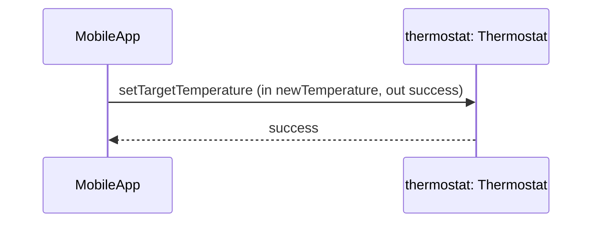

ძველი ტიპის ქვეპროგრამების მსგავსად, შეტყობინებების უმეტესობა არგუმენტებს გადასცემს და იბრუნებს.  
მაგალითად, თუ გვინდა, რომ ოპერაციამ `setTargetTemperature` დაგვიბრუნოს ინფორმაცია იმის შესახებ, წარმატებით შესრულდა თუ არა მოთხოვნა, გვექნება:

	thermostat.setTargetTemperature (in newTemperature, out success)

ამრიგად, სამიზნე ობიექტისკენ მიმართული შეტყობინების სტრუქტურას განსაზღვრავს იმ ოპერაციის **სიგნატურა**, რომელიც უნდა გამოიძახოს.

ეს სიგნატურა შედგება სამი ნაწილისგან:

1. **ოპერაციის სახელი**,
    
2. **შეყვანის არგუმენტების სია** (წინსართით `in`),
    
3. **გამოტანის არგუმენტების სია** — იგივე _return arguments_ (წინსართით `out`).

ნებისმიერი ეს სია შეიძლება ცარიელიც იყოს.  
მოკლედ რომ ჩავწეროთ, ხშირად `in` საერთოდ გამოტოვებულია და ის ნაგულისხმევად ითვლება.

შეტყობინების არგუმენტები კიდევ ერთ ფუძემდებლურ განსხვავებას აჩვენებს ობიექტზე ორიენტირებულ და ტრადიციულ პროგრამულ უზრუნველყოფას შორის.

**წმინდა ობიექტზე ორიენტირებულ გარემოში** (მაგალითად Smalltalk-ში), **შეტყობინების არგუმენტები არ არის უბრალო მონაცემები** — ისინი, ისევე როგორც ყველაფერი დანარჩენი, **ობიექტების ჰენდლებია**.  
სხვა სიტყვებით, არგუმენტიც თავისთავად ცოცხალი ობიექტია, რომელიც უბრალოდ დროებით „მიემგზავრება“ შეტყობინებასთან ერთად.

თუ ამ შეტყობინების შესრულების მომენტში „გავაჩერებდით“ პროგრამას და დავათვალიერებდით არგუმენტების რეალურ მნიშვნელობებს, შესაძლოა რაღაც მოულოდნელი დაგვხვედროდა.

მაგალითად, შესაძლოა გვენახა:

- **newTemperature** დაყენებული მნიშვნელობაზე `#918273`,
    
- **success** დაყენებული მნიშვნელობაზე `#440091`.

რატომ ასეთი უცნაური მნიშვნელობები?

იმიტომ, რომ `#918273` შეიძლება იყოს იმ ობიექტის ჰენდლი (კლასის `Integer`), რომელსაც ჩვენ უბრალოდ რიცხვ **21**-ად აღვიქვამთ,  
ხოლო `#440091` — იმ ობიექტის ჰენდლი (კლასის `Boolean`), რომელსაც ლოგიკურ მნიშვნელობად **true**-ს ვუწოდებთ.

---

ანალოგიურად, თუ განვიხილავთ `SecurityCamera` ობიექტს, რომელსაც ვთხოვთ ჩაწერის დაწყებას და ვთხოვთ, გვითხრას, რომელმა მომხმარებელმა მოითხოვა ეს მოქმედება, არგუმენტი `requestedBy` სინამდვილეში იქნება არა უბრალო ტექსტი, არამედ იმ კონკრეტული `HomeOwner` ობიექტის ჰენდლი.

შემდეგი [[თავი 1.5.3 ობიექტების როლები შეტყობინებებში]]
