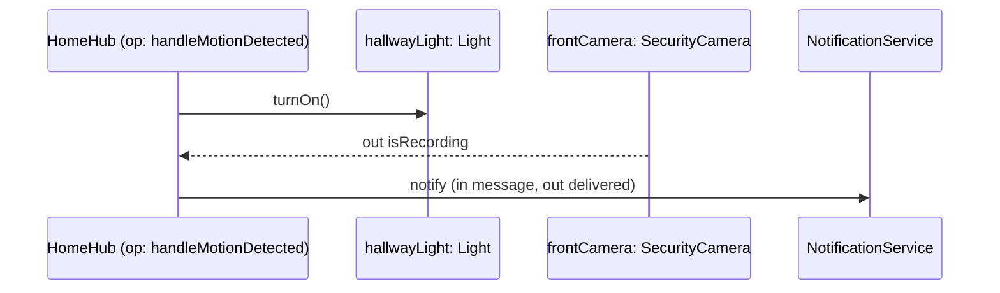
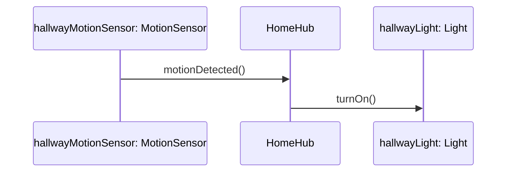

ამ ნაწილში განვიხილავთ ოთხ როლს, რომელთაგან ერთ-ერთს ობიექტი ასრულებს ობიექტზე ორიენტირებულ სისტემაში ნებისმიერ მოცემულ მომენტში. ობიექტი შეიძლება იყოს:

- შეტყობინების **გამომგზავნი**
    
- შეტყობინების **სამიზნე**
    
- სხვა ობიექტის ერთ-ერთი ცვლადის მიერ მითითებული (როგორც ვნახეთ სექციაში [[თავი 1.4 ობიექტის იდენტობა]])
    
- შეტყობინებაში წინ ან უკან გადაცემული არგუმენტის მიერ მითითებული (როგორც ვნახეთ სექციაში [[თავი 1.5.2 შეტყობინების არგუმენტები]])

კონკრეტულ ობიექტს შეუძლია საკუთარი სიცოცხლის განმავლობაში ერთზე მეტი ეს როლი შეასრულოს — ხშირად ერთდროულადაც კი.

### მაგალითი

წარმოვიდგინოთ, რომ `HomeHub` ობიექტს აქვს ოპერაცია `handleMotionDetected()`, რომელსაც სამი ცვლადი აქვს — თითოეული სხვადასხვა ობიექტზე მიმთითებელი: ერთი `Light`-ზე, ერთი `SecurityCamera`-ზე და ერთი `NotificationService`-ზე. ეს ოპერაცია სამივესთან გზავნის შეტყობინებას:

პირველ შეტყობინებას (`turnOn()`) საერთოდ არ სჭირდება არგუმენტი. მეორეს (`frontCamera`-სთან) აქვს მხოლოდ **გამოტანის არგუმენტი** — `isRecording`. მესამეს კი აქვს ორივე ტიპის არგუმენტი — **შეყვანისაც** (`message`) და **გამოტანისაც** (`delivered`). თითოეული ეს არგუმენტი, თავის მხრივ, სხვა ობიექტზე მიმთითებელია. სწორედ ასეთი ურთიერთქმედება ობიექტის ოპერაციასა და მისი ცვლადებით მითითებულ ობიექტებს შორის ძალიან ტიპურია ობიექტზე ორიენტირებულ დიზაინში.

---

ზოგჯერ შეიძლება მოგვეჩვენოს, რომ ესა თუ ის ობიექტი ყოველთვის მხოლოდ შეტყობინებებს აგზავნის, ხოლო მეორე — მხოლოდ იღებს. სინამდვილეში ეს ასე არ არის:

პირველი შეტყობინებისთვის (`motionDetected()`) `hallwayMotionSensor` არის გამომგზავნი, ხოლო `HomeHub` — სამიზნე. მეორესთვის (`turnOn()`) იგივე `HomeHub` ახლა უკვე თავად არის გამომგზავნი, ხოლო `hallwayLight` — სამიზნე. ამგვარად, ვხედავთ, რომ სხვადასხვა დროს ერთი და იგივე ობიექტი შეიძლება იყოს როგორც გამომგზავნი, ასევე სამიზნე. ტერმინები „გამომგზავნი“ და „სამიზნე“ ამიტომ დაკავშირებულია კონკრეტულ შეტყობინებასთან.  
ისინი არ არიან თავად ობიექტების ფიქსირებული თვისებები.

---

წმინდა ობიექტზე ორიენტირებული გარემო შეიცავს მხოლოდ ობიექტებს, რომელთაგან თითოეული ასრულებს ერთ ან მეტ როლს, რომლებსაც ზემოთ ვიხილეთ. წმინდა ობიექტზე ორიენტაციაში არ არის საჭირო მონაცემები, რადგან ობიექტებს შეუძლიათ მონაცემების ყველა საჭირო პროგრამული დავალების შესრულება. **Smalltalk**-ში (ძალიან წმინდა ობიექტზე ორიენტირებულ ენაში), საერთოდ არ არის მონაცემები! შესრულების დროს მხოლოდ ობიექტებია, რომლებიც მიუთითებენ სხვა ობიექტებზე (ცვლადების საშუალებით) და ურთიერთობენ ერთმანეთთან ერთმანეთის ჰენდლების წინ და უკან გადაცემით.

თუმცა, **C++**-ში (რომელიც არის შერეული ენა იმ გაგებით, რომ იგი ერთდროულად მონაცემზე/ფუნქციაზე ორიენტირებულიცაა და ობიექტზე ორიენტირებულიც), არგუმენტები შეიძლება იყოს მიმთითებლები ყველაფერზე. თუ შენი C++ კოდი ისეთივე წმინდაა, როგორც Smalltalk, მაშინ შენი ყველა არგუმენტი იქნება ობიექტებზე მიმთითებლები. მაგრამ თუ შენ პროგრამაში ერთმანეთში ურევ ობიექტებსა და მონაცემებს, მაშინ ზოგიერთი არგუმენტი შეიძლება იყოს მარტივი მონაცემი (ან მონაცემებზე მიმთითებელი). ანალოგიური კომენტარი ვრცელდება Java კოდზეც, თუმცა Java გაცილებით ნაკლებად „თავისუფალი“ ენაა, ვიდრე C++.

შემდეგი [[თავი 1.5.4 შეტყობინებების ტიპები]]
