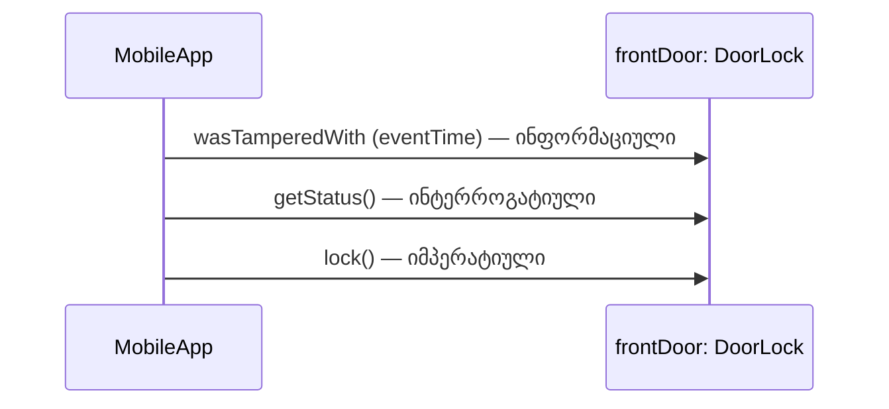

არსებობს სამი ტიპის შეტყობინება, რომელსაც ობიექტი შეიძლება იღებდეს:

**ინფორმაციული შეტყობინებები**

**ინტერროგატიული შეტყობინებები**

**იმპერატიული შეტყობინებები**

ამ სექციაში მოკლედ განვსაზღვრავთ თითოეულ ტიპს და მაგალითს მოვიყვანთ ჭკვიანი სახლის სისტემიდან.

**ინფორმაციული შეტყობინება**:

არის შეტყობინება ობიექტისთვის, რომელიც აწვდის მას ინფორმაციას საკუთარი თავის განახლებისთვის. (იგივეა, რასაც უწოდებენ **update**, **forward** ან **push** შეტყობინებას). ეს არის „წარსულზე ორიენტირებული“ შეტყობინება, რადგან ის, ჩვეულებრივ, აცნობებს ობიექტს იმას, რაც უკვე მოხდა სხვაგან.

მაგალითი ინფორმაციული შეტყობინებისა არის:

	frontDoor.wasTamperedWith (eventTime: DateTime)

ეს შეტყობინება ატყობინებს `DoorLock` ობიექტს, რომ ვიღაცამ ფიზიკურად სცადა კარის ძალით გატეხვა კონკრეტულ დროს. ზოგადად, ინფორმაციული შეტყობინება ეუბნება ობიექტს რაღაცას, რაც მოხდა იმ რეალური სამყაროს ნაწილში, რომელსაც ეს ობიექტი წარმოადგენს.

**ინტერროგატიული შეტყობინება**:

არის შეტყობინება ობიექტისთვის, რომელიც სთხოვს მას გამოავლინოს გარკვეული ინფორმაცია საკუთარ თავზე. (იგივეა, რასაც უწოდებენ **read**, **backward** ან **pull** შეტყობინებას).  
ეს არის „აწმყოზე ორიენტირებული“ შეტყობინება, რადგან ის სთხოვს ობიექტს მიმდინარე ინფორმაციის მიწოდებას.

მაგალითი ინტერროგატიული შეტყობინებისა არის:

	thermostat.getCurrentTemperature()

რომელიც სთხოვს თერმოსტატს, გვითხრას, რა ტემპერატურაა ამჟამად.  
ასეთი შეტყობინება არაფერს ცვლის; იგი, ჩვეულებრივ, უბრალოდ შეკითხვაა იმ სამყაროს ნაწილზე, რომელსაც სამიზნე ობიექტი წარმოადგენს.

**იმპერატიული შეტყობინება**:

არის შეტყობინება ობიექტისთვის, რომელიც სთხოვს მას შეასრულოს გარკვეული ქმედება საკუთარ თავზე, სხვა ობიექტზე, ან თუნდაც სისტემის ირგვლივ არსებულ ფიზიკურ გარემოზე. (იგივეა, რასაც უწოდებენ **force** ან **action** შეტყობინებას). ეს არის „მომავალზე ორიენტირებული“ შეტყობინება, რადგან ის სთხოვს ობიექტს ახლო მომავალში შეასრულოს გარკვეული ქმედება.

მაგალითი იმპერატიული შეტყობინებისა არის:

	frontDoor.lock()

რომელიც აიძულებს `DoorLock` ობიექტს, ფაქტობრივად ჩაკეტოს კარი. ასეთი შეტყობინება ხშირად იწვევს სამიზნე ობიექტის მიერ მნიშვნელოვანი ალგორითმის შესრულებას იმის გასარკვევად, თუ რა უნდა გააკეთოს.

**რეალურ დროში მოქმედ ობიექტზე ორიენტირებულ სისტემებში**, სადაც ობიექტები მართავენ ფიზიკური აპარატურის ნაწილებს, ხშირად გვხვდება ბევრი იმპერატიული შეტყობინება. სწორედ ჭკვიანი სახლის სისტემა არის ამის კარგი მაგალითი, რადგან მისი მთელი აზრი იმაშია, რომ პროგრამულმა ობიექტმა ფიზიკურ სამყაროზე რეალურად იმოქმედოს. განვიხილოთ ეს მაგალითი:

	hallwayCamera.panTiltZoom (pan: Angle, tilt: Angle, zoom: Percentage)

ეს შეტყობინება სთხოვს `SecurityCamera`-ს, მიიღოს კონკრეტული პოზიცია და მასშტაბირება სივრცეში. ალგორითმმა, შესაძლოა, საჭირო გახადოს კამერის ორივე ღერძის — მობრუნებისა და დახრის — მოტორების ერთდროული მართვა, ისევე როგორც ობიექტივის მასშტაბირება.  
ეს სამი არგუმენტი წარმოადგენს კამერის სამ თავისუფლების ხარისხს, როგორც ფიზიკური მოწყობილობისა სივრცეში.

