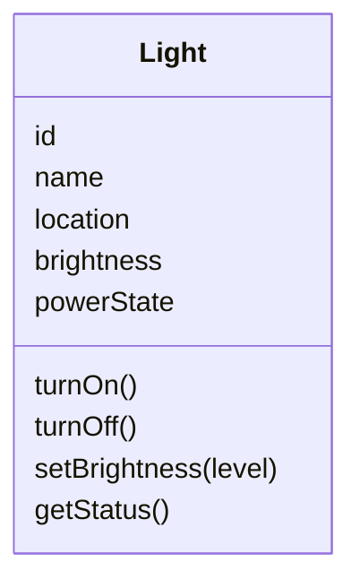

**კლასი** (class) არის ნიმუში (template), რომლის მიხედვითაც პროგრამის შესრულებისას იქმნება, ანუ **ინსტანცირდება**, ობიექტები. ერთი და იმავე კლასიდან შექმნილ ყველა ობიექტს აქვს ზუსტად იგივე სტრუქტურა და ქცევა — იგივე ატრიბუტები და იგივე ოპერაციები, რომლებიც კლასის აღწერისას იქნა განსაზღვრული.

თუ ობიექტი `obj` შექმნილია კლასის `C`-საგან, ვამბობთ: **„`obj` არის `C`-ის ინსტანცია“**.

---

### რით განსხვავდება ერთი კლასის ორი ობიექტი

ერთი და იმავე კლასის ორ ობიექტს შორის ყოველთვის ორი განსხვავებაა:

1. თითოეულს საკუთარი, უნიკალური ჰენდლი (handle) აქვს — ერთგვარი „მისამართი“, რომლითაც სხვა ობიექტები მას მიმართავენ.

2. კონკრეტულ მომენტში მათ, სავარაუდოდ, სხვადასხვა **მდგომარეობა** აქვთ — ანუ სხვადასხვა მნიშვნელობებია შენახული მათ ცვლადებში.

დასამახსოვრებლად მარტივი წესია:

- **კლასს** ვაპროექტებთ და ვწერთ კოდის დონეზე, ერთხელ.

- **ობიექტებს** ვქმნით პროგრამის შესრულებისას (run-time), საჭიროებისამებრ, რამდენჯერაც გვინდა.

---

### ანალოგია: მოწყობილობის მოდელი და მისი ეგზემპლარები

წარმოიდგინე მწარმოებელი, რომელიც უშვებს ჭკვიანი თერმოსტატის ერთადერთ მოდელს. ინჟინრებმა ერთხელ დააპროექტეს ეს მოდელი: რომელი ღილაკები ექნება, რომელი firmware-ოპერაციები (`turnOn()`, `turnOff()`, `setTargetTemperature()`) ექნება ჩაშენებული და რა ატრიბუტები (`targetTemperature`, `currentTemperature`, `powerState`) ექნება თითოეულ ეგზემპლარს. ეს დიზაინი — ნახაზი და firmware ერთად — არის **კლასის** ანალოგი.

ქარხანა შემდეგ აწარმოებს ამ მოდელის ასობით ფიზიკურ ეგზემპლარს და აგზავნის სხვადასხვა სახლში. თითოეულს ერთი და იგივე ღილაკები და ერთი და იგივე firmware-ოპერაციები აქვს — ეს არის **ობიექტების** ანალოგი. მაგრამ თითოეულ ეგზემპლარს აქვს საკუთარი სერიული ნომერი (ჰენდლის ანალოგი) და საკუთარი, ამჟამად დაყენებული ტემპერატურა (მდგომარეობის ანალოგი): ერთს შეიძლება 21°C ჰქონდეს დაყენებული, მეორეს — 19°C.

Run-time-ზე კლასს, მაგალითად `Thermostat`-ს, შეიძლება ჰყავდეს 3, ან 30, ან 3000 ობიექტი — რამდენ სახლშიც არ უნდა იყოს ეს მოდელი დამონტაჟებული. ყველა ეს ეგზემპლარი ერთმანეთის სტრუქტურულად იდენტურია, თუმცა თითოეული საკუთარ ისტორიას ინახავს.

---

### მეხსიერების განაწილება: რატომ არის ეს ეფექტური

დავუშვათ, კლასს `Light` აქვს 4 ინსტანციური ოპერაცია და 5 ინსტანციური ატრიბუტი. თუ ვიღებთ, რომ:

- თითოეული მეთოდი = **100 ბაიტი**

- თითოეული ცვლადი = **2 ბაიტი**

- თითოეული ჰენდლი = **6 ბაიტი**

მაშინ ერთი `Light` ობიექტი დაიკავებდა 416 ბაიტს (4 × 100 + 5 × 2 + 6). სამი ასეთი ობიექტი — 1248 ბაიტს, ხოლო თხუთმეტი — 6240 ბაიტს.

მაგრამ ეს გამოთვლა ძალიან არაეფექტიან სცენარს გვიხატავს, რადგან თხუთმეტივე `Light` ობიექტის ოთხივე მეთოდი აბსოლუტურად იდენტურია — მათი პროცედურული კოდი არაფრით არ განსხვავდება ერთმანეთისგან. სწორედ ამიტომ პრაქტიკაში ობიექტზე ორიენტირებული გარემო ყველა ობიექტს აძლევს მეთოდების ერთსა და იმავე ფიზიკურ ასლზე წვდომას, მაშინ როცა ცვლადები და ჰენდლები საერთოდ ვერ გაზიარდება — ისინი ხომ სხვადასხვა მნიშვნელობებს ინახავენ თითოეული ეგზემპლარისთვის ცალ-ცალკე.

ამის შედეგად, 15 `Light` ობიექტის მიერ რეალურად მოხმარებული მეხსიერება იქნება მხოლოდ 640 ბაიტი: 400 ბაიტი — ერთი საერთო მეთოდების ნაკრებისთვის, 150 ბაიტი — 15 ცვლადების ნაკრებისთვის და 90 ბაიტი — 15 ჰენდლისთვის. ეს ბევრად უკეთესია, ვიდრე 6240 ბაიტი, და სწორედ ასე ანაწილებს მეხსიერებას ჩვეულებრივი ობიექტზე ორიენტირებული გარემო.

სქემა ამას ნათლად აჩვენებს: თითოეულ ობიექტს — თავისი ჰენდლი და ცვლადები, ხოლო მეთოდები — ერთი, ყველასთვის საერთო ასლი.

<svg viewBox="0 0 640 335" xmlns="http://www.w3.org/2000/svg">
  <defs>
    <marker id="arrow-1-6" viewBox="0 0 10 10" refX="9" refY="5" markerWidth="6" markerHeight="6" orient="auto-start-reverse">
      <path d="M0,0 L10,5 L0,10 z" fill="currentColor"/>
    </marker>
  </defs>

  <rect x="20" y="15" width="210" height="70" rx="8" fill="none" stroke="#4A90D9" stroke-width="1.8"/>
  <text x="125" y="35" text-anchor="middle" font-size="12" font-weight="600" fill="currentColor">kitchenLight</text>
  <text x="125" y="53" text-anchor="middle" font-size="10" fill="currentColor">ჰენდლი #7734021</text>
  <text x="125" y="71" text-anchor="middle" font-size="10" fill="currentColor">brightness: 70%</text>

  <rect x="20" y="110" width="210" height="70" rx="8" fill="none" stroke="#4A90D9" stroke-width="1.8"/>
  <text x="125" y="130" text-anchor="middle" font-size="12" font-weight="600" fill="currentColor">hallLight</text>
  <text x="125" y="148" text-anchor="middle" font-size="10" fill="currentColor">ჰენდლი #6610933</text>
  <text x="125" y="166" text-anchor="middle" font-size="10" fill="currentColor">brightness: 40%</text>

  <rect x="20" y="205" width="210" height="70" rx="8" fill="none" stroke="#4A90D9" stroke-width="1.8"/>
  <text x="125" y="225" text-anchor="middle" font-size="12" font-weight="600" fill="currentColor">gardenLight</text>
  <text x="125" y="243" text-anchor="middle" font-size="10" fill="currentColor">ჰენდლი #2201847</text>
  <text x="125" y="261" text-anchor="middle" font-size="10" fill="currentColor">brightness: 100%</text>

  <rect x="360" y="95" width="230" height="150" rx="10" fill="none" stroke="#16A085" stroke-width="2"/>
  <text x="475" y="118" text-anchor="middle" font-size="12.5" font-weight="600" fill="currentColor">Light — მეთოდები</text>
  <line x1="360" y1="131" x2="590" y2="131" stroke="currentColor" stroke-width="1"/>
  <text x="475" y="151" text-anchor="middle" font-size="10.5" fill="currentColor">turnOn()</text>
  <text x="475" y="173" text-anchor="middle" font-size="10.5" fill="currentColor">turnOff()</text>
  <text x="475" y="195" text-anchor="middle" font-size="10.5" fill="currentColor">setBrightness(level)</text>
  <text x="475" y="217" text-anchor="middle" font-size="10.5" fill="currentColor">getStatus()</text>

  <line x1="230" y1="50" x2="358" y2="120" stroke="currentColor" stroke-width="1.3" marker-end="url(#arrow-1-6)"/>
  <line x1="230" y1="145" x2="358" y2="170" stroke="currentColor" stroke-width="1.3" marker-end="url(#arrow-1-6)"/>
  <line x1="230" y1="240" x2="358" y2="220" stroke="currentColor" stroke-width="1.3" marker-end="url(#arrow-1-6)"/>

  <rect x="20" y="288" width="14" height="14" fill="none" stroke="#4A90D9" stroke-width="1.8"/>
  <text x="40" y="299" font-size="10" fill="currentColor" text-anchor="start">— თითოეულ ობიექტს საკუთარი ასლი (ჰენდლი + ცვლადები)</text>

  <rect x="20" y="306" width="14" height="14" fill="none" stroke="#16A085" stroke-width="1.8"/>
  <text x="40" y="317" font-size="10" fill="currentColor" text-anchor="start">— ყველა ობიექტს ერთი საერთო ასლი (მეთოდები)</text>
</svg>

---

### ინსტანციური ატრიბუტები/ოპერაციები vs. კლასის ატრიბუტები/ოპერაციები

თითქმის ყველა ატრიბუტი და ოპერაცია, რომლებზეც ზემოთ ვსაუბრობდით, ეკუთვნის ინდივიდუალურ ობიექტს. მათ ეწოდება **ინსტანციური ოპერაციები** და **ინსტანციური ატრიბუტები** (ან, მოკლედ, ინსტანს ოპერაციები/ატრიბუტები).

თუმცა, არსებობს ასევე **კლასის ოპერაციები** და **კლასის ატრიბუტები**. განსაზღვრებით, მოცემულ კლასს ნებისმიერ მომენტში აქვს ზუსტად ერთი ნაკრები საკუთარი კლასის ოპერაციებისა და ატრიბუტებისა — მიუხედავად იმისა, რამდენი ობიექტი აქვს ინსტანცირებული.

კლასის ოპერაციები და ატრიბუტები საჭიროა ისეთი ამოცანების მოსაგვარებლად, რომლებიც ვერცერთი ცალკეული ობიექტის პასუხისმგებლობა ვერ იქნება. ყველაზე ცნობილი მაგალითია ოპერაცია `New`, რომელიც ქმნის მოცემული კლასის ახალ ობიექტს.

წარმოვიდგინოთ, რომ სახლში უკვე დამონტაჟებულია სამი `Light` ობიექტი — დავარქვათ მათ `kitchenLight`, `hallLight` და `bedroomLight` — და გვინდა ახალი `Light` ობიექტის დამატება ეზოში (`gardenLight`). რომელ არსებულ ობიექტს უნდა გავუგზავნოთ მესიჯი `New`? არანაირი საფუძველი არ არსებობს იმისთვის, რომ ეს სწორედ `kitchenLight`-ს მივანდოთ და არა `hallLight`-ს ან `bedroomLight`-ს. კიდევ უარესი: პირველი `Light` ობიექტი საერთოდ ვერასდროს შეიქმნებოდა, რადგან თავიდან არცერთი `Light` ობიექტი არ არსებობდა, რომელსაც `New` შეგვეგზავნა.

ამიტომ, `New` არის მესიჯი, რომელიც უნდა გაეგზავნოს **კლასს**, და არა ცალკეულ ობიექტს: `Light.New`. ეს არის კლასის მესიჯი კლასისთვის `Light`, რომელიც მას აიძულებს შეასრულოს საკუთარი კლასის ოპერაცია `New` და შექმნას ახალი ობიექტი — ახალი ინსტანცია.

კლასის ატრიბუტის მაგალითი შეიძლება იყოს `totalDevicesRegistered: Integer`, რომელიც ინახავს, სულ რამდენი მოწყობილობის ობიექტი შეიქმნა სისტემაში მისი გაშვების დღიდან. ეს ატრიბუტი გაიზრდებოდა ყოველი ახალი `New`-ს შესრულებისას. რამდენი `Device` ობიექტიც არ უნდა შექმნილიყო, ამ ატრიბუტის მხოლოდ ერთი ასლი იარსებებდა მთელი სისტემისთვის. შეგვიძლია დავაპროექტოთ ცალკე კლასის ოპერაცია, რომელიც გარესამყაროს ამ მნიშვნელობაზე წვდომას მისცემს.

გაითვალისწინე, რომ ინსტანციური მეთოდებისგან განსხვავებით (სადაც პრინციპში თითოეულ ობიექტს თავისი ასლი უნდა ჰქონდეს, თუმცა პრაქტიკაში მეხსიერების დასაზოგად ერთი ასლი იზიარება), კლასის მეთოდების შემთხვევაში ეს განსხვავება საერთოდ არ დგება: ნებისმიერი კლასისთვის, როგორც პრინციპში, ისე პრაქტიკაში, ყოველთვის მხოლოდ ერთი ნაკრები კლასის მეთოდებისა არსებობს.

კლასის ცვლადებსა და ინსტანციურ ცვლადებს შორის განსხვავება კიდევ უფრო თვალსაჩინოა: თითოეულ კლასს აქვს მხოლოდ ერთი ნაკრები კლასის ცვლადებისა, მაშინ როცა თითოეულ ობიექტს — როგორც პრინციპში, ისე ფაქტობრივად — აქვს თავისი ცალკე ნაკრები ინსტანციური ცვლადებისა.

---

### კლასი და აბსტრაქტული მონაცემთა ტიპი (ADT)

თუ გსწავლია აბსტრაქტული მონაცემთა ტიპები (ADT), შეიძლება გაინტერესებდეს, რითი განსხვავდება კლასი ADT-სგან. პასუხი: ADT აღწერს მხოლოდ **ინტერფეისს** — ის აცხადებს, რას სთავაზობს მომხმარებელს, მაგრამ არაფერს ამბობს იმაზე, როგორ არის ეს შიგნით განხორციელებული. კლასი კი არის კონკრეტული განხორციელება (შიდა დიზაინი და კოდი), რომელიც ამ ინტერფეისს რეალურად ახორციელებს. ერთსა და იმავე ADT-ს შეიძლება რამდენიმე სხვადასხვა კლასი ახორციელებდეს — ერთი შეიძლება ოპტიმიზებული იყოს სისწრაფეზე, მეორე კი მეხსიერების დაზოგვაზე, თუმცა გარეშე მომხმარებლისთვის ორივე ერთნაირად „მოიქცევა“.

ამ განსხვავებას მეტი დრო დაეთმობა მოგვიანებით ამ სახელმძღვანელოში. ამჯერად „კლასს“ და „ADT-ს“ სინონიმებად განვიხილავთ და გადავალთ შემდეგ მნიშვნელოვან საკითხზე — მემკვიდრეობაზე.

---

შემდეგი [[თავი 1.7 მემკვიდრეობა]]
