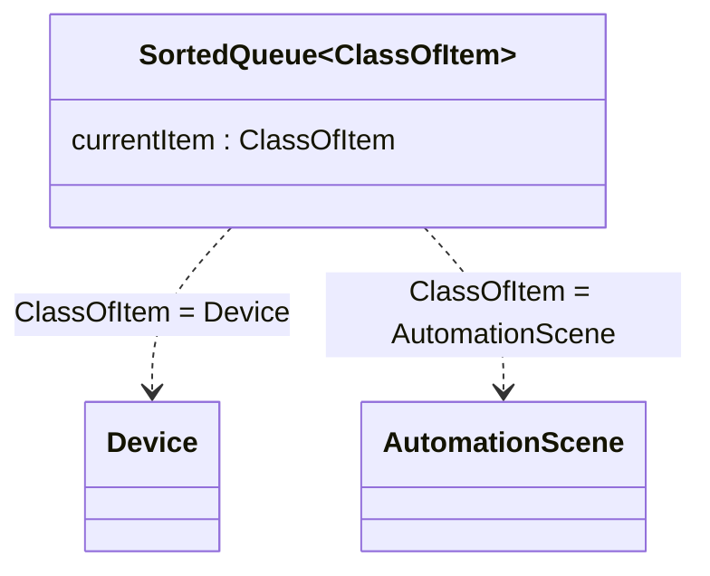

**გენერიულობა (Genericity)** არის კლასის **C** ისე აგება, რომ მისი ერთი ან რამდენიმე შიდა გამოყენებული კლასი მხოლოდ შესრულების დროს მიეწოდება — ანუ მაშინ, როცა კლასის **C** კონკრეტული ობიექტი იქმნება.

---

### მოტივაცია: ერთი და იმავე სტრუქტურის ორჯერ წერა

წარმოვიდგინოთ, რომ `HomeHub`-ისთვის ვწერთ დამხმარე კლასს `SortedQueue`, რომელიც `Device` ობიექტებს ინახავს დალაგებული, პრიორიტეტული რიგის სახით — მაგალითად, იმისთვის, რომ ჰაბმა firmware-განახლებები პრიორიტეტის მიხედვით შეამოწმოს. კლასს აქვს ჩაშენებული ჩასმისა და დახარისხების ალგორითმი, რომელიც ცოტა არ იყოს რთულის მოფიქრება დასჭირდა.

მალევე აღმოვაჩენთ, რომ ზუსტად იგივე სტრუქტურა გვჭირდება `AutomationScene` ობიექტების დასალაგებლადაც — მაგალითად, `AwayMode`-ში, რომელი სცენა რომელზე ადრე უნდა გაეშვას. რადგან პროფესორული პასუხისმგებლობის გრძნობა არ გვაკლია, უბრალოდ დავაკოპირეთ ძველი კოდი და ერთგან `Device` შევცვალეთ `AutomationScene`-ით.

ამ კლონირებამ დროებით პროდუქტიულობა გაზარდა, მაგრამ სრულყოფილი გამოსავალი არ არის — ახლა ორი თითქმის იდენტური კლასის მოვლა გვმართებს. თუ ხვალ დახარისხების ალგორითმში შეცდომას აღმოვაჩენთ (ან უბრალოდ უკეთეს ალგორითმს მოვიფიქრებთ), ორივე ასლი ცალ-ცალკე უნდა შევასწოროთ — და, თუ სამომავლოდ მესამე ტიპის ობიექტების დალაგებაც დაგვჭირდება, საქმეს კიდევ დაუმატებთ.

გვჭირდება გზა, რომლითაც დახარისხების ალგორითმის ბირთვი მხოლოდ ერთხელ დაიწერება და შემდეგ ნებისმიერი კლასის ობიექტებზე გამოვიყენებთ — `Device`-ზეც, `AutomationScene`-ზეც და ნებისმიერ სხვაზეც — კლონირების გარეშე.

---

### პარამეტრიზებული კლასი

აქ გვეხმარება **გენერიულობა**. თუ `SortedQueue`-ს განვსაზღვრავთ როგორც **პარამეტრიზებულ კლასს** (ადრე ცნობილს, როგორც generic class), მაშინ ერთ-ერთი კლასი, რომელსაც `SortedQueue` შიგნით იყენებს, დარჩება განუსაზღვრელი მანამ, სანამ შესრულების დრო არ დადგება. სავარაუდოდ, ეს არის ის კლასი, რომლის ობიექტებიც კონკრეტული რიგის ელემენტებში იქნება შენახული.

    class SortedQueue <ClassOfItem>;
        var currentItem: ClassOfItem := ClassOfItem.New;
        currentItem.getPriority();

გაითვალისწინე პარამეტრიზებული კლასის არგუმენტი `ClassOfItem`. ეს არის ფორმალური არგუმენტი, რომლის რეალური „მნიშვნელობა“ მხოლოდ შესრულების დროს მიეწოდება. მაგალითად, როცა ახალ `SortedQueue` ობიექტს ვქმნით, არგუმენტად რეალურ კლასის სახელს ვაწვდით:

    var deviceQueue: SortedQueue := SortedQueue.New <Device>;
    var sceneQueue: SortedQueue := SortedQueue.New <AutomationScene>;

ამგვარად, `deviceQueue` მიუთითებს `SortedQueue`-ის ობიექტზე, რომელიც თავის რიგში `Device`-ის ობიექტებს ინახავს (და ანალოგიურად `sceneQueue` — `AutomationScene`-ის ობიექტებს).

ეს ისეთივეა, თითქოს პირველი კოდი ორჯერ დაგვეკლონა (ერთხელ `Device`-ისთვის და ერთხელ `AutomationScene`-ისთვის):

    class DeviceQueue;
        var currentItem: Device := Device.New;
        currentItem.getPriority();

    class SceneQueue;
        var currentItem: AutomationScene := AutomationScene.New;
        currentItem.getPriority();

---

### გენერიულობა და პოლიმორფიზმი ერთად

გაითვალისწინე გამონათქვამი `currentItem.getPriority()`. ეს კარგი მაგალითია პოლიმორფიზმისა: როცა ამ ხაზს პარამეტრიზებულ კლას `SortedQueue`-ში ვწერთ, არ ვიცით, ზუსტად რომელი კლასის იქნება `currentItem`. ამიტომ, ვინც კონკრეტულ `SortedQueue`-ს ინსტანცირებას აპირებს, თავად უნდა იზრუნოს იმაზე, რომ ოპერაცია `getPriority()` განსაზღვრული იყოს იმ კლასზეც, რომელსაც ის რიგის ელემენტებად გამოიყენებს.

მსგავსი მოთხოვნა ჩნდება ნებისმიერ პარამეტრიზებულ კლასში. მაგალითად, თუ ვაპროექტებთ პარამეტრიზებულ კლასს `Schedule <ClassOfDevice>` — განრიგს, რომელსაც შეუძლია ნებისმიერი სახის `Device` ჩართოს/გამორთოს დათქმულ დროს — უნდა მივუთითოთ, რომ ნებისმიერ კლასს, რომელიც არგუმენტად მიეწოდება `ClassOfDevice`-ს, აუცილებლად უნდა ჰქონდეს ოპერაციები `turnOn()` და `turnOff()`. მაშინ `Schedule`-ს კოდს შეუძლია დაწეროს უბრალოდ:

    scheduledItem.turnOn();

და, არ აინტერესებს რა, კონკრეტულად `Light` მიუთითებს თუ `Thermostat` თუ `DoorLock` — თითოეული თავისებურად, მაგრამ სწორად „გაიგებს“ ამ ბრძანებას.

---

### რატომ არა უბრალოდ „ნებისმიერი ობიექტი“?

შეიძლება იფიქრო, რომ `SortedQueue` შეიძლებოდა დაგვეწერა გენერიულობისა და კლონირების გარეშეც — უბრალოდ ყოველი კვანძისთვის დაგვეშვა ნებისმიერი კლასის ობიექტის მიღება, თუ საერთო იერარქიის ყველაზე ზედა კლასს, ვთქვათ, `Object`-ს დავარქმევდით:

    class SortedQueue;
        var currentItem: Object := Object.New;
        currentItem.getPriority();

ახლა `SortedQueue`-ს ნებისმიერ კვანძს შეეძლებოდა ნებისმიერი ტიპის ობიექტის მიღება. კერძოდ, ერთსა და იმავე რიგში შეგვეძლო ერთმანეთში აგვერიოს `Device` ობიექტები, `AutomationScene` ობიექტები, `Room` ობიექტები და, ვთქვათ, `HomeOwner` ობიექტებიც. ეს თითქმის დარწმუნებით უაზრობა იქნებოდა — და, უფრო მეტიც, ძალიან ნაკლებად სავარაუდოა, რომ ამ სულ სხვადასხვა კლასის ობიექტებს ყველას ერთნაირად ექნებოდათ განსაზღვრული ოპერაცია `getPriority()`.

---

### კონტეინერის კლასები

`SortedQueue` და `Schedule` ორივე **კონტეინერის კლასის** მაგალითია — ანუ ისეთი კლასისა, რომელიც ობიექტებს რაიმე (ხშირად საკმაოდ დახვეწილი) სტრუქტურით ინახავს. გენერიულობა ხშირად სწორედ ასეთი კონტეინერის კლასების დასაპროექტებლად გამოიყენება ობიექტზე ორიენტირებულ დაპროგრამებაში.

მართალია, გენერიულობა არ არის აბსოლუტურად აუცილებელი იმისთვის, რომ კონტეინერის კლასისთვის ხელახლა გამოსაყენებელი კოდი დაიწეროს, მაგრამ ის აშკარად სჯობს როგორც კლონირებულ კოდს (რომელიც მოვლას ართულებს), ისე იმ მყიფე დიზაინს, სადაც ერთსა და იმავე კონტეინერში სხვადასხვა კლასის ობიექტები ურთიერთშერეულია.

---

შემდეგი [[თავი 1.10 შეჯამება]]
