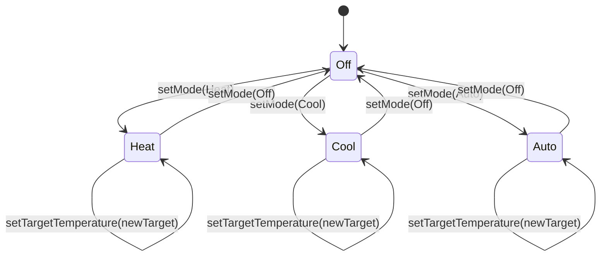

[[თავი 1.3 მდგომარეობის შენარჩუნება]] განყოფილებაში დავინახეთ, რომ ობიექტს შეუძლია საკუთარი მდგომარეობის შენარჩუნება განუსაზღვრელი დროით, და დავჰპირდით, რომ მდგომარეობის ცნებას მოგვიანებით უფრო ღრმად განვიხილავდით. ახლა დროა ეს დაპირება შევასრულოთ და ვნახოთ, ზუსტად რას ნიშნავს „მდგომარეობა" კლასის დონეზე — და რა კავშირშია ის კლასის „ქცევასთან".

კარგად დაპროექტებული კლასი წარმოადგენს იმ ობიექტების თვისებების ერთგვაროვან აბსტრაქციას, რომლებიც მას ეკუთვნიან. ეს წინადადება ორ საკვანძო სიტყვას შეიცავს, რომლებიც ღირს განვმარტოთ:

- **აბსტრაქცია** ნიშნავს, რომ კლასს არ სჭირდება რეალური სამყაროს ობიექტის ყველა შესაძლო თვისების მოდელირება. მაგალითად, **Light**-ს შეგვიძლია მივანიჭოთ ატრიბუტები `brightness` და `powerState`, მაგრამ არავითარი საჭიროება არ არსებობს, რომ კლასმა იცოდეს, რომელი მწარმოებლის ნათურაა მასში დამონტაჟებული ან რა ფერისაა მისი კორპუსი — თუ, რა თქმა უნდა, აპლიკაციას ეს რეალურად არ სჭირდება.
- **ერთგვაროვნება** ნიშნავს, რომ არჩეული აბსტრაქცია ერთნაირად ეხება კლასის ყველა ობიექტს. თუ გადავწყვეტთ, რომ **Thermostat**-ისთვის მნიშვნელოვანია ატრიბუტი `mode`, მაშინ ის თანაბრად ეხება სახლის ყველა თერმოსტატს — და არა მხოლოდ ზოგიერთს.

ეს „თვისებები", რომლებსაც კლასი ერთგვაროვნად აბსტრაჰირებს, სინამდვილეში იშლება ორ ცალკეულ თვისებად:

> კლასის ორი ფუნდამენტური თვისებაა მისი **მდგომარეობის სივრცე (state-space)** და მისი **დაშვებული ქცევა (behavior)**.

---

### რატომ არის ეს ორი ცალკეული თვისება

მანამ, სანამ ფორმალურ განსაზღვრებებზე გადავალთ, ღირს ვაჩვენოთ, რომ მდგომარეობის სივრცე და ქცევა ერთმანეთისგან დამოუკიდებელი თვისებებია — ორ კლასს შეუძლია განსხვავდებოდეს ერთით, მეორით, ან ორივით ერთად.

წარმოვიდგინოთ ორი მარტივი მოწყობილობა, რომლებსაც ერთი და იგივე ორელემენტიანი მდგომარეობის სივრცე აქვს — `powerState`, რომელსაც შეუძლია მიიღოს მხოლოდ **On** ან **Off** მნიშვნელობა:

- ჩვეულებრივი **Light**, რომელიც ირთვება და ითიშება მხოლოდ მაშინ, როცა მომხმარებელი პირდაპირ უგზავნის მას შესაბამის ბრძანებას **Dashboard**-იდან.
- მოძრაობაზე რეაგირებადი ნათურა, რომელსაც შეუძლია ასევე ავტომატურად ჩართვა, როცა **MotionSensor** მოძრაობას აღმოაჩენს, და ავტომატურად გამორთვა გარკვეული ხნის უმოძრაობის შემდეგ.

ორივე მოწყობილობას ერთი და იგივე მდგომარეობის სივრცე აქვს (**On**/**Off**), მაგრამ მათი **ქცევა** განსხვავებულია: პირველი იცვლის მდგომარეობას მხოლოდ პირდაპირი ბრძანებით, მეორეს კი აქვს დამატებითი, ავტონომიური გზა, რომლითაც შეუძლია იმავე ორ მდგომარეობას შორის იმოგზაუროს.

ახლა პირიქით წარმოვიდგინოთ: ორი ნათურა, რომლებსაც ერთი და იგივე ქცევა აქვთ — ორივე იცვლის სიკაშკაშეს მხოლოდ ოპერაციით `setBrightness(level)`, ავტომატური გადასვლების გარეშე — მაგრამ ერთს, ჩვეულებრივ **Light**-ს, შეუძლია მიაღწიოს ნებისმიერ მნიშვნელობას 0-დან 100-მდე, ხოლო მეორეს, საბავშვო ოთახისთვის გამიზნულ ვარიანტს, აქვს დამცავი შეზღუდვა — მისი `brightness` ვერასოდეს გადააჭარბებს 30-ს. ამ ორ ნათურას სრულიად იდენტური ქცევა აქვს (იგივე ოპერაცია, იგივე წესი), მაგრამ განსხვავებული მდგომარეობის სივრცე.

ეს ორი მაგალითი გვიჩვენებს, რომ მდგომარეობის სივრცე და ქცევა ერთმანეთისგან დამოუკიდებელი ღერძებია, რომლებზეც ორი კლასი შეიძლება ერთმანეთისგან განსხვავდებოდეს.

---

### მდგომარეობის სივრცის ფორმალური განსაზღვრება

> კლასის **C** **მდგომარეობის სივრცე** არის **C** კლასის ნებისმიერი ობიექტისთვის დაშვებული ყველა შესაძლო მდგომარეობის ერთობლიობა.
> **მდგომარეობის სივრცის განზომილებები** არის ის კოორდინატები, რომლებიც საჭიროა კონკრეტული ობიექტის მდგომარეობის ზუსტად აღსაწერად.

მდგომარეობის სივრცე სწორედ ის აბსტრაქცია გახლავთ, რომელზეც ზემოთ ვისაუბრეთ: კლასი შეგნებულად „ხედავს" მხოლოდ რამდენიმე შერჩეულ განზომილებას რეალურ სამყაროში არსებული ობიექტის ურიცხვი თვისებიდან.

<svg viewBox="0 0 640 400" xmlns="http://www.w3.org/2000/svg">
  <text x="320" y="30" text-anchor="middle" font-size="13" fill="currentColor">ყველა თეორიულად შესაძლო თვისება რეალურ სამყაროში</text>
  <ellipse cx="320" cy="215" rx="295" ry="160" fill="#4A90D9" fill-opacity="0.07" stroke="currentColor" stroke-width="1.5"/>
  <text x="95" y="115" text-anchor="middle" font-size="11" fill="currentColor" opacity="0.75">მწარმოებელი</text>
  <text x="545" y="115" text-anchor="middle" font-size="11" fill="currentColor" opacity="0.75">კორპუსის ფერი</text>
  <text x="95" y="335" text-anchor="middle" font-size="11" fill="currentColor" opacity="0.75">შესყიდვის თარიღი</text>
  <text x="545" y="335" text-anchor="middle" font-size="11" fill="currentColor" opacity="0.75">სერიული ნომერი</text>
  <ellipse cx="320" cy="232" rx="165" ry="98" fill="#16A085" fill-opacity="0.20" stroke="currentColor" stroke-width="1.5"/>
  <text x="320" y="192" text-anchor="middle" font-size="13" font-weight="bold" fill="currentColor">Light-ის მდგომარეობის სივრცე</text>
  <text x="320" y="210" text-anchor="middle" font-size="11" fill="currentColor">(შერჩეული განზომილებები: brightness, powerState)</text>
  <defs>
    <marker id="arrow101" viewBox="0 0 10 10" refX="9" refY="5" markerWidth="6" markerHeight="6" orient="auto-start-reverse">
      <path d="M0,0 L10,5 L0,10 z" fill="currentColor"/>
    </marker>
  </defs>
  <circle cx="270" cy="258" r="5" fill="currentColor"/>
  <circle cx="372" cy="258" r="5" fill="currentColor"/>
  <line x1="277" y1="258" x2="365" y2="258" stroke="currentColor" stroke-width="1.5" marker-end="url(#arrow101)"/>
  <text x="320" y="280" text-anchor="middle" font-size="11" fill="currentColor">brightness: 40 → 75 (გადასვლა / transition)</text>
</svg>

გარეთა, დაჩრდილული ოვალი წარმოადგენს ყველა იმ თვისებას, რომელიც პრინციპში შეიძლება ჰქონდეს რეალურ ობიექტს — მაგრამ **Light** კლასს ეს არაფერი აინტერესებს. შიდა, მუქი ოვალი კი არის ის, რასაც კლასი რეალურად ირჩევს თვალყურის საჩვენებლად: სწორედ ეს არის მისი მდგომარეობის სივრცე, ხოლო მასში ნაჩვენები წერტილიდან წერტილზე ნახტომი — ქცევა.

არაფორმალურად, ობიექტის „მდგომარეობა" არის ის მნიშვნელობების ერთობლიობა, რომელსაც ობიექტი კონკრეტულ მომენტში ატარებს — უფრო ზუსტად, იმ ობიექტების დალაგებული ნაკრები, რომლებზეც ის ამ მომენტში მიუთითებს. მაგალითად, კონკრეტული **Thermostat**-ის ობიექტის მდგომარეობა ამჟამად შეიძლება იყოს (`22°C`, `24°C`, `Heat`) — ანუ ის ამჟამად მიუთითებს 22-გრადუსიან **Temperature**-ის ობიექტზე (`currentTemperature`), 24-გრადუსიან **Temperature**-ის ობიექტზე (`targetTemperature`) და მნიშვნელობაზე `Heat` (`mode`).

წარმოიდგინე, თითოეული შესაძლო მდგომარეობა არის წერტილი ბადეზე, ხოლო ყოველი ცალკეული ობიექტი — პატარა წერტილი, რომელიც თავისი სიცოცხლის განმავლობაში ხტება ერთი წერტილიდან მეორეზე, ანუ ერთი მდგომარეობიდან მეორეზე, ამ ბადეში. ასეთ „ხტომას" ტექნიკურად **გადასვლა (transition)** ეწოდება.

**Thermostat**-ის მდგომარეობის სივრცეს, მაგალითად, სამი განზომილება აქვს: `currentTemperature`, `targetTemperature` და `mode` (რომელსაც შეიძლება ჰქონდეს მნიშვნელობები, ვთქვათ, `Off`, `Heat`, `Cool`, `Auto`). ეს სამი განზომილება ერთმანეთისგან დამოუკიდებელია — ნებისმიერ კომბინაციას შეუძლია, პრინციპში, არსებობდეს, სანამ არ განვიხილავთ იმ დამატებით შეზღუდვებს, რომლებსაც მოგვიანებით „კლასის ინვარიანტს" ვუწოდებთ.

მდგომარეობის სივრცის განზომილებები დაახლოებით ემთხვევა კლასზე განსაზღვრულ ატრიბუტებს — თუმცა არა ზუსტად. ატრიბუტი, რომლის მნიშვნელობაც უბრალოდ გამოითვლება სხვა ატრიბუტებისგან, ჩვეულებრივ არ ითვლება ცალკე განზომილებად. მაგალითად, თუ **Thermostat**-ს ექნება წაკითხვადი ატრიბუტი `isAtTarget` (რომელიც უბრალოდ ადარებს `currentTemperature`-სა და `targetTemperature`-ს), ეს არ დაამატებს მეოთხე განზომილებას — მისი მნიშვნელობა უკვე მთლიანად განისაზღვრება დანარჩენი სამი განზომილებით.

---

### ქცევის ფორმალური განსაზღვრება

უმეტესი ობიექტი (თუ ის აბსოლუტურად უცვლელი არაა) გადადის ერთი მდგომარეობიდან მეორეზე, როცა ერთი ან რამდენიმე მისი ატრიბუტი იცვლის მნიშვნელობას. სწორედ ეს გადასვლები წარმოადგენს კლასის დაშვებულ ქცევას:

> კლასის **C** **დაშვებული ქცევა** არის ის გადასვლების ერთობლიობა, რომლის გაკეთებაც **C** კლასის ობიექტს ნებადართული აქვს თავისი მდგომარეობის სივრცის შიგნით.

ეს განსაზღვრება გულისხმობს, რომ ყველა თეორიულად შესაძლო გადასვლა სულაც არ არის ლეგალური. ობიექტი „ხტება" თავისი კლასის მდგომარეობის სივრცეში მხოლოდ იმ წესებით, რომლებსაც კლასის ქცევა უწესებს მას.

**Thermostat**-ის შემთხვევაში, დაშვებული ქცევა შედგება ორი სახის გადასვლისგან:

1. საჯარო ოპერაცია `setTargetTemperature(newTarget)`, რომელიც პირდაპირ ცვლის `targetTemperature`-ის განზომილებას მომხმარებლის ან **AutomationScene**-ის მოთხოვნით.
2. შიდა, ავტომატური ოპერაცია (ხშირად უწოდებენ „tick"-ს), რომელიც პერიოდულად ასწორებს `currentTemperature`-ს რეალურ სამყაროსთან — ის ნელ-ნელა ცვლის `currentTemperature`-ს `targetTemperature`-სკენ, `mode`-ის შესაბამისად.

გაითვალისწინე, რომ **Thermostat**-ს განზრახ არ აქვს საჯარო ოპერაცია `setCurrentTemperature()`. `currentTemperature`-ის განზომილებაში „ხტომა" შესაძლებელია მხოლოდ შიდა tick-ის მეშვეობით — გარეშე კლიენტს არ შეუძლია პირდაპირ დაუსახოს თერმოსტატს, თითქოს ოთახი უცებ გაცხელდა. სწორედ ეს არის ის, რასაც ვგულისხმობთ, როცა ვამბობთ, რომ ინკაფსულაცია ზღუდავს არა მხოლოდ წვდომას მონაცემებზე, არამედ იმასაც, თუ საერთოდ რომელი გადასვლებია შესაძლებელი.

ქვემოთ მოცემულია გამარტივებული სურათი **Thermostat**-ის ქცევისა, სადაც ჩანს, რომ `mode`-ებს შორის გადასვლა საჯარო ოპერაციითაა შესაძლებელი, ხოლო `currentTemperature`-ის „მიახლოება" `targetTemperature`-სთან ხდება მხოლოდ შიდა tick-ის შედეგად:

დიაგრამაზე ნაჩვენები ოთხი „ყუთი" (`Off`, `Heat`, `Cool`, `Auto`) სინამდვილეში წარმოადგენს `mode`-ის განზომილების მნიშვნელობებს; თითოეული მათგანი, თავის მხრივ, მალავს `currentTemperature`-ისა და `targetTemperature`-ის მთელ ორგანზომილებიან ქვე-სივრცეს, რომელშიც ობიექტი ცალკე მოძრაობს tick-ისა და `setTargetTemperature`-ის მეშვეობით.

---

დასკვნის სახით: ორი კლასი შეიძლება განსხვავდებოდეს ან მდგომარეობის სივრცით, ან ქცევით, ან ორივეთი ერთად. მომდევნო ორ განყოფილებაში ვნახავთ, რა ემართება ამ ორ თვისებას, როცა ერთი კლასი მეორის ქვეკლასია.

შემდეგი [[თავი 10.2 ქვეკლასის მდგომარეობის სივრცე]]
