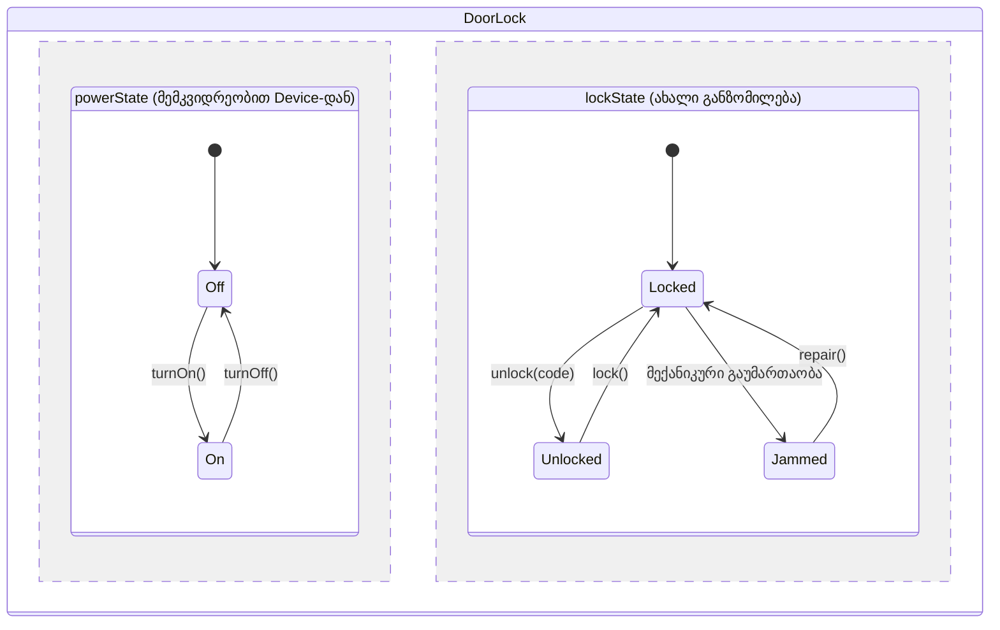

წინა განყოფილებაში განვსაზღვრეთ, რა არის კლასის მდგომარეობის სივრცე. ახლა დავსვათ კითხვა: რა კავშირშია ერთმანეთთან ორი კლასის მდგომარეობის სივრცეები, როცა ერთი მეორის ქვეკლასია?

> თუ **B** არის **A**-ს ქვეკლასი, მაშინ **B**-ის მდგომარეობის სივრცე მთლიანად უნდა იყოს შემოსაზღვრული **A**-ს მდგომარეობის სივრცით. ამბობენ, რომ **B**-ის მდგომარეობის სივრცე „შემოსაზღვრულია" **A**-ს მდგომარეობის სივრცით.

### მარტივი მაგალითი: Device და Light

ავიღოთ აბსტრაქტული ბაზისური კლასი **Device**, საიდანაც მემკვიდრეობენ ჭკვიანი სახლის ყველა მოწყობილობა. დავუშვათ, სიმარტივისთვის, რომ **Device**-ის მდგომარეობის სივრცეს მხოლოდ ერთი განზომილება აქვს: `powerState`, რომელსაც შეუძლია მიიღოს მხოლოდ ორი მნიშვნელობა — **On** ან **Off**.

**Light**, რომელიც მემკვიდრეობს **Device**-ისგან, იყენებს იმავე ორ მნიშვნელობას `powerState`-ისთვის. ეს კარგადაა: **Light**-ის მდგომარეობის სივრცე ზუსტად ემთხვევა **Device**-ის მდგომარეობის სივრცეს, ანუ მთლიანად შემოსაზღვრულია მასში.

მაგრამ წარმოვიდგინოთ ცუდი დიზაინი, სადაც ვინმემ გადაწყვიტა, რომ **Light**-ს ჰქონდეს მესამე მნიშვნელობა — **Flickering** — რომელიც **Device**-ის ორიგინალურ განსაზღვრებაში საერთოდ არ არსებობს. ეს დაარღვევდა ზემოთ მოცემულ წესს: **Light**-ის ობიექტი შეიძლებოდა ყოფილიყო ლეგალური **Light** (ვინაიდან **Flickering** მისთვის დაშვებულია), მაგრამ არალეგალური **Device** (ვინაიდან **Device**-ს არასდროს განუსაზღვრია, რას ნიშნავს **Flickering** `powerState`-ისთვის). სხვა სიტყვებით: ჩვენი ჭკვიანი ნათურა შეიძლებოდა ყოფილიყო ლეგალური ნათურა, მაგრამ არალეგალური მოწყობილობა — აბსურდი, რომელიც გვიჩვენებს, რომ ასეთი დიზაინი დაუშვებელია.

---

### გასაკვირი ნაწილი: ქვეკლასს შეუძლია მეტი განზომილება ჰქონდეს

გასაკვირად ბევრისთვის, ქვეკლასის მდგომარეობის სივრცეს შეუძლია ჰქონდეს **მეტი** განზომილება, ვიდრე მის სუპერკლასს:

> თუ **B** არის **A**-ს ქვეკლასი, მაშინ **B**-ის მდგომარეობის სივრცე უნდა მოიცავდეს მინიმუმ **A**-ს ყველა განზომილებას — მაგრამ შეიძლება მეტიც შეიცავდეს. თუ ის მეტ განზომილებას შეიცავს, ვამბობთ, რომ **B**-ის მდგომარეობის სივრცე „აფართოებს" **A**-ს მდგომარეობის სივრცეს.

ეს ერთი შეხედვით ეწინააღმდეგება წინა წესს — როგორ შეიძლება ქვეკლასის მდგომარეობის სივრცე ერთდროულად იყოს შემოსაზღვრული სუპერკლასის მიერ და ამავე დროს აფართოებდეს მას? პასუხი ასეთია: იმ განზომილებებში, რომლებიც უკვე განსაზღვრულია სუპერკლასზე, ქვეკლასის მდგომარეობის სივრცე მართლაც შემოსაზღვრულია (ან ტოლია, ან ვიწროა). მაგრამ ქვეკლასს, გარდა ამისა, შეუძლია ჰქონდეს სრულიად ახალი განზომილებები, რომლებიც სუპერკლასზე საერთოდ არ არსებობს.

საუკეთესო მაგალითი ჩვენს სისტემაშივეა: **DoorLock**, რომელიც ასევე მემკვიდრეობს **Device**-ისგან.

**DoorLock**-ს, ცხადია, აქვს იგივე `powerState` განზომილება, რაც **Device**-ს — საკეტის მოტორსაც ელექტროენერგია სჭირდება, და ამ მოტორს, ისევე როგორც ნებისმიერ სხვა მოწყობილობას, შეუძლია იყოს **On** ან **Off**. მაგრამ **DoorLock**-ს, გარდა ამისა, აქვს მთლიანად ახალი განზომილება — `lockState` — რომელსაც შეუძლია მიიღოს სამი მნიშვნელობა: **Locked**, **Unlocked** ან **Jammed** (ჩარჩენილი, მაგალითად, კარის ღრეჩოში ჩარჩენილი საკეტის ენის გამო).

ქვემოთ მოცემული სქემა გვიჩვენებს ზუსტად ამ ორმაგ ურთიერთობას — არსებულ განზომილებაში შემოსაზღვრას და ახალში გაფართოებას — ერთდროულად:

<svg viewBox="0 0 700 400" xmlns="http://www.w3.org/2000/svg">
  <defs>
    <marker id="arrow102" viewBox="0 0 10 10" refX="9" refY="5" markerWidth="6" markerHeight="6" orient="auto-start-reverse">
      <path d="M0,0 L10,5 L0,10 z" fill="currentColor"/>
    </marker>
  </defs>
  <text x="105" y="130" text-anchor="middle" font-size="12" font-weight="bold" fill="currentColor">Device</text>
  <text x="105" y="146" text-anchor="middle" font-size="10" fill="currentColor">1 განზომილება: powerState</text>
  <rect x="30" y="155" width="75" height="80" fill="#4A90D9" fill-opacity="0.15" stroke="currentColor"/>
  <rect x="105" y="155" width="75" height="80" fill="#4A90D9" fill-opacity="0.15" stroke="currentColor"/>
  <text x="67.5" y="200" text-anchor="middle" font-size="12" fill="currentColor">On</text>
  <text x="142.5" y="200" text-anchor="middle" font-size="12" fill="currentColor">Off</text>

  <line x1="185" y1="195" x2="330" y2="195" stroke="currentColor" stroke-width="1.5" marker-end="url(#arrow102)"/>
  <text x="257" y="180" text-anchor="middle" font-size="10" fill="currentColor">ქვეკლასი DoorLock</text>

  <text x="465" y="45" text-anchor="middle" font-size="12" font-weight="bold" fill="currentColor">DoorLock</text>
  <text x="465" y="61" text-anchor="middle" font-size="10" fill="currentColor">2 განზომილება: powerState + lockState</text>

  <path d="M 340 78 L 590 78" stroke="#4A90D9" stroke-width="2"/>
  <path d="M 340 73 L 340 83 M 590 73 L 590 83" stroke="#4A90D9" stroke-width="2"/>
  <text x="465" y="70" text-anchor="middle" font-size="10" fill="#4A90D9">powerState — შემოსაზღვრული (იგივეა, რაც Device-ში)</text>

  <path d="M 315 90 L 315 340" stroke="#E67E22" stroke-width="2"/>
  <path d="M 310 90 L 320 90 M 310 340 L 320 340" stroke="#E67E22" stroke-width="2"/>
  <text x="300" y="215" text-anchor="middle" font-size="10" fill="#E67E22" transform="rotate(-90 300 215)">lockState — ახალი, გაფართოებული განზომილება</text>

  <g stroke="currentColor" fill="#16A085" fill-opacity="0.12">
    <rect x="340" y="90" width="125" height="83"/>
    <rect x="465" y="90" width="125" height="83"/>
    <rect x="340" y="173" width="125" height="83"/>
    <rect x="465" y="173" width="125" height="83"/>
    <rect x="340" y="256" width="125" height="83"/>
    <rect x="465" y="256" width="125" height="83"/>
  </g>
  <text x="402.5" y="105" text-anchor="middle" font-size="10" fill="currentColor">On</text>
  <text x="527.5" y="105" text-anchor="middle" font-size="10" fill="currentColor">Off</text>
  <text x="402.5" y="135" text-anchor="middle" font-size="11" fill="currentColor">Locked</text>
  <text x="527.5" y="135" text-anchor="middle" font-size="11" fill="currentColor">Locked</text>
  <text x="402.5" y="218" text-anchor="middle" font-size="11" fill="currentColor">Unlocked</text>
  <text x="527.5" y="218" text-anchor="middle" font-size="11" fill="currentColor">Unlocked</text>
  <text x="402.5" y="301" text-anchor="middle" font-size="11" fill="currentColor">Jammed</text>
  <text x="527.5" y="301" text-anchor="middle" font-size="11" fill="currentColor">Jammed</text>

  <text x="465" y="380" text-anchor="middle" font-size="11" fill="currentColor">ერთდროულად: შემოსაზღვრული (powerState) და გაფართოებული (lockState)</text>
</svg>

ორივე განზომილება ერთმანეთისგან დამოუკიდებელია — საკეტს შეუძლია იყოს ჩართული და დაბლოკილი, ჩართული და გახსნილი, გამორთული და ჩარჩენილი, და ასე შემდეგ. ქვემოთ მოცემული დიაგრამა გვიჩვენებს ორივე განზომილებას, როგორც ორ დამოუკიდებელ (ორთოგონალურ) რეგიონს **DoorLock**-ის მდგომარეობის სივრცეში:

ეს არის ზუსტად ის, რასაც ვგულისხმობთ, როცა ვამბობთ, რომ ქვეკლასის მდგომარეობის სივრცე ერთდროულად შემოსაზღვრულია და აფართოებულია: `powerState`-ის ღერძზე, **DoorLock** მთლიანად ემორჩილება **Device**-ის წესებს (**On**/**Off**-ის მიღმა ვერაფერს გახდება); ხოლო ახალ `lockState`-ის ღერძზე, რომელიც საერთოდ არ არსებობს **Device**-ზე, **DoorLock** თავისუფლად „მოძრაობს" სამ მნიშვნელობას შორის.

---

### რატომ არის ეს პრინციპულად მნიშვნელოვანი

ეს წესი პირდაპირ უკავშირდება [[თავი 1.7 მემკვიდრეობა]]-ს არსს: თუ **DoorLock**-ის ობიექტი ვერასდროს აღმოჩნდება ისეთ მდგომარეობაში, რომელიც **Device**-ის თვალსაზრისით არალეგალურია, მაშინ ნებისმიერი კოდი, რომელიც წერია **Device**-ის ტიპის ცვლადისთვის (მაგალითად, **DeviceRegistry**-ის შიგნით, სადაც ყველა მოწყობილობა ერთნაირად განიხილება), უსაფრთხოდ იმუშავებს ნებისმიერ **DoorLock**-ის ობიექტზეც — თუნდაც ეს კოდი არაფერი არ იცოდეს `lockState`-ის შესახებ. სწორედ ეს გვაძლევს გარანტიას, რომ ქვეკლასის ობიექტი ყოველთვის შეიძლება უსაფრთხოდ გამოვიყენოთ იქ, სადაც სუპერკლასის ობიექტია მოსალოდნელი.

შემდეგი [[თავი 10.3 ქვეკლასის ქცევა]]
