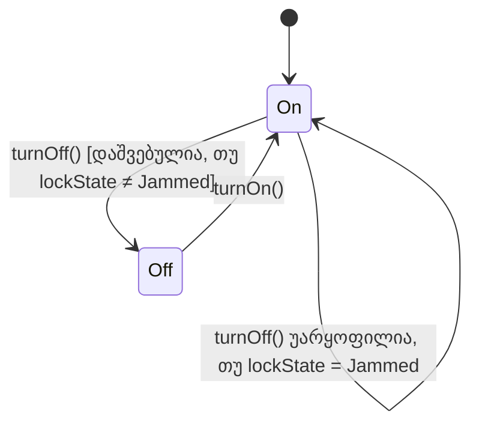

წინა ორ განყოფილებაში ვნახეთ, თუ როგორ შეიძლება ქვეკლასის მდგომარეობის სივრცემ ერთდროულად „შემოისაზღვროს" და „გააფართოვოს" სუპერკლასის მდგომარეობის სივრცე. ახლა იგივე კითხვას დავსვამთ ქცევასთან დაკავშირებით: აქვს თუ არა ქვეკლასის ქცევასა და სუპერკლასის ქცევას მსგავსი ურთიერთობა?

პასუხი დადებითია — ორივე მიმართულებით.

### გაფართოება

პირველ რიგში, განვიხილოთ **გაფართოება**: ქცევა, რომელიც აქვს ქვეკლასს **B**, მაგრამ არა აქვს სუპერკლასს **A**. ეს დამატებითი ქცევა აუცილებელია — თუ ის არ იარსებებდა, როგორ შეძლებდა **B**-ის ობიექტი „ეხტუნა" თავისი მდგომარეობის სივრცის იმ ნაწილში, რომელიც სცდება **A**-ს?

დავუბრუნდეთ **DoorLock**-ს, რომელიც წინა განყოფილებაში `lockState` განზომილებას ამატებდა **Device**-ს. ლოგიკურია, რომ **DoorLock**-ს ექნება ისეთი ოპერაციები, როგორიცაა `lock()` და `unlock(code)`, რომლებიც ცვლიან სწორედ ამ ახალ განზომილებას. ეს ქცევა აშკარად სცდება ნებისმიერ ქცევას, რომელიც შეიძლება ჰქონდეს **Device**-ს — ბოლოს და ბოლოს, **Device**-ს საერთოდ არც კი აქვს წარმოდგენა „ჩაკეტვის" შესახებ! უფრო ტექნიკურად რომ ვთქვათ: **Device**-ს არა აქვს `lockState` განზომილება თავის მდგომარეობის სივრცეში, ამიტომ ვერანაირი ქცევა, რომელიც ამ განზომილებაში გადაადგილებას გულისხმობს, ვერ იქნებოდა განსაზღვრული **Device**-ზე.

ეს მაგალითი გვიჩვენებს, რომ **DoorLock**-ს შეუძლია გააფართოვოს თავისი სუპერკლასის ქცევა — ზუსტად ისე, როგორც მან გააფართოვა მისი მდგომარეობის სივრცე.

---

### შემოსაზღვრა

მეორე მხრივ, ქვეკლასის ქცევას ასევე შეუძლია იყოს სუპერკლასის ქცევის **შემოსაზღვრული** ვერსია — ისევე, როგორც ქვეკლასის მდგომარეობის სივრცე შემოსაზღვრულია სუპერკლასის მდგომარეობის სივრცით.

წარმოვიდგინოთ, რომ **Device** საერთოდ არ აწესებს არავითარ პირობას `turnOff()`-ზე — ნებისმიერ მოწყობილობას ნებისმიერ დროს შეუძლია გამორთვა. მაგრამ **DoorLock**-ისთვის ეს უსაფრთხო არ იქნებოდა: თუ საკეტის მოტორი გამოირთვება ზუსტად იმ დროს, როცა `lockState = Jammed` (ანუ საკეტის ენა შუა გზაზეა ჩარჩენილი), კარი შეიძლება დარჩეს ისეთ მდგომარეობაში, საიდანაც მისი ხელახლა გახსნა ან ჩაკეტვა ვეღარასოდეს მოხერხდება. ამიტომ **DoorLock**-ის `turnOff()` კრძალავს გამორთვას ზუსტად მაშინ, როცა `lockState = Jammed` — ანუ **DoorLock**-ის ქცევა ამ თვალსაზრისით უფრო ვიწროა, ვიდრე **Device**-ის ზოგადი ქცევა დაუშვებდა.

ეს ზუსტად პარალელურია იმისა, რაც წინა განყოფილებაში ვნახეთ მდგომარეობის სივრცისთვის: ისევე, როგორც ქვეკლასის მდგომარეობის სივრცე შეიძლება იყოს სუპერკლასის სივრცის ვიწრო ქვეჯგუფი, ქვეკლასის ქცევაც შეიძლება იყოს სუპერკლასის ქცევის შემზღუდველი ვერსია — და, ხშირად, ეს შემზღუდველობა უბრალოდ გამომდინარეობს იქიდან, რომ ქვეკლასს დამატებული აქვს ახალი განზომილება (`lockState`), რომლის დაცვაც მოითხოვს ძველი ოპერაციების ქცევის დაზუსტებას.

იმავე „შემოსაზღვრა + გაფართოება" პრინციპს ვხედავთ ოპერაციების დონეზეც, ისევე როგორც განზომილებების დონეზე:

<svg viewBox="0 0 660 340" xmlns="http://www.w3.org/2000/svg">
  <rect x="30" y="30" width="600" height="280" rx="20" fill="#16A085" fill-opacity="0.06" stroke="currentColor" stroke-width="1.5"/>
  <text x="330" y="55" text-anchor="middle" font-size="13" font-weight="bold" fill="currentColor">DoorLock-ის დაშვებული ქცევა</text>

  <rect x="60" y="90" width="270" height="180" rx="14" fill="#4A90D9" fill-opacity="0.15" stroke="currentColor" stroke-width="1.5"/>
  <text x="195" y="115" text-anchor="middle" font-size="12" font-weight="bold" fill="currentColor">მემკვიდრეობით (Device-იდან)</text>
  <text x="195" y="150" text-anchor="middle" font-size="12" fill="currentColor">turnOn() — უცვლელი</text>
  <text x="195" y="180" text-anchor="middle" font-size="12" fill="#C0392B">turnOff() — შემოსაზღვრული</text>
  <text x="195" y="200" text-anchor="middle" font-size="10" fill="#C0392B">[დაშვებულია, თუ lockState ≠ Jammed]</text>

  <rect x="360" y="90" width="240" height="180" rx="14" fill="#E67E22" fill-opacity="0.15" stroke="currentColor" stroke-width="1.5"/>
  <text x="480" y="115" text-anchor="middle" font-size="12" font-weight="bold" fill="currentColor">ახალი (გაფართოება)</text>
  <text x="480" y="150" text-anchor="middle" font-size="12" fill="currentColor">lock()</text>
  <text x="480" y="180" text-anchor="middle" font-size="12" fill="currentColor">unlock(code)</text>

  <text x="330" y="295" text-anchor="middle" font-size="11" fill="currentColor">ერთდროულად: შემოსაზღვრული (turnOff) და გაფართოებული (lock/unlock)</text>
</svg>

ქვემოთ ნაჩვენებია, თუ როგორ ზღუდავს `lockState = Jammed` პირობა `turnOff()`-ის ხელმისაწვდომობას:

---

### რატომ არის ეს მნიშვნელოვანი

ეს დაკვირვება მიგვიყვანს ერთ-ერთ ყველაზე მნიშვნელოვან პრინციპთან კლას-იერარქიების დაპროექტებაში: თუ ქვეკლასი ძალიან თავისუფლად აფართოებს ან ავიწროებს სუპერკლასის ქცევას, შეიძლება მოულოდნელად დაირღვეს ის, რასაც სუპერკლასის ობიექტების მომხმარებელი კოდი მისგან ელოდება. ამ თემას — რომელსაც ხშირად „დახურული ქცევა" (closed behavior) ჰქვია — მომავალ განყოფილებებში დავუბრუნდებით, როცა კლას-იერარქიების ხარისხის შეფასების კრიტერიუმებზე ვისაუბრებთ. ჯერჯერობით საკმარისია დავიმახსოვროთ, რომ მდგომარეობის სივრცის მსგავსად, ქცევაც შეიძლება ერთდროულად გაფართოვდეს ახალი შესაძლებლობებით და შემოისაზღვროს არსებულებში.

შემდეგი [[თავი 10.4 კლასის ინვარიანტი, როგორც მდგომარეობის სივრცის შეზღუდვა]]
