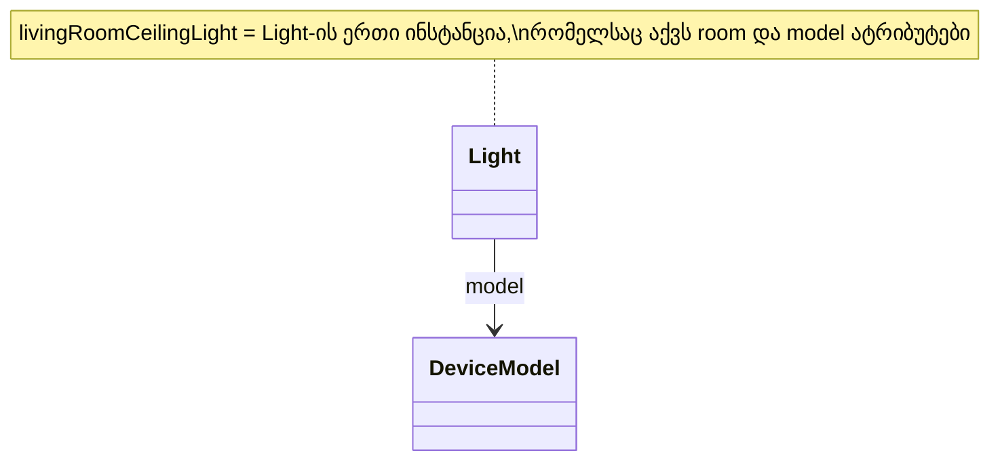

მესამე ბოროტად გამოყენება ყველაზე დახვეწილია სამივედან — ხშირად პრობლემას ვერც კი ამჩნევთ დიაგრამაზე ერთი შეხედვით, სანამ არ დაიწყებთ კითხვას: **„ამ კლასის ინსტანციები კონკრეტულად რა არის?"**

## არასწორი დიზაინი: ცალკე ქვეკლასი ერთი ფიზიკური მოწყობილობისთვის

წარმოვიდგინოთ, რომ ვინმემ გადაწყვიტა ცალკე კლასი შეექმნა კონკრეტული, ერთეული ფიზიკური ხელსაწყოსთვის — ვთქვათ, **LivingRoomCeilingLight**, როგორც **Light**-ის ქვეკლასი, სპეციალურად იმისთვის, რომ წარმოადგინოს „მისაღების ჭერზე დამონტაჟებული ნათურა":

<svg viewBox="0 0 580 300" xmlns="http://www.w3.org/2000/svg">
  <line x1="290" y1="10" x2="290" y2="290" stroke="currentColor" stroke-width="1" stroke-dasharray="4,4" opacity="0.3"/>

  <text x="145" y="24" text-anchor="middle" font-size="15" font-weight="bold" fill="#C0392B">✗ არასწორი</text>
  <rect x="100" y="42" width="90" height="34" fill="none" stroke="currentColor"/>
  <text x="145" y="64" text-anchor="middle" font-size="13" fill="currentColor">Light</text>
  <rect x="70" y="188" width="150" height="34" fill="none" stroke="currentColor"/>
  <text x="145" y="210" text-anchor="middle" font-size="10" fill="currentColor">LivingRoomCeilingLight</text>
  <polygon points="145,76 137,98 153,98" fill="none" stroke="#C0392B" stroke-width="1.5"/>
  <line x1="145" y1="98" x2="145" y2="188" stroke="#C0392B" stroke-width="1.5"/>
  <text x="145" y="250" text-anchor="middle" font-size="10" fill="#C0392B">
    <tspan x="145" dy="0">✗ ერთი ფიზიკური ობიექტისთვის ცალკე</tspan>
    <tspan x="145" dy="14">კლასი — ეს ინსტანციაა, არა კატეგორია</tspan>
  </text>

  <text x="435" y="24" text-anchor="middle" font-size="15" font-weight="bold" fill="#16A085">✓ სწორი</text>
  <rect x="390" y="42" width="90" height="34" fill="none" stroke="currentColor"/>
  <text x="435" y="64" text-anchor="middle" font-size="13" fill="currentColor">Light</text>
  <rect x="310" y="188" width="120" height="34" fill="none" stroke="currentColor"/>
  <text x="370" y="207" text-anchor="middle" font-size="8.5" text-decoration="underline" fill="currentColor">livingRoomCeilingLight</text>
  <text x="370" y="217" text-anchor="middle" font-size="8.5" text-decoration="underline" fill="currentColor">: Light</text>
  <rect x="440" y="188" width="120" height="34" fill="none" stroke="currentColor"/>
  <text x="500" y="207" text-anchor="middle" font-size="8.5" text-decoration="underline" fill="currentColor">kitchenPendantLight</text>
  <text x="500" y="217" text-anchor="middle" font-size="8.5" text-decoration="underline" fill="currentColor">: Light</text>
  <line x1="435" y1="76" x2="370" y2="188" stroke="#16A085" stroke-width="1.2" stroke-dasharray="3,3"/>
  <line x1="435" y1="76" x2="500" y2="188" stroke="#16A085" stroke-width="1.2" stroke-dasharray="3,3"/>
  <text x="390" y="140" font-size="8" fill="#16A085">ინსტანციაა</text>
  <text x="435" y="250" text-anchor="middle" font-size="10" fill="#16A085">
    <tspan x="435" dy="0">✓ ერთი კლასი, ბევრი ინსტანცია —</tspan>
    <tspan x="435" dy="14">ისე, როგორც კლას-იერარქია უნდა იყოს</tspan>
  </text>
</svg>
_სქემა: მარცხნივ — არასწორად შექმნილი ქვეკლასი ერთეული ფიზიკური ობიექტისთვის (ღრუ სამკუთხედი); მარჯვნივ — იგივე ობიექტები, სწორად წარმოდგენილი, როგორც Light-ის ინსტანციები (წყვეტილი ხაზი, ხაზგასმული სახელები UML-ის ინსტანციის აღნიშვნით)._

დასვით ის კითხვა, რომელიც ზემოთ დავსახელეთ: **რა არის LivingRoomCeilingLight-ის ინსტანციები?** სწორი პასუხი — არაფერი აზრიანი. ეს კლასი უკვე თავად წარმოადგენს ერთადერთ, კონკრეტულ ფიზიკურ ობიექტს — მისაღების ჭერის ნათურას. მას არ სჭირდება საკუთარი ინსტანციები, რადგან ის თავად **არის** ინსტანცია, არა კატეგორია. ეს დიზაინი აშკარად ვერ დამასკალირდება: წარმოიდგინეთ ცალკე კლასი ყოველი ცალკეული ნათურისთვის სახლში — ასეულობით კლასი ერთი და იმავე ქცევით, განსხვავებული მხოლოდ სახელით.

## სად ეხვევა კიდევ უფრო დახვეწილი შემთხვევა

პრობლემა ხშირად კიდევ უფრო დახვეწილ ფორმას იღებს, როცა ერთდროულად გვჭირდება ორი განსხვავებული „ჯგუფური" ცნება: ერთი, რომლის ინსტანციები ცალკეული ფიზიკური ერთეულებია, და მეორე, რომლის ინსტანციები მთელი **მოდელებია** (პროდუქტის კატალოგის ერთეულები).

- **Light**-ის ინსტანციები არიან კონკრეტული, ფიზიკურად დამონტაჟებული ნათურები — მისაღების ჭერის ეს ნათურა, სამზარეულოს გისოსზე დაკიდებული ის ნათურა და ასე შემდეგ.
- **DeviceModel**-ის ინსტანციები კი არიან მთლიანი პროდუქტის მოდელები — ვთქვათ, „SmartGlow X200" ან „SmartGlow X200 Pro" — რომლებიც აღწერენ საერთო მახასიათებლებს (მაქსიმალური სიკაშკაშე, სიმძლავრის მოხმარება, firmware-ის ვერსია) ყველა იმ ფიზიკური ნათურისთვის, რომელიც ამ მოდელს ეკუთვნის.

ეს ორი ცნება **სხვადასხვა კატეგორიის ინსტანციებზეა** დაფუძნებული — ერთია ინდივიდუალური ობიექტი, მეორე კი მთელი კატეგორია/მოდელი — და, შესაბამისად, **Light** არასდროს არ უნდა იყოს **DeviceModel**-ის ქვეკლასი (ან პირიქით). ეს იქნებოდა ზუსტად იგივე შეცდომა, რაც `LivingRoomCeilingLight`-ის შემთხვევაში, უბრალოდ ცოტა უფრო ფარული ფორმით.

## სწორი დიზაინი: კავშირი, არა მემკვიდრეობა

სწორი გამოსავალია, დავუკავშიროთ ეს ორი ცნება ჩვეულებრივი ატრიბუტით (ასოციაციით), არა მემკვიდრეობით:

ახლა **Light**-ს აქვს ინსტანციური ატრიბუტი `model: DeviceModel`, რომელიც უთითებს, რომელ პროდუქტის მოდელს მიეკუთვნება კონკრეტული ფიზიკური ნათურა. „მისაღების ჭერის ნათურა" აღარ საჭიროებს საკუთარ კლასს — ის უბრალოდ ერთი ჩვეულებრივი ინსტანციაა:

    var livingRoomCeilingLight: Light :=
        Light.New(room := livingRoom, model := smartGlowX200);

ერთი ხაზი კოდი, ახალი კლასის გარეშე — და ზუსტად ეს არის განსხვავება იმას შორის, რასაც სისტემა რეალურად ასახავს (ინდივიდუალური, ფიზიკური ობიექტი) და იმას შორის, რასაც კლას-იერარქია სასურველია აღწერდეს (კატეგორიები და მათი ურთიერთდამოკიდებულებები).

## ზოგადი წესი

მემკვიდრეობა გამოსადეგია მხოლოდ მაშინ, როცა ახალი ქვეკლასი წარმოადგენს ახალ **კატეგორიას** — ანუ, ჯგუფს, რომელსაც შეიძლება ჰქონდეს მრავალი საკუთარი ინსტანცია, საკუთარი ქცევით. თუ სინამდვილეში მხოლოდ **ერთ, კონკრეტულ ობიექტს** აღწერთ, გჭირდებათ არა ახალი კლასი, არამედ უბრალოდ არსებული კლასის ერთი ახალი ინსტანცია, საჭირო ატრიბუტების მნიშვნელობებით.

---

შემდეგი [[თავი 12.1.4 Is-a ურთიერთობის არასწორად გამოყენება]]
