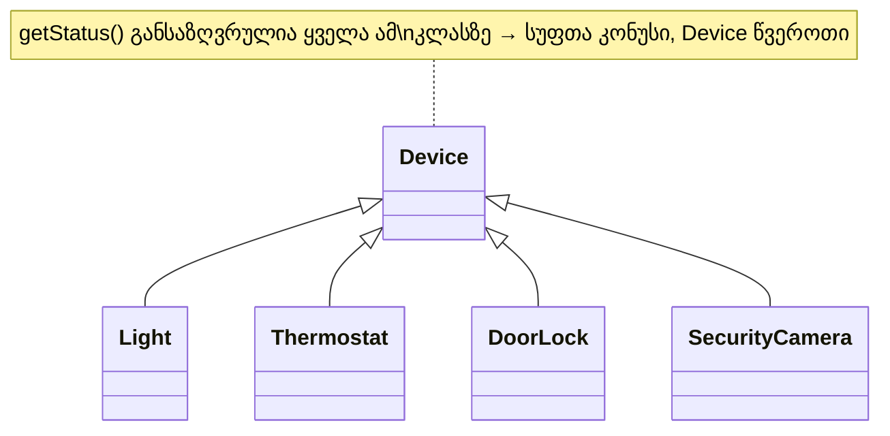
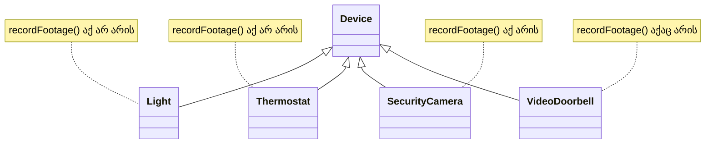

მემკვიდრეობის ბოროტად გამოყენებები ეხებოდა სიტუაციებს, სადაც თავად იერარქიის სტრუქტურა იყო არასწორად შერჩეული. მაგრამ **პოლიმორფიზმს** შეუძლია პრობლემა შექმნას მაშინაც, როცა იერარქია სავსებით სწორადაა აპროექტებული — უბრალოდ იმიტომ, რომ ის საშუალებას გვაძლევს, ობიექტს გავუგზავნოთ შეტყობინება მისი ზუსტი კლასის ცოდნის გარეშე. თუ ეს ბოლომდე გულდასმით არ ავწონეთ, ობიექტმა შეიძლება მიიღოს შეტყობინება, რომელსაც „ვერ ხვდება" — რასაც მოჰყვება გაშვების დროინდელი ავარია.

ამ ნაწილში და მომდევნო სამში განვიხილავთ ოთხ კონტექსტს, სადაც ეს საფრთხე იჩენს თავს: **ოპერაციების პოლიმორფიზმი**, **ცვლადების პოლიმორფიზმი**, **პოლიმორფიზმი შეტყობინებებში** და **პოლიმორფიზმი გენერიულობასთან ერთად**.

## პოლიმორფიზმის არეალი ოპერაციისთვის

> ოპერაცია **op**-ის **პოლიმორფიზმის არეალი (scope of polymorphism, SOP)** არის იმ კლასების ერთობლიობა, რომლებზეც **op** განსაზღვრულია.

თუ ეს არეალი ემთხვევა კლას-იერარქიის ერთ სრულ ტოტს — ანუ, ერთ კლასს მისი ყველა ქვეკლასთან ერთად — მას ეწოდება **პოლიმორფიზმის კონუსი (cone of polymorphism, COP)**, ხოლო ტოტის ზედა კლასს — **პოლიმორფიზმის წვერო (apex of polymorphism, AOP)**.

### სუფთა კონუსის მაგალითი

ოპერაცია `getStatus()`, რომელიც განსაზღვრულია **Device**-ზე და მისი ყველა ქვეკლასზე (**Light**, **Thermostat**, **DoorLock**, **SecurityCamera**) — თითოეულ მათგანში ლოკალურად ან მემკვიდრეობით — ქმნის სუფთა კონუსს, სადაც **Device** არის წვერო:

### დაუსწორებელი (ragged) არეალის მაგალითი

ახლა წარმოვიდგინოთ ოპერაცია `recordFootage()`, რომელიც აზრიანია მხოლოდ იმ მოწყობილობებისთვის, რომლებსაც კამერა აქვთ — ვთქვათ, **SecurityCamera**-სთვის და, ვთქვათ, ჰიპოთეტური **VideoDoorbell**-ისთვის — მაგრამ არა **Light**-ისთვის ან **Thermostat**-ისთვის. რადგან ეს ორი კლასი ერთმანეთის მეზობელი ტოტი არ არის (თითოეული პირდაპირ **Device**-იდან იშლება, დანარჩენი და-ძმა კლასების გვერდის ავლით), `recordFootage()`-ის არეალი **არ ქმნის კონუსს**:

დაუსწორებელი არეალი თავისთავად ცუდი არ არის — უბრალოდ, ის მოითხოვს მეტ სიფრთხილეს, რასაც შემდეგ ნაწილებში დავინახავთ.

---

## საშიშროება: ერთი და იგივე ოპერაცია, სხვადასხვა „ფორმის" პასუხი

აქამდე ვამბობდით, რომ პოლიმორფული ოპერაცია „განსაზღვრულია" რამდენიმე კლასზე — მაგრამ ის ფაქტი, რომ ოპერაციას ერთი და იგივე სახელი და არგუმენტები აქვს ყველგან, სულაც არ იძლევა გარანტიას, რომ **დაბრუნებული პასუხის „ფორმა" (structure) ერთნაირი დარჩება**. ეს ერთ-ერთი ყველაზე ხშირად უგულებელყოფილი საფრთხეა.

### (1) საწყისი კონტრაქტი

დავუშვათ, `Device.getStatus()` თავიდან აბრუნებდა უბრალო ტექსტს — `"on"` ან `"off"`. **HomeHub**-ის დაფაზე (**Dashboard**) დაწერილი ზოგადი კოდი ამ ვარაუდზეა აგებული:

    for each d in deviceRegistry.allDevices()
        print(d.getStatus().toUpperCase());

### (2) ახალი ქვეკლასი ცვლის პასუხის ფორმას

მოგვიანებით, **Thermostat**-ის დიზაინერმა გადაწყვიტა, რომ უბრალო `"on"`/`"off"` არასაკმარისია თერმოსტატისთვის, და გადააფარა `getStatus()` ისე, რომ ის ახლა აბრუნებდეს სტრუქტურულ ჩანაწერს:

    Thermostat.getStatus(): { mode: String, currentTemp: Real, targetTemp: Real }

<svg viewBox="0 0 560 320" xmlns="http://www.w3.org/2000/svg">
  <defs>
    <marker id="arrow121" viewBox="0 0 10 10" refX="9" refY="5" markerWidth="6" markerHeight="6" orient="auto-start-reverse">
      <path d="M0,0 L10,5 L0,10 z" fill="currentColor"/>
    </marker>
  </defs>
  <text x="280" y="20" text-anchor="middle" font-size="11" fill="currentColor">for each d in deviceRegistry: d.getStatus().toUpperCase()</text>
  <rect x="210" y="35" width="140" height="34" fill="none" stroke="currentColor"/>
  <text x="280" y="57" text-anchor="middle" font-size="12" fill="currentColor">d : Device</text>
  <line x1="245" y1="69" x2="120" y2="175" stroke="currentColor" stroke-width="1.3" stroke-dasharray="4,3" marker-end="url(#arrow121)"/>
  <line x1="315" y1="69" x2="440" y2="175" stroke="currentColor" stroke-width="1.3" stroke-dasharray="4,3" marker-end="url(#arrow121)"/>
  <text x="280" y="105" text-anchor="middle" font-size="10" fill="currentColor" font-style="italic">runtime-ზე რეზოლუცია</text>

  <rect x="30" y="180" width="180" height="36" fill="none" stroke="#16A085"/>
  <text x="120" y="202" text-anchor="middle" font-size="11.5" fill="#16A085">d → Light-ის ინსტანცია</text>
  <text x="120" y="236" text-anchor="middle" font-size="10" fill="#16A085">დააბრუნებს: "on" / "off"</text>
  <text x="120" y="250" text-anchor="middle" font-size="9.5" fill="#16A085">(სტრიქონი, როგორც მოსალოდნელი)</text>

  <rect x="350" y="180" width="190" height="36" fill="none" stroke="#C0392B"/>
  <text x="445" y="202" text-anchor="middle" font-size="11.5" fill="#C0392B">d → Thermostat-ის ინსტანცია</text>
  <text x="445" y="236" text-anchor="middle" font-size="10" fill="#C0392B">დააბრუნებს: &#123;mode, currentTemp,&#125;</text>
  <text x="445" y="250" text-anchor="middle" font-size="9.5" fill="#C0392B">(ჩანაწერი — ფორმა შეიცვალა!)</text>
  <text x="445" y="272" text-anchor="middle" font-size="10" fill="#C0392B" font-weight="bold">⚠ .toUpperCase() — გაშვების ავარია</text>
</svg>
_სქემა: ერთი და იგივე შეტყობინება, `getStatus()`, გაგზავნილია ცვლადზე `d: Device` — რომელ კონკრეტულ მეთოდს გამოიძახებს, დამოკიდებულია მხოლოდ იმაზე, თუ რომელი ქვეკლასის ინსტანციაზე მიუთითებს `d` გაშვების მომენტში. Light-ის შემთხვევაში პასუხის ფორმა ისეთივეა, როგორსაც HomeHub ელოდება; Thermostat-ის შემთხვევაში კი — არა._

ეს ცვლილება, თითოეულად აღებული, სავსებით გონივრულია — მაგრამ ის ჩუმად არღვევს ზემოთ ნაჩვენები **HomeHub**-ის კოდის დაშვებას. როცა ციკლი მიაღწევს თერმოსტატის ობიექტს, `d.getStatus()` დააბრუნებს ჩანაწერს, არა სტრიქონს, და `.toUpperCase()` ან საერთოდ ვერ შესრულდება (გაშვების დროინდელი შეცდომა), ან, კიდევ უფრო მოსაწყენად, დააბრუნებს რაღაც აზრს მოკლებულ პასუხს, რომელსაც არავინ ელოდა.

### (3) გამოსავალი: შენარჩუნებული „ფორმა"

პრობლემის ძირი ისაა, რომ პოლიმორფიზმი მხოლოდ **სახელისა და არგუმენტების** დონეზე გვიცავს — არა დაბრუნებული მნიშვნელობის შინაგანი სტრუქტურის დონეზე. ორი გამართლებული გამოსავალია:

- `getStatus()`-ის კონტრაქტში ჩაიდოს ვალდებულება, რომ ის ყოველთვის აბრუნებს **ერთი და იმავე ფორმის** პასუხს ყველა ქვეკლასზე (მაგალითად, მარტივ ტექსტს), ხოლო თერმოსტატისთვის სპეციფიკური დეტალები (`currentTemp`, `targetTemp`) გამოტანილი იყოს **ცალკე, სპეციალიზებულ ოპერაციაში**, როგორიცაა `Thermostat.getClimateDetails()`, რომელსაც ზოგადი, პოლიმორფული კოდი საერთოდ არც კი მოუწოდებს;
- ან, უფრო მოქნილად, დაპროექტდეს საკუთარი **DeviceStatus** ტიპი (თავისი ქვეტიპებით, `LightStatus`, `ThermostatStatus` და ასე შემდეგ), რომელსაც აქვს საკუთარი პოლიმორფული ოპერაცია `describe()` — მაშინ **HomeHub**-ს აღარასდროს სჭირდება პასუხის „ფორმის" გამოცნობა, უბრალოდ პოლიმორფულად იძახებს `status.describe()`-ს და ენდობა, რომ თითოეული ტიპი „იცის", როგორ წარმოადგინოს საკუთარი თავი.

ორივე გამოსავალი ერთსა და იმავე პრინციპს ემსახურება: **პოლიმორფული ოპერაციის „ფორმა" — არა მხოლოდ სახელი და არგუმენტები, არამედ დაბრუნებული პასუხის სტრუქტურაც — უნდა დარჩეს სტაბილური მთელი კონუსის მასშტაბით.**

---

შემდეგი [[თავი 12.2.2 ცვლადების პოლიმორფიზმი]]
