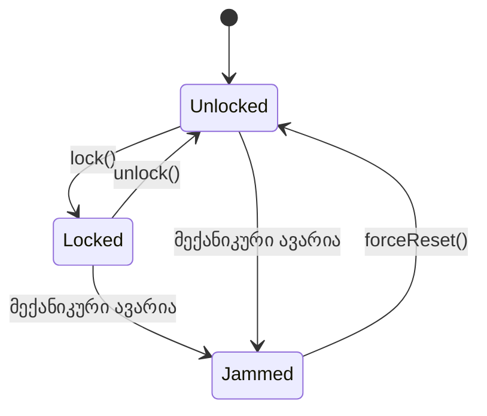

აქამდე ვსწავლობდით, სად უნდა მოთავსდეს ოპერაცია და როგორ უნდა მოეწყოს ის სხვა ოპერაციებთან მიმართებაში. ახლა კითხვას ვცვლით: საერთოდ, რა განასხვავებს **კარგ** კლასის ინტერფეისს **ცუდისგან**? ამ კითხვას სამი კუთხით შევხედავთ: მხარს უჭერს თუ არა ინტერფეისი კლასის სრულ მდგომარეობათა სივრცეს (ეს ნაწილი), მხარს უჭერს თუ არა კლასის სრულ ქცევას (მომდევნო ნაწილი), და არის თუ არა თითოეული ცალკეული ოპერაცია საკმარისად კოჰერენტული (ბოლო ნაწილი).

---

გავიხსენოთ [[თავი 1.3 მდგომარეობის შენარჩუნება]]-ს იდეა: ობიექტი სიცოცხლის განმავლობაში გადადის ერთი მდგომარეობიდან მეორეში, მიღებული შეტყობინებების საპასუხოდ. კლასის ყველა შესაძლო მდგომარეობა ერთად ქმნის მის **მდგომარეობათა სივრცეს (state-space)**. კარგ დიზაინში მოსალოდნელია, რომ ობიექტს შეეძლოს მხოლოდ თავისი კლასისთვის კანონიერი მდგომარეობების მიღწევა - არც მეტი, არც ნაკლები. მაგრამ ეს ყოველთვის ასე არ არის: კლასის საჯარო ინტერფეისმა შეიძლება ან მეტისმეტად ბევრი გზა გაუხსნას გარეშე მომხმარებელს (და ობიექტი უკანონო მდგომარეობაში ჩააგდოს), ან საკმარისი გზა არ მისცეს (და კანონიერი მდგომარეობა მიუწვდომელი დატოვოს).

მაგალითად ავიღოთ **DoorLock** - ჭკვიანი კარის საკეტი. მისი ბუნებრივი მდგომარეობათა სივრცე შედგება სამი მდგომარეობისგან: **Locked**, **Unlocked** და **Jammed** (მექანიკურად გაჭედილი, ე.ი. მოტორმა ვერ დაასრულა ჩაკეტვა ან გაღება).

_სქემა: DoorLock-ის კანონიერი მდგომარეობათა სივრცე. კითხვა, რომელსაც ამ ნაწილში ვსვამთ, არის: ინტერფეისი რეალურად აძლევს თუ არა გარეშე მომხმარებელს საშუალებას, დააკვირდეს და მართოს სწორედ ეს სამი მდგომარეობა - არც მეტი, არც ნაკლები?_

ქვემოთ განვიხილავთ ოთხ შესაძლო შედეგს, თუ როგორ შეიძლება **DoorLock**-ის ინტერფეისმა (ცუდად ან კარგად) მოეპყროს ამ სივრცეს.

---

#### 1. უკანონო მდგომარეობები

დავუშვათ, დიზაინერმა **DoorLock**-ის შიდა წარმოდგენა ააგო ერთი მთელი რიცხვის ცვლადზე, `boltPosition` (0 - სრულად გახსნილი, 100 - სრულად ჩაკეტილი), და, გაუფრთხილებლობით, ეს ცვლადი პირდაპირ საჯაროდ ჩასაწერადაც გახადა. ახლა გარეშე ობიექტს შეუძლია დაწეროს, მაგალითად, `lock1.boltPosition := 47`, რითაც საკეტი აღმოჩნდება ისეთ მდგომარეობაში, რომელიც არც Locked-ია, არც Unlocked და არც ფორმალურად Jammed - ეს არღვევს **DoorLock**-ის კლასის ინვარიანტს, რომ ბოლთი ყოველთვის ან სრულად გახსნილი, ან სრულად ჩაკეტილი უნდა იყოს (ან აშკარად მონიშნული, როგორც გაჭედილი). ინტერფეისი, რომელიც უშვებს ასეთ რამეს, უშვებს **უკანონო მდგომარეობებს** - ეს ჩვეულებრივ ხდება მაშინ, როცა დიზაინერი შიდა წარმოდგენას პირდაპირ "აჟღავნებს" გარეთ, ინკაფსულაციის დარღვევით.

---

#### 2. არასრული მდგომარეობები

დავუშვათ, დიზაინერმა გამოასწორა წინა ხარვეზი და დატოვა მხოლოდ `lock()` და `unlock()` ოპერაციები, ხოლო შიდა ლოგიკა კვლავ აღმოაჩენს მექანიკურ ავარიას და მიანიშნებს, რომ საკეტი "გაჭედილია". მაგრამ თუ ინტერფეისში საერთოდ არ არსებობს ოპერაცია, რომელიც ამ ინფორმაციას გარეთ გაუზიარებდა (ვთქვათ, `getState()` აბრუნებს მხოლოდ Locked ან Unlocked, ორ მნიშვნელობას), და არც ისეთი ოპერაცია, რომელიც გაჭედილობიდან გამოსვლის საშუალებას მისცემდა (`forceReset()` არ არსებობს), მაშინ **Jammed**, თუმცა კლასის რეალური, კანონიერი მდგომარეობაა, ინტერფეისიდან პრაქტიკულად მიუწვდომელი და უხილავია. ეს არის **არასრული მდგომარეობების** მაგალითი: ინტერფეისი კრძალავს კანონიერი მდგომარეობის მიღწევას (ან მასზე დაკვირვებას), თუმცა თავად კლასის აბსტრაქციაში ეს მდგომარეობა სავსებით ლეგიტიმურია.

---

#### 3. შეუფერებელი მდგომარეობები

წარმოვიდგინოთ სხვა ვარიანტი: დიზაინერმა კეთილსინდისიერად დაფარა `boltPosition`, მაგრამ, დებაგინგის გასაადვილებლად, საჯაროდ დატოვა `motorPulseCount: Integer` - მთვლელი, რომელიც ინახავს, რამდენი იმპულსი გაუგზავნა შიდა კონტროლერმა ძრავას ბოლთის გადასაადგილებლად. ეს რიცხვი DoorLock-ის, როგორც აბსტრაქციის, ნაწილი საერთოდ არ არის: მომხმარებელს, რომელსაც კარის საკეტი აინტერესებს, არასდროს სჭირდება იცოდეს, რამდენი მოტორის იმპულსი დასჭირდა ბოლთს. ინტერფეისი, რომელიც ავლენს ასეთ დეტალებს, გვთავაზობს **შეუფერებელ მდგომარეობებს** - ინფორმაციას, რომელიც კლასის აბსტრაქციისთვის უცხოა, თუნდაც ის თავად საშიში ან უკანონო არ იყოს.

---

#### 4. იდეალური მდგომარეობები

საბოლოო, გამართული დიზაინი გამორიცხავს ყველა ზემოთხსენებულ ხარვეზს. **DoorLock**-ის საჯარო ინტერფეისი მოიცავს მხოლოდ:

- `lock()`
- `unlock()`
- `forceReset()`
- `getState(): {Locked, Unlocked, Jammed}`

ეს ინტერფეისი საშუალებას იძლევა, ობიექტმა მიაღწიოს ყველა კანონიერ მდგომარეობას (`Jammed`-ის ჩათვლით, `getState()`-ის მეშვეობით დაკვირვებადს და `forceReset()`-ის მეშვეობით გამოსწორებადს), მაგრამ არცერთ უკანონო კომბინაციას - არც ერთი ოპერაცია არ აძლევს გარეშე ობიექტს პირდაპირ წვდომას შიდა წარმოდგენაზე (`boltPosition`, `motorPulseCount` და მისთანები). ეს არის ის, რასაც **იდეალური მდგომარეობების მხარდაჭერა** ჰქვია: ინტერფეისი აღწევს ყველა კანონიერ მდგომარეობას და მხოლოდ კანონიერ მდგომარეობებს.

---

#### მდგომარეობათა სივრცის რუკა

ოთხივე შემთხვევა ერთად შეიძლება ერთ სქემაზე დავხატოთ: შუაში დგას **DoorLock**-ის ჭეშმარიტი, კანონიერი მდგომარეობათა სივრცე (წყვეტილი ხაზით შემოხაზული), ხოლო მის ირგვლივ - ის ოთხი ზონა, რომელსაც კონკრეტული ინტერფეისი რეალურად წარმოქმნის.

<svg viewBox="0 0 640 450" xmlns="http://www.w3.org/2000/svg">
  <defs>
    <marker id="arrow14-1" viewBox="0 0 10 10" refX="9" refY="5" markerWidth="6" markerHeight="6" orient="auto-start-reverse">
      <path d="M0,0 L10,5 L0,10 z" fill="currentColor"/>
    </marker>
  </defs>

  <text x="320" y="24" text-anchor="middle" font-size="14" font-weight="bold" fill="currentColor">DoorLock — მდგომარეობათა სივრცის კლასიფიკაცია</text>

  <!-- true legal state space -->
  <ellipse cx="300" cy="235" rx="175" ry="140" fill="none" stroke="currentColor" stroke-width="2" stroke-dasharray="7 5"/>
  <text x="300" y="80" text-anchor="middle" font-size="11.5" fill="currentColor">DoorLock-ის ჭეშმარიტი კანონიერი მდგომარეობათა სივრცე</text>

  <!-- good: legal & reachable -->
  <ellipse cx="230" cy="225" rx="95" ry="82" fill="#16A085" fill-opacity="0.28" stroke="#16A085" stroke-width="1.5"/>
  <text x="230" y="208" text-anchor="middle" font-size="12" font-weight="bold" fill="currentColor">Locked, Unlocked</text>
  <text x="230" y="226" text-anchor="middle" font-size="10" fill="currentColor">lock() / unlock() / getState()</text>
  <text x="230" y="248" text-anchor="middle" font-size="9.5" fill="currentColor">(კანონიერი და მიწვდომადი)</text>

  <!-- incomplete: legal but unreachable -->
  <ellipse cx="405" cy="235" rx="58" ry="58" fill="#E67E22" fill-opacity="0.30" stroke="#E67E22" stroke-width="1.5"/>
  <text x="405" y="225" text-anchor="middle" font-size="12" font-weight="bold" fill="currentColor">Jammed</text>
  <text x="405" y="243" text-anchor="middle" font-size="9" fill="currentColor">getState()/forceReset()</text>
  <text x="405" y="256" text-anchor="middle" font-size="9" fill="currentColor">არ არსებობს → მიუწვდომელია</text>

  <!-- illegal exposed -->
  <ellipse cx="530" cy="115" rx="95" ry="55" fill="#C0392B" fill-opacity="0.28" stroke="#C0392B" stroke-width="1.5"/>
  <text x="530" y="107" text-anchor="middle" font-size="12" font-weight="bold" fill="currentColor">boltPosition := 47</text>
  <text x="530" y="125" text-anchor="middle" font-size="9" fill="currentColor">საჯარო ველი — უკანონო</text>
  <text x="530" y="138" text-anchor="middle" font-size="9" fill="currentColor">შუალედური მნიშვნელობა</text>
  <path d="M 430,155 Q 480,130 460,118" fill="none" stroke="#C0392B" stroke-width="1.5" marker-end="url(#arrow14-1)"/>

  <!-- irrelevant leaking -->
  <ellipse cx="530" cy="355" rx="95" ry="55" fill="#4A90D9" fill-opacity="0.28" stroke="#4A90D9" stroke-width="1.5"/>
  <text x="530" y="347" text-anchor="middle" font-size="12" font-weight="bold" fill="currentColor">motorPulseCount</text>
  <text x="530" y="365" text-anchor="middle" font-size="9" fill="currentColor">შეუფერებელი დეტალი —</text>
  <text x="530" y="378" text-anchor="middle" font-size="9" fill="currentColor">არ ეკუთვნის აბსტრაქციას</text>
  <path d="M 435,315 Q 480,340 460,352" fill="none" stroke="#4A90D9" stroke-width="1.5" marker-end="url(#arrow14-1)"/>

  <!-- legend -->
  <g font-size="10.5" fill="currentColor">
    <rect x="15" y="410" width="12" height="12" fill="#16A085" fill-opacity="0.5" stroke="#16A085"/>
    <text x="33" y="420">კარგი: კანონიერი და მიწვდომადი</text>

    <rect x="255" y="410" width="12" height="12" fill="#E67E22" fill-opacity="0.5" stroke="#E67E22"/>
    <text x="273" y="420">ცუდი: კანონიერი, მაგრამ მიუწვდომელი</text>

    <rect x="15" y="430" width="12" height="12" fill="#C0392B" fill-opacity="0.5" stroke="#C0392B"/>
    <text x="33" y="440">ცუდი: უკანონო, მაგრამ მიწვდომადი</text>

    <rect x="255" y="430" width="12" height="12" fill="#4A90D9" fill-opacity="0.5" stroke="#4A90D9"/>
    <text x="273" y="440">ცუდი: შეუფერებელი, ირელევანტური დეტალი</text>
  </g>
</svg>

_ოთხივე ზონა ერთსა და იმავე DoorLock-ს ეხება - სხვადასხვა, ჰიპოთეტური ინტერფეისის დიზაინის მიხედვით. კარგი დიზაინი ცდილობს, სრულად დაფაროს მხოლოდ ტეალისფერი ზონა და აარიდოს თავი დანარჩენ სამივეს._

---

შემდეგი [[თავი 14.2 ქცევის მხარდაჭერა კლასის ინტერფეისში]]
