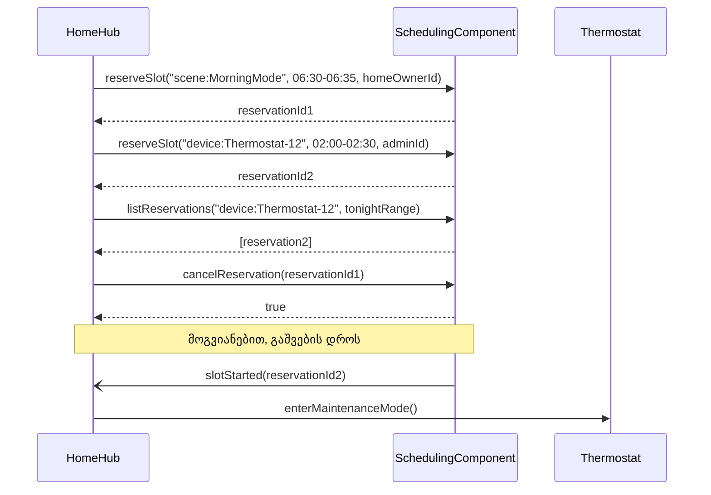

ახლა დროა, თეორია კონკრეტულ დიზაინში გადავიტანოთ. ამ სექციაში დეტალურად აღვწერთ `SchedulingComponent`-ის გარე ინტერფეისს — რას სთავაზობს ის თავის მომხმარებლებს — და ბოლოს ვნახავთ, ზუსტად როგორ იყენებს მას ჭკვიანი სახლის აპლიკაცია ორი სრულიად განსხვავებული ამოცანისთვის.

`SchedulingComponent`-ის დანიშნულებაა, მართოს კითხვა „ვინ/რა იჯავშნის დროის მონაკვეთს რომელიმე რესურსზე“ — სრულიად ზოგადად. კომპონენტისთვის რესურსი არის უბრალოდ სტრიქონი (`resourceId`); მას არანაირი მნიშვნელობა არ გააჩნია იმისა, თუ ეს სტრიქონი კონკრეტულად რას აღნიშნავს რეალურ სამყაროში. ზუსტად ეს ნეიტრალურობაა, რაც კომპონენტს ხდის ერთნაირად გამოსადეგს როგორც ჭკვიანი სახლის სცენებისა და მოწყობილობებისთვის, ისე, პრინციპში, სულ სხვა სფეროსთვისაც — ბიბლიოთეკის საკითხავი ოთახებისთვის, სპორტული დარბაზის განრიგისთვის თუ სულაც მანქანების პარკინგის ადგილებისთვის.

---

## გარე ინტერფეისები

`SchedulingComponent` თავის მომხმარებლებს სთავაზობს ორ ბიზნეს-ინტერფეისს და ერთ ტექნიკურ ინტერფეისს (ე.წ. **მიწოდებული** ინტერფეისები), და, თავის მხრივ, თავად მოითხოვს სამ ინტერფეისს გარემოსგან ან მომხმარებლისგან (ე.წ. **მოთხოვნილი** ინტერფეისები). სტანდარტული UML აღნიშვნა ამ განსხვავებას "ლოლიპოპის" (მიწოდებული) და "როზეტის" (მოთხოვნილი) სიმბოლოებით გამოსახავს:

<svg viewBox="0 0 640 400" xmlns="http://www.w3.org/2000/svg">
  <text x="320" y="26" text-anchor="middle" font-size="13" font-weight="bold" fill="currentColor">SchedulingComponent — მიწოდებული და მოთხოვნილი ინტერფეისები</text>

  <!-- component box with UML component icon tabs -->
  <rect x="220" y="140" width="200" height="140" fill="none" stroke="currentColor" stroke-width="1.5"/>
  <rect x="200" y="163" width="30" height="18" fill="none" stroke="currentColor" stroke-width="1.5"/>
  <rect x="200" y="228" width="30" height="18" fill="none" stroke="currentColor" stroke-width="1.5"/>
  <text x="320" y="200" text-anchor="middle" font-size="10.5" fill="currentColor">«component»</text>
  <text x="320" y="218" text-anchor="middle" font-size="12" font-weight="bold" fill="currentColor">SchedulingComponent</text>

  <!-- provided interfaces: lollipops (right) -->
  <line x1="420" y1="165" x2="500" y2="165" stroke="currentColor" stroke-width="1.5"/>
  <circle cx="500" cy="165" r="6" fill="currentColor"/>
  <text x="512" y="169" font-size="11" fill="currentColor">ReservationServices</text>

  <line x1="420" y1="210" x2="500" y2="210" stroke="currentColor" stroke-width="1.5"/>
  <circle cx="500" cy="210" r="6" fill="currentColor"/>
  <text x="512" y="214" font-size="11" fill="currentColor">CalendarQueryServices</text>

  <line x1="420" y1="255" x2="500" y2="255" stroke="currentColor" stroke-width="1.5"/>
  <circle cx="500" cy="255" r="6" fill="currentColor"/>
  <text x="512" y="259" font-size="11" fill="currentColor">ComponentLifecycleServices</text>

  <!-- required interfaces: sockets (left) -->
  <line x1="220" y1="165" x2="150" y2="165" stroke="currentColor" stroke-width="1.5"/>
  <path d="M 150,157 A 8 8 0 0 0 150,173" fill="none" stroke="currentColor" stroke-width="1.5"/>
  <text x="140" y="169" text-anchor="end" font-size="11" fill="currentColor">PersistenceServices</text>

  <line x1="220" y1="210" x2="150" y2="210" stroke="currentColor" stroke-width="1.5"/>
  <path d="M 150,202 A 8 8 0 0 0 150,218" fill="none" stroke="currentColor" stroke-width="1.5"/>
  <text x="140" y="214" text-anchor="end" font-size="11" fill="currentColor">ClockServices</text>

  <line x1="220" y1="255" x2="150" y2="255" stroke="currentColor" stroke-width="1.5"/>
  <path d="M 150,247 A 8 8 0 0 0 150,263" fill="none" stroke="currentColor" stroke-width="1.5"/>
  <text x="140" y="259" text-anchor="end" font-size="11" fill="currentColor">SlotEventListener</text>

  <!-- legend -->
  <circle cx="230" cy="345" r="6" fill="currentColor"/>
  <text x="242" y="349" font-size="10.5" fill="currentColor">მიწოდებული (lollipop)</text>
  <path d="M 400,337 A 8 8 0 0 0 400,353" fill="none" stroke="currentColor" stroke-width="1.5"/>
  <text x="412" y="349" font-size="10.5" fill="currentColor">მოთხოვნილი (socket)</text>
</svg>

### ReservationServices

ეს არის კომპონენტის მთავარი, „სამუშაო“ ინტერფეისი. მისი ოპერაციები პასუხობს კითხვას „დაჯავშნე, გააუქმე, ან მაჩვენე უკვე არსებული ჯავშნები“:

- **`reserveSlot(resourceId, timeRange, requestedBy)`** ცდილობს დაჯავშნოს მითითებული დროის მონაკვეთი მითითებულ რესურსზე მითითებული მომთხოვნისთვის. თუ მონაკვეთი თავისუფალია, ოპერაცია ქმნის ახალ რეზერვაციას და აბრუნებს მის უნიკალურ იდენტიფიკატორს (`reservationId`); თუ მონაკვეთი უკვე დაკავებულია, ოპერაცია არაფერს აკეთებს და აბრუნებს `false`-ს.
- **`cancelReservation(reservationId)`** აუქმებს არსებულ რეზერვაციას და ათავისუფლებს შესაბამის დროის მონაკვეთს.
- **`listReservations(resourceId, dateRange)`** აბრუნებს მითითებულ პერიოდში მითითებულ რესურსზე არსებული ყველა აქტიური რეზერვაციის სიას.
- **`getReservation(reservationId)`** აბრუნებს ერთი კონკრეტული რეზერვაციის მონაცემებს (რესურსი, დროის მონაკვეთი, მომთხოვნი, სტატუსი).

ღირს ყურადღება მივაქციოთ `cancelReservation`-ის კონტრაქტს — ეს კარგი შემთხვევაა იმის საჩვენებლად, რას ნიშნავს კომპონენტის ინტერფეისში ოპერაციის „კონტრაქტული ბუნება“ პრაქტიკაში:

```
SchedulingComponent::ReservationServices.cancelReservation(reservationId: ReservationID): Boolean

წინაპირობა:   არსებობს რეზერვაცია იდენტიფიკატორით reservationId,
              და მისი სტატუსია active

შემდგომპირობა: cancelReservation = true;
              ამ რეზერვაციის სტატუსი ხდება cancelled;
              შესაბამისი დროის მონაკვეთი თავისუფლდება
```

თუ წინაპირობა არ სრულდება (მაგალითად, ასეთი იდენტიფიკატორი საერთოდ არ არსებობს, ან რეზერვაცია უკვე გაუქმებულია), ოპერაცია არაფერს ცვლის და უბრალოდ აბრუნებს `false`-ს.

### CalendarQueryServices

ეს მეორე ბიზნეს-ინტერფეისი ეხმარება მომხმარებელს, **სანამ** ის საერთოდ სცადოს დაჯავშნა. `findAvailableSlots` აბრუნებს თავისუფალი მონაკვეთების სიას მითითებულ პერიოდში, საჭირო ხანგრძლივობის გათვალისწინებით; `isSlotFree` უბრალოდ ამოწმებს, თავისუფალია თუ არა კონკრეტული მონაკვეთი. `getSmallestGranularity`/`setSmallestGranularity` განსაზღვრავს, რამდენად „წვრილად“ იჭრება დრო კომპონენტში (მაგალითად, 5-წუთიან ბადეზე) — ეს არის სწორედ ის „წინასწარ-კონფიგურირებადი“ ნაგულისხმევი მნიშვნელობის მაგალითი, რომელზეც წინა სექციაში ვისაუბრეთ.

### ComponentLifecycleServices

ეს არის ტექნიკური ინტერფეისი, რომელსაც კომპონენტი ატარებს არა ბიზნეს-საჭიროებით, არამედ იმიტომ, რომ ეს ჩვეულებრივ ყველა კომპონენტს მოეთხოვება იმ გარემოს მხრიდან, სადაც ის ინერგება. `attach`/`detach` აღრიცხავს, თუ ვინ იყენებს კომპონენტს ამჟამად (და საშუალებას აძლევს გარემოს, უსაფრთხოდ მოხსნას კომპონენტი მეხსიერებიდან, როცა `getActiveClientCount` ნულს უბრუნდება). `listSupportedInterfaces` აძლევს სხვა პროგრამულ ერთეულებს საშუალებას, გაშვების დროს „იკითხონ“ კომპონენტს, რა შესაძლებლობები აქვს — ეს არის მე-8 თვისების (აღმოჩენადობა) კონკრეტული განხორციელება.

### რას მოითხოვს კომპონენტი გარემოსგან

გარე ინტერფეისების გვერდით, `SchedulingComponent`-ს ასევე გააჩნია **მოთხოვნილი** ინტერფეისები — ანუ ოპერაციები, რომლებსაც ის თავად საჭიროებს თავისი გარემოდან, ან საკუთარი მომხმარებლისგან, რომ სრულფასოვნად იმუშაოს:

- **`PersistenceServices`** და **`ClockServices`** — გარემოს (კონტეინერის) მიერ მოწოდებული ტექნიკური სერვისები საცავსა და საიმედო დროზე წვდომისთვის.
- **`SlotEventListener`** — არასავალდებულო ინტერფეისი, რომელიც *მომხმარებელმა* შეიძლება თავად განახორციელოს, თუ სურს, კომპონენტმა შეატყობინოს, როცა რომელიმე რეზერვაციის დაწყების დრო დგება (ამაზე უფრო დაწვრილებით შემდეგ სექციაში ვისაუბრებთ, სადაც კომპონენტის შიდა დიზაინს განვიხილავთ).

---

## (1) ჭკვიანი სახლის აპლიკაცია იყენებს SchedulingComponent-ს

ახლა ვნახოთ, კონკრეტულად როგორ იყენებს `HomeHub` (ჭკვიანი სახლის ცენტრალური მართვის კვანძი) `SchedulingComponent`-ს ორი, ერთმანეთისგან სავსებით დამოუკიდებელი ამოცანისთვის:

- **სცენის აქტივაციის დაჯავშნა** — `HomeOwner`-ს სურს, რომ `AutomationScene`-ის ქვეკლასი `MorningMode` (ანალოგიურად `NightMode`-სა და `AwayMode`-სი, რომლებიც უკვე ვიცნობთ) ავტომატურად ამოქმედდეს ხვალ დილით 06:30-06:35 შორის.
- **მოწყობილობის მოვლის ფანჯარა** — `Administrator`-ს სურს, ღამით 02:00-02:30 შორის დაბლოკოს ავტომატიზაციის ყოველგვარი ჩარევა `Thermostat`-ში (მოწყობილობის ID: `Thermostat-12`), რადგან მოსალოდნელია firmware-ის განახლება.

`HomeHub`-ისთვის ორივე შემთხვევა უბრალოდ „დროის მონაკვეთის დაჯავშნაა“ — ერთხელაც კომპონენტისთვის არ არსებობს განსხვავება სცენასა და მოწყობილობას შორის, არსებობს მხოლოდ ორი განსხვავებული `resourceId`: `"scene:MorningMode"` და `"device:Thermostat-12"`.



ქვემოთ ცალ-ცალკე განვმარტავთ დიაგრამის ყოველ ნაბიჯს.

### (1)

`HomeHub` იძახებს `sched.reserveSlot("scene:MorningMode", 06:30–06:35, homeOwnerId)`-ს. კომპონენტი ამოწმებს, თავისუფალია თუ არა ეს მონაკვეთი რესურსზე `"scene:MorningMode"`, ქმნის ახალ რეზერვაციას და უბრუნებს `HomeHub`-ს იდენტიფიკატორს `reservationId1`. `HomeHub` არასდროს იღებს `handle`-ს რომელიმე შიდა `Reservation` ობიექტზე — მხოლოდ ამ იდენტიფიკატორს, რომელსაც შემდგომში მხოლოდ კომპონენტის ინტერფეისში გამოიყენებს.

---

### (2)

ანალოგიურად, `HomeHub` იჯავშნის მოვლის ფანჯარას რესურსზე `"device:Thermostat-12"`, 02:00–02:30 შორის, `Administrator`-ის სახელით. აქ `resourceId`-ის სახეობა (`"device:..."` წინსართის ნაცვლად `"scene:..."`) წმინდად `HomeHub`-ის საკუთარი კონვენციაა — კომპონენტისთვის ეს უბრალოდ ორი განსხვავებული სტრიქონია, არაფრით უპირატესი ერთმანეთზე.

---

### (3)

სანამ ღამის ავტომატიზაცია რაიმეს სცადებდეს `Thermostat-12`-ზე, `HomeHub` პირველად კითხულობს `listReservations("device:Thermostat-12", tonightRange)`-ს, რომ გაიგოს — ხომ არ არის ეს მოწყობილობა ამჟამად მოვლის ფანჯარაში. კომპონენტი აბრუნებს რეზერვაციების სიას (ჩვენს შემთხვევაში — ერთს, `reservationId2`-ს), და `HomeHub` ამის საფუძველზე წყვეტს, დროებით შეაჩეროს თუ არა ავტომატური ბრძანებები ამ მოწყობილობისთვის.

---

### (4)

`HomeOwner`-მა გადაიფიქრა და გააუქმა `MorningMode`-ის აქტივაცია ხვალისთვის. `HomeHub` უბრალოდ იძახებს `sched.cancelReservation(reservationId1)`-ს — მას საერთოდ არ სჭირდება იცოდეს, რომელ შიდა კლასს ეკუთვნის ეს რეზერვაცია, საკმარისია ერთი იდენტიფიკატორის დაბრუნება.

---

### (5) — გამოწერილი შეტყობინება

დიაგრამის ბოლო ორი ნაბიჯი ცოტა განსხვავებულია დანარჩენებისგან: აქ ინიციატივას თავად `SchedulingComponent` იჩენს. როცა მოდის 02:00 საათი (და, შესაბამისად, `reservationId2`-ის დაწყების დრო), კომპონენტი აგზავნის ასინქრონულ შეტყობინებას `slotStarted(reservationId2)` უკან `HomeHub`-ისკენ — ოღონდ მხოლოდ იმ შემთხვევაში, თუ `HomeHub`-მა წინასწარ განახორციელა და დაარეგისტრირა კომპონენტისთვის მოთხოვნილი `SlotEventListener` ინტერფეისი (იხ. წინა სექცია). ეს არის ის მექანიზმი, რომლის დეტალურ დიზაინსაც შემდეგ სექციაში განვიხილავთ.

`HomeHub` ამ შეტყობინების მიღებისთანავე თავად წყვეტს, რას ნიშნავს ეს კონკრეტულად — ამ შემთხვევაში, ის იძახებს `dev.enterMaintenanceMode()`-ს `Thermostat-12`-ზე. `SchedulingComponent`-ს არასდროს გაუგზავნია შეტყობინება უშუალოდ `Thermostat`-ისთვის და არც კი იცის, რომ ასეთი კლასი არსებობს — მთელი „აზრი“, რომ 02:00 საათზე ეს კონკრეტულად თერმოსტატის მოვლას ნიშნავს, სრულად ცხოვრობს `HomeHub`-ის მხარეს.

---

## რატომ არის ეს ნამდვილი ხელახალი გამოყენება

ეს მაგალითი კარგად აჩვენებს, რასაც წინა სექციაში თეორიულად ვამბობდით: `SchedulingComponent`-ს შეეძლო, ზუსტად ამავე კოდით, დაეჯავშნა დარბაზი კონფერენციისთვის, მანქანა ავტოპარკში, ან ოპერაციო ოთახი საავადმყოფოში — არაფერი შეიცვლებოდა კომპონენტის შიგნით. კომპონენტმა არაფერი „იცის“ ჭკვიან სახლზე; მან იცის მხოლოდ, როგორ მართოს დროის მონაკვეთების დაკავება-გათავისუფლება ნებისმიერი დასახელებული რესურსისთვის. ეს არის ზუსტად ის დამოუკიდებლობა, რასაც კომპონენტული დიზაინი ცდილობს მიაღწიოს.

---

შემდეგი [[თავი 15.4 კომპონენტის შიდა დიზაინი]]
