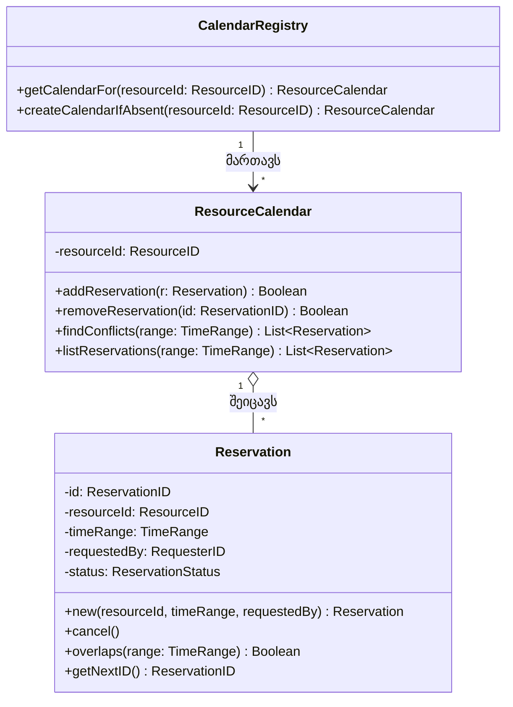
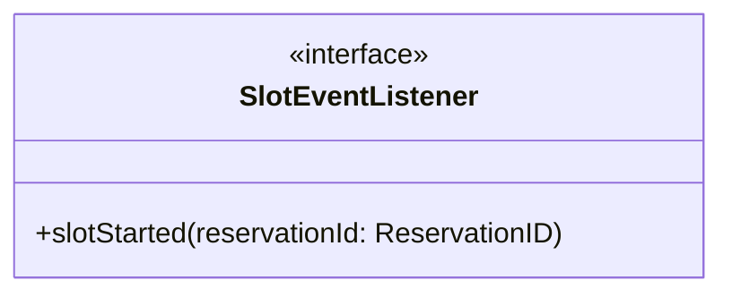

როგორც 15.1 სექციაში აღვნიშნეთ, კომპონენტს არ სჭირდება მრავალჯერადი, დამოუკიდებელი ინსტანცირება — ეს ნიშნავს, რომ დიზაინერს არაფერი აიძულებს, კომპონენტის შიგნეული ობიექტზე ორიენტირებულად ააწყოს. პრინციპში, `SchedulingComponent`-ის ყველა ოპერაცია შეიძლებოდა დაწერილიყო ცალკეული, დამოუკიდებელი პროცედურების სახით — რაც ფაქტობრივად სტრუქტურული დიზაინი იქნებოდა. მაგრამ რადგან წინა თავებში განხილული ობიექტზე ორიენტირებული უპირატესობების დათმობა არ გვინდა, `SchedulingComponent`-ის შიგნეულს მაინც ობიექტზე ორიენტირებულად ავაწყობთ.

---

## შიდა კლასები

`SchedulingComponent`-ის გულში დგას სამი თანამშრომელი კლასი:



**`Reservation`** წარმოადგენს ერთ კონკრეტულ ჯავშანს — რომელ რესურსზეა, რომელ დროის მონაკვეთზე, ვის მოთხოვნით და რა სტატუსით (`active` თუ `cancelled`). ყურადღება მიაქციეთ, რომ `new` და `getNextID` ხაზგასმულია დიაგრამაზე ჩვეული კონვენციით — ისინი კლასის ოპერაციებია (ანუ ეხება მთელ კლასს, არა ცალკეულ ობიექტს).

**`ResourceCalendar`** წარმოადგენს ერთი კონკრეტული რესურსის „განრიგს“ — ანუ ყველა იმ `Reservation`-ს, რომელიც ამ რესურსზეა გაკეთებული. სწორედ ის ამოწმებს კონფლიქტებს ახალი ჯავშნის მოთხოვნისას.

**`CalendarRegistry`** არის შესასვლელი წერტილი: ის რესურსის იდენტიფიკატორის (`resourceId`) მიხედვით პოულობს (ან, საჭიროების შემთხვევაში, ქმნის) შესაბამის `ResourceCalendar`-ს. სწორედ `CalendarRegistry`-ის წყალობით `SchedulingComponent`-ს არასდროს სჭირდება წინასწარ იცოდეს, რამდენი განსხვავებული რესურსი იარსებებს — ახალი რესურსი უბრალოდ იძენს საკუთარ `ResourceCalendar`-ს პირველივე დაჯავშნისას.

---

## მეთოდის მაგალითი: reserveSlot

აი, როგორ გამოიყურება `reserveSlot`-ის იმპლემენტაცია ფსევდოკოდში, რომელიც უშუალოდ იყენებს ზემოთ ნაჩვენებ სამ კლასს:

```
ოპერაცია ReservationServices.reserveSlot (resourceId: ResourceID,
        timeRange: TimeRange, requestedBy: RequesterID,
        out reservationId: ReservationID): Boolean

დაწყება მეთოდი

    calendar: ResourceCalendar;
    newReservation: Reservation;

    reservationId := null;
    calendar := CalendarRegistry.createCalendarIfAbsent (resourceId);

    თუ         calendar.findConflicts (timeRange) არ არის ცარიელი
    მაშინ      დააბრუნე false;   // მონაკვეთი უკვე დაკავებულია
    სხვაგვარად
               newReservation := Reservation.new (resourceId, timeRange, requestedBy);
               calendar.addReservation (newReservation);
               reservationId := newReservation.id;
               დააბრუნე true;
    დასასრული

დასასრული მეთოდი
```

`if` ბლოკი ამოწმებს, ხომ არ ეპირისპირება მოთხოვნილი მონაკვეთი უკვე არსებულ რომელიმე ჯავშანს. თუ გზა თავისუფალია, ოპერაცია მიმართავს კლასის ოპერაციას `Reservation.new`, რომელიც ქმნის ახალ ობიექტს (და, თანავე, უზრუნველყოფს მისთვის უნიკალურ იდენტიფიკატორს `getNextID`-ის მეშვეობით), შემდეგ კი ამატებს მას შესაბამის `ResourceCalendar`-ში.

გაითვალისწინეთ, რომ `HomeHub`-ს, რომელიც წინა სექციაში `reserveSlot`-ს იძახებდა, არასდროს ჩანს ეს შიდა სამი კლასი — ის უბრალოდ იღებს `reservationId`-ს პასუხად და ამით სრულდება მისი ურთიერთობა შიდა სამყაროსთან.

---

## შიდა არქიტექტურა: დომენების მიხედვით ფენები

გავიხსენოთ დომენების (foundation/architecture/business/application) ის ოთხსაფეხურიანი დაყოფა, რომელსაც ჩვენი ჭკვიანი სახლის პლატფორმისთვის უკვე ვხატავდით. საინტერესოა, რომ იგივე ლოგიკა შეგვიძლია გამოვიყენოთ `SchedulingComponent`-ის შიდა მოწყობის გასაანალიზებლადაც — ოღონდ მნიშვნელოვანი დათქმით: **დომენური კუთვნილება ყოველთვის შეფარდებითია იმისა, ვისი „პროდუქტის“ პერსპექტივიდან ვუყურებთ**.

ჩვენი პლატფორმის თვალსაზრისით, `SchedulingComponent` მთლიანად (თავისი გარე ინტერფეისებითურთაც და შიდა კლასებითურთაც) უბრალოდ ერთი, გარედან შემოტანილი დამოკიდებულებაა — ზუსტად ისეთივე სტატუსის, როგორიც აქვს ჩვენი არქიტექტურის დომენის უკვე ნაცნობ მოსახლეებს, `CloudSyncService`-სა და `EventBus`-ს: ფართოდ ხელახლა გამოსაყენებელი, ჩვენი კონკრეტული „სახლის ავტომატიზაციის“ ბიზნესისგან დამოუკიდებელი აგებული ბლოკი.

მაგრამ `SchedulingComponent`-ის **საკუთარ** შიდა სამყაროში იგივე ოთხი დომენი ისევ არსებობს, უბრალოდ სხვა ცენტრით — არა „სახლის ავტომატიზაციის“, არამედ „რესურსების დაჯავშნის“ ირგვლივ:

- **`SchedulingComponent`-ის საკუთარი ბიზნესის დომენი** — ზემოთ ნაჩვენები სამი კლასი (`Reservation`, `ResourceCalendar`, `CalendarRegistry`), რომლებიც რეალურად „იციან“, რას ნიშნავს დაჯავშნა, კონფლიქტი და გაუქმება. ეს არის ზუსტად ის ცოდნა, რომელიც ჩვენს `HomeOwner`-სა და `AutomationScene`-ს ეხება ჩვენი პლატფორმის ბიზნესის დომენში — უბრალოდ, აქ საქმის საგანია არა „სახლი“, არამედ „რესურსი და დროის მონაკვეთი“ ზოგადად.
- **`SchedulingComponent`-ის საკუთარი აპლიკაციის დომენი** — თავად ინტერფეისები (`ReservationServices`, `CalendarQueryServices`, `ComponentLifecycleServices`) და მათი „ჩრდილოვანი“ კლასები, რომლებიც უშუალოდ ახორციელებენ ამ ინტერფეისების ოპერაციებს — ეს არის ის ფენა, რომელიც სპეციფიკურია ზუსტად ამ ერთი პროდუქტისთვის (ანუ, თავად `SchedulingComponent`-ისთვის).
- **`SchedulingComponent`-ის საკუთარი არქიტექტურის დომენი** — დამხმარე უტილიტები, რომლებზეც მისი ბიზნეს-ლოგიკა ეყრდნობა: `PIStorageServices` (მუდმივ საცავზე წვდომის პლატფორმისგან-დამოუკიდებელი შრე) და `PIClockServices` (საიმედო დროზე წვდომის ანალოგიური შრე). ამათი კონკრეტული, პლატფორმაზე-დამოკიდებული იმპლემენტაცია სულ სხვანაირად გამოიყურება იმაზე დამოკიდებულებით, თუ სად დაინერგება კომპონენტი.
- **`SchedulingComponent`-ის საკუთარი საძირკვლის დომენი** — ისეთი ტიპები, როგორიცაა დროის ინტერვალის აღმნიშვნელი `TimeRange`. საინტერესოა, რომ, როცა `SchedulingComponent`-ს ჩვენს პლატფორმაზე ვნერგავთ, მას საერთოდ არც კი სჭირდება საკუთარი `TimeRange`-ის გამოგონება — შეუძლია პირდაპირ გამოიყენოს ჩვენი პლატფორმის უკვე არსებული, საძირკვლის დომენის იგივე სახელწოდების ტიპი, რადგან ორივე მხარეს ეს ცნება ერთნაირად ზოგადია.

<svg viewBox="0 0 620 400" xmlns="http://www.w3.org/2000/svg">
  <defs>
    <marker id="arrow15-4" viewBox="0 0 10 10" refX="9" refY="5" markerWidth="6" markerHeight="6" orient="auto-start-reverse">
      <path d="M0,0 L10,5 L0,10 z" fill="currentColor"/>
    </marker>
  </defs>
  <text x="310" y="18" text-anchor="middle" font-size="12.5" font-weight="bold" fill="currentColor">SchedulingComponent-ის საკუთარი დომენური იერარქია</text>

  <rect x="70" y="30" width="480" height="70" rx="6" fill="none" stroke="currentColor" stroke-width="1.5"/>
  <text x="90" y="50" font-size="11" font-weight="bold" fill="currentColor">აპლიკაციის დომენი</text>
  <text x="90" y="66" font-size="10" fill="currentColor">ReservationServices, CalendarQueryServices,</text>
  <text x="90" y="80" font-size="10" fill="currentColor">ComponentLifecycleServices + მათი „ჩრდილოვანი“ კლასები</text>

  <line x1="310" y1="100" x2="310" y2="120" stroke="currentColor" stroke-width="1.5" marker-end="url(#arrow15-4)"/>

  <rect x="70" y="122" width="480" height="70" rx="6" fill="none" stroke="currentColor" stroke-width="1.5"/>
  <text x="90" y="142" font-size="11" font-weight="bold" fill="currentColor">ბიზნესის დომენი</text>
  <text x="90" y="158" font-size="10" fill="currentColor">Reservation, ResourceCalendar, CalendarRegistry</text>
  <text x="90" y="174" font-size="10" fill="currentColor">(იცის, რას ნიშნავს დაჯავშნა, კონფლიქტი, გაუქმება)</text>

  <line x1="310" y1="192" x2="310" y2="212" stroke="currentColor" stroke-width="1.5" marker-end="url(#arrow15-4)"/>

  <rect x="70" y="214" width="480" height="70" rx="6" fill="none" stroke="currentColor" stroke-width="1.5"/>
  <text x="90" y="234" font-size="11" font-weight="bold" fill="currentColor">არქიტექტურის დომენი</text>
  <text x="90" y="250" font-size="10" fill="currentColor">PIStorageServices, PIClockServices</text>
  <text x="90" y="266" font-size="10" fill="currentColor">(პლატფორმაზე-დამოკიდებული ტექნიკური შრეები)</text>

  <line x1="310" y1="284" x2="310" y2="304" stroke="currentColor" stroke-width="1.5" marker-end="url(#arrow15-4)"/>

  <rect x="70" y="306" width="480" height="60" rx="6" fill="none" stroke="currentColor" stroke-width="1.5"/>
  <text x="90" y="326" font-size="11" font-weight="bold" fill="currentColor">საძირკვლის დომენი</text>
  <text x="90" y="342" font-size="10" fill="currentColor">TimeRange (ზოგადი, პლატფორმისგან დამოუკიდებელი ტიპი)</text>

  <text x="310" y="388" text-anchor="middle" font-size="10" fill="currentColor">ისარი ზემოდან ქვემოთ მიდის: ზედა ფენა ეყრდნობა ქვედას, არასდროს პირიქით</text>
</svg>

_ეს ფენოვანი აწყობა ზუსტად იმეორებს [[თავი 9.1 ობიექტების კლასების დომენები|9.1 თავში]] ნანახ ოთხსაფეხურიან სტრუქტურას — ოღონდ „ცენტრით“ არა სახლის ავტომატიზაციაზე, არამედ რესურსების დაჯავშნაზე. ამასთანავე, ჩვენი პლატფორმის საკუთარი პერსპექტივიდან, მთელი ეს კოშკი ერთად უბრალოდ ერთი უჯრედია ჩვენი არქიტექტურის დომენში (იხ. ზემოთ)._

ეს ორმაგი ხედვა (ჩვენგან — გარეშე, საკუთარი თავიდან — შიდა) კარგად აჩვენებს, რატომ არის ცალკეული კომპონენტის დაპროექტება ცოტა განსხვავებული ამოცანა, ვიდრე ერთი აპლიკაციის დაპროექტება: კომპონენტის დიზაინერს მოეთხოვება, ააწყოს სრულფასოვანი, საკუთარი დომენური იერარქია იმ ვარაუდით, რომ არასდროს არ იცის წინასწარ, რომელ „მასპინძელ“ აპლიკაციაში აღმოჩნდება საბოლოოდ ჩადგმული.

ეს ფენოვანი აწყობა ასევე გვაძლევს იმის შესაძლებლობასაც, რომ `SchedulingComponent`-ის აბსტრაქტული მოთხოვნები (`PersistenceServices`, `ClockServices`) კონკრეტულ შემთხვევაში, ჩვენს პლატფორმაზე დანერგვისას, პრაქტიკულად დაკმაყოფილდეს სწორედ ჩვენი უკვე არსებული არქიტექტურის დომენის სერვისებით — `CloudSyncService`-ის მსგავსი მექანიზმით მუდმივი შენახვისთვის, და `EventBus`-ის მსგავსი არხით შეტყობინებების გადასაცემად — მაშინაც კი, როცა თავად კომპონენტს ამ კონკრეტული სახელების შესახებ არაფერი გაეგება. სწორედ ეს არის ის, რასაც შემდეგ სექციაში „მსუბუქ“ კომპონენტს ვუწოდებთ.

---

## შეტყობინება მოვლენებზე: SlotEventListener მექანიზმი

წინა სექციაში დავინახეთ, რომ `SchedulingComponent`-ს შეუძლია, თავად შეატყობინოს `HomeHub`-ს, როცა რომელიმე რეზერვაციის დაწყების დრო დგება — ოპერაცია `slotStarted(reservationId)`. მაგრამ როგორ არის ეს მოწყობილი შიგნით, თუ კომპონენტს საერთოდ არაფერი გაეგება `HomeHub`-ის, სცენებისა თუ მოწყობილობების შესახებ?

პასუხი გახლავთ **subscriber/listener მექანიზმი**: ერთი მხარე (`subscriber`) აცხადებს ინტერესს გარკვეული ტიპის მოვლენისადმი, მეორე მხარე (`listener`) ადევნებს თვალს ამ მოვლენას და, მისი დადგომისას, „უკან რეკავს“ (callback) პირველ მხარეს. ასეთი დიზაინის ასაწყობად საჭიროა ოთხი რამ:

1. **subscriber**, რომელიც დაინტერესებულია მოვლენის ტიპით — ჩვენს შემთხვევაში, ეს არის თავად `HomeHub` (ან ნებისმიერი სხვა კომპონენტის მომხმარებელი), რომელსაც სურს იცოდეს, როცა კონკრეტული რეზერვაცია იწყება.
2. **listener**, რომელსაც შეუძლია აღმოაჩინოს მოვლენის ყოველი განხორციელება — ჩვენს შემთხვევაში, ეს არის შიდა კლასი `ReservationClock`, რომელიც პერიოდულად ადარებს მიმდინარე დროს (მიღებულს `PIClockServices`-იდან) ყველა აქტიური რეზერვაციის საწყის დროსთან.
3. **რეგისტრაციის საშუალება** — subscriber-მა უნდა შეძლოს, listener-ს გაუგზავნოს მოთხოვნა „მაცნობე, როცა ეს კონკრეტული რეზერვაცია დაიწყება“. ამას პასუხობს შიდა კლასი `SubscriptionRegistry`, რომელიც ინახავს რუკას რეზერვაციის იდენტიფიკატორიდან — დაინტერესებულ `handle`-ებამდე.
4. **callback-ის საშუალება** — როცა `ReservationClock` აღმოაჩენს, რომ დროა, ის იძახებს `SubscriptionRegistry`-ს, პოულობს ამ რეზერვაციაზე დარეგისტრირებულ ყველა subscriber-ს და თითოეულს უგზავნის ასინქრონულ შეტყობინებას `slotStarted(reservationId)` — ოღონდ, არსებითია, subscriber-ის მხარეს ეს ოპერაცია უნდა იყოს განხორციელებული კონკრეტული ინტერფეისის, `SlotEventListener`-ის მიხედვით.

აქ ნათლად ჩანს კომპონენტის მე-4 თვისება (მოთხოვნა გარემოსგან) პრაქტიკაში: `SchedulingComponent` **მოითხოვს**, რომ ნებისმიერმა, ვისაც ამ ფუნქციონალის გამოყენება სურს, თავად განახორციელოს მარტივი ინტერფეისი:



`HomeHub` ამ ინტერფეისს ახორციელებს და `attach`-ის დროს გადასცემს საკუთარ `handle`-ს `SchedulingComponent`-ს — ამის შემდეგ კი უბრალოდ ელოდება callback-ს, მის ნაცვლად, რომ განუწყვეტლივ ეკითხებოდეს კომპონენტს „ჯერ არ დამდგარა?“. ეს ბევრად ეფექტურია, ვიდრე მუდმივი გამოკითხვა (polling), განსაკუთრებით მაშინ, როცა რეზერვაციების დაწყების დრო წინასწარ არ არის ცნობილი ზუსტად რომელი წამით.

გაითვალისწინეთ: `ReservationClock`-ისა და `SubscriptionRegistry`-ის არსებობა კომპონენტს არაფრით არ აიძულებს იცოდეს, რას აკეთებს `HomeHub` `slotStarted`-ის მიღების შემდეგ — შესაძლოა ის სცენას ააქტიურებს, შესაძლოა მოწყობილობას მოვლის რეჟიმში გადაიყვანს, შესაძლოა უბრალოდ ჟურნალში ჩაწეროს ეს ფაქტი. კომპონენტისთვის მნიშვნელობა აქვს მხოლოდ იმას, რომ დროული შეტყობინება მოხდეს — დანარჩენი მთლიანად subscriber-ის საქმეა.

---

შემდეგი [[თავი 15.5 მსუბუქი და მძიმე კომპონენტები]]
