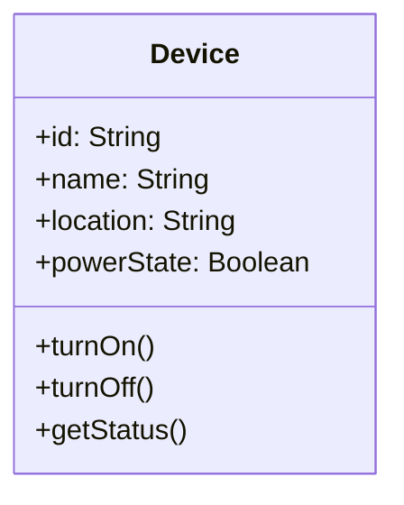
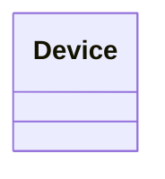

კლასის სიმბოლო UML-ის ნებისმიერი გამოყენების ცენტრშია. იგი, როგორც წესი, სამი განყოფილებისგან შედგება, რომლებიც ერთმანეთს ვერტიკალურად მისდევს:

1. ზედა განყოფილება — კლასის სახელი (და, საჭიროების შემთხვევაში, მასზე დამატებული სხვა მახასიათებელი, მაგალითად, აბსტრაქტულობის აღმნიშვნელი ნიშანი — ამაზე მოგვიანებით ვისაუბრებთ).
2. შუა განყოფილება — კლასის ატრიბუტები.
3. ქვედა განყოფილება — კლასის ოპერაციები.

კლასის სახელი ტრადიციულად იწყება დიდი ასოთი და მოდელირების ხელსაწყოებში ხშირად გამუქებული შრიფტით იწერება (თუმცა თეთრ დაფაზე ამის დაცვა არც ისე მოსახერხებელია — ჩვეულებრივი წერაც სავსებით საკმარისია).

ვთქვათ, გვინდა წარმოვადგინოთ ჭკვიანი სახლის სისტემის საბაზისო კლასი `Device`. მისი სრული სიმბოლო, სამივე განყოფილებით, ასე გამოიყურება:

სტანდარტულ სამ განყოფილებას საჭიროების შემთხვევაში შეიძლება დაემატოს კიდევ სხვა, მომხმარებლის მიერ თავად სახელდებული განყოფილებებიც — მაგალითად, კლასის ინვარიანტების ან შესაძლო გამონაკლისების ჩამოსათვლელად.

---

### შემოკლებული ფორმა

როცა დიაგრამაზე მხოლოდ კლასის არსებობისა და მისი სახელის ჩვენება გვინდა — ატრიბუტებისა და ოპერაციების დეტალების გარეშე — ვსარგებლობთ შემოკლებული სიმბოლოთი, სადაც მხოლოდ სახელის განყოფილება რჩება:

ეს ფორმა განსაკუთრებით მოსახერხებელია მაღალი დონის დიაგრამებზე, სადაც მთავარია კლასებს შორის ურთიერთობების ჩვენება და არა თითოეული კლასის შიდა შემადგენლობა.

---

### ობიექტის სიმბოლო

როცა კლასიდან ობიექტი წარმოიქმნება (ინსტანცირდება), მისი სტრუქტურა თითქმის იდენტურია საკუთარი კლასის სტრუქტურის, ამიტომაც UML ობიექტისთვის იმავე ყუთისებრ სიმბოლოს იყენებს, რასაც კლასისთვის — განსხვავება მხოლოდ სახელის განყოფილებაშია.

ერთადერთი შინაარსობრივი განსხვავება ისაა, რომ ცალკეულ ობიექტს არ გააჩნია საკუთარი, კლასის დონის (class-scope) ატრიბუტები და ოპერაციები — ეს თვისებები მხოლოდ თავად კლასს ეკუთვნის და ცალკეულ ინსტანციაზე არ ვრცელდება. (ამაზე უფრო დაწვრილებით ცალკე ვისაუბრებთ, კლასის ატრიბუტებისა და ოპერაციების განხილვისას.) პრაქტიკაში ეს დიდი შეზღუდვა არ არის, რადგან უმეტესი კლასის უმეტესი ატრიბუტი და ოპერაცია საერთოდაც ინსტანციის დონეზეა განსაზღვრული.

ობიექტის სახელი, კლასის სახელისგან განსხვავებით, ხაზგასმულია და არა გამუქებული — ეს პატარა, ტიპოგრაფიული სხვაობა თვალს სწრაფად საშუალებას აძლევს, ერთმანეთისგან გაარჩიოს კლასი და ობიექტი. ობიექტის სახელის ზოგადი სინტაქსია:

	instanceName : ClassName

მაგალითად:

	livingRoomLamp : Light

თუ ობიექტისთვის კარგი, საკუთარი სახელი ჯერ არ გვაქვს — რაც ადრეულ დიზაინის ეტაპებზე ჩვეულებრივი მოვლენაა — შეგვიძლია იგი ანონიმურად დავტოვოთ და მხოლოდ მისი კლასი მივუთითოთ:

	: Light

მიუხედავად იმისა, რომ ობიექტს ფორმალურად საკუთარი სახელი არ გააჩნია — მხოლოდ „handle“, ანუ მასზე მიმთითებელი საშუალება — დიზაინის დროს, მაგალითად, როცა ერთი ობიექტი მეორეს შეტყობინებას უგზავნის, ობიექტებს ჩვეულებრივ რაიმე გამომსახველი სახელი ეძლევათ (თუნდაც `frontDoorLock` ან `masterBedroomThermostat`), რაც დიაგრამის წაკითხვას გაცილებით აადვილებს.
