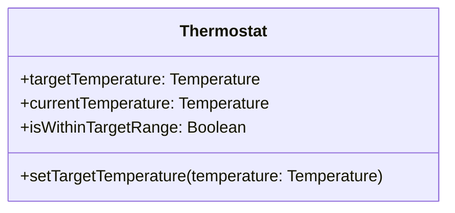

ოპერაციები კლასის სიმბოლოს ქვედა განყოფილებაში ივსება მათი სრული ფორმალური ხელმოწერით (signature). თითოეული ხელმოწერა შედგება ოპერაციის სახელისა და მისი შემომავალი და/თუ გამომავალი არგუმენტების ჩამონათვალისგან.

UML-ის ოფიციალური სტანდარტი მოითხოვს საკვანძო სიტყვების `in` და `out` გამოყენებას თითოეული არგუმენტის წინ, რათა ცხადი გახდეს, არგუმენტი ოპერაციაში შედის თუ მისგან გამოდის (ხოლო `inout` ორივე მიმართულებით მოძრავ არგუმენტს აღნიშნავს). სიმარტივისთვის, ამ მასალაშიც შემომავალი არგუმენტი ნაგულისხმევადაა მიჩნეული და `in` საკვანძო სიტყვას საერთოდ არ ვწერთ; სადაც გამომავალი არგუმენტია, უბრალოდ ვსვამთ `out`-ს, რასაც მოსდევს ერთი ან მეტი არგუმენტი. `inout` საერთოდ არ გამოიყენება.

---

### თითო ატრიბუტს — get და set

ტიპურ ატრიბუტს სჭირდება ორი სტანდარტული ოპერაცია: `get`-ოპერაცია, რომელიც აბრუნებს მის მიმდინარე მნიშვნელობას, და `set`-ოპერაცია, რომელიც ადგენს ახალ მნიშვნელობას. მაგალითად, `Device` კლასს შეიძლება ჰქონდეს

	getLocation (out location: String)
	setLocation (location: String)

ხოლო `Thermostat`-ს —

	getTargetTemperature (out targetTemperature: Temperature)
	setTargetTemperature (targetTemperature: Temperature)

ცხადია, წაკითხვად-მხოლოდ ატრიბუტს `set`-ოპერაცია არ სჭირდება. მაგალითად, `Device`-ის წარმოებული ატრიბუტისთვის `/uptimeMinutes` განსაზღვრულია მხოლოდ `getUptimeMinutes (out uptimeMinutes: Duration)`, ხოლო `Thermostat`-ის `/isWithinTargetRange`-სთვის — მხოლოდ `getIsWithinTargetRange (out isWithinTargetRange: Boolean)`.

### ატრიბუტები, რომლებსაც ისტორია აქვთ

ზოგიერთი ატრიბუტისთვის `get`-ოპერაციას შემომავალი არგუმენტიც სჭირდება — კერძოდ, მაშინ, როცა საჭიროა ატრიბუტის რომელიმე წარსული მნიშვნელობის მიღება. მაგალითად, თუ `TemperatureSensor` ინახავს ტემპერატურის ისტორიულ ჩანაწერებს, მაშინ ოპერაცია მიიღებს დროის ნიშნულს და დააბრუნებს იმ მომენტისთვის დაფიქსირებულ ტემპერატურას:

	getReadingAt (timestamp: DateTime, out temperature: Temperature)

ამ ოპერაციის განმახორციელებელმა მეთოდმა შეიძლება გამოიყენოს ცხრილში ძებნა, ან რაიმე გამოთვლა — ეს დეტალი კლასის მომხმარებლისგან დამალულია.

### ოპერაციები, რომლებიც სხვა ობიექტებთან ურთიერთობენ

ზოგიერთი ოპერაცია მოითხოვს კომუნიკაციას სხვა ობიექტებთან, შეტყობინებების გაცვლის გზით. მაგალითად, კარის საკეტის წვდომის კოდის შესაცვლელად შეიძლება დაგვჭირდეს ოპერაცია

	changeAccessCode (newCode: String, effectiveDate: DateTime)

რომლის შესრულებამაც შეიძლება გამოიწვიოს კომუნიკაცია სხვა ობიექტებთან — მაგალითად, `Administrator`-თან თუ `NotificationService`-თან, რომელსაც ეცნობება წვდომის კოდის ცვლილების შესახებ. ასეთი ობიექტთაშორისი კომუნიკაციის ნოტაციას მოგვიანებით, ობიექტთა ურთიერთქმედების დიაგრამების თავებში, უფრო დაწვრილებით განვიხილავთ.

---

### სახელდების ალტერნატიული კონვენცია

ზემოთ ნახსენები სახელები — `getTargetTemperature` და `setTargetTemperature` — მიჰყვება ერთ-ერთ პოპულარულ კონვენციას `get`/`set` ოპერაციების დასახელებისთვის. არსებობს ალტერნატივაც: ზოგი გუნდი ურჩევნია, პირველი ოპერაცია უბრალოდ ატრიბუტის სახელით დაარქვას — მაგალითად, `targetTemperature` — განსაკუთრებით მაშინ, თუ მას ფუნქციად აპირებს დაპროგრამებას, პროცედურის ნაცვლად. ასეთ შემთხვევაში, გრძელი შეტყობინების, `thermostat1.getTargetTemperature (out targetTemperature)`, ნაცვლად გვექნება უფრო მოკლე `thermostat1.targetTemperature`:

	Thermostat
		targetTemperature: Temperature
		setTargetTemperature (targetTemperature: Temperature)
		currentTemperature: Temperature
		isWithinTargetRange: Boolean

ამ კონვენციის დროს, უმეტესი `get`-ოპერაცია ფორმით ემთხვევა შესაბამის ატრიბუტს (თუმცა, მაგალითად, ისტორიის მქონე ატრიბუტების `get`-ოპერაციას მაინც სჭირდება შემომავალი არგუმენტი, როგორც `getReadingAt`-ის შემთხვევაში). სწორედ ამის გამო ბევრი გუნდი კლასის სიმბოლოდან საერთოდ გამორიცხავს ყველა ტრივიალურ `get`/`set` ოპერაციას და მხოლოდ საინტერესო თუ არასტანდარტულ ოპერაციებს აჩვენებს:

	Thermostat
		targetTemperature: Temperature
		currentTemperature: Temperature
		/ isWithinTargetRange: Boolean

		setTargetTemperature (targetTemperature: Temperature)

რა თქმა უნდა, დაფარული `get`/`set` ოპერაციები მაინც არსებობენ და პროგრამულადაც უნდა განხორციელდნენ — უბრალოდ, მათი დამალვა კლასის სიმბოლოს გადატვირთულობასა და ზომას ამცირებს. სწორედ ამ კონვენციას მივყვებით დანარჩენ მასალაშიც: `get`/`set` ოპერაციებს ცალკე ვაჩვენებთ მხოლოდ მაშინ, როცა მათი განსაკუთრებული ხაზგასმა გვჭირდება (მაგალითად, როცა `get`-ოპერაციას შემომავალი არგუმენტი აქვს). სადაც `get`-ოპერაციას მაინც ვაჩვენებთ, ვამჯობინებთ ფუნქციურ დასახელებას (`targetTemperature`, ნაცვლად `getTargetTemperature`).

ქვემოთ, დიაგრამის სახით, ნაჩვენებია `Thermostat` კლასი — სრული ატრიბუტებითა და მხოლოდ არატრივიალური ოპერაციით:

---

ზოგი აკადემიური წყარო კლასის სიმბოლოს, მასზე მითითებული ოპერაციებითურთ, „ADT-განსაზღვრების დიაგრამას“ უწოდებს (`ADT` — _abstract data type_). სხვები მას „pin-out“ სიმბოლოს ეძახიან, რადგან იგი მოგვაგონებს ინტეგრირებული მიკროსქემის (IC) დოკუმენტაციაში გამოსახულ პინების სქემას: იქ თითოეული პინი განსაზღვრავს, რა შედის მასში და რა გამოდის მისგან — ზუსტად ისე, როგორც კლასის ოპერაცია განსაზღვრავს თავის შემომავალ და გამომავალ არგუმენტებს.

### ფორმალური და რეალური არგუმენტები

_ფორმალური არგუმენტი (formal argument)_ — ინფორმატიკის ტრადიციული ტერმინია და აღნიშნავს არგუმენტს, რომელიც თავად ფუნქციის განსაზღვრებაშია მითითებული (ჩვეულებრივ, ფუნქციის სათაურში). ამის საპირისპიროდ, _რეალური არგუმენტი (actual argument)_ არის ის კონკრეტული მნიშვნელობა, რომელსაც ფუნქციის გამომძახებელი მიაწვდის. ობიექტზე ორიენტირებულ პროგრამირებაშიც იგივე განსხვავება ვრცელდება ოპერაციების არგუმენტებზეც.

`get`-ოპერაცია არის მოთხოვნის (query/accessor) ოპერაციის მაგალითი — მისი შესრულება სისტემის მდგომარეობას არ ცვლის. `set`-ოპერაცია კი არამოთხოვნის (modifier) ოპერაციის მაგალითია — მისმა შესრულებამ შეიძლება შეცვალოს სისტემის მდგომარეობა.
