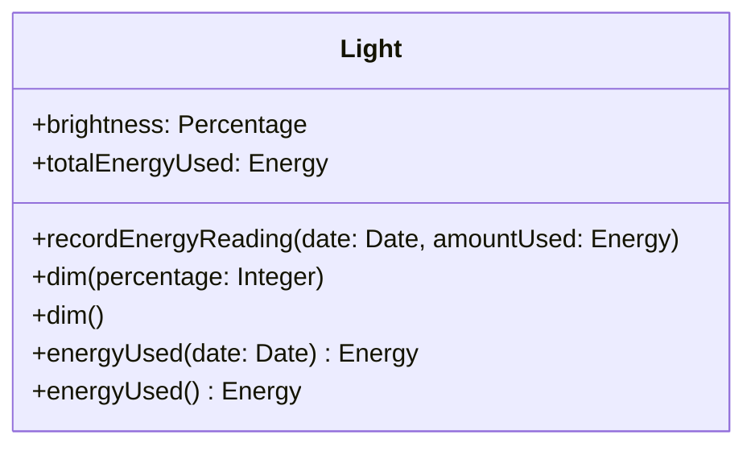

ოპერაცია **გადატვირთულია (overloaded)**, თუ ის ერთსა და იმავე კლასზეა განსაზღვრული ერთზე მეტჯერ — თითოეულ ჯერზე განსხვავებული ხელმოწერით (ანუ განსხვავებული რაოდენობის არგუმენტებით, ან არგუმენტების განსხვავებული ტიპებით). ასეთი ოპერაცია კლასის დიაგრამაზეც რამდენჯერმე გამოჩნდება, ყოველ ჯერზე ცალკე, საკუთარი ხელმოწერით.

მაგალითად, `Light` კლასის ოპერაცია `dim`, რომელიც ნათურის სიკაშკაშეს ამცირებს, შეიძლება ორ ვერსიად განისაზღვროს:

- პირველი ვერსია იღებს შემომავალ არგუმენტს — შესამცირებელ პროცენტს: `dim (percentage: Integer)`.
- მეორე ვერსია არგუმენტს არ იღებს და ყოველთვის ერთი და იმავე, ნაგულისხმევი ოდენობით ამცირებს სიკაშკაშეს: `dim ( )`.

მეორე მაგალითი გადატვირთვაზე ეხება `get`-ტიპის ოპერაციას `energyUsed`:

- პირველი ვერსია იღებს არგუმენტს `date` და აბრუნებს კონკრეტულ დღეს მოხმარებულ ენერგიას: `energyUsed (date: Date): Energy`.
- მეორე ვერსია არგუმენტს არ იღებს და აბრუნებს დაყენების მომენტიდან მოხმარებული ენერგიის ჯამურ რაოდენობას: `energyUsed ( ): Energy`.

ეს ჯამური მნიშვნელობა, ცხადია, სადღაც უნდა ინახებოდეს — მაგალითად, `Light` კლასის წარმოებულ ატრიბუტში `/totalEnergyUsed: Energy`, რომელსაც ანახლებს ცალკე ოპერაცია `recordEnergyReading (date: Date, amountUsed: Energy)`.

ეს ორივე წყვილი ერთად, დიაგრამის სახით:

გადატვირთვა სასარგებლოა მაშინ, როცა ერთი და იმავე კონცეპტუალური მოქმედების რამდენიმე ბუნებრივი ვარიანტი არსებობს — ზოგი მეტი დეტალით, ზოგი კი გამარტივებული, ნაგულისხმევი პარამეტრებით. ეს იძლევა ერთი და იმავე, დამახსოვრებადი სახელის გამოყენების საშუალებას სხვადასხვა კონტექსტში, ისე რომ გამომძახებელს არ სჭირდება ცალკეული, ხელოვნურად განსხვავებული სახელების დამახსოვრება თითოეული ვარიანტისთვის.
