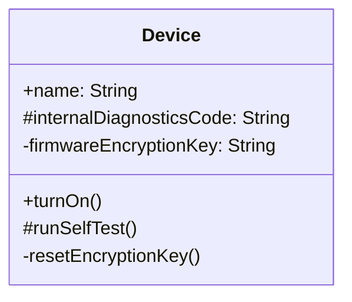

UML-ში ატრიბუტისა თუ ოპერაციის სახელს წინ ერთვის სიმბოლო, რომელიც მიუთითებს მის **ხილვადობაზე (visibility)**:

- **საჯარო (public)** ატრიბუტები და ოპერაციები აღინიშნება პლუსის ნიშნით (`+`);
- **დაცული (protected)** — ნომრის ნიშნით (`#`);
- **კერძო (private)** — მინუსის ნიშნით (`-`).

ვინაიდან კლასის დიაგრამაზე ხშირად მხოლოდ საჯარო ინტერფეისის ჩვენება გვინდა, დიზაინერები (და მოდელირების ხელსაწყოებიც) ჩვეულებრივ პლუსის ნიშანს საერთოდ გამოტოვებენ და მას მხოლოდ განსაკუთრებული ხაზგასმისთვის იყენებენ.

მაგალითად, `Device` კლასს რომ სამივე დონის ხილვადობა ჰქონდეს, ის ასე გამოიყურება:

	Device
		+ name: String
		# internalDiagnosticsCode: String
		- firmwareEncryptionKey: String

		+ turnOn ( )
		# runSelfTest ( )
		- resetEncryptionKey ( )

აქ `name` საჯაროა და ნებისმიერს შეუძლია მისი წაკითხვა თუ შეცვლა; `internalDiagnosticsCode` და `runSelfTest()` დაცულია — განკუთვნილია მხოლოდ `Device`-ისა და მისი ქვეკლასების (მაგალითად, `Light`-ის ან `Thermostat`-ის) შიდა გამოსაყენებლად; ხოლო `firmwareEncryptionKey` და `resetEncryptionKey()` მთლიანად კერძოა — მასზე წვდომა მხოლოდ თავად `Device`-ის ობიექტს აქვს.

---

### ხილვადობის ზუსტი მნიშვნელობა

მართალია, public/protected/private-ის ზუსტი მნიშვნელობა კონკრეტულ პროგრამირების ენაზეა დამოკიდებული, მაგრამ შესაძლებელია ჩამოვაყალიბოთ განმარტება, რომელიც უმეტეს ენაში მართებულია. დავუშვათ, `f` არის ატრიბუტი ან ოპერაცია, განსაზღვრული კლასის `C` ობიექტ `obj`-ზე:

- თუ `f` **საჯაროა**, ის ხილვადია ნებისმიერი ობიექტისთვის და მემკვიდრეობით გადაეცემა `C`-ის ქვეკლასებს.
- თუ `f` **კერძოა**, ის ხილვადია მხოლოდ `obj`-სთვის. (C++-სა და Java-ში: ხილვადია `C` კლასის ნებისმიერი ობიექტისთვის — ანუ `obj`-სთვის და მისი „დებისთვის“ — და მემკვიდრეობით არ გადაეცემა ქვეკლასებზე.)
- თუ `f` **დაცულია**, ის ხილვადია მხოლოდ `C` კლასისა და მისი ქვეკლასების ობიექტებისთვის და მემკვიდრეობით გადაეცემა ქვეკლასებზეც.

საბოლოო ჯამში, დიზაინერი იმ პრეფიქსს (`+`, `-` ან `#`) აირჩევს, რომელიც საუკეთესოდ შეესაბამება საკუთარი პროგრამირების ენის ხილვადობის წესებს.
