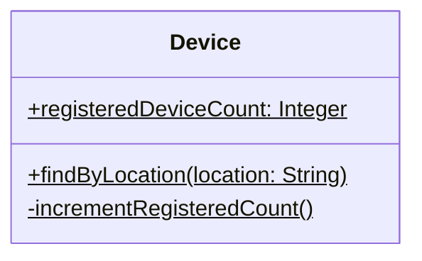

ზოგიერთი ატრიბუტი და ოპერაცია არ ეკუთვნის ცალკეულ ობიექტს, არამედ თავად კლასს მთლიანობაში — მათ **კლასის ატრიბუტები** და **კლასის ოპერაციები** ეწოდება (ინსტანციის დონის, ანუ ჩვეულებრივი, ცალკეულ ობიექტებზე განსაზღვრული ატრიბუტებისა და ოპერაციების საპირისპიროდ).

მაგალითად, `Device` კლასს რომ გვინდოდეს ვიცოდეთ, სულ რამდენი მოწყობილობაა რეგისტრირებული სისტემაში — ეს რიცხვი ცალკეულ მოწყობილობას კი არ ეკუთვნის, არამედ თავად კლასს მთლიანობაში. ანალოგიურად, ოპერაცია, რომელიც მდებარეობის მიხედვით ეძებს მოწყობილობებს, არცერთ კონკრეტულ ობიექტზე არ სრულდება — ის მთელი კლასის დონეზეა განსაზღვრული:

	Device
		+ registeredDeviceCount: Integer
		+ findByLocation (location: String)
		- incrementRegisteredCount ( )

UML-ში კლასის ატრიბუტებისა და ოპერაციების სახელები **ხაზგასმულია** — ისევე, როგორც ობიექტების (ინსტანციების) სახელები:

ლოგიკური კითხვა ჩნდება: რატომ იყენებს UML ხაზგასმას სწორედ კლასის დონის წევრებისთვის, თუ ადრე ვთქვით, რომ ხაზგასმა ინსტანციებს აღნიშნავს?

პასუხი ცოტა უცნაურია, მაგრამ საფუძველი აქვს: ობიექტზე ორიენტირებულ გარემოში თავად კლასი (მაგალითად, `Device`) განიხილება, როგორც ერთგვარი „მეტა-კლასის“ — `Class`-ის — ინსტანცია, რადგან ყოველი კლასი თავისთავად ერთგვარი ობიექტია იმ დონეზე, სადაც კლასების შესახებ მსჯელობა მიმდინარეობს. ამ ლოგიკით, `Device`-ის კლასის დონის ნებისმიერი წევრი ინსტანციის დონეზეც აღმოჩნდება — ოღონდ `Class`-ის, და არა `Device`-ის, ინსტანციის დონეზე — და სწორედ ამიტომაა ხაზგასმული.

თუ ეს ახსნა ზედმეტად აბსტრაქტული გეჩვენებათ, უბრალოდ დაიმახსოვრეთ თავად ნოტაცია — პრაქტიკული მუშაობისთვის ეს სავსებით საკმარისია. თეთრ დაფაზე ხატვისას ალტერნატივაც არსებობს: კლასის ატრიბუტებისა და ოპერაციების სახელების წინ დოლარის ნიშნის (`$`) დასმა, რაც ბევრისთვის ხაზგასმაზე მოსახერხებელია.
