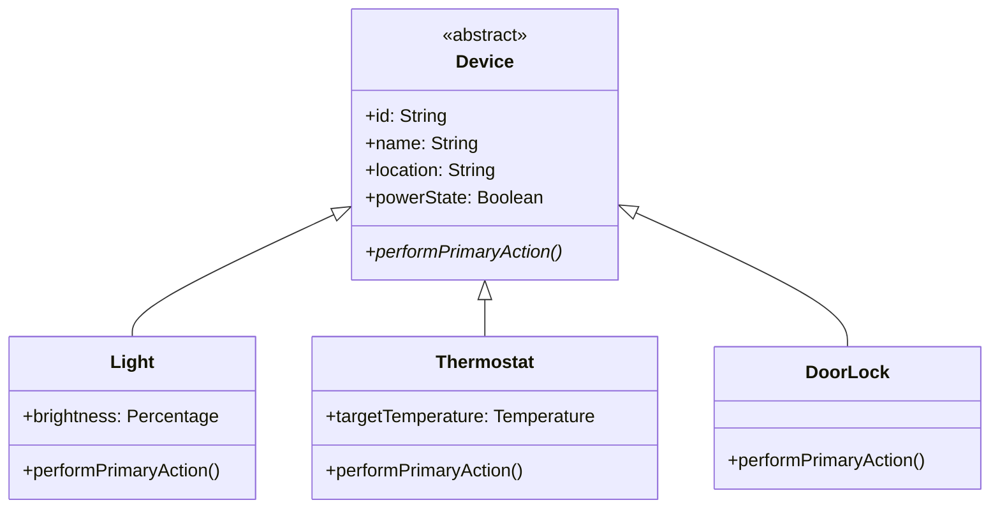

**ოპერაცია აბსტრაქტულია**, თუ მას აქვს ინტერფეისი და გარკვეული დანიშნულება, მაგრამ არა აქვს კონკრეტული იმპლემენტაცია — ანუ მისი შესრულების რეალური კოდი არსად წერია. (ეს იგივეა, რაც C++-ში „pure virtual function“ ან Eiffel-ში „deferred feature“.)

**კლასი აბსტრაქტულია**, თუ მისგან ობიექტების შექმნა შეუძლებელია — ჩვეულებრივ იმიტომ, რომ მასზე მინიმუმ ერთი აბსტრაქტული ოპერაციაა განსაზღვრული. თუ მაინც შევეცდებით ასეთი კლასის ინსტანცირებას, მივიღებთ შეცდომას, რადგან ახლადშექმნილ ობიექტს არ ექნება რეალური კოდი, რომელიც აბსტრაქტული ოპერაციის გამოძახებას უპასუხებდა:

	Device.New;  // არასწორია!

### რატომ გვჭირდება საერთოდ აბსტრაქტული ოპერაცია?

პასუხი მემკვიდრეობასთანაა დაკავშირებული. ზემოკლასზე განსაზღვრული აბსტრაქტული ოპერაცია მკითხველს (და შემდგენელს) ეუბნება: ამ იერარქიაში მდებარე ყველა კონკრეტულმა ქვეკლასმა ეს ოპერაცია საკუთარი, კონკრეტული იმპლემენტაციით უნდა უზრუნველყოს. თითოეულ ქვეკლასს შეუძლია ამ ოპერაციის განხორციელება საკუთარი საჭიროებისამებრ, საკუთარი ლოგიკით.

### მაგალითი: `Device` და `performPrimaryAction`

ჩვენს ჭკვიან სახლში `Device` არის ყველა მოწყობილობის საბაზისო კლასი, მაგრამ პრაქტიკაში არასდროს გვჭირდება უბრალო, „ზოგადი“ მოწყობილობის ინსტანცირება — ყოველთვის კონკრეტული სახეობის მოწყობილობასთან გვაქვს საქმე. სწორედ ამიტომ `Device` კარგი კანდიდატია აბსტრაქტული კლასისთვის, აბსტრაქტული ოპერაციით `performPrimaryAction()`, რომელიც აღნიშნავს „ამ მოწყობილობის ძირითადი ფუნქციის შესრულებას“:

- `Light`-ისთვის `performPrimaryAction()` ნიშნავს განათების ჩართვას/გამორთვას მიმდინარე მდგომარეობის მიხედვით;
- `Thermostat`-ისთვის — მიმდინარე ტემპერატურის სამიზნისკენ მიახლოებას;
- `DoorLock`-ისთვის — საკეტის დაბლოკვას/განბლოკვას;
- `SecurityCamera`-სთვის — ჩაწერის დაწყებას/შეჩერებას.

ამ გადაწყვეტილებას ორი პრაქტიკული შედეგი მოჰყვება:

1. თითოეულმა კონკრეტულმა ქვეკლასმა (`Light`, `Thermostat`, `DoorLock`, `SecurityCamera` და ა.შ.) სავალდებულოდ უნდა უზრუნველყოს `performPrimaryAction()`-ის საკუთარი, კონკრეტული ვერსია.
2. `Device`-ის პირდაპირი ინსტანცია არასდროს იქმნება — ანუ `Device.New` არასდროს გამოიძახება. ინსტანცირდება მხოლოდ კონკრეტული ქვეკლასები. მიუხედავად ამისა, დასაშვებია ცვლადის გამოცხადება `var d: Device`-ის სახით — მასში პოლიმორფულად შეიძლება მოთავსდეს ნებისმიერი კონკრეტული ქვეკლასის ობიექტის „handle“.

UML-ში აბსტრაქტული კლასის სახელი იტალიკურად იწერება (ან, ალტერნატიულად, სახელს ემატება თვისება `{abstract}`); ასევე იტალიკურად და `{abstract}` თვისებით აღინიშნება თავად აბსტრაქტული ოპერაციაც:

