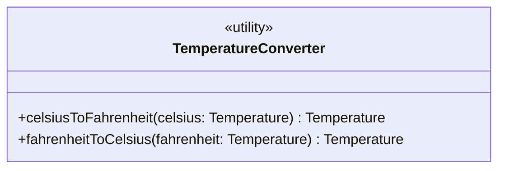

**Utility** (ან _utility package_) არის პროცედურებისა და ფუნქციების ჯგუფი, შეკრული ერთ ერთეულში, საკუთარი კერძო მონაცემებით. კლასისგან იგი იმით განსხვავდება, რომ მისგან ცალკეული ობიექტები არასოდეს იქმნება — Utility უფრო ჰგავს ტრადიციულ ფუნქციათა და პროცედურათა ნაკრებს (მაგალითად, დინამიურად დაკავშირებულ ბიბლიოთეკას), ვიდრე ჩვეულებრივ კლასს.

შეიძლება ითქვას, რომ Utility არის **„კლასი ობიექტების გარეშე“**: მისი ოპერაციები ფაქტობრივად კლასის დონის ოპერაციებია. (ალტერნატიულად, Utility შეიძლება წარმოვიდგინოთ, როგორც კლასი, რომელსაც მხოლოდ ერთი, წინასწარ განსაზღვრული ობიექტი ჰყავს.)

### მაგალითი

ჭკვიან სახლის სისტემაში კარგი მაგალითია `TemperatureConverter` — უტილიტა, რომელსაც არავითარი შიდა მდგომარეობა (state) არ აქვს და მხოლოდ გარდაქმნის ფუნქციებს გვთავაზობს:

	« utility »
	TemperatureConverter

		celsiusToFahrenheit (celsius: Temperature, out fahrenheit: Temperature)
		fahrenheitToCelsius (fahrenheit: Temperature, out celsius: Temperature)

UML-ის ნოტაციაში კლასის სახელის წინ ეწერება სტერეოტიპი «utility», ჩასმული გილემეტებში (არ აგერიოთ guillemot-ებში, რომლებიც ჩიტებია). ყურადღება მიაქციეთ ერთ დეტალს: მიუხედავად იმისა, რომ Utility-ის ოპერაციები ფაქტობრივად კლასის დონის ოპერაციებია — ისევე, როგორც წინა განყოფილებაში განხილული `Device`-ის `findByLocation` — UML-ის კონვენციით მათი სახელები **არ არის ხაზგასმული**:

Utility განსაკუთრებით სასარგებლოა ისეთი პროგრამული კონსტრუქციისთვის, რომელსაც პრინციპში მხოლოდ ერთი „გამოვლენა“ სჭირდება — მაგალითად, კონვერტაციის ან მათემატიკური ფუნქციების ნაკრები, ან **დემონი** (daemon): ფონურად მომუშავე პროცესი, რომელიც აკვირდება ცვალებად პირობებს. ჩვენს სისტემაში ასეთი დემონის კარგი მაგალითია ფონური პროცესი, რომელიც განუწყვეტლივ ამოწმებს სენსორების ზღვრულ მნიშვნელობებს და საჭიროების შემთხვევაში ააქტიურებს შესაბამის ავტომატიზაციის სცენარს.

Utility ასევე გამოსადეგია მაშინ, როცა გვინდა, ობიექტზე ორიენტირებული „საფარველი“ მივცეთ ტრადიციულ, არა-ობიექტზე ორიენტირებულ კოდს — მაგალითად, თუ ჭკვიან სახლს ვაერთებთ ძველი თაობის მოწყობილობის მწარმოებლის დაბალი დონის, პროცედურულ SDK-სთან. ასეთ შემთხვევაში, კარგად გაფორმებულ Utility-ს, რომელიც ამ ძველ კოდს ახვევს, ხშირად **wrapper**-ს უწოდებენ.
