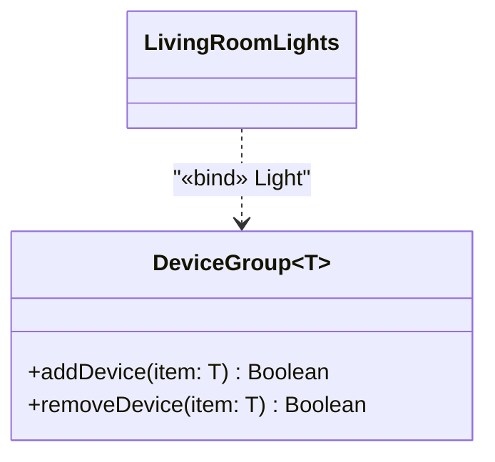

**პარამეტრიზებული კლასი** (ასევე ცნობილი, როგორც _generic class_, ხოლო C++-ში — _template class_) UML-ში გამოისახება სტანდარტული კლასის სიმბოლოს ზედა მარჯვენა კუთხეში დამატებული, წყვეტილი ხაზის ჩარჩოთი. ამ ჩარჩოში ჩამოთვლილია ფორმალური არგუმენტი (ან არგუმენტები) — ხშირად საკმარისია მხოლოდ ერთი.

### მაგალითი: `DeviceGroup<T>`

წარმოვიდგინოთ ტიპური კონტეინერული კლასი `DeviceGroup`, რომელიც ფორმალურად იღებს არგუმენტს, სახელად `T`. მისი დანიშნულებაა, ერთგვაროვანი ტიპის მოწყობილობების ჯგუფის დამახსოვრება — მაგალითად, ყველა სასტუმრო ოთახის ნათურა, ან ყველა სართულზე განთავსებული თერმოსტატი.

	DeviceGroup <T>
		addDevice (item: T, out addOK: Boolean)
		removeDevice (item: T, out removeOK: Boolean)

როცა კონკრეტული კლასი — მაგალითად, `Light` — მიეწოდება არგუმენტ `T`-ს (ანუ „ეკვრის“ T-ს), მიღებული ტიპის ყოველი ობიექტი წარმოადგენს ნათურების ჯგუფს. ასეთი, უკვე კონკრეტული კლასით შევსებული პარამეტრიზებული კლასი (**bound class**) აღინიშნება, როგორც `DeviceGroup<Light>`.

ამ bound კლასს შეგვიძლია მივანიჭოთ უფრო დამახსოვრებადი სახელი — მაგალითად:

	LivingRoomLights = DeviceGroup<Light>

აქ ტოლობის ნიშანი უბრალოდ სინონიმობას გამოხატავს: `LivingRoomLights` არის სხვა არაფერი, თუ არა `DeviceGroup<Light>`-ის მოსახერხებელი მეტსახელი.

ეს მიბმა (binding) გრაფიკულადაც შეიძლება გამოვსახოთ — წყვეტილი ისრით, სტერეოტიპით «bind», bound კლასიდან პარამეტრიზებული კლასისკენ მიმართული:

პარამეტრიზებული კლასის მთავარი ღირებულება ისაა, რომ ერთხელ დაწერილი, ტიპისგან დამოუკიდებელი ლოგიკა (მაგალითად, მოწყობილობის დამატება/წაშლა ჯგუფიდან) მრავალჯერ, სხვადასხვა კონკრეტული ტიპისთვის (`Light`, `Thermostat`, `DoorLock` და ა.შ.) თავიდან წერის გარეშე გამოვიყენოთ — უბრალო, ჩვეულებრივი კლასისგან განსხვავებით, რომელიც წინასწარ ერთადერთ კონკრეტულ ტიპზეა „მიბმული“.
