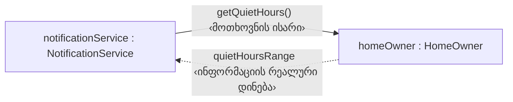
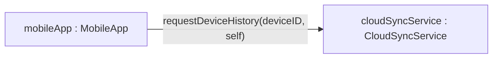

UML-ის კოლაბორაციის დიაგრამაში, **ობიექტები**, რომლებიც ურთიერთქმედებენ **შეტყობინებების გზით**, წარმოდგენილია როგორც სტანდარტული UML „ყუთები“, თითოეულზე მითითებულია ობიექტის სახელი.

<svg viewBox="0 0 600 240" xmlns="http://www.w3.org/2000/svg">
  <defs>
    <marker id="arrow51" viewBox="0 0 10 10" refX="9" refY="5" markerWidth="7" markerHeight="7" orient="auto-start-reverse">
      <path d="M0,0 L10,5 L0,10 z" fill="currentColor"/>
    </marker>
  </defs>
  <line x1="220" y1="175" x2="380" y2="175" stroke="currentColor" stroke-width="1.5"/>
  <line x1="280" y1="175" x2="320" y2="175" stroke="currentColor" stroke-width="1.5" marker-end="url(#arrow51)"/>
  <text x="300" y="135" text-anchor="middle" font-size="12" fill="#4A90D9">activate(sceneName, out activationOK)</text>
  <rect x="30" y="150" width="190" height="50" fill="none" stroke="currentColor" stroke-width="1.5"/>
  <text x="125" y="180" text-anchor="middle" font-size="13" fill="currentColor">mobileApp : MobileApp</text>
  <rect x="380" y="150" width="190" height="50" fill="none" stroke="currentColor" stroke-width="1.5"/>
  <text x="475" y="180" text-anchor="middle" font-size="13" fill="currentColor">homeHub : HomeHub</text>
</svg>

**ნახ. 5.1:** კოლაბორაციის დიაგრამა შეტყობინებისთვის `homeHub.activate`. თხელი ხაზი წარმოადგენს ობიექტებს შორის კომუნიკაციის გზას (ბმულს), ხოლო მასზე მდებარე პატარა ისარი — თავად შეტყობინებას, მიმართულს გამგზავნიდან (`mobileApp`) სამიზნისკენ (`homeHub`).

გაითვალისწინეთ, რომ თითოეული ობიექტის სახელი წარმოდგენილია ფორმატით

	ობიექტისსახელი : კლასისსახელი

და ხაზგასმითაა გამოყოფილი, რათა ითქვას, რომ საქმე გვაქვს **ინსტანსებთან**, არა **კლასებთან**.

კოლაბორაციის დიაგრამაზე თითოეული ობიექტი იდენტიფიცირდება იმ სახელით, რომელსაც სხვა ობიექტები იყენებენ, როცა მას შეტყობინებას უგზავნიან — რადგან სინამდვილეში ობიექტებს საკუთარი „სახელი“ არ გააჩნიათ. სხვა სიტყვებით რომ ვთქვათ, **სამიზნე ობიექტი იღებს იმ ცვლადის სახელს, რომელიც გამგზავნი ობიექტის შიგნით შეიცავს მის handle-ს**.

---

### შეტყობინების გამოსახვა

კოლაბორაციის დიაგრამაზე **სინქრონული შეტყობინება** წარმოდგენილია პატარა ისარით, რომელიც მიუთითებს **გამგზავნი ობიექტიდან (sendobj) სამიზნე ობიექტისკენ (targobj)**.

შეტყობინების ისარს ეწერება სამიზნე ობიექტის ოპერაციის სახელი, რომელსაც მოჰყვება ოპერაციის რეალური **შესვლისა და გამოსვლის არგუმენტები**.

შეტყობინების ისარი მდებარეობს ხაზზე, რომელიც გამგზავნ ობიექტს უკავშირდება სამიზნე ობიექტს და წარმოადგენს **კომუნიკაციის გზას** ორ ობიექტს შორის. კომუნიკაციის გზა ჩვეულებრივ არსებობს, რადგან არსებობს **ბმული (link)** `sendobj`-სა და `targobj`-ს შორის. თუმცა, არსებობენ სხვა გზებიც, რომ ასეთი გზა წარმოიქმნას — მაგალითად, `sendobj`-მ შესაძლოა მიიღოს `targobj`-ის მიმართ ჰენდლი წინა შეტყობინებით მესამე ობიექტისგან.

ჩვენს მაგალითში, ოპერაცია `triggerNightMode` (**MobileApp** კლასის ობიექტიდან) უგზავნის შეტყობინებას სამიზნე ობიექტს `homeHub` (**HomeHub** კლასის ობიექტი). შეტყობინება ითხოვს, რომ `homeHub`-მა ჩართოს მითითებული სცენა. გამოსვლის არგუმენტი `activationOK` ხდება `true`, როცა სცენის სახელი ვალიდურია და აქტივაცია წარმატებულია.

შეტყობინება, რომელიც გამოჩნდება გამგზავნი ოპერაციის `triggerNightMode` კოდში, ასე გამოიყურება:

	homeHub.activate(sceneName, out activationOK)

გაითვალისწინეთ, რომ კოლაბორაციის დიაგრამაზე ან თანმიმდევრობის დიაგრამაზე **არგუმენტის სახელი არის რეალური არგუმენტის სახელი** — ანუ გამოყენებულია ის სახელი, რაც გამგზავნის არგუმენტების სიაშია, **არა ის ფორმალური სახელი**, რაც სამიზნე ოპერაციის სათაურშია. მაგალითად, რეალური არგუმენტის სახელი ჩვენს მაგალითში არის `sceneName`. (ფორმალური არგუმენტის სახელი ოპერაციაში `activate` ალბათ არის `requestedScene`.)

> შენიშვნა 1: გამგზავნი და სამიზნე ობიექტები ჩვეულებრივ განსხვავებულები არიან, მაგრამ ეს აუცილებელი არაა.  
> შენიშვნა 2: როგორც მოგეხსენებათ მე-4 თავიდან, **ბმული (link)** არის ასოციაციის ინსტანცია — ასოციაცია არსებობს კლასებს შორის, ბმული კი ობიექტებს შორის.  
> შენიშვნა 3: არგუმენტები, რომლებიც `out`-ის ქვეშ არიან არგუმენტების სიაში, არიან გამოსვლის არგუმენტები (target-დან sender-ისკენ). სხვა არგუმენტები არიან შესვლის არგუმენტები (sender-დან target-ისკენ).  
> შენიშვნა 4: ადამიანები ხშირად გამოტოვებენ კლასის სახელებს შეტყობინების არგუმენტებთან ერთად კოლაბორაციის დიაგრამაზე. მაგალითად, ჩვეულებრივ ვწერ `(sceneName, out activationOK)` ნაცვლად `(sceneName: String, out activationOK: Boolean)`-ისა. თუმცა გამჭვირვალობის მიზნით, ზოგან კლასის სახელებსაც ვურთავ.

თუმცა, ამ კოლაბორაციის დიაგრამაზე მარცხენა ყუთი წარმოადგენს **ერთ ოპერაციას** (`triggerNightMode`), არა მთელ ობიექტს (`mobileApp`). მე ვთვლი, რომ ეს მიდგომა სასარგებლოა ორი მიზეზით:

1. დიაგრამის დასაწყისი უფრო წესიერი ხდება იმ ოპერაციიდან, რომელიც იწყებს მთლიან კოლაბორაციას.
2. შესაძლებელი ხდება ზუსტად გამოვყოთ, რომ კონკრეტული შეტყობინებები მოდის მხოლოდ კონკრეტული ოპერაციიდან, არა ვაგონურად მთელი ობიექტიდან.

---

შემდეგი მაგალითი აჩვენებს ჩვენი სისტემის კიდევ ერთ სცენარს: **AwayMode**-ის გააქტიურებას, როცა სახლის მფლობელი სახლს ტოვებს. გაითვალისწინეთ პატარა რიცხვები შეტყობინებებზე — ისინი მიუთითებენ **შემთხვევის თანმიმდევრობას**.

<svg viewBox="0 0 700 420" xmlns="http://www.w3.org/2000/svg">
  <defs>
    <marker id="arrow52" viewBox="0 0 10 10" refX="9" refY="5" markerWidth="7" markerHeight="7" orient="auto-start-reverse">
      <path d="M0,0 L10,5 L0,10 z" fill="currentColor"/>
    </marker>
  </defs>
  <line x1="350" y1="70" x2="350" y2="158" stroke="currentColor" stroke-width="1.5" marker-end="url(#arrow52)"/>
  <line x1="300" y1="211" x2="130" y2="318" stroke="currentColor" stroke-width="1.5" marker-end="url(#arrow52)"/>
  <line x1="350" y1="211" x2="350" y2="318" stroke="currentColor" stroke-width="1.5" marker-end="url(#arrow52)"/>
  <line x1="400" y1="211" x2="572" y2="318" stroke="currentColor" stroke-width="1.5" marker-end="url(#arrow52)"/>

  <text x="358" y="118" font-size="12" fill="#4A90D9">1: arm()</text>
  <text x="150" y="255" font-size="12" fill="#4A90D9">2: lock()</text>
  <text x="358" y="270" font-size="12" fill="#4A90D9">3: setTemperature(ecoTemp)</text>
  <text x="435" y="255" font-size="12" fill="#4A90D9">4: startRecording()</text>

  <rect x="260" y="20" width="180" height="50" fill="none" stroke="currentColor" stroke-width="1.5"/>
  <text x="350" y="50" text-anchor="middle" font-size="13" fill="currentColor">mobileApp : MobileApp</text>

  <rect x="260" y="160" width="180" height="50" fill="none" stroke="currentColor" stroke-width="1.5"/>
  <text x="350" y="190" text-anchor="middle" font-size="13" fill="currentColor">homeHub : HomeHub</text>

  <rect x="30" y="320" width="170" height="50" fill="none" stroke="currentColor" stroke-width="1.5"/>
  <text x="115" y="350" text-anchor="middle" font-size="12" fill="currentColor">frontDoorLock : DoorLock</text>

  <rect x="265" y="320" width="170" height="50" fill="none" stroke="currentColor" stroke-width="1.5"/>
  <text x="350" y="343" text-anchor="middle" font-size="12" fill="currentColor">hallwayThermostat :</text>
  <text x="350" y="359" text-anchor="middle" font-size="12" fill="currentColor">Thermostat</text>

  <rect x="500" y="320" width="170" height="50" fill="none" stroke="currentColor" stroke-width="1.5"/>
  <text x="585" y="343" text-anchor="middle" font-size="12" fill="currentColor">backyardCamera :</text>
  <text x="585" y="359" text-anchor="middle" font-size="12" fill="currentColor">SecurityCamera</text>
</svg>

**ნახ. 5.2:** იგივე ურთიერთქმედება, ნაჩვენები კოლაბორაციის დიაგრამის საკუთარი ფორმით — ობიექტები განლაგებულია სივრცობრივ ქსელად (არა ვერტიკალურ ღერძზე), ხოლო პატარა დანომრილი ისრები თითოეულ ბმულზე გვიჩვენებენ შეტყობინებების გაგზავნის თანმიმდევრობასა და მიმართულებას: `mobileApp` აგზავნის შეტყობინებას 1-ს `homeHub`-თან, რომელიც შემდეგ თანმიმდევრობით უგზავნის შეტყობინებებს 2, 3 და 4 დარჩენილ სამ მოწყობილობას.

მე უნდა ვაღიარო, რომ **არ მიყვარს თანმიმდევრობის ნომრები**. მიზეზები:

1. ისინი ბევრს არ მეხმარება: ან თანმიმდევრობა მარტივია (და მაშინ ვის უნდა ნომრები?), ან რთულია (და როგორ განსაზღვრო აზრობრივი დროითი თანმიმდევრობა კომპლექსურ ალგორითმში?). სწრაფი ალგორითმისთვის, თანმიმდევრობის ნომრების დამატების ნაცვლად, შეგიძლია მიუთითო შეტყობინებების თანმიმდევრობა **მეთოდის ფსევდოკოდში**, ანუ ოპერაციის იმპლემენტაციის აღწერაში.
    
2. თანმიმდევრობის ნომრები რთულია განახლებისთვის, თუმცა ზოგი ინსტრუმენტი ამაში დაგეხმარებათ. მიუხედავად ამისა, თუ გინდა, რომ ინსტრუმენტმა ავტომატურად გადააქციოს კოლაბორაციის დიაგრამა თანმიმდევრობის დიაგრამად, მაინც უნდა დაამატო ნომრები შეტყობინებებს.

---

ახლა ვნახოთ კიდევ ერთი მაგალითი, სადაც შეტყობინების ისარი ერთი შეხედვით **ანტილოგიკურად** გამოიყურება. წარმოვიდგინოთ, რომ **NotificationService**-ს, სანამ შეტყობინებას გაუგზავნის სახლის მფლობელს, სურს გაარკვიოს, არ ხვდება თუ არა ეს დრო მისი „მშვიდი საათების“ (quiet hours) პერიოდში.

**ნახ. 5.3:** შეტყობინების ისარი მიუთითებს, **ვინ იძახებს ოპერაციას**, და არა — ვისკენ მიედინება ინფორმაცია.

აქ არის რაღაც **ანტილოგიკური** შეტყობინების ისარზე: ინფორმაცია მიედინება `homeOwner → notificationService`, მაგრამ ისარი მიუთითებს `notificationService → homeOwner`. ეს იმიტომ ხდება, რომ UML-ის შეტყობინების ისარი აჩვენებს **ვინ ასრულებს გამოძახებას (invokes)**, და არა — ვისთვის არის საინტერესო ინფორმაცია. თუ ეს ბუნდოვანი ჩანს, შეგიძლია ოპერაცია `getQuietHours` უფრო აღწერითად დაარქვა, მაგალითად `reportQuietHours`.

---

### პოლიმორფიზმი კოლაბორაციის დიაგრამაში

პოლიმორფიზმი მატებს დიდ ძალას ობიექტზე ორიენტირებულობას. ახლა ცუდი ამბავი: **პოლიმორფიზმი** და **დინამიკური ბინდინგი** (რომელიც პოლიმორფიზმის რეალურ დროში შესრულების მექანიზმია) ასევე ქმნიან პრობლემებს ნოტაციის შემქმნელებისთვის.

სტრუქტურირებული დიზაინის სამყაროში ჩვენ ყოველთვის ვიცოდით, სად ვიმყოფებოდით: **გამოძახება A ყოველთვის ნიშნავდა გამოძახება A-ს**. მაგრამ ობიექტზე ორიენტირებული **პოლიმორფიზმის** გამოყენებისას **გამგზავნ ობიექტს შეიძლება არ ჰქონდეს ზუსტად ცოდნა, რომელი კლასის ობიექტს უგზავნის შეტყობინებას**. ასეთ შემთხვევაში, **როგორ უნდა აღვწეროთ სამიზნე ობიექტის კლასი?**

**პასუხი:** აირჩიეთ სამიზნე ობიექტის კლასი, როგორც **მემკვიდრეობის იერარქიაში ყველაზე დაბალი კლასი**, რომელიც არის **ყველა შესაძლო კლასის სუპერკლასი**, რომელთაც სამიზნე ობიექტი შესაძლოა მიეკუთვნებოდეს.

მაგალითად, დავუშვათ, რომ `homeHub` ინახავს ღამის რეჟიმისთვის დაშვებულ მოწყობილობათა სიას, სადაც შერეულადაა **Light**, **Thermostat** და **DoorLock** კლასის ობიექტები. ღამის დადგომისას `homeHub` თითოეულს უგზავნის **ერთი და იმავე სახელის შეტყობინებას** — `enterNightMode()` — რომელსაც თითოეული ქვეკლასი თავისებურად ახორციელებს (ნათურა ითიშება, თერმოსტატი წყვეტს ტემპერატურას, ჩამკეტი იკეტება). ვინაიდან `homeHub`-მა არ იცის, ზუსტად რომელი ქვეკლასის ობიექტს უგზავნის შეტყობინებას თითოეულ მომენტში, სამიზნე კლასად აღინიშნება **Device** — საერთო სუპერკლასი სამივესთვის.

ზოგი დიზაინერი ხაზს უსვამს სამიზნე ობიექტის პოლიმორფულ ბუნებას **კლასის სახელის ფრჩხილებში ჩასმით**:

<svg viewBox="0 0 700 320" xmlns="http://www.w3.org/2000/svg">
  <defs>
    <marker id="arrow54" viewBox="0 0 10 10" refX="9" refY="5" markerWidth="7" markerHeight="7" orient="auto-start-reverse">
      <path d="M0,0 L10,5 L0,10 z" fill="currentColor"/>
    </marker>
  </defs>
  <line x1="190" y1="55" x2="440" y2="55" stroke="currentColor" stroke-width="1.5" marker-end="url(#arrow54)"/>
  <text x="315" y="40" text-anchor="middle" font-size="12" fill="#4A90D9">enterNightMode()</text>

  <line x1="535" y1="80" x2="420" y2="220" stroke="currentColor" stroke-width="1.5" stroke-dasharray="4,3"/>
  <line x1="535" y1="80" x2="535" y2="220" stroke="currentColor" stroke-width="1.5" stroke-dasharray="4,3"/>
  <line x1="535" y1="80" x2="650" y2="220" stroke="currentColor" stroke-width="1.5" stroke-dasharray="4,3"/>
  <text x="535" y="112" text-anchor="middle" font-size="11" font-style="italic" fill="currentColor">(შესაძლო კონკრეტული ტიპები გაშვების დროს)</text>

  <rect x="20" y="30" width="170" height="50" fill="none" stroke="currentColor" stroke-width="1.5"/>
  <text x="105" y="60" text-anchor="middle" font-size="13" fill="currentColor">homeHub : HomeHub</text>

  <rect x="440" y="30" width="190" height="50" fill="none" stroke="#4A90D9" stroke-width="1.5"/>
  <text x="535" y="60" text-anchor="middle" font-size="13" fill="currentColor">device : (Device)</text>

  <rect x="370" y="220" width="100" height="44" fill="none" stroke="#16A085" stroke-width="1.5"/>
  <text x="420" y="247" text-anchor="middle" font-size="12" fill="currentColor">Light</text>

  <rect x="485" y="220" width="100" height="44" fill="none" stroke="#16A085" stroke-width="1.5"/>
  <text x="535" y="247" text-anchor="middle" font-size="12" fill="currentColor">Thermostat</text>

  <rect x="600" y="220" width="100" height="44" fill="none" stroke="#16A085" stroke-width="1.5"/>
  <text x="650" y="247" text-anchor="middle" font-size="12" fill="currentColor">DoorLock</text>
</svg>

**ნახ. 5.4:** ოპერაცია `enterNightMode` შესრულდება კლასიდან **Device** ან მისი რომელიმე ქვეკლასიდან (**Light**, **Thermostat**, **DoorLock** — ნაჩვენებია დაწყვეტილი ხაზებით, რადგან ეს არაა შეტყობინება, არამედ შესაძლო რეალური ტიპების ჩვენება) და იქნება **დინამიკურად დაკავშირებული** სამიზნე ობიექტთან `device`. ფრჩხილები კლასის სახელის გარშემო (`(Device)`) მიუთითებს, რომ ეს არის **დინამიკური ბინდინგი**.

- როცა სამიზნე ობიექტის ზუსტი კლასი შეიძლება **დიზაინის ეტაპზე იყოს ცნობილი** (ანუ ხდება **სტატიკური ბინდინგი**), მაშინ სამიზნე კლასის სახელი იწერება **ფრჩხილების გარეშე**.
- როცა ზუსტი კლასი განისაზღვრება მხოლოდ **გაშვების დროს** (ანუ ხდება **დინამიკური ბინდინგი**), სამიზნე კლასის სახელი იწერება **ფრჩხილებში**, როგორც ზემოთ.

მეორე მაგალითი პოლიმორფიზმისთვის: ვთქვათ, `homeHub`-ს სურს ერთდროულად ჩაწეროს დიაგნოსტიკური ჩანაწერი ყველანაირი ტიპის ობიექტზე — მოწყობილობაზეც, სცენაზეც, თუნდაც მომხმარებელზე — შეტყობინებით `logStatus`. ასეთ შემთხვევაში, **საუკეთესო არჩევანი სამიზნე კლასის სახელად** იქნება **ყველაზე მაღალი საერთო სუპერკლასი** ყველა ამ კლასისთვის — რომელიც ჩვენს სისტემაში, ალბათ, უბრალოდ **Object**-ია, რადგან **Device**, **AutomationScene** და **HomeOwner** ერთმანეთისგან სრულიად დამოუკიდებელი იერარქიებია.

---

### განმეორებადი შეტყობინებები

**განმეორებადი შეტყობინება** არის შეტყობინება, რომელიც **დაეგზავნება მრავალჯერ**, ჩვეულებრივ **აგრეგატური ობიექტის თითოეულ კონსტიტუენტს**.

წინა მაგალითი — `homeHub`-ის ღამის რეჟიმის გააქტიურება — ამის შესანიშნავი ილუსტრაციაცაა. წარმოვიდგინოთ, რომ `homeHub`-ს აქვს ცვლადი `devices`, რომელშიც ინახავს ყველა რეგისტრირებულ მოწყობილობაზე ჰენდლს.

<svg viewBox="0 0 620 260" xmlns="http://www.w3.org/2000/svg">
  <defs>
    <marker id="arrow55" viewBox="0 0 10 10" refX="9" refY="5" markerWidth="7" markerHeight="7" orient="auto-start-reverse">
      <path d="M0,0 L10,5 L0,10 z" fill="currentColor"/>
    </marker>
  </defs>
  <line x1="210" y1="115" x2="405" y2="115" stroke="currentColor" stroke-width="1.5" marker-end="url(#arrow55)"/>
  <text x="300" y="95" text-anchor="middle" font-size="12" fill="currentColor"><tspan fill="#E67E22" font-weight="bold">*</tspan>enterNightMode()</text>

  <rect x="30" y="90" width="180" height="50" fill="none" stroke="currentColor" stroke-width="1.5"/>
  <text x="120" y="120" text-anchor="middle" font-size="13" fill="currentColor">homeHub : HomeHub</text>

  <rect x="430" y="70" width="170" height="50" fill="none" stroke="currentColor" stroke-width="1.5"/>
  <rect x="410" y="90" width="170" height="50" fill="none" stroke="currentColor" stroke-width="1.5"/>
  <text x="495" y="120" text-anchor="middle" font-size="13" fill="currentColor">device : (Device)</text>

  <text x="495" y="165" text-anchor="middle" font-size="11" font-style="italic" fill="currentColor">devices</text>
</svg>

**ნახ. 5.5:** შეტყობინება `enterNightMode` იგზავნება **იტერაციულად**, ანუ **თითოეულ მოწყობილობას რიგობრივად**, რომელიც შედის `devices` კოლექციაში (გამგზავნი ობიექტი — `homeHub`). წინ დასმული **ვარსკვლავი (\*)** მიუთითებს მრავლობითობას, ხოლო სამიზნე ობიექტის **გაორმაგებული ყუთის სიმბოლო** ხაზს უსვამს, რომ ცალკეულ სამიზნეებს ცალკე სახელი არ ჰქონდეთ — ისინი უბრალოდ `devices` კოლექციის წევრები არიან.

განმეორებადი შეტყობინება UML-ში ჩვეულებრივი შეტყობინების მსგავსად გამოჩნდება, მაგრამ **სამი თავისებურებით**:

1. შეტყობინებას აქვს **ვარსკვლავი (*)** წინ, რაც აღნიშნავს **მრავლობითობას**.
2. კოლექციის სახელი (`devices`) ჩანს მის ჩვეულ ადგილას, მაგრამ **თითოეულ ინდივიდუალურ სამიზნე ობიექტს სახელი არ აქვს**.
3. სამიზნე ობიექტის სიმბოლო **გაორმაგებულია**, რათა კიდევ ერთხელ გამოხატოს მრავლობითობა.

განმეორებადი შეტყობინება ჩვეულებრივ საჭიროებს **შეტყობინებას იტერაციის ინიციალიზაციისთვის** პროგრამაში. მაგალითად, თუ თქვენი `devices` არის სიაში (List), მოგიწევთ **პირველი შეტყობინება**, რომ აიღოთ სიის თავი (head), შემდეგ იტერაცია ავტომატურად გამოიძახებს **შემდეგ ელემენტს**. ჩვეულებრივ, ასეთი გადახედვის შეტყობინებები დიზაინში არ ვაჩვენე, თუმცა შეგიძლიათ აჩვენოთ.

ეს მაგალითი შესანიშნავი ილუსტრაციაა ობიექტზე ორიენტირებულობისთვის: **ერთი ობიექტი უგზავნის ერთსა და იმავე შეტყობინებას თითოეულ ობიექტს ჯგუფში.** თუმცა, რადგან **ჯგუფის თითოეულ წევრს შეიძლება ჰქონდეს განსხვავებული კლასი** (**Light**, **Thermostat**, **DoorLock**), **თითოეული მათგანი შეიძლება თავისებურად ახორციელებდეს ამ შეტყობინებას**. პოლიმორფიზმის წყალობით კი, **გამგზავნი ობიექტი სრულიად თავისუფალია ამ სირთულისგან** — მას არ სჭირდება იცოდეს, რა კლასს ეკუთვნის ჯგუფის თითოეული წევრი ან როგორ ასრულებს იგი ამ ოპერაციას.

---

### self-ის გამოყენება შეტყობინებებში

ტერმინი **self** ხშირად ჩნდება UML დიაგრამების შეტყობინებებში. **self** არის **ინსტანციის კონსტანტა** (ანუ არა ცვლადი), რომელიც ინახავს **ობიექტის საკუთარ ჰენდლს**.

ეს საშუალებას აძლევს ობიექტს, რომელიც უგზავნის შეტყობინებას, **ორი რამ გააკეთოს**:

1. გადასცეს **self არგუმენტად**, რათა სამიზნე ობიექტმა გაიგოს, **რომელი ობიექტი უგზავნის შეტყობინებას**, ან
2. **უგზავნოს შეტყობინება საკუთარ თავს**.

---

UML-ში, **პირველი გამოყენება** (self-ის არგუმენტად გადაცემა) გამოისახება **ერთ-ერთი შეტყობინების არგუმენტის სახელით self**.

**ნახ. 5.6:** `mobileApp` გადასცემს `self`-ს, რათა `cloudSyncService`-მა მოგვიანებით იცოდეს, ვის დაუბრუნოს პასუხი.

`self`-ის არგუმენტად გადაცემა გამოიყენება ძირითადად მაშინ, როცა სამიზნე ობიექტს სჭირდება **გამგზავნის იდენტიფიცირება ან მისი ჰენდლის შენახვა**, მაგალითად, როცა მას მოგვიანებით მოუწევს გამგზავნის მოძებნა რაღაც ცხრილში ან რეგისტრში, რომელიც შეიძლება სხვა ობიექტებთანაც იყოს დაკავშირებული — ზუსტად ეს ხდება, როცა `cloudSyncService`-მა მოგვიანებით `mobileApp`-ს უნდა დაუბრუნოს მოთხოვნილი ისტორია callback-ის სახით (ამაზე მომდევნო თავში ვისაუბრებთ).

ბევრი დამწყები დიზაინერი UML დიაგრამებში **ზედმეტად იყენებს self არგუმენტებს**, რადგან ფიქრობს, თითქოს სამიზნე ობიექტს სჭირდება გამგზავნის ჰენდლი, რათა **შეტყობინების შედეგები უკან სწორი გზით დააბრუნოს**. სინამდვილეში — **არა!** სინქრონული შეტყობინების ისარი უკვე ნიშნავს, რომ **სამიზნე ობიექტის მიერ შესრულების დასრულების შემდეგ კონტროლი ავტომატურად უბრუნდება გამგზავნს**. ყველა ძირითადი ობიექტზე ორიენტირებული პროგრამირების ენა ამას სისტემურად უზრუნველყოფს, დამატებითი არგუმენტის გარეშე.

> ამიტომ `self` გამოიყენეთ **მხოლოდ მაშინ**, როცა ის **მართლა საჭიროა** (მაგ. როცა სამიზნე ობიექტს რეალურად სჭირდება გამგზავნის იდენტიფიკაცია ან რეგისტრაცია სადმე, როგორც ზემოთ callback-ის მაგალითში).

გარდა ამისა, ერიდეთ ე.წ. **„yo-yo messaging“-ს** — ეს არის სიტუაცია, როცა ორი ობიექტი გამუდმებით უგზავნის ერთმანეთს შეტყობინებებს წინ და უკან, თითქოს ბადმინტონის ბურთივით „დაფრინავს“ მათ შორის კონტროლი. UML დიაგრამაზე ასეთ სიტუაციას ხშირად გამოხატავს `self` არგუმენტები, რომლებიც მიქრიან ერთი ობიექტიდან მეორეზე და ისევ ბრუნდებიან.

---

თუ ობიექტი **საკუთარ თავს უგზავნის შეტყობინებას**, UML-ში სამიზნე ობიექტის სახელი შეიძლება პირდაპირ აღინიშნოს, როგორც `self`. მაგალითად, `homeHub`-ის ოპერაცია `activate` შეიძლება ჯერ საკუთარ თავს გაუგზავნოს დამხმარე შეტყობინება, სანამ სცენას რეალურად ჩართავს:

	homeHub: activate(...) -> self: validateSceneDevices()

<svg viewBox="0 0 420 260" xmlns="http://www.w3.org/2000/svg">
  <defs>
    <marker id="arrow57" viewBox="0 0 10 10" refX="9" refY="5" markerWidth="7" markerHeight="7" orient="auto-start-reverse">
      <path d="M0,0 L10,5 L0,10 z" fill="currentColor"/>
    </marker>
  </defs>
  <path d="M 255,150 C 255,70 345,70 305,150" fill="none" stroke="currentColor" stroke-width="1.5" marker-end="url(#arrow57)"/>
  <text x="280" y="55" text-anchor="middle" font-size="12" fill="#4A90D9">validateSceneDevices()</text>
  <rect x="110" y="150" width="200" height="60" fill="none" stroke="currentColor" stroke-width="1.5"/>
  <text x="210" y="185" text-anchor="middle" font-size="13" fill="currentColor">homeHub : HomeHub</text>
</svg>

**ნახ. 5.7:** `homeHub` უგზავნის შეტყობინებას საკუთარ თავს — მარყუჟისებრი ისარი ტოვებს და ისევ უბრუნდება იმავე ობიექტის ყუთს, რაც ცალსახად აჩვენებს, რომ `self` არ არის ცალკე ობიექტი, არამედ იგივე `homeHub`.

პროგრამირების მკაცრი გაგებით, ობიექტს არ სჭირდება საკუთარ თავს შეტყობინების გაგზავნა, როცა გამომძახებელი და სამიზნე მეთოდი ერთსა და იმავე ობიექტს ეკუთვნის — ასეთ დროს გამომძახებელ მეთოდს პირდაპირაც შეეძლო იმავე შიდა ცვლადებზე მანიპულირება, რადგან მას ყველა შიდა მდგომარეობაზე წვდომა აქვს.

თუმცა, ამ მიდგომას ორი ნაკლი აქვს:

1. იგივე კოდი შეიძლება განმეორდეს სხვადასხვა მეთოდში.
2. ობიექტის შიდა სტრუქტურის ცოდნა გავრცელდება ზედმეტად ბევრ ადგილას.

ამიტომ, ობიექტის მიერ საკუთარი თავისადმი შეტყობინების გაგზავნა სასარგებლო ხდება, როცა დიზაინერი ცდილობს **იმპლემენტაციის დამალვას** — ერთი ოპერაციის შესრულების დეტალების დაფარვას მეორე ოპერაციისგან, მიუხედავად იმისა, რომ ორივე ერთსა და იმავე კლასშია. ჩვენს მაგალითში, `activate`-ს არ სჭირდება იცოდეს, როგორ ამოწმებს `validateSceneDevices` მოწყობილობების ვარგისიანობას — უბრალოდ იძახებს მას, როგორც ცალკე ოპერაციას.
