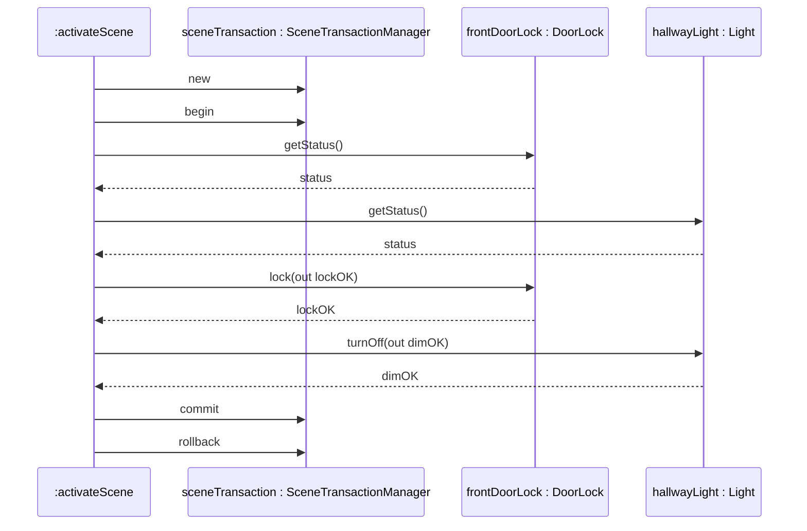

თანმიმდევრობის დიაგრამა არის ობიექტების ურთიერთქმედების დიაგრამის ტიპი, რომელიც უფრო მეტად ხაზს უსვამს **დროის თანმიმდევრობას** სტატიკური ობიექტური ურთიერთობების ნაცვლად. მე ვამჯობინებ თანმიმდევრობის დიაგრამას კოლაბორაციის დიაგრამაზე, როცა ჯგუფში ობიექტებს შორის ხდება დაახლოებით ნახევარი დუჟინა ან მეტი შეტყობინება — თანმიმდევრობის დიაგრამაზე ნათლად ჩანს, **ვინ რას ეუბნება ვის და როდის**. ასევე, აუცილებლად ვამჯობინებ მას, როცა პროცედურული ან დროის საკითხები რთულდება, რადგან სხვა დიაგრამა დროის ასახვას ასე კარგად ვერ აჩვენებს.

დრო იზრდება ვერტიკალურ ღერძზე ქვემოთ. ჰორიზონტალურად, ზედა მხარეს, განთავსებულია ობიექტების სია, რომლებსაც მიეწოდება შეტყობინებები. (ეს ობიექტები შეიძლება ჩამოთვლილი იყვნენ მათი კლასის სახელებით, თუ ეს საკმარისად ზუსტია.) დიაგრამის ძირითადი ნაწილი აჩვენებს გააქტიურებულ ოპერაციებს, ზომით ასახავს მათ დაახლოებით რამდენ ხანს არიან აქტიური: გააქტიურებული ოპერაციის სიმბოლო ვერტიკალურად დაახლოებით პროპორციულია იმ დროზე, რამდენ ხანს ოპერაცია აქტიურია. ოპერაციებს შორის ისრები ასახავენ შეტყობინებებს, ისევე როგორც კოლაბორაციის დიაგრამაზე. არჩევითად შეტანილი **თანმიმდევრობის ნომრები** შეტყობინებებზე იძლევა დროის თანმიმდევრობას, ისევე როგორც კოლაბორაციის დიაგრამაზე.

განვიხილოთ ჩვენი სისტემის კიდევ ერთი მაგალითი — **AwayMode**-ის სცენის გააქტიურება ისე, რომ ეს პროცესი ატომურად წარიმართოს: ან ყველა საჭირო მოწყობილობა წარმატებით გადადის „წასული სახლის“ მდგომარეობაში, ან საერთოდ არაფერი იცვლება.

**აღწერა — `:activateScene.run(): Boolean`**

	- ახალი სცენის ტრანზაქციის შექმნა
	- ტრანზაქციის დაწყება
	- frontDoorLock-ის მდგომარეობის შემოწმება
	- hallwayLight-ის მდგომარეობის შემოწმება

თუ ორივე მოწყობილობა ხელმისაწვდომია და გამართულია, მაშინ:  
	`frontDoorLock.lock(out lockOK);`  
წინააღმდეგ შემთხვევაში:  
	`sceneTransaction.rollback; return false;`

თუ `lockOK`, მაშინ:  
	`hallwayLight.turnOff(out dimOK);`  
თუ არა:  
	`sceneTransaction.rollback; return false;`

თუ `dimOK`, მაშინ:  
	`sceneTransaction.commit; return true;`  
თუ არა:  
	`sceneTransaction.rollback; return false;`

**`:activateScene`**

	- frontDoorLock : DoorLock
	- hallwayLight : Light
	- sceneTransaction : SceneTransactionManager

ფსევდოკოდი ოპერაციისთვის: `activateScene.run(): Boolean`

**ნახ. 5.8:** თანმიმდევრობის დიაგრამა **AwayMode**-ის სცენის ატომური გააქტიურებისთვის.

ახლა მოკლედ გიამბობთ შეტყობინებების შესრულების თანმიმდევრობას. თანმიმდევრობა იწყება სახელის არმქონე `:activateScene` ობიექტით, მარცხნიდან. ამ ობიექტის ოპერაცია `run` (ნახაზზე გამოკვეთილი გრძელი ვერტიკალური ზოლი მარცხნივ) ახორციელებს ატომურ გადასვლას „წასული სახლის“ მდგომარეობაზე ორი მოწყობილობისთვის — `frontDoorLock` და `hallwayLight`. ვივარაუდოთ, რომ `:activateScene`-ის სხვა ოპერაცია, მაგალითად `setUpScene`, უკვე დაარეგულირა ინფორმაცია, თუ ზუსტად რომელი მოწყობილობები მონაწილეობენ ამ სცენაში.

`run` ოპერაცია იღებს შეტყობინებას `new`, რომ შექმნას ტრანზაქციის მონიტორინგის ობიექტი, სახელად `sceneTransaction`, კლასიდან `SceneTransactionManager`. შემდეგ `run` უგზავნის შეტყობინებას `begin`, რომ `sceneTransaction` დაიწყოს. ტრანზაქციის მონიტორის გამოყენება საჭიროა, რათა წარუმატებელი შემთხვევისას სისტემამ უგულებელყოს ნაწილობრივ შესრულებული ცვლილებები, როგორც ნაჩვენებია `rollback` შეტყობინებით. ჩვენ არ გვინდა, რომ კარი ჩაიკეტოს, ნათურა კი ვერ ჩაქრეს (ან პირიქით) — ორივე ცვლილება ან ერთად უნდა შედგეს, ან საერთოდ არცერთი.

შემდეგი ორი შეტყობინება მიემართება:

	- frontDoorLock: getStatus()
	- hallwayLight: getStatus()

ეს შეტყობინებები ამოწმებენ, რომ მოწყობილობები ამჟამად ხელმისაწვდომია და გამართულია. `:activateScene`-ს უნდა იცოდეს ეს ორი მნიშვნელობა ორი მიზეზით: ერთი, რომ დარწმუნდეს, ორივე მოწყობილობა შესაძლებელია გადავიდეს ახალ მდგომარეობაში, და მეორე, რომ თავიდან აიცილოს მცდელობა იმ მოწყობილობასთან, რომელიც ამჟამად, მაგალითად, „firmware-ის განახლების“ პროცესშია.

შემდეგი შეტყობინება `lock(out lockOK)` მიდის `frontDoorLock`-თან. როგორც გვერდით ფსევდოკოდშია აღნიშნული, `lock`-ის გამოსვლის არგუმენტი `lockOK` ხდება `true`, თუ ყველაფერი წესრიგშია.

ბოლოს, თუ ყველაფერი კარგადაა, შეტყობინება `turnOff(out dimOK)` თიშავს `hallwayLight`-ს, ხოლო შეტყობინება `commit` ატყობინებს `sceneTransaction`-ს, რომ ყველაფერი შეიძლება საბოლოოდ დაფიქსირდეს. თუ ყველაფერი არ არის კარგად, შეტყობინება `rollback` ატყობინებს `sceneTransaction`-ს, რომ უნდა უგულებელყოს ყველა ცვლილება, რაც `begin`-ის შემდეგ მოხდა.

სულ ეს ესაა: ნახ. 5.8-ის თანმიმდევრობის დიაგრამის უმეტესი ნაწილი ინტუიციურად გასაგებია, მაგრამ აქვს შეზღუდვა: ვერ ჩანს, რომ `rollback` და `commit` შეტყობინებები, **მიუხედავად იმისა, რომ ორივე დიაგრამაზეა ნაჩვენები**, სინამდვილეში მხოლოდ ერთი იგზავნება ერთდროულად — არასდროს ორივე ერთად. სად შედის ეს ალგორითმული ნიუანსი? ფორმალურად, ის განთავსებულია, როგორც ფსევდოკოდი ერთი ან რამდენიმე მეთოდისთვის, ჩვენი მაგალითის მსგავსად. არაფორმალურად, შეგიძლიათ მიამაგროთ აღწერითი შენიშვნები თანმიმდევრობის დიაგრამაზე, სტიკერების მსგავსად — ზოგი ინსტრუმენტი ამისთვის სპეციალურ ფუნქციას გთავაზობთ. თუ იყენებთ თანმიმდევრობის დიაგრამას use case-ის მოდელირებისთვის, ტექსტური სპეციფიკაცია შეგიძლიათ განათავსოთ ცალკე ყუთში, მარცხნივ.

ამ თანმიმდევრობის დიაგრამის მაგალითში, ზედა ნაწილში მითითებული სახელები ეხება ობიექტებს. ალტერნატივად, როგორც ადრე აღვნიშნეთ, შეგიძლიათ გამოიყენოთ კლასის სახელები ან განათავსოთ ფიზიკური კვანძები (მაგალითად, კონკრეტული `HomeHub`-ის მოწყობილობა ან `CloudSyncService`-ის სერვერი) დიაგრამის ზედა ნაწილში, რათა მოდელირდეს სისტემის არქიტექტურული კომპონენტების შესრულების ქცევა.
