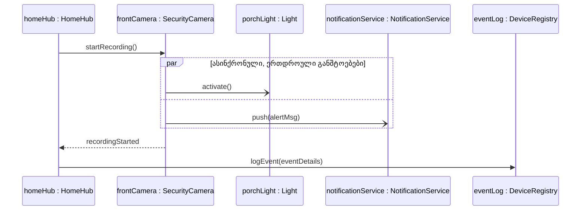
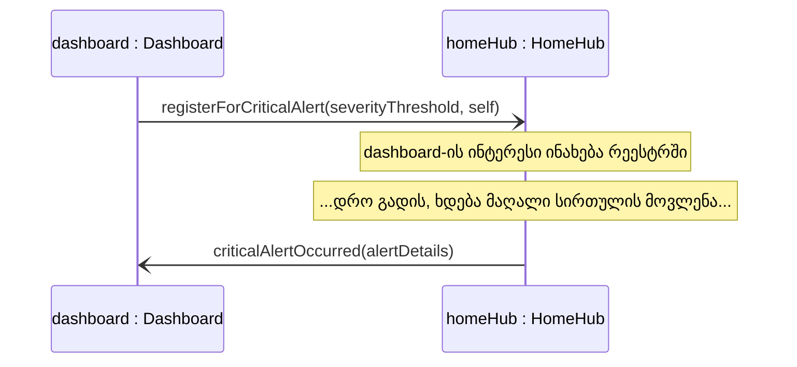
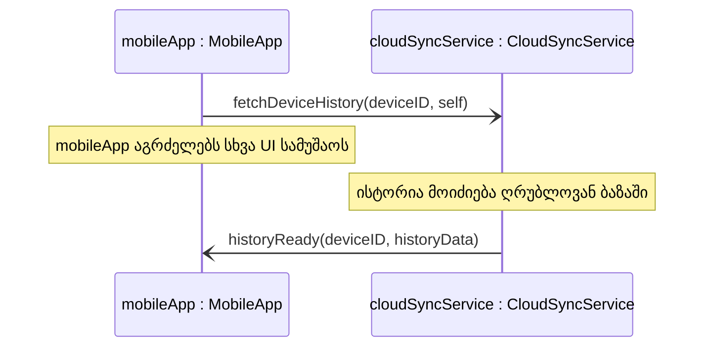
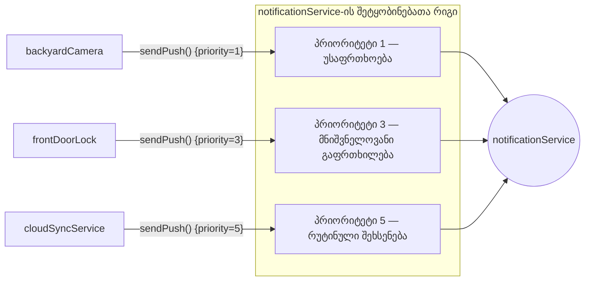
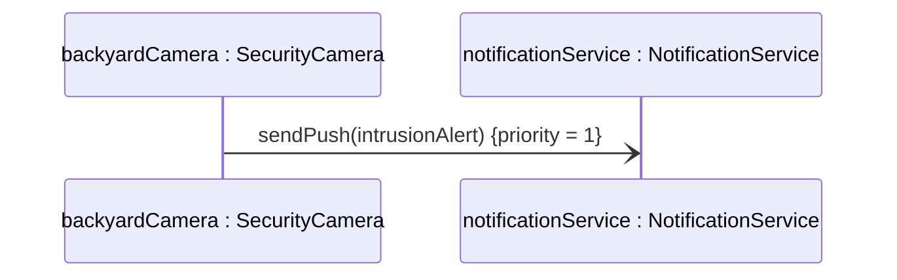
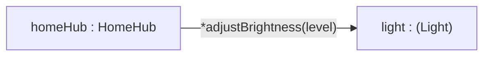

წინა ორ სექციაში მე ვივარაუდე, რომ ყველა შეტყობინება **სინქრონულია** — ანუ, ისინი სამიზნე ობიექტის მიერ მუშავდება ერთი-ერთზე, ხოლო გამგზავნი ელოდება. ასევე ვივარაუდე, რომ ობიექტზე ორიენტირებულ სისტემაში **ყველა შესრულება ერთშრიანია**, რაც ნიშნავს, რომ ერთ დროში მხოლოდ ერთი ობიექტია აქტიური. უფრო კონკრეტულად, მე ვივარაუდე შემდეგი:

- სისტემაში მხოლოდ ერთ ობიექტს შეუძლია ერთდროულად შეტყობინების გაგზავნა.
- გამგზავნი ობიექტი უნდა დაელოდოს, სანამ სამიზნე ობიექტი პროცესს დაამუშავებს.
- სამიზნე ობიექტი ერთდროულად მხოლოდ ერთ შეტყობინებას იღებს.

მიუხედავად იმისა, რომ ასე მუშაობს ბევრი ძირითადი ობიექტზე ორიენტირებული გარემო, **სინქრონული შეტყობინება** მხოლოდ ობიექტის შესრულების სპეციალური შემთხვევაა.

ამ სექციაში განვიხილავ უფრო ზოგად შემთხვევას — **ასინქრონულ შეტყობინებას**, რომელიც საშუალებას აძლევს შეტყობინების გამგზავნ ობიექტს განაგრძოს შესრულება იმავე დროს, როცა სამიზნე ობიექტი ამუშავებს შეტყობინებას. ასინქრონული შეტყობინებები მოითხოვს სისტემაში **მრავალშრიან კონტროლის ნაკადებს**, რათა რამდენიმე ობიექტმა შეძლოს ერთდროული შესრულება. **მრავალშრიანი კონტროლის ნაკადების გარეშე (concurrency-ს გარეშე)** ყველა შეტყობინება უნდა იყოს სინქრონული.

---

### ასინქრონული შეტყობინების გამოსახვა

ასინქრონული შეტყობინებები შეიძლება აჩვენოთ ობიექტთა ურთიერთქმედების დიაგრამაზე (კოლაბორაციული ან სექვენსური) **ნახევარი ისრის წვერით**. როდესაც ასინქრონული შეტყობინება იგზავნება, სისტემაში აქტიურია **ერთდროულად ორი (ან მეტი) შესრულების ლოკუსი**, რადგან სამიზნე იწყებს შესრულებას იმავე დროს, როცა გამგზავნი თავადაც გრძელდება.

> ქვემოთ მოცემულ სექვენს-დიაგრამებში ასინქრონული შეტყობინება აღნიშნულია ღია ისრით (`-)`), ხოლო სინქრონული — სავსე ისრით (`->>`), რაც სწორედ ამ „ნახევარი ისრის თავის“ განსხვავებას ასახავს.

<svg viewBox="0 0 520 200" xmlns="http://www.w3.org/2000/svg">
  <defs>
    <marker id="arrowFullCmp" viewBox="0 0 10 10" refX="9" refY="5" markerWidth="12" markerHeight="12" orient="auto-start-reverse">
      <path d="M0,0 L10,5 L0,10 z" fill="currentColor"/>
    </marker>
    <marker id="arrowHalfCmp" viewBox="0 0 10 10" refX="9" refY="5" markerWidth="12" markerHeight="12" orient="auto-start-reverse">
      <path d="M0,0 L10,5 L0,5 z" fill="currentColor"/>
    </marker>
  </defs>
  <text x="160" y="35" text-anchor="middle" font-size="13" fill="currentColor">სინქრონული შეტყობინება</text>
  <line x1="60" y1="70" x2="260" y2="70" stroke="currentColor" stroke-width="2" marker-end="url(#arrowFullCmp)"/>
  <text x="160" y="100" text-anchor="middle" font-size="11" fill="#4A90D9">სავსე ისრის თავი — გამგზავნი ელოდება</text>

  <text x="160" y="140" text-anchor="middle" font-size="13" fill="currentColor">ასინქრონული შეტყობინება</text>
  <line x1="60" y1="170" x2="260" y2="170" stroke="currentColor" stroke-width="2" marker-end="url(#arrowHalfCmp)"/>
  <text x="160" y="192" text-anchor="middle" font-size="11" fill="#E67E22">ნახევარი ისრის თავი — გამგზავნი აგრძელებს</text>
</svg>

**ილუსტრაცია:** სინქრონული (სავსე ისრის თავი) და ასინქრონული (ნახევარი ისრის თავი) შეტყობინების ისრები, გვერდიგვერდ შედარებული — ეს არის ის ზუსტი გრაფიკული განსხვავება, რომელსაც ეყრდნობა ქვემოთ მოცემული სექვენს-დიაგრამების `-)` და `->>` ნოტაცია.

ამ სექციაში UML-ში concurrency-სა და ასინქრონული შეტყობინებების მოდელირებაზე ვსაუბრობ, ამიტომ კონკრეტულ იმპლემენტაციის მექანიზმებზე (მაგ., non-blocking შეტყობინებების გაგზავნა) ვერ გავჩერდები, თუმცა რამდენიმე ტერმინს ავხსნი:

- თუ სისტემა მთლიანად იყენებს concurrency-ს, მაგრამ თითოეული სამიზნე ობიექტი ერთდროულად მხოლოდ ერთ შეტყობინებას ემსახურება — ეს არის **სისტემური concurrency**.
- თუ სამიზნე ობიექტს შეუძლია ერთდროულად რამდენიმე შეტყობინების მომსახურება — ეს არის **ობიექტური concurrency**.
- თუ ერთი ოპერაცია ერთდროულად რამდენიმე შეტყობინებას ემსახურება — ეს არის **ოპერაციული concurrency**. (ოპერაცია ერთდროულად რამდენიმე შეტყობინებას იღებს, reentrant კოდის მრავალშრიანი შესრულებით ან უბრალოდ რამდენიმე ეგზემპლარის გაშვებით.)
- პროცესორს ასევე შეუძლია **ფსევდო-concurrency-ის** სიმულირება, მაგალითად, დროის ნაჭრების (time-slicing) საშუალებით.

განვიხილოთ კონკრეტული მაგალითი ჩვენი სისტემიდან, სადაც ერთდროულადაა ასინქრონული და სინქრონული შეტყობინებები. წარმოვიდგინოთ, რომ ეზოში დამონტაჟებულმა `frontMotionSensor`-მა მოძრაობა აღმოაჩინა, რაც `homeHub`-ის ოპერაციას `handleMotionEvent` იწვევს.

`handleMotionEvent` ჯერ უგზავნის **სინქრონულ** შეტყობინებას `startRecording()` ობიექტს `frontCamera` (**SecurityCamera**-ის ინსტანცია) — მას სჭირდება დარწმუნება, რომ ჩაწერა რეალურად დაიწყო, სანამ გააგრძელებს. ოპერაცია `startRecording`, თავის მხრივ, ჩაწერის დაწყებისთანავე უგზავნის **ორ ასინქრონულ შეტყობინებას ერთდროულად**: `activate()` ობიექტს `porchLight` (**Light**), რომ ავანძინოს გარე განათება, და `push(alertMsg)` ობიექტს `notificationService`, რომ გაუგზავნოს შეტყობინება მფლობელს. `frontCamera` არცერთ მათგანს არ ელოდება — ორივე პარალელურად სრულდება, სანამ კამერა თავად აგრძელებს ჩაწერას.

მას შემდეგ, რაც `startRecording` სინქრონულად უბრუნდება `handleMotionEvent`-ს, ეს უკანასკნელი უგზავნის ბოლო **სინქრონულ** შეტყობინებას `logEvent(eventDetails)` ობიექტს `eventLog`, რომ ჩაიწეროს, თუ როდის და სად მოხდა მოძრაობის დაფიქსირება.

**სურათი 5.9:** სექვენს-დიაგრამა, რომელიც აჩვენებს ასინქრონულ და სინქრონულ შეტყობინებებს ერთდროულად.

---

### Callback მექანიზმი

**ასინქრონული შეტყობინებების** ერთ-ერთი ყველაზე პოპულარული გამოყენება არის **callback მექანიზმი**, სადაც ხდება შემდეგი მოვლენები:

1. **subscriber ობიექტი** (`subscrobj`) რეგისტრირებს ინტერესს გარკვეულ მოვლენათა ტიპზე ასინქრონული შეტყობინებით **target ობიექტისთვის** (`listenobj`).
2. `subscrobj` აგრძელებს სხვა აქტივობებს, სანამ `listenobj` აკვირდება რეგისტრირებული ტიპის მოვლენას.
3. როდესაც რეგისტრირებული ტიპის მოვლენა ხდება, `listenobj` აგზავნის **შეტყობინებას (ჩვეულებრივ ასინქრონულს)** უკან `subscrobj`-ს, რათა აცნობოს ეს მოვლენა — ეს არის **callback**. შემდეგ `listenobj` აგრძელებს სხვა აქტივობებს.

<svg viewBox="0 0 560 260" xmlns="http://www.w3.org/2000/svg">
  <defs>
    <marker id="arrowHalfCb" viewBox="0 0 10 10" refX="9" refY="5" markerWidth="8" markerHeight="8" orient="auto-start-reverse">
      <path d="M0,0 L10,5 L0,5 z" fill="currentColor"/>
    </marker>
  </defs>
  <line x1="200" y1="115" x2="360" y2="115" stroke="currentColor" stroke-width="1.5" marker-end="url(#arrowHalfCb)"/>
  <text x="280" y="98" text-anchor="middle" font-size="11" fill="#4A90D9">1: register(eventType, self)</text>

  <line x1="360" y1="150" x2="200" y2="150" stroke="currentColor" stroke-width="1.5" marker-end="url(#arrowHalfCb)"/>
  <text x="280" y="172" text-anchor="middle" font-size="11" fill="#E67E22">2: callback(eventData) — მოგვიანებით</text>

  <rect x="30" y="100" width="170" height="60" fill="none" stroke="currentColor" stroke-width="1.5"/>
  <text x="115" y="135" text-anchor="middle" font-size="13" fill="currentColor">subscrobj</text>

  <rect x="360" y="100" width="170" height="60" fill="none" stroke="currentColor" stroke-width="1.5"/>
  <text x="445" y="135" text-anchor="middle" font-size="13" fill="currentColor">listenobj</text>
</svg>

**ილუსტრაცია:** callback მექანიზმის ზოგადი სქემა — ორივე ისარი ასინქრონულია (ნახევარი ისრის თავი). ჯერ `subscrobj` აგზავნის რეგისტრაციის შეტყობინებას `listenobj`-სთან ერთი მიმართულებით (ისარი 1), შემდეგ, გარკვეული დროის შემდეგ, `listenobj` აგზავნის callback-ს საპირისპირო მიმართულებით (ისარი 2) — ორივე ქვემოთ მოცემულ კონკრეტულ სცენარში (`dashboard`/`homeHub` და `mobileApp`/`cloudSyncService`) ამ იმავე ორმხრივ ნიმუშს მიჰყვება.

ჩვენს სისტემაში callback-ის ორი ტიპური სცენარი გვხვდება.

**პირველი სცენარი — მოვლენაზე პასიური რეგისტრაცია.** `dashboard` (**Dashboard** კლასის ობიექტი) რეგისტრირებს ინტერესს კრიტიკულ განგაშებზე `homeHub`-თან, გადასცემს `self`-ს, რათა `homeHub`-მა იცოდეს, სად გაუგზავნოს პასუხი მოგვიანებით:

**სურათი 5.10:** Callback მექანიზმი — რეგისტრაცია განგაშის ტიპზე.

`dashboard`-ის ოპერაცია, რომელმაც გააგზავნა `registerForCriticalAlert`, გრძელდება გარკვეულ ხანს და შემდეგ მთავრდება, ხოლო `homeHub` ინახავს (მაგალითად, ცხრილში), რომ `dashboard` დაინტერესებულია ამ ტიპის მოვლენით. როდესაც შესაბამისი სირთულის განგაში ხდება, `homeHub` აგზავნის ასინქრონულ შეტყობინებას `criticalAlertOccurred` `dashboard`-ს, არგუმენტით `alertDetails`. `homeHub` შემდეგ აგრძელებს თავის აქტივობებს, რაც ხშირად მოიცავს მრავალი სხვა subscriber-ის callback-საც, რომლებმაც იმავე ტიპის მოვლენაზე დარეგისტრირდნენ.

**მეორე სცენარი — აქტიური მოთხოვნა.** `mobileApp` სთხოვს `cloudSyncService`-ს მოწყობილობის ისტორიის მოძიებას და თავადვე აგრძელებს სხვა საქმეს, სანამ პასუხს დაელოდება:

**სურათი 5.11:** Callback მექანიზმი — ერთჯერადი მოთხოვნა და პასუხი.

ამ ორ სცენარს შორის ორი განსხვავებაა:

1. პირველ სცენარში `homeHub` არ ითხოვს არაფერს აქტიურად — უბრალოდ ინახავს `dashboard`-ის ინტერესს და ელოდება მოვლენას. მეორეში კი `cloudSyncService` მაშინვე იწყებს აქტიურ მუშაობას მოთხოვნაზე.
2. პირველ სცენარში საინტერესო მოვლენა შეიძლება არაერთხელ განმეორდეს (და ყოველ ჯერზე callback გამოიწვიოს), ხოლო მეორეში მოთხოვნა-პასუხის წყვილი ერთჯერადია — ფორმალური რეგისტრაცია საჭირო აღარ არის, მას შემდეგ რაც პასუხი მოვა.

callback მექანიზმის (ორი ასინქრონული შეტყობინებით) გამოყენების უპირატესობა, ერთი სინქრონული შეტყობინების ნაცვლად, არის ის, რომ გამგზავნს (`mobileApp`-ს ან `dashboard`-ს) შეუძლია concurrency-ს გამოყენებით შეასრულოს სხვა აქტივობები, რომლებიც სხვაგვარად სერიულად უნდა შესრულებულიყო.

---

### ასინქრონული შეტყობინებები პრიორიტეტით

მიუხედავად იმისა, რომ ვანიჭებთ concurrency-ს, ვანიჭებთ ასევე საშუალებას, რომ **target ობიექტი ერთდროულად რამდენიმე sender ობიექტისგან შეტყობინებებით „დაიბომბოს“**. რადგან ეს შეტყობინებები შეიძლება მოვიდნენ უფრო სწრაფად, ვიდრე target ობიექტს შეუძლია მათი დამუშავება, ისინი უნდა გადავიდნენ ადგილას, სადაც ელოდებიან თავის რიგს — ამას ხშირად უწოდებენ **message queue**-ს.

Target ობიექტი შემოსულ შეტყობინებებს უშვებს message queue-ში. შემდეგ ობიექტი განმეორებით იღებს შეტყობინებას რიგის წინიდან, იწვევს ოპერაციას, რომელიც ამ შეტყობინებას ამუშავებს, და შემდეგ იღებს რიგში შემდეგ შეტყობინებას. რიგის გადავსების შემთხვევაში ზედმეტი შეტყობინებები იკარგება. ობიექტი, რომელსაც არ აქვს რიგის მექანიზმი, უარყოფს ყველა შეტყობინებას, რომელიც მაშინვე ვერ დამუშავდება.

შეტყობინებები რიგში შეიძლება **დალაგდეს პრიორიტეტით**. შეგიძლიათ წარმოიდგინოთ ეს, როგორც **პარალელური რიგების ჯგუფი target-ზე**, თითოეულ რიგს — საკუთარი პრიორიტეტი.

**სურათი 5.12:** სამი პარალელური რიგი, თითოეულს საკუთარი პრიორიტეტი, ერთი target ობიექტისთვის — `notificationService`.

ცალკეულ შეტყობინებაზე პრიორიტეტის მითითება UML-ში გამოისახება, როგორც თვისება `{priority = N}` შეტყობინების ისრის გვერდით:

**სურათი 5.13:** ასინქრონული შეტყობინება პრიორიტეტით 1 — ობიექტზე, რომელსაც აქვს მრავალპრიორიტეტული message queue.

მიუხედავად იმისა, რომ აქ ვაჩვენე შეტყობინებები პრიორიტეტით, ზუსტად არ განვიხილავ, როგორ მუშაობს პრიორიტეტების იმპლემენტაცია. ყველაზე მარტივი მიდგომაა, რომ ობიექტმა შეტყობინებები დაამუშავოს პრიორიტეტების კლებადობით. Sender ობიექტებსაც შეიძლება ჰქონდეთ პრიორიტეტები — ამ შემთხვევაში წესი „შეტყობინება ვერ იქნება უფრო მაღალი პრიორიტეტის, ვიდრე sender ობიექტი“ უზრუნველყოფს სისტემის კრიტიკული ნაწილებისთვის გარანტირებულ პრიორიტეტს.

მაგალითად, თუ აირის გაჟონვის სენსორი საშიშროებას აღმოაჩენს, კარგი იდეაა, დარწმუნდეთ, რომ **მთავარი სარქვლის ჩაკეტვის** ბრძანება შესრულდება უფრო მაღალი პრიორიტეტით, ვიდრე, ვთქვათ, ყოველკვირეული მოხმარების ანგარიშის გენერირება `cloudSyncService`-ში.

ბევრ გარემოში პრიორიტეტები განსაზღვრულია, როგორც ტასკების თვისებები, ამიტომ ოპერაციამ შეიძლება გამოაგზავნოს შეტყობინებები მსგავსი ტასკების ჯგუფისთვის, თითოეული განსხვავებული პრიორიტეტით. მაგრამ ეს მარტივი მიდგომები ვერ უმკლავდება რთულ პრობლემებს, როგორიცაა **starvation** და **priority inversion** — ეს სცილდება ამ შესავალი განხილვის ფარგლებს.

---

### გადაცემა (ბროდკასტი) შეტყობინების გამოსახვა

ობიექტი, რომელიც შეტყობინებას აგზავნის, ჩვეულებრივ ატარებს ჰენდლს ობიექტზე, რომელიც არის შეტყობინების სამიზნე (target). თუმცა, concurrency-ისა და ასინქრონული შეტყობინებების სისტემებში, ეს ყოველთვის ასე არაა. ექსტრემალურ შემთხვევებში, sender ობიექტს შეუძლია გააგზავნოს **broadcast შეტყობინება** — ანუ მიიღოს ყველა ობიექტი სისტემაში, როგორც პოტენციური target. შეტყობინების ასლი მიდის ყოველი შესაბამისი ობიექტის რიგში.

მაგალითად, როცა `frontMotionSensor` მოძრაობას აღმოაჩენს, `homeHub`-ს შეუძლია გააგზავნოს broadcast შეტყობინება `motionDetected(location)` — ყველა ობიექტისთვის სისტემაში, ვისაც საერთოდ სურს ამ ინფორმაციის მიღება. ობიექტს შეუძლია იგნორირება გაუწიოს broadcast შეტყობინებას, თუ მას არ აქვს ოპერაცია მისი დამუშავებისთვის; სხვა ობიექტმა კი შეიძლება დროებით უგულებელყოს იგი, სანამ შესაბამის მდგომარეობას არ მიაღწევს.

<svg viewBox="0 0 700 320" xmlns="http://www.w3.org/2000/svg">
  <defs>
    <marker id="arrowHalf514" viewBox="0 0 10 10" refX="9" refY="5" markerWidth="7" markerHeight="7" orient="auto-start-reverse">
      <path d="M0,0 L10,5 L0,5 z" fill="currentColor"/>
    </marker>
  </defs>
  <line x1="350" y1="70" x2="95" y2="218" stroke="currentColor" stroke-width="1.5" stroke-dasharray="4,3" marker-end="url(#arrowHalf514)"/>
  <line x1="350" y1="70" x2="265" y2="218" stroke="currentColor" stroke-width="1.5" stroke-dasharray="4,3" marker-end="url(#arrowHalf514)"/>
  <line x1="350" y1="70" x2="435" y2="218" stroke="currentColor" stroke-width="1.5" stroke-dasharray="4,3" marker-end="url(#arrowHalf514)"/>
  <line x1="350" y1="70" x2="605" y2="218" stroke="currentColor" stroke-width="1.5" stroke-dasharray="4,3" marker-end="url(#arrowHalf514)"/>

  <text x="350" y="100" text-anchor="middle" font-size="12" fill="#C0392B"><tspan font-weight="bold">*</tspan>motionDetected(location)  «broadcast»</text>

  <rect x="265" y="20" width="170" height="50" fill="none" stroke="currentColor" stroke-width="1.5"/>
  <text x="350" y="50" text-anchor="middle" font-size="13" fill="currentColor">homeHub : HomeHub</text>

  <rect x="20" y="220" width="150" height="50" fill="none" stroke="currentColor" stroke-width="1.5"/>
  <text x="95" y="240" text-anchor="middle" font-size="11" fill="currentColor">backyardCamera :</text>
  <text x="95" y="256" text-anchor="middle" font-size="11" fill="currentColor">SecurityCamera</text>

  <rect x="190" y="220" width="150" height="50" fill="none" stroke="currentColor" stroke-width="1.5"/>
  <text x="265" y="240" text-anchor="middle" font-size="11" fill="currentColor">notificationService :</text>
  <text x="265" y="256" text-anchor="middle" font-size="11" fill="currentColor">NotificationService</text>

  <rect x="360" y="220" width="150" height="50" fill="none" stroke="currentColor" stroke-width="1.5"/>
  <text x="435" y="240" text-anchor="middle" font-size="11" fill="currentColor">dashboard :</text>
  <text x="435" y="256" text-anchor="middle" font-size="11" fill="currentColor">Dashboard</text>

  <rect x="530" y="220" width="150" height="50" fill="none" stroke="currentColor" stroke-width="1.5"/>
  <text x="605" y="240" text-anchor="middle" font-size="11" fill="currentColor">eventLog :</text>
  <text x="605" y="256" text-anchor="middle" font-size="11" fill="currentColor">DeviceRegistry</text>
</svg>

**სურათი 5.14:** ბროდკასტ შეტყობინება — `homeHub` აგზავნის `motionDetected`-ს ყველა ობიექტისკენ, ვისაც შეიძლება ეს აინტერესებდეს, თუმცა ეს ობიექტები (`SecurityCamera`, `NotificationService`, `Dashboard`, `DeviceRegistry`) ერთმანეთისგან სრულიად დამოუკიდებელი, არაკავშირებული კლასების ინსტანციებია — ამიტომ ფორმალური სამიზნე კლასი არის `Object`. წყვეტილი ისრები და ნახევარი ისრის თავი უსვამს ხაზს, რომ ეს ასინქრონული, ფაქტობრივად „უცნობი მიმღების“ მიმართულებით გაგზავნილი შეტყობინებებია.

ბროდკასტ შეტყობინება მსგავსია **განმეორებადი შეტყობინებისა**, რადგან მიდის მრავალი ობიექტისთვის — აქედან გამომდინარე, **გაორმაგებული სიმბოლო** target-ზე და **ვარსკვლავი (*)** შეტყობინების წინ. სტერეოტიპი **«broadcast»** კი დამატებით უსვამს ხაზს, რომ ეს არაა ჩვეულებრივი იტერაცია ცნობილ კოლექციაზე — გამგზავნმა შეიძლება საერთოდ არც იცოდეს, ვინ მიიღებს ამ შეტყობინებას.

ხანდახან გვინდა, რომ broadcast შეტყობინება მივაწოდოთ არა ყველა ობიექტს, არამედ მხოლოდ **ერთი კონკრეტული კლასის** ობიექტებს — ამას **narrowcasting** ეწოდება. მაგალითად, `homeHub`-ს შეუძლია narrowcast-ის სახით გაუგზავნოს `adjustBrightness(level)` **მხოლოდ** `Light` კლასის ობიექტებს (და მისი ქვეკლასების ობიექტებს), მიუხედავად იმისა, ზუსტად რომელი და რამდენი ნათურაა ამჟამად სისტემაში დარეგისტრირებული:

<svg viewBox="0 0 640 320" xmlns="http://www.w3.org/2000/svg">
  <defs>
    <marker id="arrowHalf515" viewBox="0 0 10 10" refX="9" refY="5" markerWidth="7" markerHeight="7" orient="auto-start-reverse">
      <path d="M0,0 L10,5 L0,5 z" fill="currentColor"/>
    </marker>
  </defs>
  <rect x="40" y="195" width="560" height="95" fill="none" stroke="currentColor" stroke-width="1" stroke-dasharray="3,3"/>
  <text x="320" y="185" text-anchor="middle" font-size="11" font-style="italic" fill="currentColor">Light და მისი ქვეკლასები</text>

  <line x1="320" y1="70" x2="140" y2="213" stroke="currentColor" stroke-width="1.5" stroke-dasharray="4,3" marker-end="url(#arrowHalf515)"/>
  <line x1="320" y1="70" x2="320" y2="213" stroke="currentColor" stroke-width="1.5" stroke-dasharray="4,3" marker-end="url(#arrowHalf515)"/>
  <line x1="320" y1="70" x2="500" y2="213" stroke="currentColor" stroke-width="1.5" stroke-dasharray="4,3" marker-end="url(#arrowHalf515)"/>

  <text x="320" y="110" text-anchor="middle" font-size="12" fill="#C0392B"><tspan font-weight="bold">*</tspan>adjustBrightness(level)  «broadcast»</text>

  <rect x="235" y="20" width="170" height="50" fill="none" stroke="currentColor" stroke-width="1.5"/>
  <text x="320" y="50" text-anchor="middle" font-size="13" fill="currentColor">homeHub : HomeHub</text>

  <rect x="60" y="215" width="160" height="50" fill="none" stroke="#16A085" stroke-width="1.5"/>
  <text x="140" y="245" text-anchor="middle" font-size="12" fill="currentColor">ledStrip : LEDStrip</text>

  <rect x="240" y="215" width="160" height="50" fill="none" stroke="#16A085" stroke-width="1.5"/>
  <text x="320" y="245" text-anchor="middle" font-size="12" fill="currentColor">ceilingLamp : CeilingLamp</text>

  <rect x="420" y="215" width="160" height="50" fill="none" stroke="#16A085" stroke-width="1.5"/>
  <text x="500" y="245" text-anchor="middle" font-size="12" fill="currentColor">porchLight : Light</text>
</svg>

**სურათი 5.15:** Narrowcast შეტყობინება — `homeHub` ფარგლავს ბროდკასტს **მხოლოდ** `Light` კლასისა და მისი ქვეკლასების ობიექტებამდე (წყვეტილი მართკუთხედი აღნიშნავს ამ შეზღუდვას), მიუხედავად იმისა, რომ ეს შეიძლება იყოს განსხვავებული კონკრეტული ქვეკლასი, როგორიცაა `LEDStrip` ან `CeilingLamp` — შეადარეთ სურათ 5.14-ს, სადაც მიმღებები არაერთგვაროვანი, ურთიერთდაუკავშირებელი კლასებისა იყვნენ.

პოლიმორფიზმის წყალობით, თითოეული `Light`-ის ქვეკლასი (მაგალითად, დაფარული LED-ზოლი და ჩვეულებრივი ჭერის ნათურა) შეძლებს თავისებურად შეასრულოს `adjustBrightness`.

შედარებისთვის, თუ `homeHub`-ს წინასწარ აქვს ცნობილი, კონკრეტული ჰენდლების კოლექცია (`lights: Set<Light>`) და უბრალოდ ატარებს მასზე იტერაციას, ეს არის ჩვეულებრივი (non-broadcast) **განმეორებადი შეტყობინება** — არავითარი «broadcast» სტერეოტიპი აქ საჭირო არაა:

**სურათი 5.16:** ჩვეულებრივი (non-broadcast) განმეორებადი შეტყობინება — `homeHub`-ს წინასწარ აქვს ჰენდლები ყველა ნათურაზე.

განსხვავება ამ ორ სურათს შორის ცხადია: სურათ 5.15-ზე `homeHub`-მა შეიძლება საერთოდ არც იცოდეს, რომელი კონკრეტული `Light`-ის ობიექტები არსებობს სისტემაში — შეტყობინება „ეძებს“ მათ კლასის მიხედვით; სურათ 5.16-ზე კი `homeHub`-ს უკვე გააჩნია ცნობილი, ცალსახა ნაკრები, რომელზეც უბრალოდ იტერირებს.
