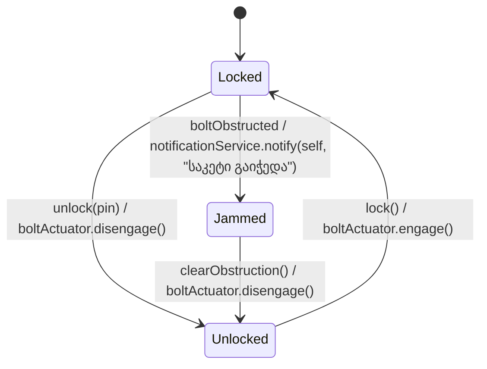
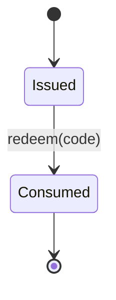

მდგომარეობის დიაგრამა არ გამოდგება ყველა ატრიბუტისთვის. ის იდეალურია მხოლოდ ისეთი ატრიბუტისთვის, რომელსაც აქვს ორი კონკრეტული თვისება:

- ატრიბუტს გააჩნია **მცირერიცხოვანი** შესაძლო მნიშვნელობები, და
- ამ მნიშვნელობებს შორის გადასვლაზე არსებობს **მნიშვნელოვანი შეზღუდვები**.

## ორი კონტრასტული მაგალითი

წარმოვიდგინოთ კლასი `DoorLock`. მას შეიძლება მივანიჭოთ სამი შესაძლო „საკეტის სტატუსი“: `Unlocked` (განბლოკილი), `Locked` (დაბლოკილი) და `Jammed` (გაჭედილი — ბოლტი ფიზიკურად ვერ გადაადგილდა). მნიშვნელობები ცოტაა, და გადასვლებზეც აშკარა შეზღუდვები არსებობს: მაგალითად, საკეტი ვერასდროს გადავა პირდაპირ `Unlocked`-დან `Jammed`-ში, თუ წინასწარ არ სცადა დაბლოკვა. ეს არის ზუსტად ის ორი თვისება, რაც `DoorLock`-ის სტატუსს მდგომარეობის დიაგრამისთვის იდეალურ კანდიდატად აქცევს.

შევადაროთ ეს, ვთქვათ, `Thermostat.currentTemperature`-ს. ამ ატრიბუტს პრაქტიკულად შეუზღუდავი რაოდენობის შესაძლო მნიშვნელობა აქვს — 18.0°, 18.1°, 18.05° და ასე შემდეგ, უსასრულოდ ხშირი წვრილმანებით. და პრაქტიკულად არც არსებობს რაიმე ბიზნეს-შეზღუდვა იმაზე, თუ რომელი მნიშვნელობიდან რომელ მნიშვნელობაზე შეიძლება „გადავიდეს“ ეს ატრიბუტი — ის უბრალოდ მიჰყვება ოთახის ფიზიკურ ტემპერატურას. ამიტომ `currentTemperature`, თავისი ნედლი სახით, **არ** გამოდგება პირდაპირ მდგომარეობის დიაგრამის საფუძვლად. (მოგვიანებით, [[თავი 6.5 უწყვეტად ცვლადი ატრიბუტები]]-ს განხილვისას, დავინახავთ, რომ ასეთი ატრიბუტიც შეიძლება „გამოსადეგი“ გახდეს, თუ მის მნიშვნელობებს დიაპაზონებად დავყოფთ — მაგრამ ეს უკვე სულ სხვა ისტორიაა.)

ინსტანციური ატრიბუტი, რომელსაც აქვს ეს ორი იდეალური თვისება და რომლის მნიშვნელობებიც ბუნებრივად ასახავს მისი მფლობელი ობიექტის რეალურ „მდგომარეობებს“, იწოდება **მდგომარეობის ატრიბუტად (state attribute)**. მდგომარეობის ატრიბუტი არის მექანიზმი, რომლის მეშვეობითაც ობიექტის მდგომარეობები საერთოდ წარმოდგება.

---

## საბაზისო ნოტაცია

მდგომარეობის დიაგრამაზე თითოეული მართკუთხედი წარმოადგენს მდგომარეობის ატრიბუტის ერთ კონკრეტულ მნიშვნელობას — ანუ ობიექტის ერთ მდგომარეობას. ისრები მართკუთხედებს შორის წარმოადგენენ **გადასვლებს (transitions)**.

თითოეულ გადასვლას თან ახლავს ორნაწილიანი წარწერა:

- ხაზის ზემოთ (ან, სტილისტურად, დახრილი ხაზის — `/` — წინ) იწერება **მოვლენა (event)**, რომელიც, როგორც წესი, გამოწვეულია ობიექტისკენ შემომავალი შეტყობინებით. სწორედ მოვლენა იწვევს გადასვლას ერთი მდგომარეობიდან მეორეში. თუ ხაზის ზემოთ რამდენიმე მოვლენაა ჩამოთვლილი, ეს ნიშნავს, რომ **ნებისმიერმა** მათგანმა შეიძლება დაუშვას გადასვლა.
- ხაზის ქვემოთ (ან დახრილი ხაზის შემდეგ) იწერება **მოქმედება (action)**, რომელიც გადასვლის დროს სრულდება — ჩვეულებრივ ეს არის ობიექტიდან გამავალი შეტყობინება. თუ რამდენიმე მოქმედებაა ჩამოთვლილი, ისინი **ყველა** სრულდება. ზოგ გადასვლას საერთოდ არ ახლავს მოქმედება.

`DoorLock`-ის მაგალითზე ეს ასე გამოიყურება:

### (1)

ობიექტი იქმნება პირდაპირ `Locked` მდგომარეობაში (ახალი, ქარხნულად დაყენებული საკეტი ივარაუდება დაბლოკილად). ეს გადასვლა საწყისი წერტილიდან, როგორც წესი, არ საჭიროებს წარწერას.

### (2)

`unlock(pin)` შეტყობინების მიღებისას (მოვლენა), ობიექტი გადადის `Unlocked`-ში და, ამასთანავე, აგზავნის მოქმედებას `boltActuator.disengage()` — ფიზიკურად ათავისუფლებს ბოლტს.

### (3)

`lock()` შეტყობინების მიღებისას ობიექტი ცდილობს დაბლოკვას და გადადის `Locked`-ში.

### (4)

თუ ბოლტის მექანიზმი აღმოაჩენს ფიზიკურ დაბრკოლებას (მოვლენა `boltObstructed`), საკეტი გადადის `Jammed`-ში და ატყობინებს `NotificationService`-ს პრობლემის შესახებ. `clearObstruction()` მოვლენა კი აბრუნებს მას `Unlocked`-ში.

(მოგვიანებით, [[თავი 6.4 გარდამავალი მდგომარეობები შეტყობინების შედეგებიდან]]-ში, დავინახავთ, რომ სინამდვილეში ეს დიაგრამა ცოტა უფრო დახვეწილ მოდელირებას საჭიროებს — მაგრამ ჯერჯერობით ეს გამარტივებული ვერსია საკმარისია საბაზისო ცნებების ასახსნელად.)

---

## საწყისი და საბოლოო მდგომარეობა

ზემოთ უკვე გამოვიყენეთ **საწყისი მდგომარეობა (initial state)** — შავი წერტილი, საიდანაც გამომავალი ისარი მიუთითებს იმ მდგომარეობაზე, რომელსაც ობიექტი პირველად იძენს შექმნის ან ინიციალიზაციის მომენტში. თავად საწყისი წერტილი არ არის „ნამდვილი“ მდგომარეობა — ობიექტი მასში დროს არ ატარებს, უბრალოდ მყისიერად გადადის თავის პირველ ნამდვილ მდგომარეობაში.

არსებობს ასევე **საბოლოო მდგომარეობა (final state)**, რომელიც აღინიშნება „ხარის თვალის“ სიმბოლოთი (წრეში ჩასმული შევსებული წრე) და წარმოადგენს ობიექტის აქტივობის დასრულებას. მაგალითად, წარმოვიდგინოთ, რომ `Administrator` სტუმრისთვის გასცემს დროებით, ერთჯერად წვდომის კოდს (`GuestAccessCode`), რომელიც გამოყენების შემდეგ საბოლოოდ უქმდება:

აქ `Consumed`-დან საბოლოო წერტილისკენ მიმავალი ისარი გვიჩვენებს, რომ ობიექტის (ან, უფრო ზუსტად, ამ კონკრეტული აქტივობის ციკლის) სასიცოცხლო ხაზი დასრულებულია. (როგორც [[თავი 6.2 ბუდობრივი მდგომარეობები]]-ში დავინახავთ, საბოლოო მდგომარეობის ზუსტი მნიშვნელობა კიდევ უფრო დაზუსტდება, როცა ის ბუდობრივი მდგომარეობის შიგნით გამოჩნდება — მაშინ ის აღნიშნავს არა მთლიანი ობიექტის, არამედ კონკრეტულად ამ ჩაბუდებული აქტივობის დასრულებას.)

---

## Mealy-ის და Moore-ის კონვენციები

ის, რაც აქამდე ვნახეთ — მოქმედებები, რომლებიც მიბმულია **გადასვლებზე** — UML-ში იწოდება **Mealy-ის კონვენციად**. თუმცა, UML ასევე უჭერს მხარს ალტერნატივას, სადაც მოქმედებები მიბმულია არა გადასვლებზე, არამედ პირდაპირ **მდგომარეობებზე** — ამას **Moore-ის კონვენცია** ეწოდება. ამ მიდგომის კონკრეტულ მაგალითს [[თავი 6.5 უწყვეტად ცვლადი ატრიბუტები]]-ში ვნახავთ, `Thermostat`-ის მაგალითზე. მნიშვნელოვანია ვიცოდეთ უკვე ახლა, რომ UML-ს ორივესთვის მოეძებნება ადგილი — და ერთსა და იმავე დიაგრამაზეც კი შეიძლება ორივე კონვენციის ერთდროულად გამოყენება.

შემდეგი [[თავი 6.2 ბუდობრივი მდგომარეობები]]
