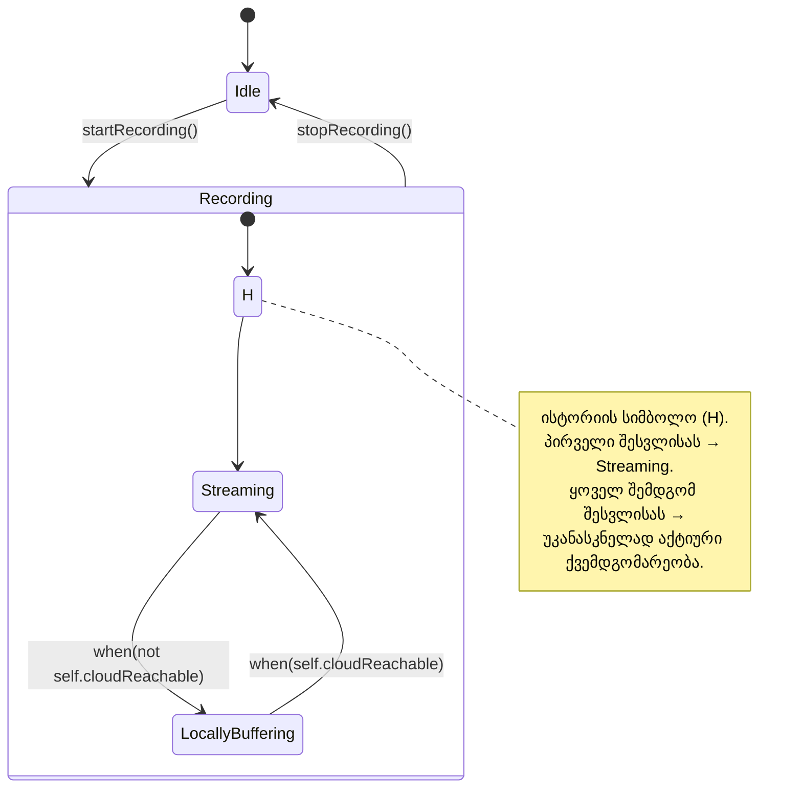

ყველა მდგომარეობის დიაგრამა ისეთი მარტივი არ არის, როგორიც წინა ნაწილში `DoorLock`-ისთვის დავხატეთ. ხანდახან ერთი მდგომარეობის შიგნით საჭირო ხდება საკუთარი, შიდა ქვედიაგრამის ჩაშენება — ანუ **ბუდობრივი მდგომარეობა (nested state)**.

## რატომ გვჭირდება ბუდობრივი მდგომარეობა

განვიხილოთ `SecurityCamera`. მას აქვს ორი, ერთმანეთთან დაკავშირებული ასპექტი:

1. ზოგადი აქტივობის სტატუსი — არის თუ არა კამერა საერთოდ ჩართული ჩაწერაზე. ეს განისაზღვრება უკვე ნაცნობი ოპერაციებით `startRecording()` და `stopRecording()`, და აქვს ორი მნიშვნელობა: `Idle` და `Recording`.
2. მაგრამ როცა კამერა უკვე **ჩაწერს**, აქტუალური ხდება მეორე, უფრო წვრილმანი კითხვა: აგზავნის თუ არა კამერა ცოცხალ ვიდეო ნაკადს `CloudSyncService`-ში (`Streaming`), თუ, ქსელის მიუწვდომლობის გამო, ინახავს ჩანაწერს ლოკალურად (`LocallyBuffering`).

აქ საინტერესო შეზღუდვაა: `Streaming`-სა და `LocallyBuffering`-ს აზრი აქვთ **მხოლოდ** მაშინ, როცა კამერა საერთოდ `Recording`-შია. როცა კამერა `Idle`-შია, კითხვას „მიდის თუ არა ცოცხალი ნაკადი ღრუბელში“ საერთოდ არ აქვს აზრი. სწორედ ასეთი შეზღუდვების არსებობისას ღირს ერთი მდგომარეობის დიაგრამის მეორეში **ჩაბუდება**: `Streaming` და `LocallyBuffering` ჩაბუდებულია `Recording`-ის შიგნით.

---

## ცვლილების მოვლენა და დაცვის პირობა

სანამ სრულ დიაგრამას დავხატავთ, დაგვჭირდება ორი ახალი ცნება.

**ცვლილების მოვლენა (change event)**, რომელიც იწერება `when(ბულეანური გამოსახულება)` სახით, ითვლება მომხდარად ზუსტად იმ წამს, როცა ფრჩხილებში მოცემული პირობა ცრუდან ჭეშმარიტში გადადის. მაგალითად, `when(not self.cloudReachable)` ხდება ზუსტად მაშინ, როცა კავშირი ღრუბელთან წყდება — და არა ნებისმიერ მომენტში, როცა კავშირი უბრალოდ არ არსებობს.

**დაცვის პირობა (guard)**, რომელიც იწერება კვადრატულ ფრჩხილებში მოვლენის შემდეგ — `[ბულეანური გამოსახულება]` — ნიშნავს, რომ გადასვლა შესრულდება მხოლოდ იმ შემთხვევაში, თუ ეს პირობა ჭეშმარიტია **სწორედ იმ მომენტში**, როცა მასთან დაკავშირებული მოვლენა ხდება. განსხვავებით ცვლილების მოვლენისგან, დაცვის პირობა თავისთავად გადასვლას არ იწვევს — ის მხოლოდ „ფილტრავს“ უკვე მომხდარ მოვლენას.

ახლა უკვე შეგვიძლია დავხვეწოთ [[თავი 6.1 ბაზისური მდგომარეობის დიაგრამები|წინა ნაწილში]] დანახული `DoorLock`-ის დიაგრამა: `unlock(pin)` სინამდვილეში უნდა ატარებდეს დაცვის პირობასაც — საკეტი განიბლოკება მხოლოდ სწორი კოდით:

```
Locked --> Unlocked : unlock(pin) [pin = self.authorizedPinHash] / boltActuator.disengage()
```

აქ ვხედავთ, რომ დაცვის პირობა შედგება როგორც ობიექტის ატრიბუტისგან (`self.authorizedPinHash`), ისე შემომავალი მოვლენის არგუმენტისგან (`pin`) — ორივე ერთად ქმნის ერთ ლოგიკურ გამოსახულებას.

---

## `SecurityCamera`-ს ბუდობრივი დიაგრამა



აქ ორი **საწყისი წერტილია**:

- გარეთა შავი წერტილი გვეუბნება, რომ ახლადშექმნილი `SecurityCamera` ობიექტი ავტომატურად იწყებს `Idle`-დან.
- შიდა საწყისი მარკერი (`H`, რომელზეც ცოტა ქვემოთ ვისაუბრებთ) გვეუბნება, თუ რომელი ქვემდგომარეობით უნდა დაიწყოს `Recording`, როცა ეს გარეთა მდგომარეობა ხელახლა შედის ძალაში.

ეს ორმაგი ჩაბუდება ზუსტად ასახავს ჩვენს შეზღუდვას: `Streaming`/`LocallyBuffering` არსებობს მხოლოდ `Recording`-ის „შიგნით“. მოგვიანებით, ცალკე თავში, ამ იდეას უფრო ფორმალურად დავუბრუნდებით, როცა ვისაუბრებთ კლასის მთელი შესაძლო მდგომარეობების სივრცეზე და მასზე დაწესებულ შეზღუდვებზე.

---

## ისტორიის სიმბოლო

წარმოვიდგინოთ სცენარი: კამერა იწერს `LocallyBuffering` რეჟიმში (ინტერნეტი დროებით მიუწვდომელია), შემდეგ მოძრაობა ოთახში წყდება და კამერა უბრუნდება `Idle`-ს. ცოტა ხანში ხელახლა ჩნდება მოძრაობა და კამერა ისევ გადადის `Recording`-ში.

კითხვა: რომელი ქვემდგომარეობით უნდა დაიწყოს ხელახლა — ყოველთვის `Streaming`-ით (თითქოს ესეც „საწყისი“ იყოს), თუ იმით, რაც წინა ჯერზე იყო აქტიური?

აშკარაა, რომ პირველი ვარიანტი — ყოველთვის თავიდან `Streaming`-ით დაწყება — არასწორია: თუ ინტერნეტი კვლავ მიუწვდომელია, კამერამ ისევ `LocallyBuffering`-ში უნდა „გაიხსენოს“ თავი, და არა თავიდან სცადოს ისეთი რამ, რაც ალბათ ისევ ჩავარდება. ზუსტად ამ საჭიროებისთვის იყენებს UML **ისტორიის სიმბოლოს** — პატარა წრეში ჩასმულ ასო `H`-ს (იდეა ეკუთვნის დევიდ ჰარელს).

ისტორიის სიმბოლოს მნიშვნელობა ასეთია: **ყოველ შემდგომ შესვლისას ჩაბუდებულ მდგომარეობაში, გადადი იმ ქვემდგომარეობაში, რომელიც ბოლოს იყო აქტიური.** თუ ისტორიის სიმბოლოს გამოდის კონკრეტული ისარი რომელიმე ქვემდგომარეობისკენ (ჩვენს შემთხვევაში — `Streaming`-ისკენ), ეს ისარი ცალკე მნიშვნელობას იძენს: ის აღნიშნავს, თუ რომელი ქვემდგომარეობით უნდა დაიწყოს ობიექტი **პირველი** შესვლისას, როცა ჯერ არავითარი „ისტორია“ არ არსებობს. ამრიგად, ისტორიის სიმბოლო შეიძლება მთლიანად ჩაანაცვლოს ჩვეულებრივ საწყისი მდგომარეობის მარკერს ქვედონეზე, როგორც ჩვენს დიაგრამაშიც მოხდა.

შემდეგი [[თავი 6.3 ერთდროული მდგომარეობები და სინქრონიზაცია]]
