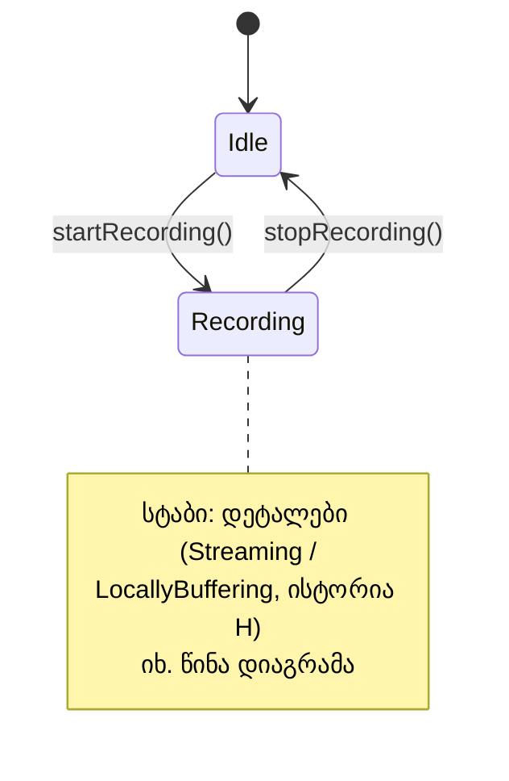
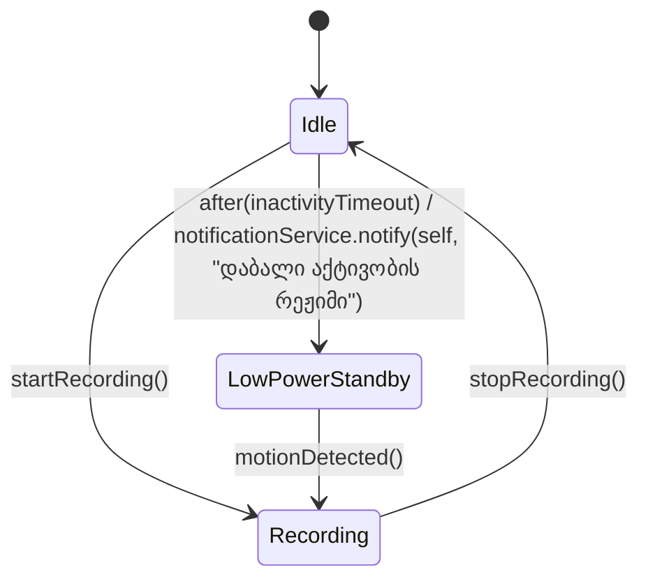
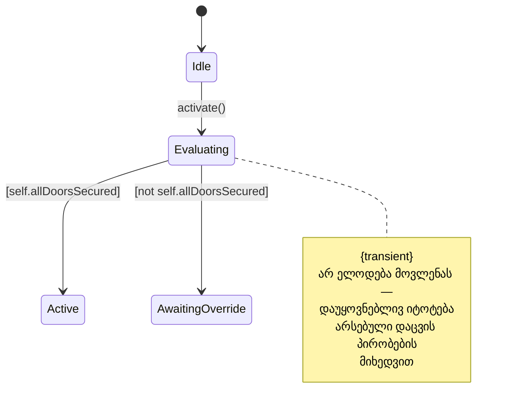
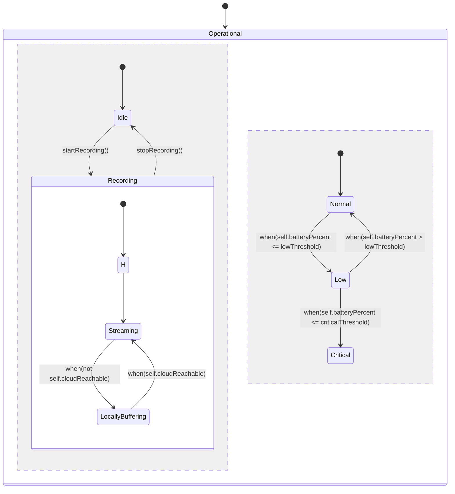
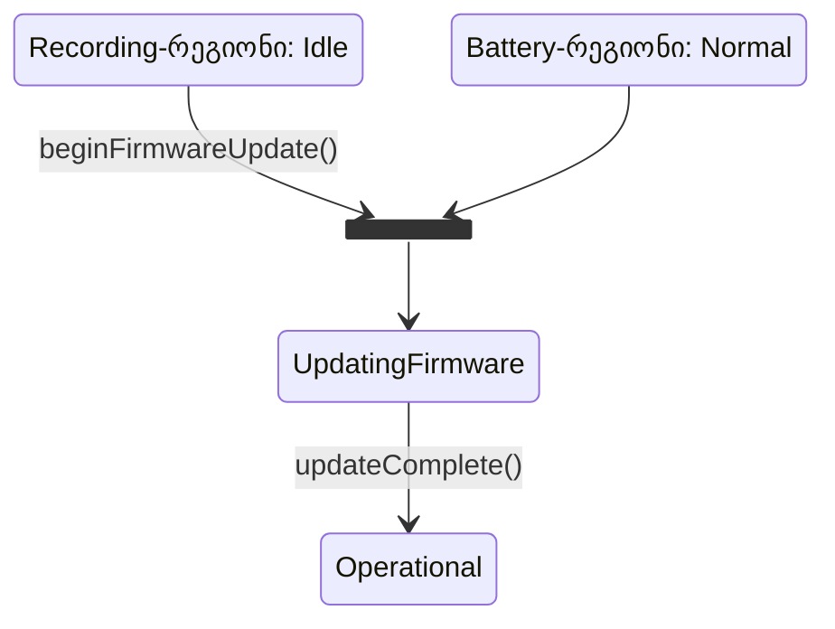

ეს ნაწილი აგრძელებს ბუდობრივი მდგომარეობების თემას და კიდევ ერთ ახალ იდეას მატებს — **ერთდროულ (concurrent) მდგომარეობებს**. გზადაგზა კიდევ ორ საკითხსაც შევეხებით: სტაბის ნოტაციას, დროის ამოწურვის მოვლენას და **გარდამავალი მდგომარეობის** ზოგად იდეას.

## სტაბი: დეტალების დამალვა

[[თავი 6.2 ბუდობრივი მდგომარეობები|წინა ნაწილში]] `Recording` მდგომარეობა სრულად, პირდაპირ დახატეთ თავისი შიდა ქვედიაგრამით. დიდ, ბევრმდგომარეობიან სისტემებში ეს სწრაფად გახდება არეული და გადატვირთული. ამის თავიდან ასაცილებლად, UML გვთავაზობს **სტაბს (stub)** — მცირე ხაზს მდგომარეობის მართკუთხედის შიგნით, რომელიც უბრალოდ გვამცნობს: „ამ მდგომარეობას აქვს ჩაბუდებული დეტალები, რომლებიც სრულად სხვაგან, ცალკე დიაგრამაზეა გაშლილი“ — თავად დეტალების გამეორების გარეშე.

ეს ორი დიაგრამა — ერთი სტაბით, ერთი მთლიანად გაშლილი — უბრალოდ ერთი და იმავე რეალობის ორი, ერთმანეთის ტოლფასი წარმოდგენაა. რომელი ვარიანტი აირჩევა, დამოკიდებულია მხოლოდ იმაზე, არეულია თუ არა საბოლოო დიაგრამა — თვით სემანტიკა არ იცვლება.

---

## დროის ამოწურვის მოვლენა

მდგომარეობის დიაგრამებზე მოვლენა ყოველთვის შემომავალი შეტყობინება არ არის. UML გვთავაზობს მესამე სახის მოვლენასაც — **დროის ამოწურვის მოვლენას (elapsed-time event)**, რომელიც იწერება `after(დროის_ინტერვალი)` სახით და ხდება ზუსტად მაშინ, როცა მითითებული დროის ინტერვალი გავიდა იმ მომენტიდან, რაც ობიექტი ამჟამინდელ მდგომარეობაში შევიდა.

მაგალითად, თუ `SecurityCamera` დიდხანს (`Idle`-ში) არავითარ მოძრაობას არ აღმოაჩენს, აზრი აქვს დაბალი ენერგომოხმარების რეჟიმზე გადასვლას:

---

## გარდამავალი მდგომარეობა: ზოგადი შემთხვევა

ხანდახან მდგომარეობას საერთოდ არ სჭირდება მოვლენის მოლოდინი — ის უბრალოდ „გამტარია“, ერთგვარი გზაჯვარედინი, სადაც ობიექტი დაუყოვნებლივ, არჩეულ დაცვის პირობათა მიხედვით, აგრძელებს გზას. ასეთ მდგომარეობას ეწოდება **გარდამავალი მდგომარეობა (transient state)**, ან **გამტარი მდგომარეობა (flow-through state)**; მასზე გამოსული, მოვლენის-გარეშე გადასვლას კი — **მოვლენის-გარეშე გადასვლა (triggerless transition)**.

წარმოვიდგინოთ `AutomationScene` სახელად `AwayMode`. როცა `HomeOwner` მას აქტივირებს, სცენას მაშინვე სურს გადაამოწმოს, მართლა მზადაა თუ არა სახლი უპატრონოდ დასატოვებლად:

`Evaluating`-ის ორივე გამავალი გადასვლა ატარებს **მხოლოდ** დაცვის პირობას, არავითარ მოვლენას — ეს სწორედ ის ნიშანია, რაც მდგომარეობას გარდამავალად აქცევს.

საინტერესო კითხვაა: რატომ არ გამოვიყენეთ `when(self.allDoorsSecured)` ცვლილების მოვლენა ამის ნაცვლად? პასუხი მნიშვნელოვან დეტალშია: ცვლილების მოვლენა ხდება მხოლოდ იმ ზუსტ წამს, როცა პირობა ცრუდან ჭეშმარიტში გადადის. მაგრამ თუ ყველა კარი უკვე დაბლოკილი იყო `Evaluating`-ში შესვლის მომენტისთვის, პირობა არასდროს „გადავა“ ცრუდან ჭეშმარიტში — ის უკვე ჭეშმარიტია შესვლისთანავე, ამიტომ `when` საერთოდ არასდროს გამოიწვევდა გადასვლას, და სცენა სამუდამოდ გაიყინებოდა `Evaluating`-ში. სწორედ ამიტომ გვჭირდება უბრალო, დაუყოვნებელი დაცვის-პირობიანი გატოტვა და არა ცვლილების მოვლენა.

---

## ერთდროული (concurrent) მდგომარეობები

ზოგჯერ ობიექტს საერთოდ ერთი მდგომარეობის ატრიბუტი არ ჰყოფნის. მას შეიძლება ჰქონდეს ორი (ან მეტი) სრულიად დამოუკიდებელი „ცხოვრების ხაზი“, რომლებიც ერთდროულად, პარალელურად ვითარდება. `SecurityCamera`-ს, ჩაწერის სტატუსის გარდა, ასევე აქვს ბატარეის დონე — და ეს ორი ასპექტი ერთმანეთზე საერთოდ არ არის დამოკიდებული: კამერას შეუძლია ერთდროულად იყოს, ვთქვათ, `Recording → Streaming` **და** `Battery → Low`.

UML-ში ასეთი დამოუკიდებელი, პარალელური „რეგიონები“ ერთმანეთისგან წყვეტილი ხაზით გამოიყოფა ერთი და იმავე კომპოზიტური მდგომარეობის შიგნით:

წყვეტილი ხაზი (`--`) ორად ყოფს `Operational`-ს: ზემოთ — ჩაწერის რეგიონი (თავად ბუდობრივი, `Recording`-ის შიდა დეტალებით), ქვემოთ — ბატარეის რეგიონი. ობიექტი, სანამ `Operational`-შია, ერთდროულად „ცხოვრობს“ **ორივე** რეგიონში ერთდროულად — ერთ მდგომარეობას ატარებს ჩაწერის რეგიონიდან და ერთს ბატარეის რეგიონიდან, ორივეს ერთდროულად და დამოუკიდებლად.

---

## სინქრონიზაციის ზოლი

მართალია, ეს ორი რეგიონი დამოუკიდებელია, მაგრამ ხანდახან საჭირო ხდება მათ შორის **შეხვედრის წერტილის** მოდელირება — მომენტი, როცა ორივე რეგიონმა უნდა მიაღწიოს კონკრეტულ მდგომარეობას, სანამ რაიმე საერთო გადასვლა შესრულდება. მაგალითად, firmware-ის განახლების დაწყება უსაფრთხოა მხოლოდ მაშინ, თუ კამერა ამჟამად არაფერს იწერს (`Recording`-რეგიონი — `Idle`-ში) **და** ბატარეა საკმარისადაა დამუხტული (`Battery`-რეგიონი — `Normal`-ში).

ამის აღსანიშნად UML იყენებს **სინქრონიზაციის ზოლს (synchronization bar)** — გამსხვილებულ ხაზს, რომელშიც ორივე რეგიონიდან შემომავალი ისარი გროვდება, და საიდანაც გამოდის ერთი, საერთო გადასვლა მხოლოდ მას შემდეგ, რაც **ორივე** შემომავალი პირობა შესრულდა:

ეს დიაგრამა ცალკე გამოკვეთილად გვიჩვენებს ზუსტად იმას, რაც წინა დიაგრამის ორივე რეგიონში ხდება: `beginFirmwareUpdate()` მოვლენა ერთდროულად „ეთხოვება“ ორივე რეგიონს, მაგრამ საერთო გადასვლა `UpdatingFirmware`-ში მხოლოდ მაშინ ხდება, როცა ორივე რეგიონი უკვე შესაბამის მდგომარეობაშია. სანამ თუნდაც ერთი პირობა არ დაკმაყოფილდა, ობიექტი ელოდება ზოლთან.

ღირს იმის აღნიშვნაც, რომ **ყველა** გამომსვლელ გადასვლას სინქრონიზაცია არ სჭირდება — მხოლოდ ისეთს, სადაც ჭეშმარიტად **ორივე** პირობა ერთდროულადაა საჭირო (ანუ „და“-ლოგიკა). თუ, ვთქვათ, გვინდოდა მოდელირება იმისა, რომ კამერა დაუყოვნებლივ გადავიდეს უსაფრთხო გამორთვის მდგომარეობაში, როგორც კი **ან** ბატარეა გახდება კრიტიკული, **ან** ჩაწერის მექანიზმი შეცდომას მოგვცემს — საკმარისი იქნებოდა ორი ცალკეული, ჩვეულებრივი ისარი, ორივე ერთსა და იმავე სამიზნეზე („ან“-ლოგიკა), არავითარი სინქრონიზაციის ზოლის გარეშე. სინქრონიზაციის ზოლი სპეციალურადაა განკუთვნილი მხოლოდ „და“-ტიპის რენდევუსთვის.

შემდეგი [[თავი 6.4 გარდამავალი მდგომარეობები შეტყობინების შედეგებიდან]]
