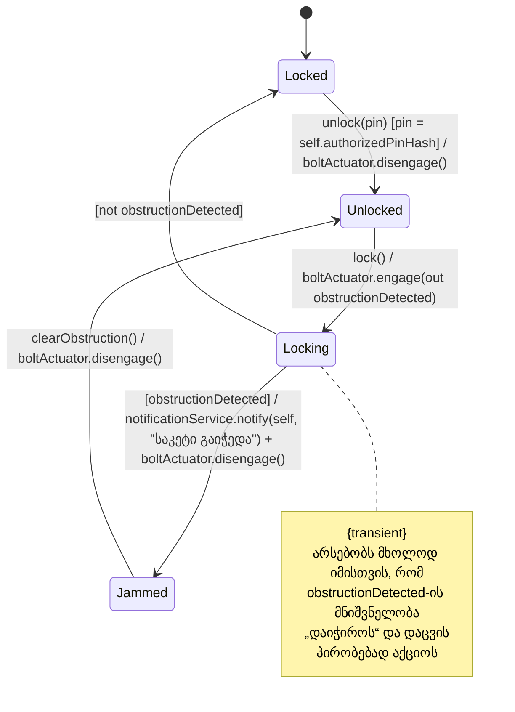

[[თავი 6.2 ბუდობრივი მდგომარეობები|ადრე]] ვნახეთ, რომ დაცვის პირობა (ან `when`-გამოსახულება) შეიძლება აშენდეს სამი სახის ელემენტისგან:

1. ობიექტის **ატრიბუტებისგან** (მაგალითად, `self.batteryPercent`);
2. შემომავალი შეტყობინების **არგუმენტებისგან** (მაგალითად, `unlock(pin)`-ის `pin`);
3. გამავალი შეტყობინების **დაბრუნებული არგუმენტებისგან**.

პირველი ორი ტიპი უკვე ვნახეთ — მაგალითად, `DoorLock`-ის დაცვის პირობა `[pin = self.authorizedPinHash]` ერთდროულად იყენებდა ორივეს. მაგრამ მესამე ტიპი, გამავალი შეტყობინების დაბრუნებული მნიშვნელობა, ჯერ არ განგვიხილავს — და სწორედ აქ იჩენს თავს ობიექტზე ორიენტირებული მოდელირების ერთ-ერთი დახვეწილი სირთულე.

## პრობლემა

დავუბრუნდეთ [[თავი 6.1 ბაზისური მდგომარეობის დიაგრამები|`DoorLock`-ის ბაზისურ დიაგრამას]]. იქ დავწერეთ, უბრალოდ:

```
Unlocked --> Locked : lock() / boltActuator.engage()
```

მაგრამ სინამდვილეში, ბოლტის ფიზიკური ჩართვა შეიძლება ვერ მოხერხდეს — ვთქვათ, კარის ჩარჩო ოდნავ გადაადგილებულია და ბოლტი ეჯახება რაღაცას. გვინდა, რომ ეს შემთხვევა ცალკე მდგომარეობაში აისახოს — `Jammed`-ში — და არა უბრალოდ დუმილში ჩაიფაროს. ანუ გვინდა დაცვის პირობებით გატოტვილი გადასვლა:

- თუ ბოლტი წარმატებით ჩაირთო → `Locked`;
- თუ აღმოჩნდა დაბრკოლება → `Jammed`.

მაგრამ სად უნდა მოვათავსოთ ეს დაცვის პირობები? ისინი დამოკიდებულია მნიშვნელობაზე (ვთქვათ, `obstructionDetected`), რომელიც **დაბრუნდება** მხოლოდ მას შემდეგ, რაც `DoorLock` თავად გაუგზავნის შეტყობინებას ბოლტის მამოძრავებელ მექანიზმს:

```
boltActuator.engage(out obstructionDetected)
```

აქ ჩნდება მოდელირების პრობლემა: დაცვის პირობა ლოგიკურად ფასდება მოვლენის დადგომის მომენტში (ანუ, `lock()`-ის მიღებისთანავე) — მაგრამ `obstructionDetected`-ის მნიშვნელობა ჯერ კიდევ არ არსებობს ამ მომენტში! ის გაჩნდება მხოლოდ მას შემდეგ, რაც `boltActuator.engage`-ის მოქმედება უკვე შესრულდება. სხვა სიტყვებით, ვერ ჩავსვამთ დაცვის პირობას ისეთი გადასვლის თავზე, რომლის **საკუთარმა მოქმედებამ** ჯერ არ იცის, რას დააბრუნებს.

## გამოსავალი: გარდამავალი მდგომარეობა

ზუსტად ამ სიტუაციისთვის გამოგვადგება [[თავი 6.3 ერთდროული მდგომარეობები და სინქრონიზაცია|წინა ნაწილში]] უკვე ნანახი **გარდამავალი მდგომარეობის** მექანიზმი — თუმცა ამჯერად ის საჭირო ხდება არა მოხერხებულობის, არამედ **აუცილებლობის** გამო: სხვანაირად ეს დაცვის პირობები საერთოდ ვერსად ჩავეტევა.

ვამატებთ შუალედურ, გარდამავალ მდგომარეობას — `Locking` — რომელშიც შედის `lock()`-ის მოქმედება, და საიდანაც ორი გზა გამოდის, თითოეული საკუთარი დაცვის პირობით:



### (1)

`Unlocked` მდგომარეობაში მყოფი `DoorLock` იღებს `lock()` შეტყობინებას. ის დაუყოვნებლივ გადადის `Locking`-ში, ხოლო ამ გადასვლის მოქმედების ფარგლებში აგზავნის გამავალ შეტყობინებას `boltActuator.engage(out obstructionDetected)`.

### (2)

`boltActuator` ცდილობს ბოლტის ფიზიკურად ჩართვას და აბრუნებს პასუხს `obstructionDetected`-ის სახით.

### (3)

ახლა, როცა `DoorLock` უკვე `Locking`-შია და უკვე იცის `obstructionDetected`-ის მნიშვნელობა, მისი ორივე გამომსვლელი გადასვლა შეუძლია გამოიყენოს ეს მნიშვნელობა უბრალო დაცვის პირობად — მოვლენის ხელახლა მოლოდინის გარეშე, ზუსტად ისე, როგორც წინა ნაწილში ვნახეთ ზოგადი გარდამავალი მდგომარეობებისთვის.

### (4)

თუ დაბრკოლება არ აღმოჩნდა, გადადის `Locked`-ში. თუ აღმოჩნდა, გადადის `Jammed`-ში, ატყობინებს `NotificationService`-ს და ხელახლა ათავისუფლებს ბოლტს, რათა კარი მთლიანად ღია დარჩეს დაბრკოლების მოსაცილებლად.

---

## რატომ არის ეს ობიექტზე-ორიენტირებული სირთულე

ტრადიციულ, არა-ობიექტზე-ორიენტირებულ მდგომარეობა-გადასვლის დიაგრამებში ეს პრობლემა უბრალოდ არ დგებოდა — იქ არ არსებობდა ცნება „გამავალი შეტყობინება, რომლის პასუხიც შემდეგ დაცვის პირობად გამოიყენება“. სწორედ ობიექტებს შორის შეტყობინებების გაცვლამ შემოიტანა ეს ახალი შესაძლებლობა (და მასთან ერთად — ეს ახალი სირთულეც). ამიტომ გარდამავალი მდგომარეობა აქ არ არის უბრალოდ სასურველი სტილისტური არჩევანი, როგორც წინა ნაწილის `AwayMode`-ის მაგალითში იყო — ის აქ **აუცილებელია**, რადგან სხვანაირად ამ დაცვის პირობების ჩასმისთვის საერთოდ ადგილი არ იარსებებდა დიაგრამაზე.

შემდეგი [[თავი 6.5 უწყვეტად ცვლადი ატრიბუტები]]
