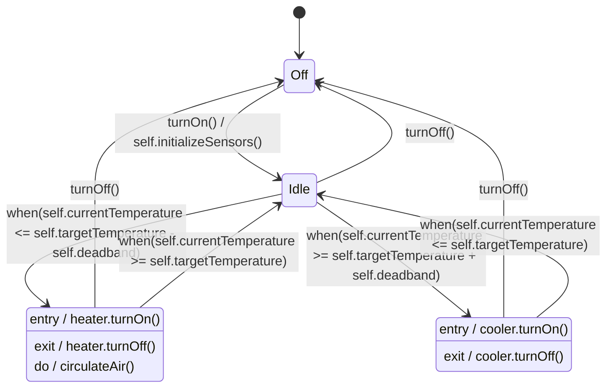

[[თავი 6.1 ბაზისური მდგომარეობის დიაგრამები|თავის დასაწყისში]] გამოვრიცხეთ `Thermostat.currentTemperature` მდგომარეობის დიაგრამის კანდიდატებიდან — ხომ ვთქვით, რომ მას პრაქტიკულად უსასრულო რაოდენობის შესაძლო მნიშვნელობა აქვს და თითქმის არავითარი შეზღუდვა არ ადევს იმაზე, თუ როგორ იცვლება ის დროში. ასეთ ატრიბუტს ეწოდება **უწყვეტად ცვლადი ატრიბუტი (continuously variable attribute)**: კონცეპტუალურად, ის ცვალებადობს არა დისკრეტულად, ცალკეული „ნახტომებით“, არამედ განუწყვეტლივ — ისევე, როგორც, მაგალითად, ოთახში ჰაერის წნევა ან, ჩვენს შემთხვევაში, ტემპერატურა.

მაგრამ არსებობს გზა, რომლითაც ასეთი ატრიბუტიც შეიძლება გახდეს მდგომარეობის დიაგრამის საფუძველი: საკმარისია მისი უწყვეტი დიაპაზონი დავყოთ რამდენიმე მნიშვნელოვან **ზოლად (band)**.

## ტემპერატურის ზოლები, როგორც მდგომარეობები

`Thermostat`-ს მივანიჭოთ ოთხი მდგომარეობა: `Off`, `Idle`, `Heating` და `Cooling`. თითოეული მათგანი შეესაბამება არა ერთ ზუსტ მნიშვნელობას, არამედ `currentTemperature`-ის დამოკიდებულებას `targetTemperature`-თან (გარკვეული ცდომილების ზოლის, `deadband`-ის, გათვალისწინებით):

```
< targetTemperature - deadband           // ცივა, გათბობა სჭირდება
targetTemperature ± deadband ფარგლებში   // ნორმალურია
> targetTemperature + deadband           // ცხელა, გაგრილება სჭირდება
```



შეამჩნევდით, რომ თითქმის ყველა გადასვლა აქ ცვლილების მოვლენით (`when`) არის გამოწვეული (გარდა `turnOn()`/`turnOff()`-ისა, რომლებიც ნამდვილი შემომავალი შეტყობინებებია) — და ეს სავსებით ბუნებრივია: უწყვეტად ცვლად ატრიბუტზე დაფუძნებული მდგომარეობის დიაგრამის ერთ-ერთი დამახასიათებელი ნიშანია სწორედ ამგვარი, ცვლილების მოვლენებით მჭიდროდ დატვირთული სურათი. ეს არ არის დიზაინის ხარვეზი — ეს უბრალოდ ასეთი ატრიბუტის ბუნებაა.

---

## Moore-ის კონვენცია მოქმედებაში

[[თავი 6.1 ბაზისური მდგომარეობის დიაგრამები|ადრე]] აღვნიშნეთ, რომ UML-ს, გადასვლებზე მიბმული მოქმედებების (**Mealy-ის კონვენცია**) გარდა, გააჩნია ალტერნატივაც — მოქმედებები, რომლებიც პირდაპირ **მდგომარეობებზეა** მიბმული (**Moore-ის კონვენცია**). ზემოთ მოცემულ დიაგრამაში `Heating` და `Cooling` სწორედ ამ კონვენციას იყენებენ, სამი შესაძლო საკვანძო სიტყვის მეშვეობით:

- **`entry`** — მოქმედება, რომელიც სრულდება ერთხელ, ზუსტად მდგომარეობაში შესვლის მომენტში (ატომური მოქმედება);
- **`exit`** — მოქმედება, რომელიც სრულდება ერთხელ, ზუსტად მდგომარეობიდან გამოსვლის მომენტში (ასევე ატომური);
- **`do`** — არა ერთჯერადი მოქმედება, არამედ **მიმდინარე აქტივობა**, რომელიც გრძელდება მთელი იმ დროის განმავლობაში, სანამ ობიექტი ამ მდგომარეობაშია.

ჩვენს დიაგრამაში, `Heating`-ში შესვლისთანავე ერთხელ ირთვება გამათბობელი (`entry / heater.turnOn()`), ხოლო გამოსვლისას ერთხელ ითიშება (`exit / heater.turnOff()`) — ეს ორი ატომური მოვლენაა. მაგრამ ჰაერის ცირკულაცია (`do / circulateAir()`) არ არის ერთჯერადი მოვლენა — ის მიმდინარეობს განუწყვეტლივ, სანამ თერმოსტატი საერთოდ `Heating`-შია.

საყურადღებოა ისიც, რომ `Off --> Idle` გადასვლას თან ახლავს Mealy-ის სტილის მოქმედება (`turnOn() / self.initializeSensors()`) — ანუ, ერთსა და იმავე დიაგრამაზე თავისუფლად თანაარსებობს ორივე კონვენცია. UML ამას არ კრძალავს; პირიქით, ორივეს ერთდროულად გამოყენება საკმაოდ ჩვეულებრივი პრაქტიკაა.

შემდეგი [[თავი 6.6 მდგომარეობის დიაგრამები შეჯამება]]
