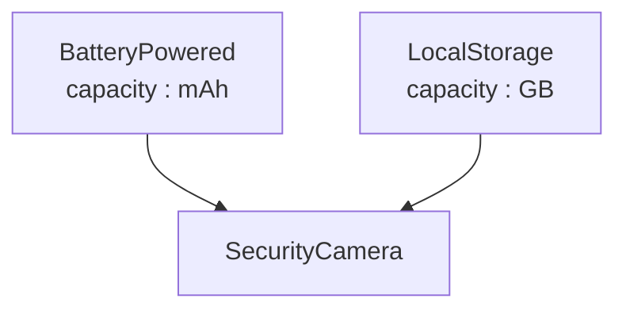

აქამდე კონასცენციას ვუთანაბრებდით „ერთგვარობას" ან „მსგავსებას": ორ ელემენტს კონასცენცია აქვთ სახელისა, თუ მათ ერთი და იგივე სახელი უნდა ერქვას. მაგრამ არსებობს კონასცენციის ერთგვარი საპირისპირო ვარიანტიც — შემთხვევები, როცა მნიშვნელოვანია სწორედ **განსხვავება**.

---

#### მარტივი მაგალითი

წარმოვიდგინოთ, რომ **HomeHub**-ის განრიგის დამმუშავებელ კოდში გვაქვს ორი ცვლადის გამოცხადება:

    var startTime: Time;
    var endTime: Time;

იმისთვის, რომ კოდი საერთოდ გამართულად იმუშაოს, ეს ორი სახელი — **startTime** და **endTime** — უნდა განსხვავდებოდეს ერთმანეთისგან. ეს ორი დეკლარაცია არ არის დამოუკიდებელი: თუ ვინმეს მოუნდება პირველი ცვლადის სახელის **endTime**-ზე შეცვლა, მეორეც უნდა გადაერქვას რაღაც სხვა სახელი, თორემ კონფლიქტი მოხდება. ეს არის **კონტრაკონასცენცია (contranascence)** — კონასცენციის ერთგვარი სახეობა, სადაც მოთხოვნილია არა თანხვედრა, არამედ სწორედ განსხვავება.

---

#### უფრო რეალისტური მაგალითი: მრავლობითი მემკვიდრეობა

კონტრაკონასცენცია განსაკუთრებით თვალშისაცემი ხდება მრავლობითი მემკვიდრეობის დროს. წარმოვიდგინოთ, რომ ჩვენს ბიბლიოთეკაში გვაქვს ორი ზოგადი, „შერევადი" კლასი:

- **BatteryPowered** — ატრიბუტით **capacity**, რომელიც ნიშნავს ბატარეის ტევადობას მილიამპერსაათებში (mAh).
- **LocalStorage** — ატრიბუტით **capacity**, რომელიც ნიშნავს ჩამწერი მედიის მოცულობას გიგაბაიტებში (GB).

ორივე კლასი გონივრულია დამოუკიდებლად. მაგრამ თუ **SecurityCamera**-ს გადავწყვეტთ განვახორციელოთ ორივესგან მემკვიდრეობით — ის ხომ მართლაც არის ბატარეით მომუშავე მოწყობილობა, რომელსაც ასევე აქვს ადგილობრივი მეხსიერების ბარათი ჩანაწერების შესანახად — მაშინვე გვექმნება პრობლემა: **SecurityCamera**-ს ახლა ორი, სახელით იდენტური, მაგრამ მნიშვნელობით სრულიად განსხვავებული ატრიბუტი აქვს.

*დიაგრამა: SecurityCamera მემკვიდრეობს ორივე კლასს, რომელთაგან თითოეულს აქვს ატრიბუტი capacity — მაგრამ სრულიად სხვადასხვა მნიშვნელობით.*

აქ არსებობს **კონტრაკონასცენცია სახელისა** — **BatteryPowered**-ისა და **LocalStorage**-ის მახასიათებლებს შორის. ამ ორი კლასის დამახასიათებლები (ატრიბუტები და ოპერაციები) არ უნდა ემთხვეოდეს სახელობრივად, თუ გვინდა, რომ ისინი ერთდროულად, უსაფრთხოდ იქნას გამოყენებული ერთი და იმავე ქვედა კლასის მიერ. ერთი გამოსავალი იქნებოდა, ერთ-ერთი (ან ორივე) ატრიბუტისთვის უფრო კონკრეტული სახელი შერჩეულიყო — მაგალითად, **batteryCapacity** და **storageCapacity**.

უფრო ფართოდ რომ ვთქვათ: მთელ კლას-ბიბლიოთეკაში, სადაც ნებისმიერ ორ კლასს პოტენციურად შეუძლია ერთი საერთო ქვეკლასი გაუჩნდეს, არსებობს ერთგვარი ფონური **კონტრაკონასცენცია სახელისა** — ყველა კლასის ყველა სახელი უნდა რჩებოდეს განსხვავებული, ნებისმიერი მომავალი კომბინაციისთვის. სწორედ ეს არის ერთ-ერთი მთავარი მიზეზი, რის გამოც მრავლობით მემკვიდრეობას ცუდი რეპუტაცია მოჰყვა, და რის გამოც ზოგიერთ ენას აქვს სპეციალური მექანიზმი (მაგალითად, მემკვიდრეობისას ატრიბუტის თუ ოპერაციის სახელის გადარქმევა) ასეთი კონფლიქტების მოსაგვარებლად.

---

#### დისნასცენცია — კონასცენციის არარსებობა

სანამ შემდეგზე გადავალთ, ღირს მოკლედ ვახსენოთ საპირისპირო უკიდურესობაც: თუ ორ ელემენტს ერთმანეთთან საერთოდ არაფერი აქვთ საერთო — არც სახელისა, არც ტიპის, არც არაფრის კონასცენცია — ასეთ წყვილს შეიძლება ეწოდოს **დისნასცენტური (disnascent)**. ეს, ფაქტობრივად, უბრალო დამოუკიდებლობის სხვა სახელია.

---

#### განსხვავება „საჭირო" და „შეგნებულად არჩეულ" კონასცენციას შორის

ღირს ერთი დაზუსტება: კონტრაკონასცენცია (განსხვავების საჭიროება) არ უნდა აგერიოს იმაში, თუ **რამდენად შეგნებულადაა** არჩეული ჩვეულებრივი კონასცენცია. მაგალითად, როცა **MobileApp**-ი და **CloudSyncService** ღიად და წინასწარ თანხმდებიან სქემაზე, რომლითაც განრიგის მონაცემებს ერთმანეთს უცვლიან — ვთქვათ, სტაბილურ, ვერსირებულ JSON-ფორმატს ობიექტისთვის **ScheduleSyncPayload** — ეს ტექნიკურად მაინც ჩვეულებრივი კონასცენციაა (კონვენციისა და ტიპისა), და არა კონტრაკონასცენცია: ორივე მხარეს ხომ ერთი და იგივეს ცოდნა სჭირდება, არა განსხვავებულის. მაგრამ განსხვავება ისაა, რომ ეს კონასცენცია **შეგნებულადაა შერჩეული და დოკუმენტირებული** — და, როგორც შემდეგ ვნახავთ, სწორედ ეს განსხვავება წყვეტს, იაფად სამართავია თუ არა ეს დამოკიდებულება მომავალში.

შემდეგი [[თავი 8.2.3 კონასცენცია და ინკაფსულაციის საზღვრები]]
