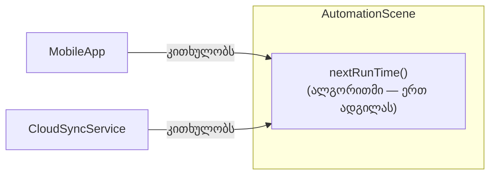

შეიძლება ითქვას, რომ კონასცენცია და კონტრაკონასცენცია დგას თანამედროვე პროგრამული ინჟინერიის კონსტრუქციების ცენტრში. ამის ასახსნელად, დავუბრუნდეთ [[თავი 8.1.1 ინკაფსულაციის დონეები|ინკაფსულაციის]] თემას და დავსვათ კითხვა, რომელსაც მანამდე პირდაპირ არ ვპასუხობდით: **რატომ** არის ინკაფსულაცია საერთოდ მნიშვნელოვანი?

---

პასუხი მარტივია: **ინკაფსულაცია არის კონასცენციის, განსაკუთრებით კონტრაკონასცენციის, შემკავებელი მექანიზმი**.

წარმოვიდგინოთ, რომ მთელი ჭკვიანი სახლის სისტემის ლოგიკა — ყველა მოწყობილობის მდგომარეობა, ყველა სცენარი, ყველა განრიგი — ერთ გიგანტურ, დაუყოფელ სკრიპტში იქნებოდა ჩაწერილი, ასობით ცვლადითა და ფუნქციით, ყოველგვარი კლასების ან პაკეტების გარეშე. ასეთ ვითარებაში **კონტრაკონასცენცია** ასობით ცვლადის სახელს შორის კოშმარად იქცეოდა: უბრალოდ ახალი ცვლადის სახელის შესარჩევადაც კი მოგიწევდა ათეულობით არსებული სახელის შემოწმება, კონფლიქტის თავიდან ასაცილებლად.

მეორე პრობლემა კი კოდის მატყუარა ბუნება იქნებოდა. წარმოიდგინე ორი ხაზი, რომლებიც ასეთ სკრიპტში ერთმანეთის გვერდით აღმოჩნდნენ. ეს იმიტომ ხდება, რომ ისინი **ნამდვილად** უნდა იყვნენ გვერდიგვერდ (მაგალითად, კონასცენცია შესრულებისა — `armSecurity()` უსათუოდ უსწრებს `lockAllDoors()`-ს), თუ უბრალოდ ასე „მოხდა", რომ სკრიპტის წერისას ერთმანეთის გვერდით აღმოჩნდნენ, არავითარი რეალური კავშირის გარეშე? ამ ორ შემთხვევას ტექსტში ვერაფრით გაარჩევ.

ასე რომ, სისტემას, რომელიც ინკაფსულირებულ ერთეულებად არ არის დაშლილი, ორი პრობლემა აქვს: მართვას გამოსხლტომილი კონასცენცია (განსაკუთრებით კონტრაკონასცენციის სახით), და დაბნეულობა იმაზე, რომელი მსგავსება რეალურია და რომელი — შემთხვევითი.

---

#### როგორ ათვინიერებს ინკაფსულაცია კონასცენციას

ეს ასევე ხსნის, რატომ „მუშაობს" ობიექტური ორიენტაცია: ის არ აქრობს კონასცენციას (ეს, ხშირად, საერთოდაც შეუძლებელია), არამედ **უჩენს მას სახლს**.

დავუბრუნდეთ ადრე ნახსენებ მაგალითს: **MobileApp**-ისა და **CloudSyncService**-ის მიერ დამოუკიდებლად გამოთვლილ „შემდეგი დაგეგმილი გაშვების დროს". თუ ეს გამოთვლის ალგორითმი მხოლოდ **დონე 1**-ის (ცალკეული ფუნქციების) სახით არსებობს, გაფანტული სისტემის სხვადასხვა ნაწილში, არაფერი გვაძლევს მინიშნებას, სად ზუსტად არის ის განხორციელებული, რამდენ ადგილას და რამდენად შორს ერთმანეთისგან. თუ ერთხელაც საჭირო გახდება ალგორითმის შესწორება (ვთქვათ, ზაფხულის დროზე გადასვლის გათვალისწინებით), ვინმემ ხელით უნდა მოძებნოს ყველა ეს ადგილი — დოკუმენტაციის იმედად, თუ საერთოდ არსებობს.

მაგრამ თუ ამის ნაცვლად, „შემდეგი გაშვების დროის" გამოთვლის ლოგიკას გადავიტანთ ერთ, კონკრეტულ კლასში — მაგალითად, თავად **AutomationScene**-ის ოპერაციად **nextRunTime()** — მაშინ კონასცენცია ალგორითმისა არსად არ ქრება (ის ხომ კვლავ არსებობს ყველა იმ ადგილს შორის, ვისაც ეს დრო სჭირდება), მაგრამ ის ახლა **გაკონტროლებულია**: ის ცხოვრობს ერთი, კარგად განსაზღვრული ერთეულის საზღვრებში. თუ დიზაინი კარგადაა გაკეთებული, არსად სხვაგან — არც **MobileApp**-ში, არც **CloudSyncService**-ში — აღარ იარსებებს დამოუკიდებელი ასლი ამ ალგორითმისა; ორივე უბრალოდ მიმართავს **AutomationScene**-ს კითხვით „როდისაა შემდეგი გაშვება?", და პასუხს იღებს ერთი, საერთო წყაროდან.

*დიაგრამა: ალგორითმის კონასცენცია არ გამქრალა, მაგრამ მოთავსდა ერთი კლასის საზღვრებში — ორივე მომხმარებელი ერთსა და იმავე წყაროს ეყრდნობა, ერთმანეთისგან დამოუკიდებლად აღარ იმეორებს ლოგიკას.*

---

ეს არის **დონე 2** ინკაფსულაციის (კლასის) ნამდვილი ღირებულება: ის კონასცენციას არ აქრობს, უბრალოდ აძლევს მას საზღვრებს — ერთ ადგილს, სადაც ის ცნობილი, გამოკვეთილი და მართვადია, იმის ნაცვლად, რომ თავისუფლად „დაცურავდეს" მთელ სისტემაში.

შემდეგი [[თავი 8.2.4 კონასცენცია და შენარჩუნებადობა]]
