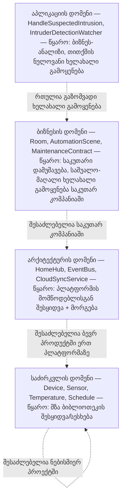

წინა ჩანაწერში ოთხი დომენი ჩამოვთვალეთ ისე, რომ საძირკვლის დომენი ბოლოს დავტოვეთ, ხოლო აპლიკაციის დომენი — თავში. ეს რიგი შემთხვევითი არ იყო: ის ზუსტად ასახავს, თუ რამდენად **ხელახლა გამოყენებადია (reusable)** თითოეული დომენის კლასი. საძირკვლის დომენს აქვს ყველაზე მაღალი ხელახალი გამოყენებადობა, აპლიკაციის დომენს — ყველაზე დაბალი.

ეს, ერთგვარად, თვითცხადია — ხომ ჩვენვე განვსაზღვრეთ საძირკვლის დომენი, როგორც „ის, რაც ყველგან გამოადგება“. მაგრამ ამ ფაქტს პრაქტიკული შედეგი აქვს: კითხვაზე „საიდან უნდა მოვიპოვო ეს კლასები?“ პასუხი დომენის მიხედვით რადიკალურად იცვლება.

---

### საიდან მოდის საძირკვლის დომენის კლასი

პასუხი მარტივია: **იყიდე ან ისესხე**. `Temperature`, `TimeRange`, `Schedule`, ან `Device`/`Sensor` აბსტრაქციების საკუთარი ხელით, ნულიდან აწყობა ძალიან ძვირი და დამღლელი საქმეა — მსგავს კლასებს ხშირად უკვე შეიცავს ენის სტანდარტული ბიბლიოთეკა ან ფართოდ გავრცელებული საერთო-დანიშნულების ბიბლიოთეკები. თუ ეს არ გყოფნით, დაამატეთ საკუთარი რამდენიმე კლასი — მაგრამ მანამდე ყოველთვის სცადეთ მზა გადაწყვეტის მოძიება.

### საიდან მოდის არქიტექტურის დომენის კლასი

აქაც წყარო მსგავსია — ისესხეთ, მაგრამ ოთხი დათქმით:

1. ხშირად მოგიწევთ `EventBus`-ის, `MessageQueue`-ის ან `CloudSyncService`-ის მსგავსი კლასების შეძენა კონკრეტულად იმ ღრუბლოვანი პლატფორმის ან კომუნიკაციის პროტოკოლის მომწოდებლისგან, რომელსაც იყენებთ.
2. თუ სხვადასხვა მომწოდებლის ბიბლიოთეკებს ერთმანეთში ურევთ, მოსალოდნელია არათავსებადობის თავსატეხები.
3. თქვენი არქიტექტურის ბიბლიოთეკის მომწოდებელმა შეიძლება სულ სხვა საძირკვლის ბიბლიოთეკაზე ააგოს საკუთარი კოდი, ვიდრე თქვენ იყენებთ.
4. ამის გამო, ნაყიდი არქიტექტურის ბიბლიოთეკა, ჩვეულებრივ, საძირკვლის ბიბლიოთეკაზე მეტ მორგებას და მოდიფიცირებას მოითხოვს.

### საიდან მოდის ბიზნესის დომენის კლასი

აი, აქ სურათი იცვლება. **Room**, **AutomationScene**, **DeviceInstallation** ან **MaintenanceContract** ბაზარზე ასე უბრალოდ ვერ იყიდება — ვერც ერთი გარე მომწოდებელი ვერ იცნობს თქვენი კონკრეტული ბიზნესის ყველა დეტალს ისე ღრმად, როგორც თქვენ თვითონ. ამასთან, თუნდაც ვინმემ სცადოს ასეთი ბიბლიოთეკის გაყიდვა, თითოეულ მყიდველს, დიდი ალბათობით, საკუთარი მორგება დასჭირდება — ორი კომპანია იშვიათად აწყობს `MaintenanceContract`-ის პირობებს ერთნაირად.

ამიტომ ბიზნესის დომენის კლასების უმეტესობის აშენება საკუთარ თავზეა დამოკიდებული. ეს ითხოვს სერიოზულ ანალიზს (მაგალითად, როლებისა და ურთიერთობების ფრთხილად შესწავლას), რადგან სწორედ ეს კლასები დროთა განმავლობაში იქცევა თქვენი კომპანიის საკუთარი, დაგროვილი ცოდნის საცავად — ისეთად, რომლის ხელახლა გამოყენებაც შემდეგ პროექტებში სერიოზულ კონკურენტულ უპირატესობას მოგცემთ, თუ კარგად არის დაპროექტებული, და პრაქტიკულად უსარგებლო აღმოჩნდება, თუ ცუდადაა.

### საიდან მოდის აპლიკაციის დომენის კლასი

ყველაზე მაღალი დომენისთვის ხელახალ გამოყენებადობაზე ფიქრი დროის კარგვაა — რაც არ უნდა ბრწყინვალედ დააპროექტოთ **IntruderDetectionWatcher** ან **HandleSuspectedIntrusion**, ორივე თითქმის დარწმუნებით მხოლოდ ამ ერთადერთ პროდუქტში დარჩება. ამ დომენის კლასების ძირითადი წყარო არის თავად ბიზნესის ანალიზის პროცესი — კონკრეტულად ის მოვლენები, რომლებსაც ანალიზისას აღმოაჩენთ.

ღირს აღინიშნოს ისიც, რომ ამ დომენში ტერმინი „კლასი“ ხშირად პირობითია: `HandleSuspectedIntrusion` შეიძლება საერთოდ არც კლასად დაპროექტდეს, არამედ უბრალო პროცედურად ან უკვე არსებული `Home` კლასის ერთ ოპერაციად.

---

## რეზიუმე დიაგრამის სახით

ერთი შეხედვით ეს არგუმენტი წრიულია — ხომ საძირკვლის დომენი სწორედ იმიტომ ისე განვსაზღვრეთ, რომ ის ყველგან გამოსადეგი ყოფილიყო. მაგრამ პრაქტიკული დასკვნა მაინც ღირებულია: რაც უფრო დაბალ დომენში დგას კლასი, მით უფრო ღირს მისი ყიდვა-სესხება და მით ნაკლებად ღირს მისი გამოგონება; რაც უფრო მაღლა ავდივართ, მით მეტად გვევალება, თავად ავაშენოთ ის საგულდაგულოდ და საკუთარი ცოდნით.

---

შემდეგი [[თავი 9.2 დატვირთვა (Encumbrance)]]
