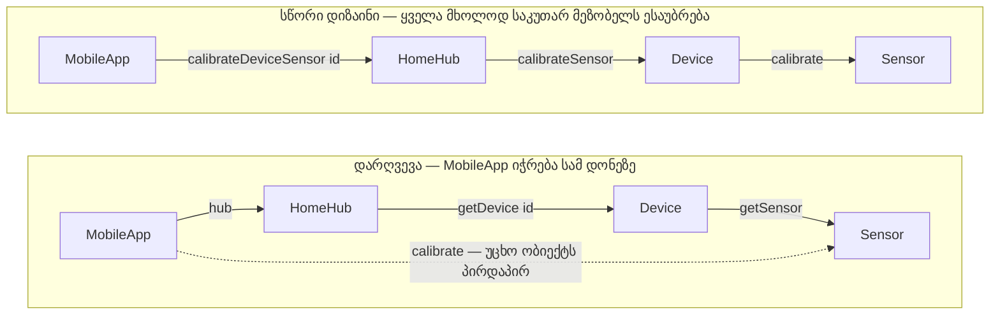

წინა ჩანაწერში დატვირთვა განვსაზღვრეთ, როგორც **შედეგის** საზომი — რამდენ კლასზეა დამოკიდებული მოცემული კლასი, საბოლოო ჯამში. მაგრამ როგორ ავირჩიოთ, კონკრეტულად რომელ კლასს მივმართოთ პირდაპირ, როცა ცალკეულ ოპერაციას ვწერთ? სწორედ ამაზე გვპასუხობს **დემეტრეს კანონი (Law of Demeter)** — პრინციპი, რომელიც ზღუდავს კლასის **პირდაპირ** დატვირთვას, უფრო ზუსტად კი — ზღუდავს, თუ ვის შეიძლება გაუგზავნოს შეტყობინება ერთი კონკრეტული ოპერაციის კოდმა.

---

### კანონის ფორმულირება

წარმოვიდგინოთ ობიექტი `obj`, კლასის **C** ინსტანცია, და მისი ერთ-ერთი ოპერაცია `op`. დემეტრეს კანონის თანახმად, `op`-ის იმპლემენტაციის შიგნით, ნებისმიერი შეტყობინების სამიზნე უნდა იყოს მხოლოდ ერთ-ერთი შემდეგთაგანი:

1. **obj თავად** — თავად ობიექტი, რომელსაც ეკუთვნის `op`.
2. **არგუმენტი** — ობიექტი, რომელიც `op`-ს პარამეტრად გადაეცა.
3. **obj-ის საკუთარი ცვლადი** — ობიექტი, რომელზეც `obj`-ის რომელიმე ველი (ან კოლექციის შემადგენელი, თუ ეს ველი კოლექციაა) მიუთითებს.
4. **op-ის მიერ ახლადშექმნილი ობიექტი** — ის, რაც სწორედ ამ ოპერაციამ `New`-ის მეშვეობით შექმნა.
5. **გლობალური ცვლადით მითითებული ობიექტი**.

სხვა სიტყვებით, `op`-ის კოდს შეუძლია ესაუბროს მხოლოდ „უახლოეს მეზობლებს“ — არა უცხო ობიექტებს, რომლებთანაც წვდომა მხოლოდ სხვისი შუამავლობით არის შესაძლებელი.

კანონს ორი ვერსია აქვს, რომლებიც მე-3 პუნქტს ცოტათი განსხვავებულად კითხულობენ: **ძლიერი დემეტრეს კანონი** ცვლადად მხოლოდ **C**-ში უშუალოდ განსაზღვრულ ცვლადს თვლის; **სუსტი დემეტრეს კანონი** კი ცვლადად ითვლის ასევე იმ ცვლადებსაც, რომლებსაც **C** ზემოკლასებისგან მემკვიდრეობით იღებს. ძლიერი ვერსია სასურველია, რადგან ის კიდევ უფრო მკაცრად ზღუდავს კლასის დამოკიდებულებას საკუთარი ზემოკლასების შიდა მოწყობაზე — რაც ორმაგად სასარგებლოა: ჯერ ერთი, ეს თავისუფლებას აძლევს ზემოკლასის დიზაინერს, თავისუფლად შეცვალოს მისი შიდა იმპლემენტაცია; მეორეც, აადვილებს ქვედა კლასის გაგებას, რადგან მკითხველი აღარ არის იძულებული, გაეცნოს ზემოკლასების შიდა დეტალებს მხოლოდ იმისთვის, რომ ერთი ოპერაცია გაიგოს.

---

### ცუდი მაგალითი: MobileApp იჭრება HomeHub-ის შიგნეულობაში

წარმოვიდგინოთ, რომ **MobileApp**-ს სჭირდება მოწყობილობის სენსორის კალიბრაცია. თუ `MobileApp`-ის ერთ-ერთ ოპერაციაში ასეთი კოდი დაიწერება:

	app.hub.getDevice(id).getSensor().calibrate();

ეს არის დემეტრეს კანონის კლასიკური დარღვევა. გავშალოთ ეს ჯაჭვი ნაბიჯ-ნაბიჯ:

- `app.hub` — ეს ჯერ კიდევ კანონიერია: `hub` არის `MobileApp`-ის საკუთარი ცვლადი (მე-3 პუნქტი).
- `.getDevice(id)` — აქედან მიღებული `Device`-ის ობიექტი **უცხოა** `MobileApp`-სთვის: ის არც `MobileApp`-ის არგუმენტია, არც მისი საკუთარი ცვლადი, არც მისი მიერ შექმნილი — ის უბრალოდ სესხდება `HomeHub`-ის შიდა მოწყობილობათა კრებულიდან.
- `.getSensor()` — აქ საქმე კიდევ უფრო უარესდება: `MobileApp` აღარ კმაყოფილდება `HomeHub`-ის შიგნეულობის სესხებით, ის ამ ნასესხებ `Device`-საც უღრმავდება და მისგანაც სესხულობს ობიექტს — `Sensor`-ს.
- `.calibrate()` — და ბოლოს, `MobileApp` შეტყობინებას უგზავნის ამ ორმაგად უცხო ობიექტს.

`MobileApp`-მა, პრაქტიკულად, უნდა იცოდეს, რომ `HomeHub`-ს შიგნით აქვს მოწყობილობათა კრებული, რომ თითოეულ `Device`-ს შიგნით აქვს `Sensor`, და რომ ამ `Sensor`-ს აქვს `calibrate()`. ეს არის ზუსტად ის, რასაც ვეძახით **დაბლოკვას (encumbering)**: `MobileApp` ახლა თან დაათრევს `HomeHub`-ის მთელ შიდა ობიექტთა გრაფს — თუ `HomeHub` ოდესმე გადაწყვეტს, `Sensor`-ი აღარ იყოს ცალკე ობიექტი, ან `Device`-ის შენახვის წესი შეცვალოს, `MobileApp`-იც გატყდება, თუმცა მას ამასთან, ერთი შეხედვით, არაფერი ესაქმებოდა.

---

### კარგი მაგალითი: HomeHub საკუთარ ოპერაციას სთავაზობს

გამოსავალი მარტივია: `HomeHub`-მა თავად უნდა შესთავაზოს ოპერაცია, რომელიც მთელ ამ სირთულეს საკუთარ თავში მალავს:

	hub.calibrateDeviceSensor(id);

ახლა `MobileApp`-ის მხრიდან ყველაფერი კანონიერია: ის მხოლოდ თავის საკუთარ ცვლადს (`hub`) მიმართავს და მას მხოლოდ ერთ შეტყობინებას უგზავნის. `MobileApp`-მა აღარც კი იცის, რომ `Device`-ს ან `Sensor`-ს საერთოდ აქვს ადგილი ამ ისტორიაში.

მაგრამ საინტერესოა, როგორ არის მოწყობილი `HomeHub.calibrateDeviceSensor(id)` თავად, რომ ისიც კანონს იცავდეს და უბრალოდ პრობლემა ერთი დონით ქვემოთ არ გადაწიოს:

	self.deviceRegistry.deviceWithId(id).calibrateSensor();

- `self.deviceRegistry` — კანონიერია: `deviceRegistry` არის `HomeHub`-ის საკუთარი ცვლადი.
- `.deviceWithId(id)` — მიღებული `Device` ესეც კანონიერი სამიზნეა, რადგან ეს არის ობიექტი, რომელიც **HomeHub-ის საკუთარი კოლექციის** (`deviceRegistry`-ის) შიგნით ცხოვრობს — ხოლო კანონის მე-3 პუნქტი ცალსახად უშვებს „ობიექტს, obj-ის მიერ მითითებულ კოლექციაში“.
- `.calibrateSensor()` — `HomeHub` ამ `Device`-ს უგზავნის ზუსტად ერთ შეტყობინებას და ჩერდება — აღარ იჭრება `Device`-ის შიგნით `Sensor`-ის საძებნელად.

დარჩენილია ერთადერთი კითხვა: სად ხდება ფაქტობრივი კალიბრაცია? პასუხი — თავად `Device`-ის შიგნით:

	// Device.calibrateSensor():
	self.sensor.calibrate();

აქაც ყველაფერი წესრიგშია: `sensor` არის თავად `Device`-ის საკუთარი ცვლადი, ამიტომ `Device`-ს სრული უფლება აქვს, პირდაპირ მიმართოს მას.

შედეგი: `MobileApp` ესაუბრება მხოლოდ `HomeHub`-ს, `HomeHub` — მხოლოდ თავის `DeviceRegistry`-სა და მისგან მიღებულ `Device`-ს, ხოლო `Device` — მხოლოდ თავის საკუთარ `Sensor`-ს. თითოეული რგოლი პასუხისმგებელია მხოლოდ საკუთარ უშუალო მეზობელზე, და მთლიანი პროცესი მაინც სრულდება — უბრალოდ, პასუხისმგებლობა სწორადაა განაწილებული, ერთი შორეული ობიექტის მაგივრად, რომელიც ყველა დანარჩენს „ხელს ჩაავლებდა“.

---

შემდეგი [[თავი 9.3 კლასის კოჰეზია (Class Cohesion)]]
