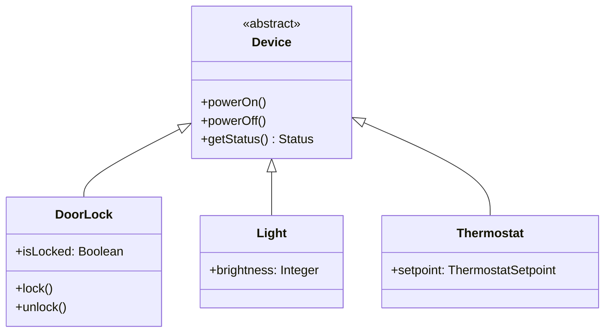

### განმარტება

კლასს აქვს **შერეული ინსტანციური კოჰეზია (mixed-instance cohesion)**, თუ მას გააჩნია ისეთი ატრიბუტი ან ოპერაცია, რომელიც უაზროა (undefined) ამ კლასის ზოგიერთი ინსტანციისთვის.

---

### დიაგნოზი: Device.unlock() და Device.lock()

წინა ჩანაწერში დანახული `Device` კლასის მაგალითს დავუბრუნდეთ:

	class Device:
	    powerOn();
	    powerOff();
	    getStatus(): Status;
	    unlock();
	    lock();
	    ...

დავუშვათ, გვაქვს ორი ცვლადი: `light1` (კლასის `Light` ინსტანცია) და `frontDoor` (კლასის `DoorLock` ინსტანცია). შემდეგი ორი შეტყობინებიდან მხოლოდ ერთს აქვს აზრი:

	frontDoor.unlock();     // აზრიანია
	light1.unlock();        // რას ნიშნავს ამას? ნათურის „განბლოკვა“?

`light1.unlock()`-ს არაფრის თქმა არ შეუძლია — `Light`-ს არასდროს ჰქონია „ჩაკეტილობის“ ცნება. შეგვეძლო, პასუხად, `unlock()` ყველგან, გარდა `DoorLock`-ისა, ცარიელ, არაფრის-გამკეთებელ ოპერაციად დაგვეტოვებინა, ან `Device`-ისთვის დაგვემატებინა ატრიბუტი `isLockable: Boolean` და `unlock()`-ის შიგნით ასეთი შემოწმება ჩაგვედო:

	unlock():
	    if not self.isLockable then raise Error("ეს მოწყობილობა არ იკეტება");
	    ...

ეს ამუშავდებოდა, მაგრამ ეს იქნებოდა უშნო დიზაინი — და, რაც მთავარია, **სიცრუე**: `light1`-ს არა აქვს `isLockable = false`, მას საერთოდ არა აქვს ლოგიკური აზრი ამ კითხვაზე. ნამდვილი პრობლემა კი ისაა, რომ `Device` ზედმეტად **უხეშად განზოგადებულია** ჩვენი აპლიკაციისთვის: ის ერთ გროვაში ურევს ისეთ მოწყობილობებს, რომლებსაც შეიძლება ჩაკეტვა-განბლოკვა, და ისეთებს, რომლებსაც ეს არასდროს შეეძლებათ.

---

### გამოსწორება

`unlock()` და `lock()` (და, სავარაუდოდ, ატრიბუტიც — `isLocked: Boolean`) უნდა გადავიდეს იქ, სადაც ისინი მართლა აზრს იძენენ — `DoorLock` ქვეკლასში, `Device`-ის ხარჯზე კი დარჩეს მხოლოდ ის, რაც ნამდვილად საერთოა ყველა მოწყობილობისთვის:

ახლა `frontDoor.unlock()` კვლავ აზრიანია (`DoorLock`-ს ეკუთვნის), ხოლო `light1.unlock()` საერთოდ ვეღარ დაიწერება — არც კომპილაციაზე, არც პროგრამის შესრულებისას, რადგან `Light`-ს ეს ოპერაცია საერთოდ არა აქვს. ეს ბევრად სუფთა შედეგია, ვიდრე ის, რომ ეს შეცდომა მხოლოდ გაშვების დროს, `if`-ის სახით გამოვაშკარაოთ.

---

### რატომ ჩნდება ეს პრობლემა

**შერეული ინსტანციური კოჰეზია, ჩვეულებრივ, არასწორად ან არასრულად დამუშავებული კლას-იერარქიის ნიშანია.** როცა ერთი კლასის ინსტანციები ორ (ან მეტ) აშკარად განსხვავებულ ჯგუფად იყოფა — ისეთად, სადაც ერთ ჯგუფს გარკვეული ქცევა სჭირდება, მეორეს კი ეს ქცევა საერთოდ არ ეხება — ეს არის სიგნალი, რომ საჭიროა ახალი, უფრო ვიწრო ქვეკლასების გამოყოფა. საპირისპირო გამოსავალი (ცარიელი ოპერაციები, დამატებითი `if`-ები, ცრუ ატრიბუტები) მხოლოდ ფარავს პრობლემას და კლასის კოდს ჭუჭყიანს ხდის, პრობლემას კი არ აქრობს.

---

შემდეგი [[თავი 9.3.2 შერეული დომენური კოჰეზია (Mixed-Domain Cohesion)]]
