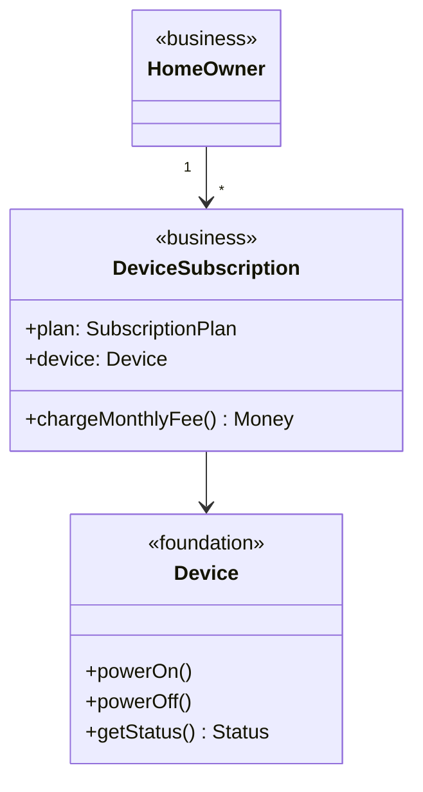

### განმარტება

კლასს აქვს **შერეული დომენური კოჰეზია (mixed-domain cohesion)**, თუ მისი რომელიმე ატრიბუტი ან ოპერაცია პირდაპირ ადატვირთავს (encumbers) კლასს **უცხო** კლასთან, რომელიც **სხვა დომენში** დგას.

აქ „უცხოს“ ცნება ზუსტად უნდა განვსაზღვროთ:

- კლასი **B** არის **გარეშე (extrinsic)** კლასისთვის **A**, თუ **A**-ს სრულად შეგვიძლია განვსაზღვროთ **B**-ის ცნების საერთოდ ხსენების გარეშე.
- **B** არის **შინაგანი (intrinsic)** **A**-სთვის, თუ **B** გამოხატავს **A**-ს ბუნებრივ, თანდაყოლილ მახასიათებელს.

მაგალითად, `Room` არის გარეშე `Sensor`-ისთვის — „რაღაც, რომელიც ზომავს გარემოს სიდიდეს“ სრულად აღიწერება ოთახის ცნების გარეშეც. ხოლო `Temperature` არის შინაგანი `TemperatureSensor`-ისთვის — ტემპერატურის სენსორის მთელი არსი სწორედ ტემპერატურის წაკითხვაშია.

---

### დიაგნოზი: Device.subscriptionPlan და Device.chargeMonthlyFee()

დავუბრუნდეთ ჩვენს „პაციენტს“:

	class Device:
	    powerOn();
	    powerOff();
	    getStatus(): Status;
	    subscriptionPlan: SubscriptionPlan;
	    chargeMonthlyFee(): Money;

`Device` მოვიაზრეთ, როგორც საძირკვლის დომენის კლასი — ისეთივე ზოგადი, როგორც წინა ჩანაწერებში ავხსენით: მისი აბსტრაქცია (რაღაც, რომლის ჩართვა/გამორთვაც შესაძლებელია და აქვს მდგომარეობა) ისეთივე კარგად ერგებოდა სამრეწველო რობოტსაც. მაგრამ `subscriptionPlan` და `chargeMonthlyFee()` სულ სხვა ისტორიიდან მოდის — მათ სჭირდებათ `SubscriptionPlan` და `Money`, ხოლო ეს ცნებები ბიზნესის დომენს (ან თუნდაც უფრო მაღალს) ეკუთვნის.

გამოვცადოთ დიაგნოსტიკური კითხვა: **შეიძლება თუ არა Device-ის სრულად აგება, სანამ საერთოდ არსებობს SubscriptionPlan-ის ცნება?** რასაკვირველია, დიახ — მილიონობით მოწყობილობა (სამრეწველო სენსორები, ავტომობილის ბორტკომპიუტერი) საერთოდ არასდროს იცნობს გამოწერას. მაშასადამე, `SubscriptionPlan` არის **გარეშე** `Device`-ისთვის, და მისი პირდაპირი ჩამატება `Device`-ში ქმნის **შერეულ დომენურ კოჰეზიას**: `Device`, რომელიც საძირკვლის დომენში უნდა ცხოვრობდეს, ახლა პირდაპირ ეთრევა ბიზნეს (ან კიდევ უფრო მაღალი) დომენის კლასის კუდში.

თუ `Device`-ის საჯარო ინტერფეისს ვხატავთ და მის თითოეულ წევრს იმის მიხედვით ვღებავთ, თუ რომელ დომენს ეკუთვნის სინამდვილეში, არევა თვალნათლივი ხდება:

<svg viewBox="0 0 460 300" xmlns="http://www.w3.org/2000/svg">
  <rect x="60" y="30" width="340" height="200" fill="none" stroke="currentColor" stroke-width="1.5"/>
  <text x="230" y="55" text-anchor="middle" font-size="13" fill="currentColor">Device</text>
  <line x1="60" y1="65" x2="400" y2="65" stroke="currentColor"/>

  <rect x="80" y="80" width="10" height="10" fill="#16A085"/>
  <text x="98" y="89" font-size="11" fill="currentColor">powerOn()</text>

  <rect x="80" y="100" width="10" height="10" fill="#16A085"/>
  <text x="98" y="109" font-size="11" fill="currentColor">powerOff()</text>

  <rect x="80" y="120" width="10" height="10" fill="#16A085"/>
  <text x="98" y="129" font-size="11" fill="currentColor">getStatus(): Status</text>

  <rect x="80" y="150" width="10" height="10" fill="#E67E22"/>
  <text x="98" y="159" font-size="11" fill="currentColor">subscriptionPlan: SubscriptionPlan</text>

  <rect x="80" y="170" width="10" height="10" fill="#E67E22"/>
  <text x="98" y="179" font-size="11" fill="currentColor">chargeMonthlyFee(): Money</text>

  <rect x="80" y="255" width="12" height="12" fill="#16A085"/>
  <text x="100" y="265" font-size="11" fill="currentColor">საძირკვლის დომენი (ბუნებრივი, intrinsic)</text>

  <rect x="80" y="275" width="12" height="12" fill="#E67E22"/>
  <text x="100" y="285" font-size="11" fill="currentColor">ბიზნესის დომენი (უცხო, extrinsic)</text>
</svg>

*დიაგრამა: შერეული დომენური კოჰეზია — Device-ის უმეტესობა (მწვანე) სუფთა საძირკვლის დომენს ეკუთვნის, მაგრამ ორი წევრი (ნარინჯისფერი) პირდაპირ შემოაქვს ბიზნესის დომენის ცნებები (SubscriptionPlan, Money) იმავე კლასში.*

---

### სად გაჩერდება ეს?

პრობლემა სწორედ იმაშია, რომ ამის დაშვების შემდეგ გაჩერების საზღვარი აღარსად ჩანს:

	class Device:
	    ...
	    subscriptionPlan: SubscriptionPlan;
	    chargeMonthlyFee(): Money;
	    warrantyContract: MaintenanceContract;
	    insurancePolicy: InsurancePolicy;
	    numOfHomesUsingThisModel: Integer;
	    ...შენი საკუთარი იდეა აქ...

თითოეული ეს დამატება ცალკე გამართლებულად ჟღერს („ხომ მოსახერხებელია, რომ მოწყობილობამ თავად იცოდეს, რომელ კონტრაქტს ეკუთვნის“), მაგრამ ყველა მათგანი აბლოკავს `Device`-ს კიდევ ერთ, სულ სხვა დომენის უცხო კლასთან. ეს არის ზუსტად ის მექანიზმი, რომელიც კლასს დროთა განმავლობაში „აბერებს“ და მის დატვირთვასაც უსაფუძვლოდ ზრდის.

---

### გამოსწორება

ბიზნეს-ლოგიკა უნდა გავიტანოთ `Device`-ის გარეთ, ცალკე, ბიზნესის დომენის კლასში — ვთქვათ, **DeviceSubscription**-ში, რომელიც უკავშირდება არა `Device`-ს პირდაპირ, არამედ, ვთქვათ, `HomeOwner`-ს ან `MaintenanceContract`-ს:

ახლა `Device` კვლავ სუფთა საძირკვლის დომენის კლასია — მისი აგება შესაძლებელია `SubscriptionPlan`-ის ცნების ხსენების გარეშეც. `DeviceSubscription` კი, პირიქით, თავისუფლად შეიცავს ბიზნეს-სპეციფიკურ დეტალებს, რადგან სწორედ ეს არის მისი დანიშნულება.

---

### ზოგადი წესი

მნიშვნელოვანია გავმიჯნოთ ორი სრულიად განსხვავებული სიტუაცია. **ჩვეულებრივია და ჯანსაღიც კი**, რომ კლასი დამოკიდებული იყოს **დაბალი** დომენის კლასებზე — სწორედ ეს არის ხელახალი გამოყენებადობის არსი (`AutomationScene`-ს, ბუნებრივია, სჭირდება `Temperature` და `Schedule`). **საშიშია** კი საპირისპირო: როცა დაბალი დომენის კლასი (`Device`) იწყებს იმ კლასების ჩართვას, რომლებიც მაღალი დომენიდან მოდის (`SubscriptionPlan`, `MaintenanceContract`). არქიტექტურის დომენის კლასი, რომელიც პირდაპირ შეიცავს ბიზნესის დომენის დეტალებს, ზუსტად ამავე შეცდომას იმეორებს — მაგალითად, `HomeHub`-ისთვის (არქიტექტურის დომენი) იქნებოდა ცუდი, ეცნო `HomeOwner`-ის ან `MaintenanceContract`-ის ცნებები, თუ ეს ჩვენი ბიზნესი არ იყოს კონკრეტულად ასეთი ინფრასტრუქტურის გაყიდვა.

---

შემდეგი [[თავი 9.3.3 შერეული როლური კოჰეზია (Mixed-Role Cohesion)]]
