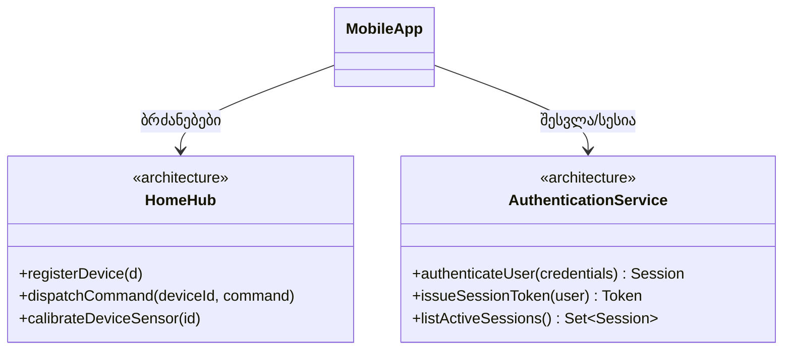

### განმარტება

კლასს **C** აქვს **შერეული როლური კოჰეზია (mixed-role cohesion)**, თუ მისი რომელიმე ატრიბუტი ან ოპერაცია პირდაპირ ადატვირთავს კლასს **C**-ის უცხო კლასთან, რომელიც **იმავე დომენში** დგას.

განსხვავება წინა ჩანაწერისგან ერთადერთია: აქ დომენების არევა აღარ გვაქვს — ორივე მხარე ერთსა და იმავე დომენს ეკუთვნის. პრობლემა კი ისაა, რომ ერთ კლასში ორი ცალკეული **როლი** ხვდება ერთად, სადაც „როლი“ ნიშნავს რეალურ სამყაროში მსგავს საგანთა ჯგუფის ერთგვარ აბსტრაქციას.

---

### დიაგნოზი: HomeHub როგორც კოორდინატორი და ავთენტიფიკაციის სერვისი

ჩვენი სცენარის `HomeHub`-ს, პროექტის მსვლელობისას, დაემატა ორი აშკარად განსხვავებული პასუხისმგებლობა:

	class HomeHub:
	    // მოწყობილობის კოორდინაცია
	    registerDevice(d: Device);
	    dispatchCommand(deviceId, command);
	    calibrateDeviceSensor(id);

	    // მომხმარებლის ავთენტიფიკაცია
	    authenticateUser(credentials): Session;
	    issueSessionToken(user): Token;
	    listActiveSessions(): Set<Session>;

პირველი ჯგუფი — მოწყობილობის რეგისტრაცია, ბრძანებების მარშრუტიზაცია, სენსორის კალიბრაცია — ეს არის **მოწყობილობის კოორდინატორის** როლი. მეორე ჯგუფი — მომხმარებლის ვინაობის დადასტურება, სესიის მართვა — ეს არის **ავთენტიფიკაციის სერვისის** როლი. ორივე მათგანი, რასაკვირველია, არქიტექტურის დომენს ეკუთვნის (ორივე ზოგადი, „ინფრასტრუქტურული“ პასუხისმგებლობაა, არა კონკრეტულად სახლის საქმიანობის ცნება) — ამიტომ აქ არ არის შერეული დომენური კოჰეზია. ასევე არ არის შერეული ინსტანციური კოჰეზია: ყოველ `HomeHub`-ის ინსტანციას რეალურად სჭირდება ორივე ჯგუფის ფუნქციონალი, არცერთი მათგანი არ არის „ზოგისთვის უაზრო“. და მაინც — `Device`-ის კოორდინაცია და მომხმარებლის ავთენტიფიკაცია ორი **სრულიად დამოუკიდებელი ცნებაა**, რომლებიც ერთმანეთს არაფრით არ საჭიროებენ. ერთი შეგვიძლია, მეორის ხსენების გარეშეც, სრულად აღვწეროთ — ეს კი ზუსტად ის ტესტია, რომელიც აჩვენებს, რომ საქმე გვაქვს ორ ცალკეულ როლთან, ერთ კლასში მოქცეულს.

ორივე როლი ერთსა და იმავე დომენშია, ამიტომ დომენის ნიშნით მათ ვერ გავარჩევთ — მაგრამ თუ `HomeHub`-ის წევრებს იმის მიხედვით ვღებავთ, თუ რომელ როლს ემსახურება თითოეული, არევა მაინც ცხადად ჩანს:

<svg viewBox="0 0 460 300" xmlns="http://www.w3.org/2000/svg">
  <rect x="60" y="30" width="340" height="200" fill="none" stroke="currentColor" stroke-width="1.5"/>
  <text x="230" y="55" text-anchor="middle" font-size="13" fill="currentColor">HomeHub</text>
  <line x1="60" y1="65" x2="400" y2="65" stroke="currentColor"/>

  <rect x="80" y="80" width="10" height="10" fill="#4A90D9"/>
  <text x="98" y="89" font-size="11" fill="currentColor">registerDevice(d)</text>

  <rect x="80" y="100" width="10" height="10" fill="#4A90D9"/>
  <text x="98" y="109" font-size="11" fill="currentColor">dispatchCommand(deviceId, command)</text>

  <rect x="80" y="120" width="10" height="10" fill="#4A90D9"/>
  <text x="98" y="129" font-size="11" fill="currentColor">calibrateDeviceSensor(id)</text>

  <rect x="80" y="150" width="10" height="10" fill="#E67E22"/>
  <text x="98" y="159" font-size="11" fill="currentColor">authenticateUser(credentials): Session</text>

  <rect x="80" y="170" width="10" height="10" fill="#E67E22"/>
  <text x="98" y="179" font-size="11" fill="currentColor">issueSessionToken(user): Token</text>

  <rect x="80" y="190" width="10" height="10" fill="#E67E22"/>
  <text x="98" y="199" font-size="11" fill="currentColor">listActiveSessions(): Set&lt;Session&gt;</text>

  <rect x="80" y="255" width="12" height="12" fill="#4A90D9"/>
  <text x="100" y="265" font-size="11" fill="currentColor">მოწყობილობის კოორდინატორის როლი</text>

  <rect x="80" y="275" width="12" height="12" fill="#E67E22"/>
  <text x="100" y="285" font-size="11" fill="currentColor">ავთენტიფიკაციის სერვისის როლი</text>
</svg>

*დიაგრამა: შერეული როლური კოჰეზია — HomeHub-ის ერთ ნაწილს (ლურჯი) მოწყობილობის კოორდინაციის როლი აქვს, მეორეს (ნარინჯისფერი) — ავთენტიფიკაციის სერვისის როლი. ორივე არქიტექტურის დომენშია, მაგრამ სრულიად დამოუკიდებელი ცნებებია — ერთი ჯგუფის აღწერისას მეორის ხსენებაც კი არ გვჭირდება.*

---

### რატომ არის ეს ცდუნება ასეთი ძლიერი

ღირს გავიაზროთ, რატომ ჩნდება ასეთი დიზაინი ასე ბუნებრივად:

- **მოსახერხებელია.** ერთი გამოძახება, `hub.authenticateUser(creds)`, გვერდიგვერდ დგას `hub.dispatchCommand(...)`-თან — არც კი გვჭირდება მეორე ობიექტის მოძიება.
- **ინტუიციურად ერთიანი „ჰაბის“ სურათი გვაცდუნებს.** ბევრს ბუნებრივად ჰგონია, რომ „ჰაბი“ ცნებით ისედაც მოიცავს იმას, ვინც სახლში შემოდის და ვინც არა — თითქოს ეს ერთი და იმავე პასუხისმგებლობის ორი მხარეა.
- **ანთროპომორფული ალღო გვატყუებს.** „ჰაბს ხომ უნდა შეეძლოს, თვითონვე გაარკვიოს, ვინც მას ესაუბრება“ — ჟღერს ბუნებრივად, თუმცა რეალურად ეს ორი დამოუკიდებელი პასუხისმგებლობის შერევის საბაბია და არა დიზაინის პრინციპი.

---

### გამოსწორება

ორი როლი ორ ცალკე კლასად უნდა გამოიყოს — `HomeHub` დარჩეს მხოლოდ მოწყობილობის კოორდინატორად, ხოლო ავთენტიფიკაციის პასუხისმგებლობა გადავიდეს ცალკე კლასში, ვთქვათ, **AuthenticationService**-ში:

ახლა `MobileApp`-ს შეუძლია, ცალ-ცალკე ესაუბროს ორივეს, საჭიროებისამებრ, ხოლო თითოეული კლასი დამოუკიდებლად ვითარდება, დამოუკიდებლად ტესტირდება და დამოუკიდებლად გამოიყენება — ვთქვათ, თუ ოდესმე მოგინდებათ `AuthenticationService`-ის გამოყენება სულ სხვა პროდუქტში (ან, პირიქით, `HomeHub`-ის მსგავსი მოწყობილობის-კოორდინატორის ლოგიკის გამოყენება უსახელო, ანგარიშების გარეშე მომუშავე სამრეწველო კარიბჭეზე), აღარაფერი გიშლით ხელს — ორივე კლასი დამოუკიდებელია მეორისგან.

---

### სად დგას ეს დანარჩენ ორთან შედარებით

სამივე „ცოდვიდან“ **შერეული როლური კოჰეზია ყველაზე მსუბუქია**: ის არც ცუდ კლას-იერარქიას მოწმობს (როგორც შერეული ინსტანციური), არც დომენების საშიშ არევას (როგორც შერეული დომენური) — უბრალოდ, ორ თემატურად უცხო რამეს კრებავს ერთად. მაგრამ თუ ხელახალი გამოყენებადობა თქვენთვის რეალურად მნიშვნელოვანია, ეს მაინც ღირს გამოსწორებად: `HomeHub`, რომელსაც თან მუდმივად მიათრევს ავთენტიფიკაციის მთელი მექანიზმი, ვერასდროს გამოყენდება იქ, სადაც ავთენტიფიკაცია საერთოდ არ არსებობს.

---

შემდეგი [[თავი 9.4 დომენების, დატვირთვისა და კოჰეზიის შეჯამება]]
