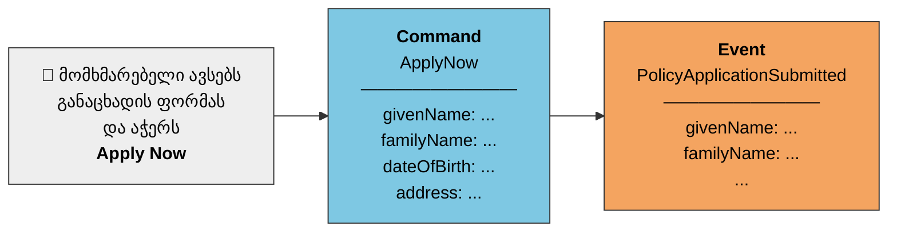
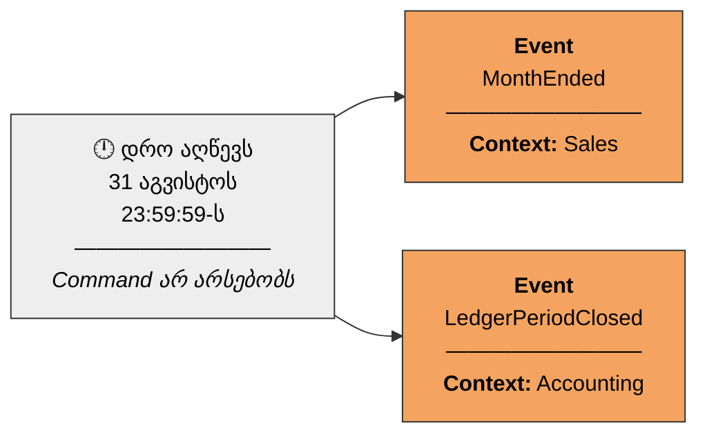

ადამიანების ყოველდღიური საქმიანობის დიდი ნაწილი, სინამდვილეში, არის რეაქცია ორ რამეზე  **Command**-ზე (ბრძანება) და **Event**-ზე (მოვლენა). ადამიანური აზროვნება ხშირად სწორედ ამ ორ კატეგორიაშია ჩამოყალიბებული: მოქმედების განზრახვა (Command) და ამ მოქმედების შედეგი (Event).

მაგალითად, როცა გვეუბნებიან „სამუშაო დღის ბოლომდე გადასცი მმართველ საბჭოს ხედვის დოკუმენტი"  ეს ფაქტობრივად Command-ია, თუნდაც ეს სიტყვასიტყვით ასე არ ჟღერდეს. ეს არის იმპერატივი, რომელიც მოქმედების შესრულებას მოითხოვს.

მეორე მხრივ, როცა ეს დოკუმენტი უკვე მზად არის და საბჭოს გადაეცემა, საბჭოს წევრები რეაგირებენ ფაქტზე, რომ დოკუმენტი უკვე ხელმისაწვდომია ეს არის Event („ხედვის დოკუმენტი გადაეცა საბჭოს"). საბჭოს თითოეულ წევრს შეიძლება ჰქონდეს სამი შესაძლო რეაქცია ამ Event-ზე:

- **მიღება** — წაიკითხოს დოკუმენტი და თავადვე „გასცეს" საკუთარ თავს ახალი Command-ები (მაგალითად, „მოვამზადო კომენტარები");
- **გადავადება** — მოგვიანებით დაუბრუნდეს ამ ფაქტს;
- **იგნორირება** — ჩათვალოს, რომ ვინმე სხვა უკეთ არის მომზადებული ამაზე საუბრისთვის.

ზუსტად იგივე ლოგიკა მუშაობს პროგრამულ სისტემებშიც.

**რატომ განვიხილავთ ჯერ Command-ს, თუ მიდგომას „Events-First" ჰქვია?** ეს ერთგვარი ქათმისა და კვერცხის დილემაა Event ხშირად Command-ის შედეგია, თუმცა ჯერ ორივე ტერმინის ზუსტი განმარტება გვჭირდება.

> [!NOTE] ტერმინების განმარტება
> **Command (ბრძანება)** — მონაცემთა ნაკრები, რომელსაც სახელად აქვს მინიჭებული აშკარა მოთხოვნა რაიმეს გასაკეთებლად. კლასიკური მაგალითია ძველი გრაფიკული ინტერფეისების **OK** და **Cancel** ღილაკები მათი დაწკაპება წარმოშობს კონკრეტულ Command-ს (დიალოგის დადასტურება ან გაუქმება), ხოლო ფანჯარაში შეყვანილი მონაცემები ამ Command-ის ნაწილი ხდება.
>
> **Event (მოვლენა)** — ჩანაწერი იმისა, რომ Command უკვე შესრულდა. ეს არის მონაცემთა ნაკრები, რომლის სახელიც წარსულში მომხდარ ფაქტს გამოხატავს (მოვლენის სახელი ყოველთვის წარსული დროის ზმნით ფორმდება). Event, როგორც წესი, გამოწვეულია Command-ით თუმცა, როგორც ქვემოთ ვნახავთ, ეს სავალდებულო წესი არ არის.

**მაგალითი — სადაზღვევო განაცხადი.** წარმოვიდგინოთ, რომ მომხმარებელი ავსებს ონლაინ სადაზღვევო განაცხადის ფორმას და აჭერს ღილაკს **Apply Now**. ეს დაწკაპება წარმოადგენს Command-ს მონაცემები იგზავნება სერვისზე, სერვისი ამოწმებს მათ სისრულესა და სისწორეს და, თუ ყველაფერი წესრიგშია, იწყებს პოლისის დამტკიცების პროცესს, ჩაწერს რა Event-ს სახელწოდებით **Policy Application Submitted** („განაცხადი წარდგენილია"), რომელიც Command-ის მონაცემების შესაბამის ნაწილს ინახავს.

**ნახაზი 3.1.** _წიგნის ორიგინალი ილუსტრაცია აჩვენებს, თუ როგორ იწვევს Apply Now ღილაკზე დაწკაპება (Command) Policy Application Submitted მოვლენას (Event) — მარტივი ისრით დაკავშირებული ორი ბლოკის სახით: მარცხნივ Command, მარჯვნივ — მისგან წარმოშობილი Event._

_ჩემი ორიგინალური სქემა, რომელიც იმავე იდეას გადმოსცემს ჩემი დიზაინით: ღია ლურჯი Command, ნარინჯისფერი Event (იგივე ფერთა კონვენცია, რასაც [[თავი 3.4 სესიების ფასილიტაცია]]-ში განვიხილავთ EventStorming-ის sticky note-ებისთვის)._

აქვე უნდა აღინიშნოს, რომ Command ყოველთვის ფორმულირებულია იმპერატივში („გააკეთე ეს ახლავე"), და ის შეიძლება უარყოფილიც იქნას — მაგალითად, თუ განაცხადი არასრული ან არასწორია. თუ Command წარმატებით სრულდება, ეს ფაქტი ფიქსირდება Event-ის სახით, რომელსაც სახელად ერთვის **არსებითი სახელი + წარსული დროის ზმნა** კომბინაცია (მაგ., Policy Application Submitted). წესის მიხედვით, Event ინახება მონაცემთა ბაზაში, რათა ეს ფაქტი მუდმივად იყოს დაცული და მომავალშიც ხელმისაწვდომი.

**Event ყოველთვის Command-ის შედეგი არ არის.** ზოგჯერ Event წარმოიშობა დროზე დაფუძნებულადაც, ყოველგვარი Command-ის გარეშე მაგალითად, საათი აღწევს 31 აგვისტოს 23:59:59-ს და თვე მთავრდება. ჩვენი მაგალითი-კომპანია NuCoverage-ისთვის ეს შეიძლება მნიშვნელოვანი ფაქტი იყოს, თუმცა შესაბამისი Event-ის სახელი დამოკიდებულია იმაზე, თუ რომელ **Context**-ში ვმსჯელობთ: გაყიდვების (Sales) კონტექსტში ეს შეიძლება ეწოდოს **Month Ended** („თვე დასრულდა"), ხოლო ბუღალტრული აღრიცხვის (Accounting) კონტექსტში **Ledger Period Closed** („საბუღალტრო პერიოდი დაიხურა").

**ნახაზი 3.2.** _ორიგინალი ილუსტრირებს, თუ როგორ შეიძლება ერთი და იმავე თარიღი-დროის ცვლილებამ (თვის ბოლო) სხვადასხვა Context-ში სხვადასხვა სახელის Event წარმოშვას ისრები კალენდრიდან ორივე მოვლენისკენ მიემართება, Command-ის გარეშე._

_ჩემი ორიგინალური სქემა: ერთი და იგივე დროზე დაფუძნებული ფაქტი ორ სხვადასხვა Context-ში ორ სხვადასხვა სახელწოდების Event-ს წარმოშობს არც ერთ მათგანს Command არ უძღვის წინ._

ეს მაგალითი ცხადყოფს მე-2 თავში უკვე განხილულ იდეას: სახელების არჩევისას აუცილებელია კომუნიკაციის **Context**-ის პატივისცემა. მე-2 თავი ფოკუსირებული იყო Claims, Underwriting და Insurance Products კონტექსტებზე; ეს თავი კი მათ ამატებს ორ ახალს — Sales (გაყიდვები) და Accounting (ბუღალტერია), თითოეული ცალკე მოდულში განთავსებული. ეს კარგად აჩვენებს, რომ ერთი ბიზნესის ფარგლებში შეიძლება არსებობდეს ბევრი განსხვავებული Context, და ეფექტური კომუნიკაციისთვის აუცილებელია, გუნდის წევრებმა მკაფიოდ იცოდნენ, რომელ Context-ში მსჯელობენ დიზაინის განხილვისას.

---
### Software Model-ების გამოყენება

ზემოთ მოყვანილი მაგალითები, სინამდვილეში, **Software Model**-ის (პროგრამული მოდელი) გამოხატულებებია. მოდელირება ბიზნესის სირთულის გააზრების მთავარი გზაა — შექმნილი მოდელები ბიზნესის ყოველდღიურ პროცედურებსა და პროცესებს პროგრამულ კომპონენტებთან აკავშირებს. მოდელის ელემენტების სახელები აზრს იძენენ მაშინ, როცა ისინი შემთხვევით კი არა, არამედ გუნდის კომუნიკაციის კონტექსტთან ჰარმონიაში, გააზრებულადაა შერჩეული.

წიგნის დანარჩენი ნაწილი მნიშვნელოვნად ეყრდნობა Software Model-ირებას, როგორც პრაქტიკას, რომელიც ღრმა სწავლებამდე და გარღვევით ინოვაციამდე მიგვიყვანს. Event-ები დგას იმ ინსტრუმენტის ცენტრში, რომელსაც გუნდები კონსტრუქციული და სწრაფი სწავლებისთვის იყენებენ — თუმცა Command-ებიც და მოდელირების სხვა კონცეფციებიც მნიშვნელოვან როლს თამაშობენ ამ პროცესში, რასაც მომდევნო სექციაში დეტალურად ვნახავთ.

---

წინა [[თავი 3.1 მოვლენებზე ორიენტირებული ექსპერიმენტები და აღმოჩენები]]
შემდეგი [[თავი 3.3 სწრაფი სწავლა EventStorming-ით]]
