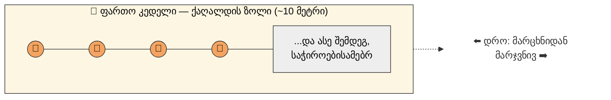

ეს სექცია აღწერს, თუ როგორ მიმდინარეობს EventStorming სესია **პირისპირ (in-person)** ფორმატში თუმცა ზემოთ განხილული რჩევების გათვალისწინებით, იგივე პრინციპები, რამდენადაც შესაძლებელია, გამოსადეგია დისტანციური ფასილიტაციისთვისაც. ჯერ განვიხილავთ ფიზიკურ ინსტრუმენტებს, შემდეგ კი  თავად ადამიანების როლს პროცესში.

### მოდელირების ზედაპირი

EventStorming-ს სჭირდება პრაქტიკულად შეუზღუდავი მოდელირების ზედაპირი — ეს მიიღწევა ქაღალდის გრძელი ზოლის მიმაგრებით ფართო კედელზე, დაახლოებით 10 მეტრის სიგრძეზე. ეს, რა თქმა უნდა, ნამდვილად უსასრულო არაა, მაგრამ უმეტეს შემთხვევაში სავსებით საკმარისია. თუ არასაკმარისი აღმოჩნდა, გუნდმა უნდა მოძებნოს უფრო ფართო კედელი ან განაგრძოს მომდევნო კედელზე. შესაფერისი ქაღალდის რულონები (მაგალითად, სამშენებლო ან სარეკლამო დანიშნულების ფართო ქაღალდი) ხშირად ადვილად საშოვნია სპეციალიზებულ მაღაზიებში.

**ნახაზი 3.4.** _ორიგინალში ნაჩვენებია ადამიანების ჯგუფი, რომლებიც დგანან გრძელი, კედელზე მიმაგრებული ქაღალდის ზოლის წინ — ეს არის EventStorming-ის კლასიკური „scene": ფართო, ცარიელი ზედაპირი, მზად წებოვანი ქაღალდებით ასავსებად._

_ჩემი ორიგინალური სქემა: მთავარი პრინციპი კი არა კონკრეტული ფოტო, არამედ თავად იდეაა მნიშვნელოვანი — ერთი გრძელი, პრაქტიკულად „უსასრულო" ზედაპირი, რომელზეც Event-ები (ნარინჯისფერი წრეები) დროის მიხედვით, მარცხნიდან მარჯვნივ ილაგება, ისე რომ საჭიროებისამებრ ყოველთვის შესაძლებელია გაგრძელება._

### მარკერები

მონაწილეებმა ხელით უნდა დაწერონ, ამიტომ საჭიროა კარგი მარკერების არსებობა  კონკრეტულად, საშუალო სისქის, მუდმივი მელნის მარკერები (არა ულტრათხელი წვერით). ეს არ არის შემთხვევითი დეტალი: თუ ხელით წერენ ფანქრით, ბურთულა ან ძალიან წვრილწვერიანი კალმით, ხელნაწერი მცირე მანძილიდანაც კი ძნელად იკითხება; თუ კი ძალიან სქელი მარკერია, მელანი „იშლება" და ტექსტი კვლავ გაუგებარი ხდება. საჭიროა ზუსტად „საშუალო" — არც ძალიან თხელი და არც ძალიან სქელი — ვარიანტი, რომელიც საკმარისად მკაფიოდ იკითხება მოშორებითაც.

**ნახაზი 3.5.** _წიგნის ორიგინალი ფოტოზე ნაჩვენებია სწორედ ასეთი, ფართო წვერის მუდმივი მარკერი — ავტორები ხუმრობით აღნიშნავენ, რომ „სწორი" მარკერი ყველას ჭკვიანს ხდის._

<svg viewBox="0 0 700 220" xmlns="http://www.w3.org/2000/svg" style="max-width:100%; height:auto; font-family: sans-serif;">
  <rect x="0" y="0" width="700" height="220" fill="#ffffff"/>
  <!-- too thin -->
  <g>
    <rect x="30" y="20" width="180" height="120" fill="#fff" stroke="#ccc"/>
    <text x="120" y="60" font-size="10" fill="#999" text-anchor="middle" font-family="cursive">EventStorming</text>
    <text x="120" y="150" font-size="13" text-anchor="middle" fill="#c62828">❌ ულტრათხელი — არ იკითხება</text>
  </g>
  <!-- too thick -->
  <g>
    <rect x="260" y="20" width="180" height="120" fill="#fff" stroke="#ccc"/>
    <text x="350" y="65" font-size="22" fill="#333" text-anchor="middle" font-family="cursive" style="filter:blur(1.2px)">EventStorm</text>
    <text x="350" y="150" font-size="13" text-anchor="middle" fill="#c62828">❌ ზედმეტად სქელი — მელანი იშლება</text>
  </g>
  <!-- just right -->
  <g>
    <rect x="490" y="20" width="180" height="120" fill="#fff" stroke="#333" stroke-width="2"/>
    <text x="580" y="65" font-size="16" fill="#111" text-anchor="middle" font-family="cursive">EventStorming</text>
    <text x="580" y="150" font-size="13" text-anchor="middle" fill="#2E7D32">✔ საშუალო — მკაფიოდ იკითხება</text>
  </g>
  <text x="350" y="200" font-size="14" text-anchor="middle" fill="#666">ჩემი ორიგინალური საილუსტრაციო შედარება — არა წიგნის ფოტოს ასლი</text>
</svg>

### წებოვანი ქაღალდები (Sticky Notes)

სესიაზე გამოიყენება დიდი რაოდენობით სხვადასხვა ფერის წებოვანი ქაღალდი თითოეული ფერი განსხვავებულ კონცეფციას წარმოადგენს მოდელირების კონკრეტული პერსპექტივის ფარგლებში. თუმცა მნიშვნელოვანია, სესია არ იქცეს ზედმეტად ფორმალურ „მეცნიერებად" — თავად ბიზნესი უკვე საკმარისად რთულია იმისთვის, რომ მოდელირების პროცესსაც დამატებითი სირთულე დავამატოთ. მთავარია ღია კომუნიკაციის სტიმულირება, რომელიც აღმოჩენებზე დაფუძნებულ სწავლებამდე მიგვიყვანს. ახალბედების გამუდმებული „გასწორება" იმ მიზნით, რომ „იდეალურად სწორი" მოდელი მივიღოთ, პირიქით, საზიანოა — ეს განაშორებს კრიტიკულად მნიშვნელოვან ადამიანებს პროცესს. თუ ყველა ერთმანეთს ესმის და ღრმა სწავლებაში წვლილი შეაქვს — ეს უკვე წარმატებაა.

მოდელის ელემენტების ფერები და ტიპები შემდეგნაირად არის განაწილებული:

| ფერი | ელემენტის ტიპი | მნიშვნელობა |
|---|---|---|
| ღია ლურჯი | **Command** (ბრძანება) | იმპერატივი, აშკარა მოთხოვნა რაიმეს გასაკეთებლად — ჩვეულებრივ, მომხმარებლის მოქმედების შედეგი. |
| ნარინჯისფერი | **Event** (მოვლენა) | ფაქტი იმისა, რომ მოცემულ Context-ში მნიშვნელოვანი რამ მოხდა — ხშირად Command-ის წარმატებული შესრულების შედეგი. სახელი — არსებითი სახელი + წარსული დროის ზმნა (მაგ., Policy Application Submitted). ეს არის EventStorming-ის „მთავარი გმირი" — თავდაპირველად სწორედ Event-ების უმეტესობა უნდა იყოს განთავსებული ზედაპირზე. |
| იასამნისფერი | **Policy** (პოლიტიკა/წესი) | სახელდებული ბიზნეს წესი ან წესების ერთობლიობა, რომელიც განსაზღვრავს, Event-ის დადგომის შემდეგ როგორ მოქმედებს სისტემა შემდგომ. |
| ღია ყვითელი | **Aggregate/Entity** | ადგილი, სადაც ინახება მონაცემები, სადაც Command-ები გამოიყენება და საიდანაც Event-ები „გამოდის". ეს არის მოდელის „არსებითი სახელები" — მაგ., Application, Risk, Policy, Claim, Coverage. |
| მკვეთრი ყვითელი | **User Role** (მომხმარებლის როლი) | პიროვნება, რომელიც კონკრეტულ როლს ასრულებს მოდელში (მაგ., Underwriter, Adjuster) — გამოსადეგია სცენარებისა და შემთხვევების გასავლელად. |
| მუქი მწვანე | **View/Query** (ხედვა/მოთხოვნა) | მონაცემთა საცავიდან ინფორმაციის ამოღება მომხმარებლისთვის ჩვენების მიზნით. |
| იასამნისფერი | **Process** (პროცესი) | Policy-ის მსგავსია, თუმცა პასუხისმგებელია რამდენიმე ნაბიჯის თანმიმდევრულ შესრულებაზე საბოლოო შედეგის მისაღწევად. |
| ღია ვარდისფერი | **Context / External System** | გარე სისტემა ან ცალკეული საკომუნიკაციო Context, საიდანაც სისტემა იღებს ან რომელსაც უგზავნის სტიმულს. |
| ღია მწვანე | **Opportunity** (შესაძლებლობა) | მოდელის ის უბანი, სადაც შესაძლებელია ახალი კონკურენტული უპირატესობის აღმოჩენა/ექსპერიმენტი. |
| წითელი | **Problem** (პრობლემა) | მოდელის ის უბანი, სადაც ბიზნეს პროცესის კონკრეტულ ნაწილს დამატებითი კვლევა და გამოსწორება სჭირდება. |
| მუქი ლურჯი | **Voting Arrow** (ხმის მიცემის ისარი) | სესიის ბოლოს თითოეულ მონაწილეს ეძლევა ორი ასეთი ქაღალდი, რომლებითაც ხმას აძლევენ ყველაზე მნიშვნელოვან Opportunity/Problem-ს — ყველაზე მეტი ხმის მქონე უბანი შემდეგი ფოკუსის საგანი ხდება. |
| თეთრი | **Note** (შენიშვნა) | თავისუფალი კომენტარი ან ისარი, რომელიც პირდაპირ სხვა ელემენტზეა მიწერილი (არასდროს — უშუალოდ ქაღალდის ზედაპირზე, რადგან წებოვან ქაღალდებთან ერთად გადაადგილებას საჭიროებს). |

**ნახაზი 3.6.** _ორიგინალში მოცემულია ცხრილის ანალოგიური ვიზუალური „საკვანძო" (legend), სადაც თითოეული ფერი დანომრილია და მისი წარწერა ახსნილია — ბეჭდურ გამოცემაში ფერების ნაცვლად სხვადასხვა შტრიხულ ნიმუშს იყენებენ, ციფრულად კითხვადობისთვის._

<svg viewBox="0 0 900 640" xmlns="http://www.w3.org/2000/svg" style="max-width:100%; height:auto; font-family: 'Comic Sans MS', 'Segoe Print', cursive, sans-serif;">
  <rect x="0" y="0" width="900" height="640" fill="#ffffff"/>

  <!-- row 1 -->
  <g transform="rotate(-2 115 110)">
    <rect x="20" y="20" width="190" height="160" fill="#7EC8E3" stroke="#333" stroke-width="2"/>
    <text x="115" y="90" font-size="34" text-anchor="middle">▶</text>
    <text x="115" y="140" font-size="20" font-weight="bold" text-anchor="middle" fill="#000">Command</text>
  </g>
  <g transform="rotate(3 335 110)">
    <rect x="240" y="20" width="190" height="160" fill="#F4A460" stroke="#333" stroke-width="2"/>
    <text x="335" y="90" font-size="34" text-anchor="middle">✓</text>
    <text x="335" y="140" font-size="20" font-weight="bold" text-anchor="middle" fill="#000">Event</text>
  </g>
  <g transform="rotate(-3 555 110)">
    <rect x="460" y="20" width="190" height="160" fill="#B19CD9" stroke="#333" stroke-width="2"/>
    <text x="555" y="90" font-size="34" text-anchor="middle">§</text>
    <text x="555" y="140" font-size="20" font-weight="bold" text-anchor="middle" fill="#000">Policy</text>
  </g>
  <g transform="rotate(2 775 110)">
    <rect x="680" y="20" width="190" height="160" fill="#FDFD96" stroke="#333" stroke-width="2"/>
    <text x="775" y="90" font-size="34" text-anchor="middle">▦</text>
    <text x="775" y="132" font-size="18" font-weight="bold" text-anchor="middle" fill="#000">Aggregate /</text>
    <text x="775" y="154" font-size="18" font-weight="bold" text-anchor="middle" fill="#000">Entity</text>
  </g>

  <!-- row 2 -->
  <g transform="rotate(2 115 310)">
    <rect x="20" y="220" width="190" height="160" fill="#FFEB3B" stroke="#333" stroke-width="2"/>
    <text x="115" y="290" font-size="34" text-anchor="middle">☺</text>
    <text x="115" y="332" font-size="18" font-weight="bold" text-anchor="middle" fill="#000">User</text>
    <text x="115" y="354" font-size="18" font-weight="bold" text-anchor="middle" fill="#000">Role</text>
  </g>
  <g transform="rotate(-2 335 310)">
    <rect x="240" y="220" width="190" height="160" fill="#2E7D32" stroke="#333" stroke-width="2"/>
    <text x="335" y="290" font-size="34" text-anchor="middle">👁</text>
    <text x="335" y="332" font-size="18" font-weight="bold" text-anchor="middle" fill="#fff">View /</text>
    <text x="335" y="354" font-size="18" font-weight="bold" text-anchor="middle" fill="#fff">Query</text>
  </g>
  <g transform="rotate(3 555 310)">
    <rect x="460" y="220" width="190" height="160" fill="#B19CD9" stroke="#333" stroke-width="2"/>
    <text x="555" y="90" font-size="34" text-anchor="middle" dy="220">⟳</text>
    <text x="555" y="342" font-size="20" font-weight="bold" text-anchor="middle" fill="#000">Process</text>
  </g>
  <g transform="rotate(-3 775 310)">
    <rect x="680" y="220" width="190" height="160" fill="#F8C8DC" stroke="#333" stroke-width="2"/>
    <text x="775" y="290" font-size="34" text-anchor="middle">☁</text>
    <text x="775" y="332" font-size="16" font-weight="bold" text-anchor="middle" fill="#000">Context /</text>
    <text x="775" y="354" font-size="16" font-weight="bold" text-anchor="middle" fill="#000">Ext. System</text>
  </g>

  <!-- row 3 -->
  <g transform="rotate(3 115 510)">
    <rect x="20" y="420" width="190" height="160" fill="#90EE90" stroke="#333" stroke-width="2"/>
    <text x="115" y="490" font-size="34" text-anchor="middle">★</text>
    <text x="115" y="540" font-size="18" font-weight="bold" text-anchor="middle" fill="#000">Opportunity</text>
  </g>
  <g transform="rotate(-2 335 510)">
    <rect x="240" y="420" width="190" height="160" fill="#E57373" stroke="#333" stroke-width="2"/>
    <text x="335" y="490" font-size="34" text-anchor="middle">✕</text>
    <text x="335" y="540" font-size="20" font-weight="bold" text-anchor="middle" fill="#000">Problem</text>
  </g>
  <g transform="rotate(2 555 510)">
    <rect x="460" y="420" width="190" height="160" fill="#1565C0" stroke="#333" stroke-width="2"/>
    <text x="555" y="490" font-size="34" text-anchor="middle">↑↑</text>
    <text x="555" y="532" font-size="16" font-weight="bold" text-anchor="middle" fill="#fff">Voting</text>
    <text x="555" y="554" font-size="16" font-weight="bold" text-anchor="middle" fill="#fff">Arrow</text>
  </g>
  <g transform="rotate(-3 775 510)">
    <rect x="680" y="420" width="190" height="160" fill="#FFFFFF" stroke="#333" stroke-width="2"/>
    <text x="775" y="490" font-size="34" text-anchor="middle">📌</text>
    <text x="775" y="540" font-size="20" font-weight="bold" text-anchor="middle" fill="#000">Note</text>
  </g>

  <text x="450" y="620" font-size="14" text-anchor="middle" fill="#666" font-family="sans-serif">ჩემი საკუთარი აიქონები და განლაგება — წიგნისგან დამოუკიდებელი ვიზუალური გადაწყვეტა</text>
</svg>
_ჩემი ორიგინალური სტიკერების საკვანძო — იგივე თორმეტი ტიპი და ფერი, რაც ცხრილშია აღწერილი, მაგრამ ჩემი, საკუთარი აიქონებითა და განლაგებით (არა წიგნის ილუსტრაციის ასლი)._

ავტორები დამატებით აღნიშნავენ, რომ დროთა განმავლობაში „სტანდარტული" ფერის წებოვანი ქაღალდების პოვნა სულ უფრო რთულდება, ამიტომ ხშირად საჭიროა პალიტრის ადაპტირება ხელმისაწვდომობის მიხედვით — მთავარია, თითოეულ ტიპს მკაფიოდ განსხვავებული ფერი მიენიჭოს, რომ გუნდის ყველა წევრი ერთმანეთს გაუგოს. ასევე რეკომენდირებულია თითოეული ტიპისთვის უნიკალური აღმნიშვნელი ხატულის (icon) გამოყენებაც — ეს განსაკუთრებით ეხმარება ფერადმხედველობის დარღვევის მქონე მონაწილეებს, რომლებიც ავტორების გამოცდილებით საკმაოდ ხშირად გვხვდებიან სემინარებზე.

---

წინა [[თავი 3.3 სწრაფი სწავლა EventStorming-ით]]
შემდეგი [[თავი 3.5 დიდი სურათის მოდელირება]]
